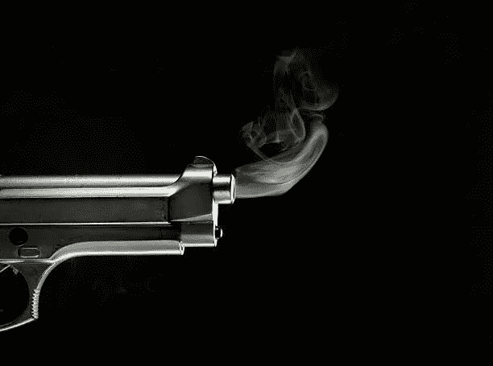

# 我刚拍了我的 ICO。我喜欢这样。

> 原文：<https://medium.com/hackernoon/i-just-shot-my-ico-and-i-liked-it-bb0e6221a1ef>

我已经扣动了永久陨落 ICO 的扳机，扼杀了公开发售。我们将完全私有化，与经验丰富/合格的投资者合作。我唯一的遗憾是没有聪明地早点这么做。我建议认真对待自己业务的人也发出同样的呼吁，但显然我的行动反映了我们业务的情况和背景。所以让我从头开始，你可以决定什么是适合你的…

为什么当前的 ICO 模型是错误的——对我们来说，也许对您也是如此

1.  公开发售代币只关乎一件事——现在的流动性！

这是，尽管事实上，总的来说，他们弊大于利。代币被放在交易所里，它们被锤打——大多数人损失惨重。我们的模型需要至少 12 个月的时间来开发一个真正的代币购买者市场(人们将会使用这些该死的东西！)在我们这里是游戏玩家。

在现实世界中，等待 12 个月的潜在+10 倍回报被认为是非常可怕的。我们现在廉价出售游戏代币，并在发布时大幅提高零售价格，即 10 美分至 50 美分，因此游戏玩家仍然可以负担得起，但我们也认识到早期买家的风险。但是在秘密世界里，12 个月比 11 个月太长了。

尽管我们的永久硬币令牌是一个真正的游戏令牌(它在游戏中使用，特权，折扣，访问和地位；你可以赚，也可以买，然后用在线/离线经济)，我们发现优质投资者对公开销售非常害羞，因为有一个很大的 SEC“如果”附在每一次公开销售上。

**2。ico 不再像 Kickstarter 一样用于融资**

我们有完整的商业模式、计划和战略来创造一种新型的全球游戏/娱乐——我们没有成品。最初，ICO 的全部目的是以 Kickstarter 的方式融资，但随着更大的公司进入以象征他们的业务，买家会去他们认为风险更小的地方。

因此，对我们来说，私有化意味着创造一系列融资里程碑，产生 MVP，最有可能绕过 ICO 流程，开始向游戏玩家出售代币。

**3。存在完全透明的腐败**

这主要是以著名的顾问，评级网站，空投/奖金和泵&倾卸网络的形式。已经有无数次有人找我，要我交出一大块代币，然后利用代币赚快钱。这样做会毁掉这个行业，因为我们的模式需要聪明的代币组学——只出售总供应量的 35%，并使用 45%作为储备来支持交易所的代币，为游戏玩家提供奖励，保持稳定的价格，如果需要的话，成为做市商。

同样，上市让我们与一个众所周知的、有据可查的系统发生冲突，这个系统使用大量 ICO 资料吸引人们，尽快将大量代币转移到交易所，提升价值并拼命出售。走向私人化意味着与那些想要产生长期的、最终更确定的价值的人进行严肃的、非歇斯底里的交谈。在那种环境下，我感觉更自在。

**4。ICO 模式已经死亡，只是它还不知道而已**

我们现在看到一次又一次的汽车事故，ICOs 无法推出。人们已经明白了，多亏了一大堆垃圾，一个很棒的模型已经被破坏了。现在，您将看到 eto(股票代币发行)和其他模式的兴起，它们更符合现实世界投资者的要求。

我觉得真正的 ico 会迷失在混乱中，要么是因为他们没有完整的产品，缺乏营销资金，要么是因为随着垃圾供应的不断增加，ico 的买家不断减少。

我对任何有真正商业机会的人的建议是:去私人化，把赏金计划/空投/大规模炒作和普遍的愚蠢抛在脑后。如果你有一个很好的模式和价值主张，就会有投资者帮助你建立一个真正的企业。

这样做，你就不会被世界各地的人问一万次“你什么时候在交易所上市？”