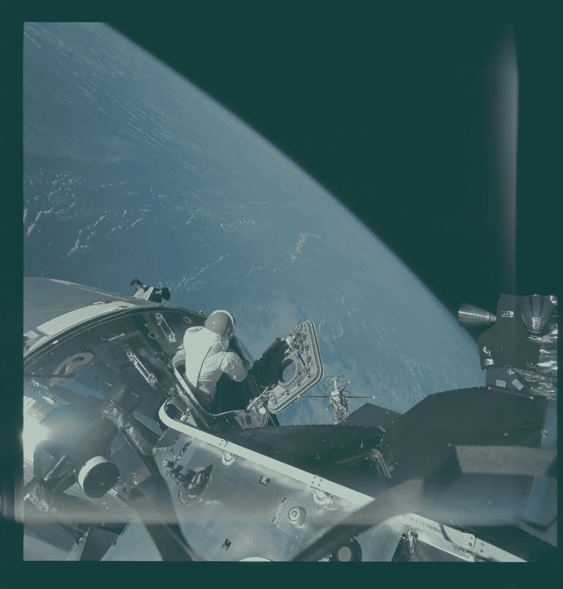

# 我看了阿波罗任务的 14227 张照片。这是我的发现。

> 原文：<https://medium.com/hackernoon/i-looked-through-all-14-227-photos-from-the-apollo-missions-heres-what-i-found-5c119f7f5a72>

# 景色美极了。

I don’t think I could get anything done with that view.

# 太空中没有旗帜飘扬。

在阿波罗任务之前，联合国通过了一项条约，规定“外层空间，包括月球和其他天体，不得被国家据为己有。”但是一位年轻的美国宇航局工程师汤姆·莫泽受命秘密制作一面可以在月球上使用的旗帜。“国会里有人说‘让它发生’”，他说。因此，他制作了一个可折叠的旗杆，在接缝处缝上可延伸的水平杆，并在阿波罗 11 号发射前几个小时偷偷把它装到航天飞机上。

Do you see the rods sewn into the fabric of the flag?

当巴兹·奥德林和尼尔·阿姆斯壮试图竖起这面旗帜时，他们遇到了障碍。“尽管我们尽了最大努力，望远镜还是无法完全展开。这样，原本应该是平的旗帜有了自己的[永久](https://hackernoon.com/tagged/permanent)波浪宇航员巴兹·奥德林说。

Sorry folks, Stanley Kubrick didn’t stage the moon landing.

# 在月球上驾驶规则！

# 直到你被困在月亮沟里。

D’oh!

# 可折叠的太空瓶棒极了。

It’s so eco-friendly and a great example of form following function.

# 当所有东西都变轻时，就不需要轻装上阵了。

Hey, where are you going with my bags!

# 月亮战士女神是真的！

Do you see the silhouette of her face?

# 海龟战士也是真的！

Do you see his shield or his tiny and pointy hat?

# 忘了无重力笔吧，我要这些太空*墨镜！*

# 胶带拯救了阿波罗 13 号船员的生命

一点小聪明和胶带能够给阿波罗 13 号机组人员一个回家的战斗机会。这是救了他们一命的临时过滤器。

Duct tape is as good as they say.

用纸板保持形状，用胶带防止泄漏，阿波罗 13 号上的船员能够稳定船上的空气过滤系统。

It ain’t pretty but it worked!

# 这个粘稠的仪表显示什么？

“Houston, we have a…I’m not sure what we have here.”

# 宇航员是出色的摄影师

If YOU have the camera, how am I taking this picture?

想看更多阿波罗的照片吗？这里有一个[链接](https://www.flickr.com/photos/projectapolloarchive/)到阿波罗任务的宇航员在 1961 年到 1972 年拍摄的其他高分辨率照片。

如果你喜欢我们的月球之旅，请关注我的 *。感谢您的阅读，祝您愉快🎩👌*