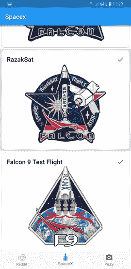

# 我爱你扑

> 原文：<https://medium.com/hackernoon/i-love-you-flutter-fd7c30b2047e>

Photo by [Mayur Gala](https://unsplash.com/photos/2PODhmrvLik?utm_source=unsplash&utm_medium=referral&utm_content=creditCopyText) on [Unsplash](https://unsplash.com/search/photos/love?utm_source=unsplash&utm_medium=referral&utm_content=creditCopyText)

我第一次带着 [Flutter](https://flutter.io) 兜了一圈，享受其中的每一刻。嗯，语法对我来说是不同的，但仍然很喜欢它。以下是我对第一次使用 Flutter 的一些想法。

# 装置

我使用 MacOS，所以我从[入门:在 macOS 上安装](https://flutter.io/setup-macos/)页面开始。只需下载压缩的 sdk 并将其添加到您的`PATH`。

我运行了`flutter doctor`命令来检查一切是否正常。我遇到了一些问题，比如在 Android Studio 上安装 flutter 插件。我安装了插件，看到了这个(吼吼):

下一步是[配置我的编辑器](https://flutter.io/get-started/editor/#androidstudio)，在这里是 Android Studio。只需点击几下，我就在编辑器上安装了 flutter 和 dart 插件。很简单。

# 开始

让我们写一些代码，或者至少运行它。

[入门步骤](https://flutter.io/get-started/test-drive/#androidstudio)第一步是在 Android Studio 中新建一个 flutter 项目并运行。一切都像医生说的那样，利润！

# 编码

敬畏耶！编码在这里。

[代码实验室](https://flutter.io/get-started/codelab/)的目标是实现无限滚动的 ListView 应用程序，名为:*启动名称生成器。*类似这样的事情:

Gif by https://flutter.io

这个教程是非常翔实的，我学会了如何建立一个布局；如何使用外部包以及 StatelessWidget 和 StatefulWidget 的区别。

在教程的最后，有一个总结，总结了我所取得的成就，以及我是否想继续下去(是的，请)，还有一个小玩笑:

Gif by [https://flutter.io](https://flutter.io)

我点击了[第二部分](https://codelabs.developers.google.com/codelabs/first-flutter-app-pt2/#0)。任务是添加一个收藏图标和一个收藏名称的导航。

前 3 个步骤是构建环境，所以如果您在第 1 部分中完成了这些，可以跳过它们。我从 flutter 的材质设计中学到了 app 热重装、导航(Flutter 已经开箱即用)以及如何添加图标。

Screenshot by [https://flutter.io](https://flutter.io)

本教程的最后一步[包含了一些进一步教程和知识库的链接，但是我太渴望尝试一些东西，并且谷歌我需要的东西。](https://codelabs.developers.google.com/codelabs/first-flutter-app-pt2/#8)

# 我的第一个颤振项目

当我测试一个新的移动框架或语言时，我喜欢构建一个简单的 reddit 应用程序。抓取热门话题，看一些帖子，阅读评论。这是一个很好的实践，因为它结合了 http 调用、解析对象、导航和 webview。你可以在我的 Github 上看到用 [Kotlin](https://github.com/yershalom/check-the-idle) 和 [React Native](https://github.com/yershalom/reddit_react_native) 写的例子。

> 不要改变一支胜利的队伍

所以我没有。我用 flutter 写了一个新的简单的 reddit 应用程序。我谷歌了如何填充，我有了我的第一个屏幕:

TopicsScreen, PostsScreen and open link using ChromeCustomTabs package

到目前为止，一切顺利。但我想测试更多 Flutter 的功能。我决定加一个[底部导航栏](https://docs.flutter.io/flutter/material/BottomNavigationBar-class.html)。我使用 [SpaceX API](https://github.com/r-spacex/SpaceX-API) 构建了另一个屏幕，并创建了一个 SpaceX 发射历史列表。

带有卡片的简单列表视图，包含任务名称，任务补丁和成功或失败。

我想尝试图像处理和相机访问。

我又加了一个叫挑剔的屏幕。我在应用栏上添加了`add a photo`图标用于添加图片，还有两个旋转图标用于旋转图片。

总结一下，我爱扑。Android Studio 的 Flutter 插件非常棒，让你可以构建 iOS 和 Android。不仅仅是惊奇。

From my [Github](https://github.com/yershalom/reddit_flutter)

你可以从这里抓取源代码:[https://github.com/yershalom/reddit_flutter](https://github.com/yershalom/reddit_flutter)

希望你喜欢！如果有，可以在 [Twitter](https://twitter.com/yershalom) 关注我。