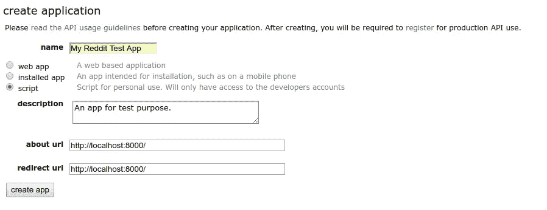
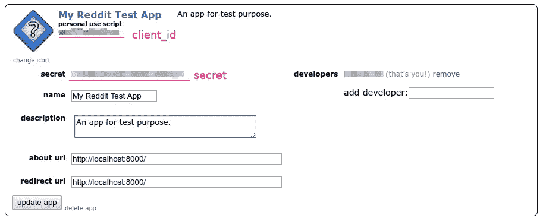
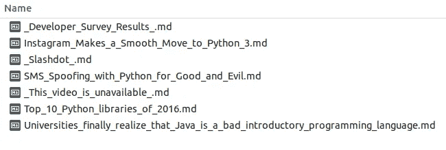

# 我用 100 行 Python 做了一个新闻刮刀。

> 原文：<https://medium.com/hackernoon/i-made-a-news-scrapper-with-100-lines-of-python-2e1de1f28f22>


每天我坐地铁去办公室，在那里我的手机根本没有信号。但是 medium app 不让我离线看故事，所以我决定自己做一个新闻刮刀。

我不想做一个非常花哨的应用程序，所以我只完成了能满足我需求的最小原型。这个概念非常简单:

1.  找一些新闻来源
2.  用 Python 抓取新闻页面
3.  解析 html 并用 BeautifulSoup 提取内容
4.  把它转换成可读格式，然后给我自己发一封电子邮件

现在让我解释一下我是如何完成每一部分的。

# 新闻来源:Reddit

人们向 Reddit 提交链接并投票，因此 Reddit 是阅读新闻的好消息来源。现在的问题是:如何获取每日热门新闻列表？

在考虑网络抓取之前，我们应该尝试找出目标网站是否提供任何 API，因为使用 API 是完全合法的，最重要的是，API 提供了机器可读的数据，所以我们不需要解析 HTML。

幸运的是 Reddit 提供了 API。从[它的 API 列表](https://www.reddit.com/dev/api/)我们可以很容易的找到我们需要的:`/top`。该端点将返回 Reddit 或给定 subreddit 上的头条新闻。这样我们就可以用它从我们感兴趣的子主题中检索头条新闻。

下一个问题是:我们如何访问这个 API？

在阅读了 Reddit 文档之后，我找到了访问这个端点的最佳方式。

第一步是在 Reddit 上创建一个应用程序。登录我的帐户，进入“首选项→应用程序”。底部有一个名为“创建另一个应用程序…”的按钮。单击它并创建一个“脚本”类型的应用程序。注意，我们不需要提供“about url”或“redirect url ”,因为我们的应用程序不打算被公开访问或被任何其他人访问。



创建应用程序后，我们可以在应用程序信息框中找到应用程序 id 和密码。



下一个问题是如何使用这个凭证。因为我们只需要获取给定 subreddit 的头条新闻，我们不需要访问任何用户相关信息，所以从技术上讲，我们不需要提供任何用户信息，如用户名或密码。Reddit 提供了“[仅应用 OAuth](https://github.com/reddit-archive/reddit/wiki/OAuth2#application-only-oauth) ”，通过它我们的应用可以匿名访问公共信息。尝试以下命令来测试 API:

```
$ **curl -X POST -H 'User-Agent: myawesomeapp/1.0' -d grant_type=client_credentials --user 'OUR_CLIENT_ID:OUR_CLIENT_SECRET'** [**https://www.reddit.com/api/v1/access_token**](https://www.reddit.com/api/v1/access_token)
```

我们将得到这样的访问令牌:

```
{"access_token": "ABCDEFabcdef0123456789", "token_type": "bearer", "expires_in": 3600, "scope": "*"}
```

太棒了。有了访问令牌，我们可以做任何事情。

最后一点，我们不想从头开始写 API 访问代码。我们可以使用 python 客户端库:

[](https://github.com/praw-dev/praw) [## praw-发展/praw

### praw - PRAW 是“Python Reddit API Wrapper”的首字母缩写，是一个 Python 包，允许简单访问 Reddit 的…

github.com](https://github.com/praw-dev/praw) 

让我们做一个快速测试。我们从`/r/Python`获取前 5 名提交的内容:

```
>>> **import praw**
>>> **import pprint**
>>> **reddit = praw.Reddit(client_id='OUR_CLIENT_ID',**
...                      **client_secret='OUR_SECRET',**
...                      **grant_type='client_credentials',**
...                      **user_agent='mytestscript/1.0')**
>>> **subs = reddit.subreddit('Python').top(limit=5)**
>>> **pprint.pprint([(s.score, s.title) for s in subs])**
[(6555, 'Automate the boring stuff with python - tinder'),
 (4548,
  'MS is considering official Python integration with Excel, and is asking for '
  'input'),
 (4102, 'Python Cheet Sheet for begineers'),
 (3285,
  'We started late, but we managed to leave Python footprint on r/place!'),
 (2899, "Python Section at Foyle's, London")]
```

太好了！

# 刮新闻版面

下一步相当简单。从上一步，我们可以得到`Submission`对象，它的`url`属性正是我们想要的 URL。我们还可以通过检查`domain`属性来过滤 URL，以确保我们只从 Reddit 以外的网站抓取链接。

```
subs = [sub for sub in subs if not sub.domain.startswith('self.')]
```

接下来我们需要做的就是获取 URL。这可以通过`requests`来实现:

```
for sub in subs:
  res = requests.get(sub.url)
  if (res.status_code == 200 and 'content-type' in res.headers and
      res.headers.get('content-type').startswith('text/html')):
    html = res.text
```

这里我们跳过了内容类型不是`text/html`的提交。这是因为用户可能会提交直接的图像链接，这不是我们的目标。

# 提取内容

下一步是从新闻 HTML 中提取文本内容。我们的目标是提取新闻标题和新闻内容，忽略诸如页眉、页脚、边栏或任何我们不需要阅读的内容。

这是一项相当艰巨的任务，老实说，没有通用的、完美的解决方案。我们可以使用`BeautifulSoup`来提取文本内容，但是它会提取包括页眉和页脚在内的所有内容。

我很幸运地发现，现代网站比它们的祖先创建的格式更好。我们不再看到表格布局和`<font>` s 和`<br>` s，取而代之的是，文章页面清楚地标注了标题的`<h1>`和段落的`<p>`。我发现大多数网站会把标题和主要内容放在同一个容器元素中，例如:

```
<header>Site Navigation</header>
<div id="#main">
  <section>
    <h1 class="title">Page Title</h1>
  </section>
  <section>
    <p>Paragraph 1</p>
    <p>Paragraph 2</p>
  </section>
</div>
<aside>Sidebar</aside>
<footer>Copyright...</footer>
```

这里的顶层`<div id="#main">`是标题和内容的公共容器。所以我们可以做一个算法来找到内容:

1.  找到`<h1>`作为标题。通常页面中只有一个`<h1>`，出于 SEO 的目的。
2.  找到`<h1>`的父节点，测试父节点是否有足够的`<p>`元素。
3.  重复步骤 2，直到找到具有足够多`<p>`元素的父元素或到达`<body>`标签。如果找到足够多的`<p>`，那么父元素就是主要内容标签。如果在找到足够多的`<p>`之前到达了`<body>`标签，则该页面不包含可读内容。

这是一个简单的算法，没有考虑任何语义信息，但它实际上非常适合我们的目的。无论如何，如果这个算法失败了，我们可以简单地忽略新闻，少读一条新闻对我来说也无妨……你肯定可以通过解析`<header>`、`<footer>`或`#main`、`.sidebar` id / classes 来做出更精确的算法。

有了这个算法，我们可以很容易地编写解析器代码:

```
soup = BeautifulSoup(text, 'html.parser')# find the article title
h1 = soup.body.find('h1')# find the common parent for <h1> and all <p>s.
root = h1
while root.name != 'body' and len(root.find_all('p')) < 5:
  root = root.parentif len(root.find_all('p')) < 5:
  return None# find all the content elements.
ps = root.find_all(['h2', 'h3', 'h4', 'h5', 'h6', 'p', 'pre'])
```

这里我们使用`len(root.find_all('p')) < 5`作为主要内容的条件，因为一条真实的新闻不太可能少于 5 段。您可以根据需要增加该值。

# 转换成可读格式

最后一步是将内容转换成可读格式。在这个例子中，我选择了 Markdown，但是您可以制作自己的花式转换器。

在这个例子中，我只取了`<h#>`和`<p>`，`<pre>`，所以一个快捷的函数可以很容易地将它们转换成 Markdown。

```
ps = root.find_all(['h2', 'h3', 'h4', 'h5', 'h6', 'p', 'pre'])
ps.insert(0, h1)    # add the title
content = [tag2md(p) for p in ps] def tag2md(tag):
  if tag.name == 'p':
    return tag.text
  elif tag.name == 'h1':
    return f'{tag.text}\n{"=" * len(tag.text)}'
  elif tag.name == 'h2':
    return f'{tag.text}\n{"-" * len(tag.text)}'
  elif tag.name in ['h3', 'h4', 'h5', 'h6']:
    return f'{"#" * int(tag.name[1:])} {tag.text}'
  elif tag.name == 'pre':
    return f'```\n{tag.text}\n```'
```

# 把它们放在一起

最后，这是完整的代码:

正好 100 行！尝试运行它…

```
Scraping /r/Python...
  - Retrieving https://imgs.xkcd.com/comics/python_environment.png
      x fail or not html
  - Retrieving https://thenextweb.com/dd/2017/04/24/universities-finally-realize-java-bad-introductory-programming-language/#.tnw_PLAz3rbJ
      => done, title = "Universities finally realize that Java is a bad introductory programming language"
  - Retrieving https://github.com/numpy/numpy/blob/master/doc/neps/dropping-python2.7-proposal.rst
      x fail or not html
  - Retrieving http://www.thedurkweb.com/sms-spoofing-with-python-for-good-and-evil/
      => done, title = "SMS Spoofing with Python for Good and Evil"
  ...
```

和刮新闻:



然后，我需要做的最后一件事是将这个脚本放在我的服务器上，设置一个 cron 作业每天运行一次，并将生成的文件发送到我的电子邮件。

我没有在细节上花太多精力，所以还有很多可以改进的地方。您可以继续向这个脚本添加更多的特性，比如使结果文件更漂亮和提取图像。

感谢阅读！希望这个脚本是有用的，至少它可以作为访问 Reddit API 的一个例子。喜欢这个帖子请推荐。