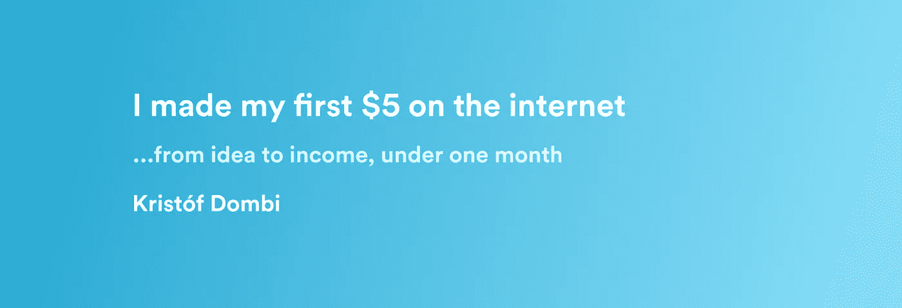
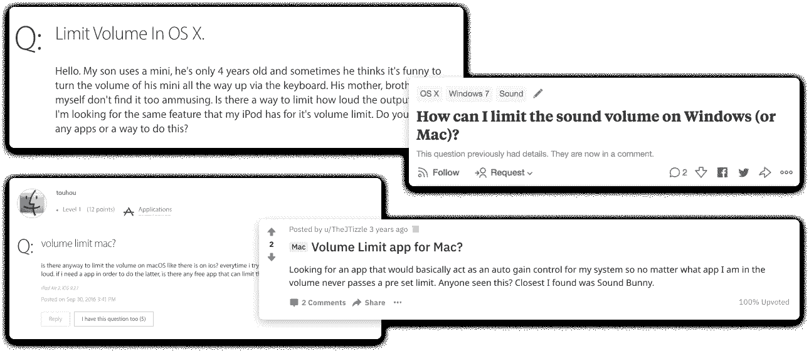

# 我在网上赚了第一笔 5 美元🔥

> 原文：<https://medium.com/hackernoon/i-made-my-first-5-on-the-internet-a277b421990>

## 我为 OSX 创建了一个容量限制应用程序，之前没有一个月的本地开发经验。💻

当你能感受到自己的工作受到赏识时，这是人生中令人愉快的时刻。但是说到欣赏，我们每个人面前都有一段旅程。它包含了许多要完成的事情和要获得的大量经验。我觉得 [Earsafe](https://earsafe.io) (我写的应用)是我旅程中第一个*里程碑*之一。🛫

有了这段内容，我想和大家分享一下我是如何开始的，以及一路走来我学到了什么。所以现在请坐好，放松，享受你的阅读吧！🍿

# TL；博士——给懒惰的人😉

我是一个普通人，他通过互联网[卖他制作的](https://hackernoon.com/tagged/internet) [OSX](https://hackernoon.com/tagged/osx) 应用程序赚了他的第一笔 5 美元。

在这里你可以找到我的**知识**和**经验**我上个月在以一种*可理解的 30 秒格式*构建/启动应用时得到的:

*   **⚡ ️Take 承诺快速实现你的目标**——这对我很有效(例如:我在想法产生后 5 分钟就买了我的域名。👉动机)
*   🏎走捷径，继续前进——尽可能快地简化一切
*   👌**少操心，多做事！正如鲍勃·马利所说……如果你觉得负担过重，不要犹豫，放松一下**
*   🐶从长远来看，每天使用自己的产品是值得的
*   🛳:尽可能快地出货——不要像大公司那样，只是快速行动，快速出货并验证
*   💰通过真实销售来验证你的产品——只有当你的产品卖 5 美元时，你才会知道它值 5 美元。

## 关于我的两句话——这样你就有了背景👨‍💻

我是来自匈牙利的前端开发人员，是[独立黑客社区](https://indiehackers.com)和 [wip.chat](https://wip.chat) 的成员。我总是有想法(或副业)，我正在努力，不断地在它们之间跳跃，让我的女朋友为此疯狂。🤦‍

## Earsafe 的起源💡

当我热衷于 The Verge 的 Youtube 内容时，我看到了他们的一个视频,内容是关于长时间通过耳塞听吵闹的音乐有多危险。🎧

看完视频后我立刻有了这个想法。它是关于实现一个菜单栏应用程序，它照顾你的耳朵。👂

好吧，下一步是显而易见的，让我们在谷歌上检查一下，它是否已经存在。这是我发现的:🧐

所以底线是我在看完视频 **~5 分钟**后购买了域名。

# 我学到的/经历的:

## **做出承诺，快速实现你的目标⚡️**

我们已经达到了我的第一次学习，购买域名这么快。快速做出承诺对我来说很有用。我如此专注于这个项目，以至于我能够克服对本地开发缺乏经验的恐惧。我直接跳到谷歌，输入“*如何为 OSX 写一个菜单栏应用程序？*”。🛠

尽管我从未写过任何代码，无论是在 Swift 中，还是在 Objective-C 中，但我可以从中找到一个不错的教程。🚀

## 走捷径，继续前进🏎

我对这个应用程序的最初想法比实际输出要困难得多。我不得不删除某些特性，以保持 *MVP* 是真正的*最小可行产品*。📦

起初，我想显示主输出的实际分贝水平，但我不得不放弃，因为它远远超出了我目前的知识。我甚至找不到任何有帮助的 StackOverflow 问题，所以觉得不值得花时间去实现。⏳

我必须向前看。我不想像我在早期项目中所做的那样，仅仅在实现上花费超过一个月的时间。🛑✋

## 少操心，多做事！不管怎样，问题都会得到解决。👌

有时你会发现自己正面临阻碍你前进或降低你对项目的动力的障碍。我刚才提到的分贝问题也发生在我身上。我一开始也很害怕原生开发。但是我认为犹豫越少，产出越多。📈

退一步，放松一下，你总会有其他的选择和解决方案。😴

## 吃你自己的狗粮🐶

如果你正在自己构建一些东西，我强烈建议你每天都使用它。我一有机会就开始使用 Earsafe，从那以后我就一直在使用它。这样你会更快地找到产品中最大的痛点。甚至你的早期采用者也会遇到边缘情况的错误(希望如此🤞)到发射的时候。

## 尽可能快地运送🛳

正如我之前写的，保持更高水平的配速是一个很好的练习。作为一个单枪匹马的决策者，你最大的优势是你可以比公司更快地做出决定。🏢

如果你在考虑“*调整你的一个功能*”或“*重新设计你的登陆页面*”，**你可能只是在为不发货** **你的产品找借口，玩你自己的时间**。😟

我告诉你这些，因为我已经用 [Earsafe](https://earsafe.io) 做了同样的事情。最后我想通了，我只是害怕别人的看法(这么独特的问题，对吧？😀).我可能一遍又一遍地犯这个错误。🔄

克服你的恐惧是一件困难的事情，但是为了成功，这是必须的。就我而言，我肯定需要在释放恐惧方面有所提高。

## 通过真实销售来验证你的产品💰

我没有花太多时间给 Earsafe 定价。⏱我看到其他黑客在我的价格附近给其他菜单栏应用定价，所以我坚持了下来。💵

只有当你的产品卖 5 美元时，你才会知道它值 5 美元。就这么简单。最糟糕的情况是你将钱退还给不满意的顾客。但这样你至少有机会知道你失败的原因，这很好。👍

# 总结一下:

Earsafe 是我的第一个产品，我正在推出它，我通过销售它赚了我的第一笔 5 美元。我还有很长的路要走，还有很多事情要做，才能达到我想达到的目标，但我认为这次出售是一个良好的开端。💪我希望我的第一个里程碑的这些亮点对你的阅读有价值。

如果你和我处境相同，请随时在推特上给我发信息，我很想听听你的故事！❤️

…哦，别忘了，如果你是苹果电脑用户，你想让你的听力保持到更老的时候，看看 [**Earsafe**](https://earsafe.io) 吧！👂🔊