# 一、❤·拉姆达——带有特殊占位符的部分应用

> 原文：<https://medium.com/hackernoon/i-ramda-partial-application-with-curry-e95100f7c7b1>

[puzzle-last-part-joining-together](https://pixabay.com/en/puzzle-last-part-joining-together-3223941/) by [Alexas_Fotos](https://pixabay.com/en/users/Alexas_Fotos-686414/)

# ❤·拉姆达简介

I ❤拉姆达系列将略有不同，其他你可能已经看到了。本系列没有使用典型的`foo`、`bar`、`baz`示例，也没有使用演示独立函数的文章，而是旨在展示 Ramda.js 的实际应用

# 带有特殊占位符的部分应用程序

如果你用过`bind`，你可能已经熟悉了局部应用的概念。

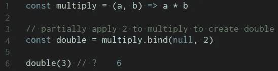

使用`bind`，我们能够将值`2`部分应用于函数`multiply`中的参数`a`，以创建一个全新的函数`double`。

上面的解决方案(使用`bind`)工作得很好，即使我们必须调用`bind`并传入上下文(在本例中是`null`)。

# 咖喱的局部应用

处理部分应用程序的 Ramda 方法是调用`multiply`函数。

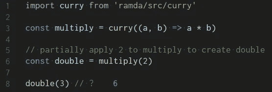

好的，现在代码是… *不同的*，但是你不兴奋，我明白。但是坚持住，因为🧙魔术即将开始。

# bind 不足之处

让我们考虑这个例子，看看第 9 行和第 10 行…

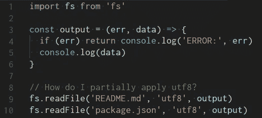

所有对`readFile`的调用都将是`utf8`，现在我想到了，它们都将使用相同的`output`函数。

对于这个例子，不能使用 bind，因为`bind`只会从左到右应用参数。必须创建一个全新的功能。

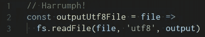

# 特殊占位符

Ramda 有一个他们称之为特殊占位符的东西，用于部分应用参数，而不管位置如何。

要使用这个特殊的占位符，必须首先简化函数。

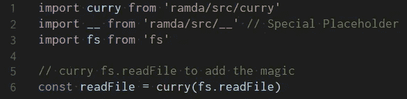

既然`fs.readFile`已经被简化为`readFile`，我们可以使用 Ramda 的特殊占位符(`__`)作为文件名参数，并将`utf8`和`output`部分应用到`readFile`。

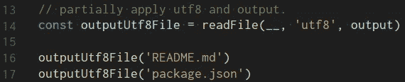

😍如果此时你不兴奋，去看医生吧，因为你内心已经死了。

让我们通过一些重构来结束这个例子。

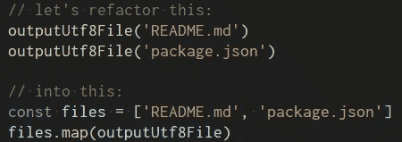

也可以这样使用，因为现在我们有了更多的选择！

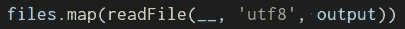

# 家庭作业

最好的学习方法是*做*😉。所以在这个练习中，试着在函数`fetch`的基础上创建两个新函数`fetchGet`和`fetchPost`。

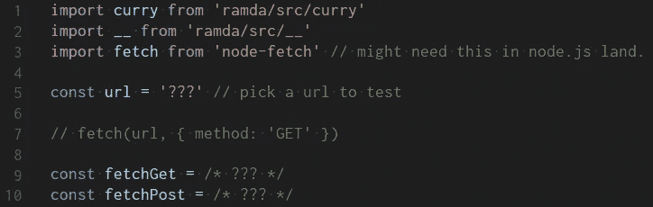

如果需要帮助，在评论区发帖提问，我会尽力回答每一个问题！

# 我们还能做什么？

这是我正在做的一个项目的简化片段。首先，我将剔除`tokenContract`，这样您也可以运行这个示例。

同样，不要对这部分代码做过多解读，这只是设置。但是请注意下面如何使用`curry`函数。

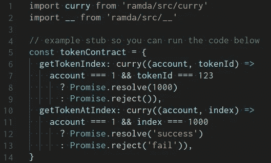

现在是肉🍖

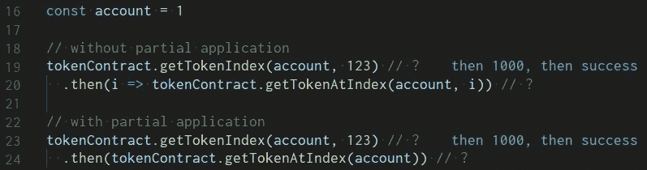

Curry 和部分应用程序允许我们在`then`中去掉函数的两端`i =>`和`, i`。这是一种你会经常看到的模式。从`then`函数提供的单个参数(在本例中是`i`)将成为在`tokenContract.getTokenAtIndex`中调用的函数的最终参数。

进一步研究:省略结尾的`i`的过程称为无点或默认编程，自变量`i`为“点”。

因为我知道我正在做的工作总是为`account`而做，所以我可以将`account`值应用于两个函数。

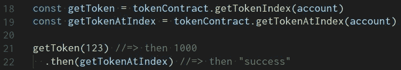

# 额外学分

函数组合将在以后的文章中讨论，但是现在我想把它作为额外的学分留给你去研究和修改:

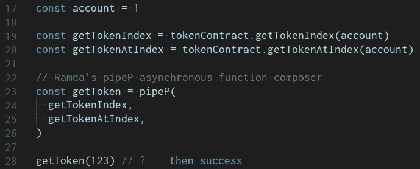

# 摘要

本文简要介绍了部分应用程序、Currying，甚至函数组合。前往 [Ramda](http://ramdajs.com/) 了解更多信息。在评论里提问，每一个问题我都会回复！

如果你觉得这很有趣，我有更多关于[媒体](https://medium.com/@joelthoms/latest)和[发展到](https://dev.to/joelnet)的文章。

在 [Twitter](https://twitter.com/joelnet) 、 [Medium](https://medium.com/@joelthoms/latest) 、 [dev.to](https://dev.to/joelnet) 和 [steemit](https://steemit.com/@joelnet) 或[joel.net](http://joel.net/)订阅，以获得未来文章的通知。

干杯！

[最初发布于 github](https://github.com/joelnet/articles/blob/master/2008-05-09---i-heart-ramda--partial_application_with_curry/Partial_Application_with_Curry.md)