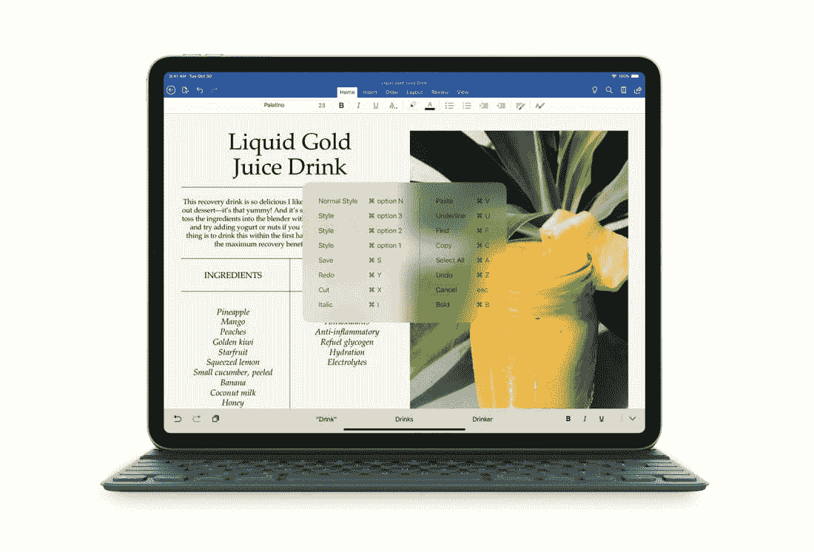

# 为什么我把笔记本电脑换成了 iPad Pro

> 原文：<https://medium.com/hackernoon/i-replaced-my-laptop-with-an-ipad-pro-599099627a57>

新款 iPad Pro 上市了。它有薄边框，没有 home 键，Face ID，比市场上任何其他平板电脑都更强大。它如此强大，以至于苹果敢于在性能(和销量)上与笔记本电脑相提并论。然而，当谈到 iPad 时，许多科技媒体网站争相发布他们最喜欢的标题:“它仍然无法取代你的笔记本电脑”。好吧，我在这里反驳这种观点；几个月前，我把笔记本电脑换成了 iPad Pro。

首先简单说一下我更换的笔记本电脑。2015 年 10 月买了一台 Surface Book[立马就爱上了](https://geekonrecord.com/2015/11/01/my-experience-with-the-surface-book/)。有一个特别的功能让我着迷:Windows Hello。多亏了 Windows Hello，我才能够只用我的脸解锁设备。它又快又可靠，向我展示了未来应该是什么样子。不幸的是，我无法使用 Windows Hello 登录我的应用程序和网站，尽管这有望很快改变。最重要的是，Surface Book 对于轻便旅行来说太大太重了，所以在 2017 年 12 月，我买了一台 iPad。

作为一名多年的 iPhone 用户，我对 iOS 的简单性或 App Store 上广泛的应用程序并不感到惊讶。无论如何，我很喜欢 iPad 作为旅行伴侣，因为它的电池续航时间长，外形轻薄，认证简单(基于触控 ID)。得到看起来笨拙的智能键盘是一个有趣的附加功能:整个包装非常容易携带，以至于我发现自己经常从 iPad 上为 geekonrecord.com 的 T4 写作。

Surface Book 没有任何真正的问题，但它的大小提供了足够的摩擦力，让我停止在日常生活中使用它。相反，我最终用 iPad 做了所有事情:在谷歌文档上写科技文章，在周末旅行时看网飞，回复长邮件，在网上寻找假日航班，下班后玩一些视频游戏(你应该[看看游戏“Inside](https://playdead.com/games/inside/) ”,我着迷了！)或者在 Kindle 上看书。不到一个月，iPad 成了我的主要电脑。

在某个时候，我注意到 Surface Book 正在积灰，所以我在今年夏天早些时候扔掉了它，就在 Surface Go 发布的时候。我承认我害怕后悔我的决定。如果我发现了一个无法用 iPad 覆盖的新用例怎么办？毕竟，新闻网站一遍又一遍地重复说 iPad 不能取代笔记本电脑。尽管如此，我告诉自己这只是害怕错过，我总是可以再买一台笔记本电脑。从我开始把 iPad 作为我唯一的电脑使用到现在已经四个月了。

每次科技作家说他们试图用 iPad 作为笔记本电脑时，我都非常好奇。他们有哪些我没有的用例？这通常归结为照片或视频编辑，因为 iPad 很难从外部来源导入原始图片(除非它们先经过相机胶卷)。然而，这让我意识到，批评家通常认为大多数人都有和他们相似的需求。我认为这是错误的。

我在为 Windows 和 Bing 开发 UX 的过程中学到的一件事是，大多数用户会忽略我认为显而易见的东西。绝大多数客户在技术方面都有简单的需求，并且他们期望同样简单的解决方案来解决他们的问题。大多数用户想要一台电脑来编辑或创建文本文档、浏览网页、回复电子邮件、观看电影，以及其他一些经常被股票或流行应用覆盖的场景。例如，大多数用户不会在意或不会看到苹果的邮件应用程序和微软的 Outlook 应用程序之间的任何差异。大多数用户不需要在屏幕上同时显示四个窗口，两个就足够了。

定义你在和什么类型的用户交谈是关键，我相信这是许多科技作家所忽略的。如果你认为大多数人需要导入原始图像才能在 Photoshop 中编辑它们，你应该三思而行。不要再想‘超级用户’，想想普通用户；意识到许多人并不真正理解网络浏览器和搜索引擎的区别。对于所有这些普通用户来说，iPad 可以毫不费力地取代他们的笔记本电脑。

下次当你读到或看到关于新 iPad 的评论说它不能取代你现在的电脑时，想想你是什么样的用户，你的需求是什么。也许你应该考虑价格或屏幕尺寸等其他方面。但是如果你想要一台易于使用、便于携带的电脑(并且至少有 1000 美元备用)，你可能会想去苹果专卖店。

你喜欢这篇文章吗？ [**订阅**](https://geekonrecord.com/subscribe/) **通过邮件获取新帖。**

*图片来自苹果*

[查看伊万·罗德里格斯的所有帖子](https://geekonrecord.com/author/irodrisa/)

*原载于 2018 年 11 月 8 日*[*【geekonrecord.com】*](https://geekonrecord.com/2018/11/07/i-replaced-my-laptop-with-an-ipad-pro/)*。*