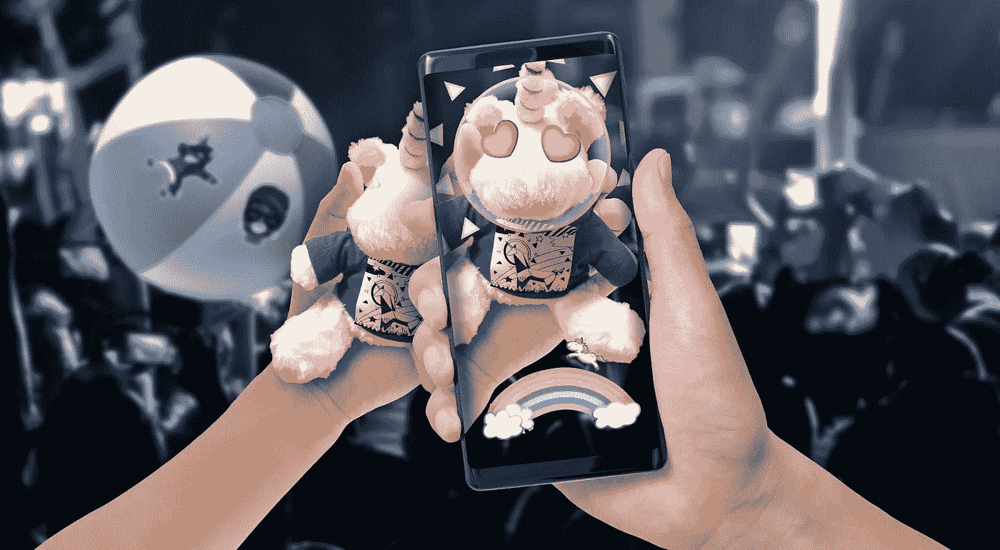

# 我看到独角兽和彩虹！

> 原文：<https://medium.com/hackernoon/i-see-unicorns-and-rainbows-cf89d2432b19>

Uniscore AR App enables *cheering for introverts*.

多可爱的礼物啊，对吧？但它是如何在最近比利时列日举行的 Wallifornia 音乐节黑客马拉松中成为一个获奖的增强现实(AR)黑客的呢？把它归因于房间里令人不舒服的寂静。

在那次黑客马拉松上，房间坐满了人，几个参与者向人群推销他们的项目想法。当投球结束时，房间里一片寂静。这是一个有点不舒服的时刻，一屋子聪明的开发人员变得死一般的沉默，每个人都在想，“就这些吗？”我参加过许多黑客马拉松，非常清楚当这种沉默降临时，最好有人提醒参与者，黑客马拉松是为了娱乐。

那一刻，这个房间对于一个音乐技术黑客马拉松来说太严肃了。

> 我抓起 Cloudinary 的超级酷[独角兽](https://hackernoon.com/tagged/unicorn)毛绒玩具，走上舞台，提出了一个愚蠢的想法:“我有一个想法！建立一个使用这个独角兽的黑客。把它做成动画，用 AR 和 Cloudinary 做一些有趣的事情。给我们惊喜！”

房间里充满了笑声。

这打破了僵局，其他几个参与者走上舞台，提出了更有趣的想法……至少我是这么认为的。

大约一个小时后，一位年轻的开发人员李颖芝·布吕克纳走到我们的展位前，问她是否可以买一打毛绒独角兽。

Uniscore Team

她解释说，她和她的队友——她的父亲汤姆·布吕克纳(Tom Brückner)，以及路易斯·费雷斯·莫利纳(Luis Feres Molina)和罗尔德·博杜(Roald Baudoux)——希望将独角兽用于他们的黑客项目，他们计划向观众分发独角兽，以获得该项目的互动体验。我们有很多赃物，坦率地说，我知道我们的新布道者[塔玛斯·皮罗斯](https://www.linkedin.com/in/tamaspiros/)不会因为不得不把剩下的赃物带上回布达佩斯的飞机而感到兴奋。所以，我很高兴地答应了:“没问题，你想拿多少就拿多少。”

稍后，Tom 向我们展示了他们项目和概念的第一次迭代的演示，他们巧妙地将其命名为 ***Uniscore:为内向者*** 欢呼。

Uniscore Demo

主要前提是让内向的人在现场音乐表演中以有意义的方式参与进来。正如汤姆所描述的:“对于现场艺术家来说，内向的人很难发出欢呼，他们通常只是站在观众中，但不像外向的人那样欢呼。为了给内向的人一种表达欣赏的方式，一个很酷的填充玩具，加上一个 AR 应用程序和一个舞台展示，勇敢地应对了这一场合。”巧妙！

**Uniscore 是做什么的？**

Uniscore 是一个项目，旨在丰富音乐会观众的体验，尤其是内向的人。

人们可以使用他们的智能手机和带有特定标签的独角兽毛绒玩具向音乐家提供反馈。智能手机的摄像头对准长毛绒，当检测到它时，它周围会出现一个光环。人们可以通过在镜头前或多或少地举起毛绒玩具来表达他们的欣赏。当他们这样做时，屏幕底部会出现一道彩虹。当彩虹有了所有的颜色，一只奔跑的独角兽跑过彩虹。

同时，一些控制消息被发送回音乐家，以控制一个附加的轨道(在这种情况下，它触发了奔跑的独角兽的声音)。音乐家软件中的一些标记也触发了与独角兽上的魔法和仙女世界相关的特定图片的出现。

Uniscore 团队将 Cloudinary 的 plushy unicorn、Unity 和 Vuforia 用于 AR 应用程序，将 NodeJS 用于服务器后端，将 Reaper + Reactor Blocks 用于现场音乐。他们计划使用飞利浦 Hue API 来控制特效照明，并使用额外的 Cloudinary APIs 来在应用程序中传递产品销售图像。挑剔的硬件和时间限制将这些想法挤出了桌面，使其成为团队用来演示该想法的最小可行产品(MVP)。

该团队为能为演示制作一些好听的音乐而感到非常自豪。他们能够开发一个功能性的 AR 设置，并将应用程序提交给谷歌 Play 商店，并在黑客马拉松结束前发布。他们的 iOS 应用程序也准备好了，正在等待苹果的审查过程。李颖芝为增强现实体验创作了伟大的图画。

看到一个父女组合把这么傻的概念，变成好玩有趣的东西，真是太棒了。评委和 Cloudinary 对音乐会观众的应用体验以及可爱的音乐会纪念品和相关产品的潜在市场价值印象深刻。

Cloudinary Unicorn

事实上，随着 AR 音乐会体验在音乐行业不断涌现，他们将音乐会 swag 与 AR 联系起来的想法就像我们年轻的艺术家和开发人员绘制的那些美丽的舞蹈独角兽和彩虹一样精彩。

所以下次你去音乐会看 AR 体验的时候，记得 Wallifornia…还有那些独角兽和彩虹。