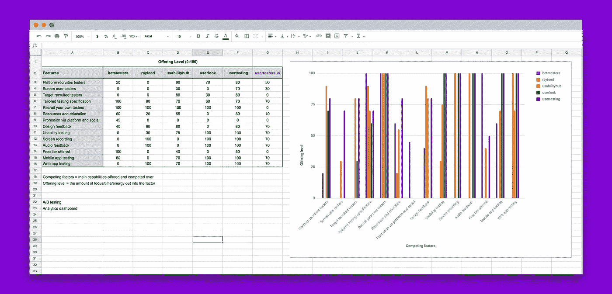
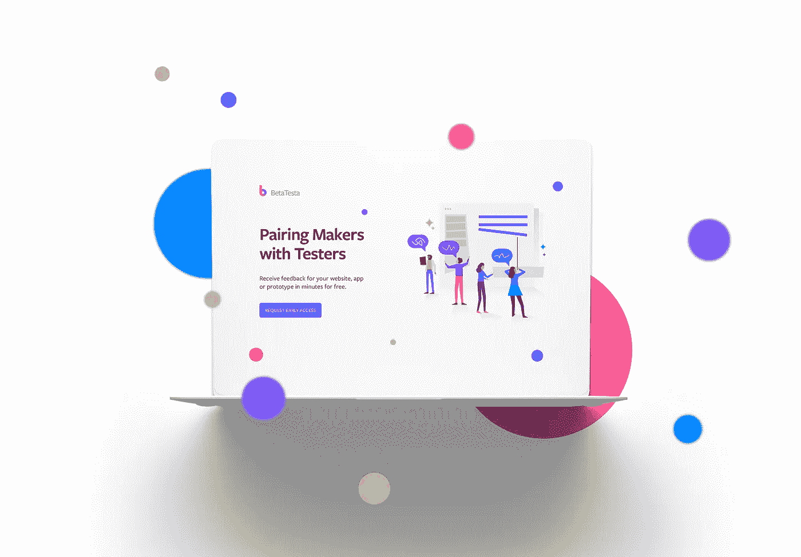

# 我研究了每个用户测试平台，以下是我的发现

> 原文：<https://medium.com/hackernoon/i-studied-every-user-testing-platform-and-heres-what-i-found-6274b16db303>

我最近在互联网上看到的一个惊人数字是 **80%** 的数字产品所有者或团队**在发布他们的初始产品之前不进行用户测试**。

我不需要向你解释为什么这是一个坏主意，只要说这是一个荒谬的数字就够了，事情不一定是那样的。

最近由 Aytekin Tank*(Jotform 的创始人&CEO)*发表的一篇文章讨论了在创建 jot form 的早期，他和他的团队在幕后辛苦地构建他们的新平台，结果却向非常失望的观众发布了他们的新作品。

> 在真空中工作使我们无法收集重要的反馈。这个版本很乱，到处都是 bug。客户很生气，许多人要求恢复旧版本。有些人甚至离开了我们。

就我个人而言，我会举手承认我是统计数据的一部分。我很天真，认为我不需要和用户交流，我已经想好了一切，我确切地知道我的目标用户想要什么。

我只想说我错了。

在几个失败的个人兼职项目和无数个月的浪费之后，我最终发现了精益创业方法和构建、测量、学习框架。

一晃 5 年过去了，我现在是伦敦一家创业工作室的高级产品经理，与一些令人难以置信的新创公司一起工作，同时还在兼职经营自己的一些项目。

作为一名产品经理，用户测试即使不是每天也是每周一次，几乎已经成为 ucreate 的项目经理们痴迷的特征。相信我，一旦你从用户测试会议中获得了洞察力，你会很快明白我在说什么。这种从测试早期线框和原型中获得的洞察力将为您节省数周甚至数月的时间和金钱。

## 研究

通过这种对用户测试的痴迷，我和我们在 ucreate 的产品经理团队在过去几年里测试了我们能得到的每一个用户测试平台。

> 作为一名产品经理，最好的事情之一就是我们处在产品和用户的交汇点，所以我们处在一个很好的位置来客观地评估用户测试平台的价值。

为了验证我关于为什么不进行用户测试的假设，我对我的网络进行了一次调查，收到了 98 份回复。以下是不进行用户测试的主要原因:

*   我觉得没必要( **40%** )
*   太贵了( **22%** )
*   我没时间( **20%** )
*   不知如何( **18%** )

这些理由中有一些是有根据的，也许…然而，我觉得有一个基本的原因从清单中遗漏了，如果我们都诚实面对自己，这个原因可能会排在第一位。

> 我们不想听到真相。我们不希望有人证明我们的假设是错误的。我们害怕真相。

如果这引起了你的共鸣，我会敦促你收起你的骄傲，在你的产品早期开发阶段尽早得到反馈。越快越好。它不需要昂贵、及时或复杂。相信我！

在我的研究中，下一步是规划出当前所有的用户测试平台。我是通过与我们的产品团队、谷歌搜索、IndieHackers 论坛、Quora、Product Hunt 和 Reddit 等多种渠道交谈来做到这一点的。然后，我确定了每个平台的关键功能，并在电子表格中绘制出来，并根据每个功能分配了一个大致的产品级别。这基本上允许我对每个产品及其相关特性进行相互比较。从我确定的 40 个左右的产品中，我将名单缩小到 5 个主要参与者。

Example of my product offering benchmark analysis

# 我的发现

## **成本**

大多数用户测试解决方案的价格可以分为两类。

1.  免费增值层，提供极其有限的产品，经过优化，在产品使用体验非常有限的情况下，将您转化为付费用户。
2.  付费层，通常基于订阅，是前几层的一个大台阶。对于大多数制造商和小团队来说，这很大程度上是负担不起的。典型的订阅模式不适用于较小的团队和 solo 制作者，他们不像较大的团队那样频繁地发货，或者需要每月进行一致的测试。

**底线**

免费增值层几乎没有价值，付费订阅层缺乏灵活性。我们需要灵活的定价层级，以便您可以在准备就绪时逐步扩大规模。

## **易用性**

正如我前面提到的，有很多用户测试平台。在我的研究中，我发现至少有 40 个。在这样一个拥挤的空间中会出现竞争，产品团队通常会做些什么来从竞争中脱颖而出呢？他们构建了大量的功能，希望这能让他们的产品比竞争对手的产品更有粘性、更好。要是有那么简单就好了。

大量可用的特性可能会让人不知所措，而且通常是不需要的。它们通常也是针对专业团队的。在很大程度上，它们与较小的团队和个人无关。

**底线**

成熟的产品往往会遭受功能膨胀的困扰，不幸的是，它们的本质会越来越复杂。因此，他们在与竞争对手的激烈竞争中牺牲了 UX，讽刺的是，这样做为新的竞争打开了大门！

## **招聘候选人**

招募候选人可能是进行用户测试最棘手的部分之一。您通常有两种选择:

1.  招募自己的测试候选人。如果你有一个庞大的关系网可以利用，或者财力雄厚，可以通过提供某种形式的经济激励来获得候选人，这是一个显而易见的选择。
2.  付费平台为您招募候选人*(下文详述)*。

假设你没有一个很大的网络，没有一大群人等着购买你的产品，你会本能地被用户测试平台的候选人才库所吸引。依靠平台招募测试候选人的问题是，你不知道他们是谁，他们真的是他们所说的人吗，他们实际测试你的产品的动机是什么？

**底线**

目前许多提供收费招聘应试者的平台通常将这项工作外包给第三方，自己收取少量佣金。这导致对候选人的真实性缺乏控制。

候选人的动机是什么，我猜想通常是财务上的。尽管经济激励没什么不好，但我个人不希望我的所有候选人都被这种激励所左右。为什么？

以可用性中心为例，他们对每个被招募的测试人员收费 1 美元。测试人员每次测试获得 0.10 美元，只能取钱，直到他们达到 100 美元。这意味着他们需要完成 1000 项测试才能取出 100 美元。你可以想象测试者被激励去通过尽可能多的测试，以达到那微不足道的回报。不理想。他们只是想尽快通过你的测试。

# 解决方案

通过对当前产品的失望，我正在重建 BetaTesta。一个简单的平台**将数字产品的制造商**与测试候选人**配对。**

我们的使命是简化用户测试，这样制造商就可以花时间来构建伟大的产品，更好地了解他们的产品如何满足用户的需求。我们想揭开用户测试的神秘面纱，并把它带给大众，让它变得像编写一条消息一样简单和不费力。

> 不需要复杂！不需要很久！不需要很贵！所以不要让它！[今天加入我们](http://www.betatesta.xyz)。

New homepage design: www.betatesta.xyz

BetaTesta MVP 最初于 1 月 18 日在产品搜索中推出，并获得了来自超过 40 个国家**的 340 名注册测试者**的热烈响应。

 [## 我的周末 MVP:使用零代码或现金，获得数百名用户

### 上周我发布了我最新的侧投影，BetaTesta。在这篇文章中，我想分享一些事情；我如何建立…

startupsventurecapital.com](https://startupsventurecapital.com/my-weekend-mvp-using-zero-code-or-cash-and-acquiring-hundreds-of-users-bd56bcb5bd3e) 

作为一家由充满激情的制造商运营的公司，我们深知需要一种简单且经济实惠的解决方案。这就是我们创建 BetaTesta 的原因。为单独制造商、设计师、产品经理、中小型创业公司服务，这是我们的 DNA，从功能、支持到定价，一切都是为您设计的。

我们已经删除了所有不必要的特性和复杂性，并将其剥离回一个简单而强大的用户测试工具，只需花费一小部分成本。

我等不及要给你看我们正在建造的东西。

在下一阶段，我将与 [ucreate](http://www.ucreate.it) *(我工作的公司)*合作开发 BetaTesta 的下一阶段。我们将通过我们的 [**新 Flash 程序**](https://www.ucreate.it/our-programmes-flash) 运行 MVP，因为通过它运行内部项目来测试它是更好的方法。忠于我们的使命，我们将在整个 Flash 计划中分享我们的旅程。

你喜欢这篇文章吗？如果是这样，我只要求你帮一个忙🙏🏻。在你阅读这篇文章的时候，你可以给我一些非常有用的反馈👉 [**点击此处**](https://ucreate.typeform.com/to/RliimB) 👈