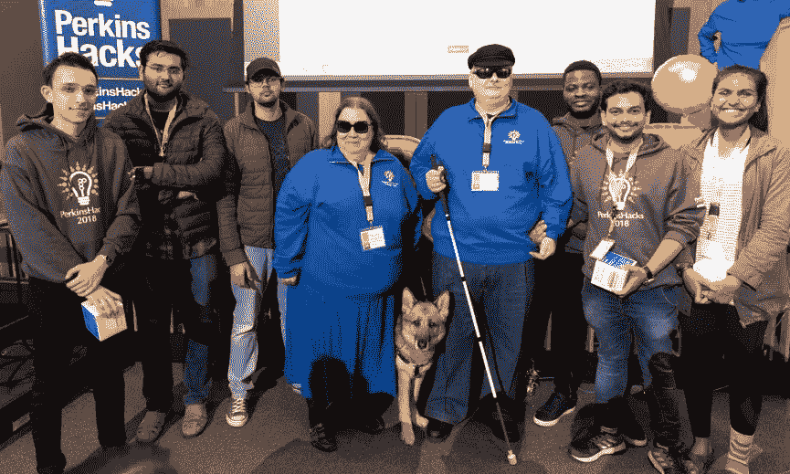

# 我不擅长利他…我还能成为公民黑客吗？

> 原文：<https://medium.com/hackernoon/i-suck-at-being-altruistic-can-i-still-be-a-civic-hacker-57dee4ab5a1>

**简而言之，是的。**

所以我简单分享一下我的故事。

总有人问我**为什么**我会做我现在做的事情。从我年轻的时候起，我感同身受和理解他人感受的能力就一直很强。

在朋友群体中，我一直是中立的一方，我很感激自己从未被欺负到我的一些好朋友所经历的程度。我的角色一直是联系并保护那些需要保护的人。我想为他们创造空间，让他们在没有外部压力的情况下做自己。似乎太不公平了。

我相信小莎拉会同意，我现在作为一名公民黑客和社会企业家的角色与过去的我是一致的。**我仍在为我们的社区连接和建设保护空间，以管理我们想看到的好东西。**

我去年看了这个视频，非常喜欢阿比盖尔·马什分享的内容:

> “随着社会变得越来越富裕，人们似乎将注意力转移到了外面，因此，对陌生人的各种利他主义都在增加，从志愿服务到慈善捐赠，甚至利他的肾脏捐赠。
> 
> 但所有这些变化也产生了一个奇怪而矛盾的结果，那就是，即使这个世界正在变得更美好、更人道，但人们普遍认为它变得更糟糕、更残酷，事实并非如此。
> 
> 我不知道这到底是为什么，但我认为这可能是因为我们现在对遥远地方的陌生人的痛苦有了更多的了解，所以我们现在更加关心那些遥远陌生人的痛苦。
> 
> 但是很清楚的是，我们看到的这些变化表明，利他主义和同情心的根源与残忍和暴力一样是人性的一部分，甚至可能更是如此，尽管有些人似乎天生对遥远的他人的痛苦更敏感，但我真的相信，几乎每个人都有能力摆脱圈子的中心，将同情心的圈子向外扩展，甚至包括陌生人。”

你不需要成为完美无瑕的伟人。相信我，我一直都在犯错。抓住自己的假设。说错话。问一个奇怪的问题。但是事情是这样的…我正在**学习**…我正在**尝试。如果你做错了，你就不是一个可怕的人。**

然而，你逃避并没有公平对待自己。没事的。如果你被纠正或批评，你仍然会被别人听到。

当涉及到不同的文化或社会规范或我们自己的假设时，我们中的许多人对挑战自己感到尴尬。我记得当我在帕金斯盲人学校支持盲人黑客马拉松时。

我知道并理解这个社区面临的挑战吗？数量

老实说，我从小组成员那里听到的故事以及在活动中与人们的交谈中学到了更多。我在管理盲人志愿者，我必须很快学会所有的礼仪……我戴上“像个孩子”的帽子，问问题。我是直接和诚实的…

**…那我怎么让你知道我在和你说话呢？我怎么帮你从 A 区走到 B 区？如果你需要你的拐杖，我该怎么接近你…我把它放在哪里？你用什么设备？他们怎么会更好呢？**

Photo credit: Perkins School for the Blind

我交谈过的人没有一个对我的问题感到厌倦，我在最初的几个小时里学到的东西比我一生学到的都多。到了黑客马拉松的第 5 个小时，我们已经把一切都搞定了，我感觉很舒服。

我们都是人。我可以保证，虽然残疾以各种形式存在，但我们都有同样的情感，是时候克服我们的不安全感了。所以不管你对自己有什么看法，我邀请你进来看看你实际上有什么能力。