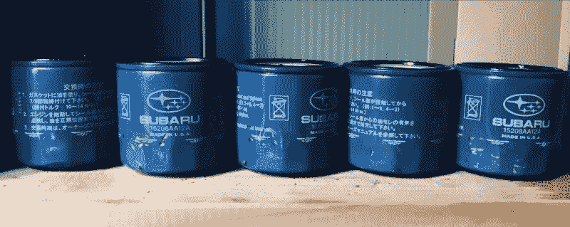

# 黑客在业余时间都做些什么？我花了 100 个小时看 YouTube，自学如何制造涡轮增压汽油发动机

> 原文：<https://medium.com/hackernoon/i-taught-myself-how-to-build-a-turbocharged-gasoline-engine-from-a-single-youtube-video-in-100-88420f7d4bf3>

## 令人难以置信的是，现在有如此多的其他人的知识和经验可以轻易获得。受到这一事实以及人工智能最新进展的启发，我开始寻求通过模仿行为来完成复杂的任务，并以程序化的方式工作，以确定算法将如何处理问题。

Internal combustion process, source: Giphy

一年的最后一天通常是一个很好的时间来回忆我们从 1 月 1 日以来已经学过的，完成的，可能是我们还没有完成的，以及我们为下一年计划的。

整整一年前，我挑战自己。让我与你分享我的冒险。我希望它将提供一个有用的数据点，并有希望成为某个人的灵感来源。

给你简单介绍一下。我是一名研究员。我喜欢问问题，并想出如何回答。我的问题是:

***鉴于网上有丰富的人类知识，一个人是否可以通过浏览互联网，以自学(无人监督)的方式学习一些不平凡的东西。***

而你却可以很快的说: ***是的！*** 还是 ***不！*** 我本想用更科学的方式来做。我决定在自己身上做一个实验。在这篇文章中，我将尽可能具体地描述我所做的和这个实验的结果——因为科学的本质是可重复性，对吗？

Source: Another World, Delphine Software

我希望你还和我在一起。如果是这样的话，那我就多说一点我的动机。

主要原因是我是做人工智能(AI)研究的。更具体地说，我对无监督学习感兴趣。这是一种能够自动收集数据并计算出如何处理的人工智能。

Andrej Karpathy 有一篇很好的博客文章，是关于尝试手动分类图像，以确定人工智能可用数据上的人类表现

*   [Andrej Karpathy 在人工图像分类方面的努力](http://karpathy.github.io/2014/09/02/what-i-learned-from-competing-against-a-convnet-on-imagenet/)

我决定做这样的事情会很好，但是是在更复杂的事情上。

但这不是唯一的原因。在我的生活中，我多次听说你真的需要正规教育来做一些事情，并且获得适当的培训(由已经是某方面大师的人提供)是至关重要的。因此，你需要在人生的早期就决定自己的命运，然后接受它。我不同意。我认为过去是这样，但现在不是了。

特别是在机器学习社区，关于是否有必要拥有一个官方学位的辩论正在进行。我有计算机科学的博士学位，所以我可能是说你不需要它的合适人选。你需要的是这个:

*   好奇心
*   毅力(这真的很重要)
*   能够确定数据洪流中的真实情况

我认为我很好奇，我可以忍受很多，第三个可能需要一些实践，但可以学习。就是这样。

# 好的。这是实验。

Source: Another World, Delphine Software

## **任务**

*富士重工生产的带主动气门控制系统(AVCS)的 2.5 升 4 缸涡轮增压对置发动机(EJ257)总成。*

EJ25 engine. Source: Subaru

在某种程度上，我是幸运的，因为我有一些重要的事情需要去做(我有一些时间可以捐给科学)。它符合所有条件:

*   我真的不知道该怎么做。人们告诉我，我注定要失败。
*   网上有数据(未过滤)
*   它看起来足够复杂，可以作为其他问题的代理问题(我估计完成它需要大约 100 个小时)。
*   最后有一个简单的**是/否**答案

April 2017, Buttonwillow raceway. I killed this engine then, so I could use it for science. It was dead, so I heard that everything had to be disassembled or replaced.

## 目标

拆卸、修理、组装。跑 10000 英里(当你去找专业机械师，他们会给你这种保修)

## 该方法

模仿。通过观看一个 YouTube 视频来学习。不要做过分聪明的事。

成功了(今天突破了 10000 英里大关)。事不宜迟，我来描述一下我的所作所为。如果对细节不感兴趣，可以跳到最后。

# 细节

在本节中，我将:

*   试图让你相信这个问题实际上并不简单
*   显示采取的步骤

事不宜迟，我来描述一下我接下来做了什么。

**如前所述，我对这个**几乎一无所知(完全免责声明:我之前换过刹车片)。

[这是我使用](https://www.youtube.com/watch?v=kUfNrB1Dy54)的视频，并试图对正在做的事情进行逆向工程。我可以假设那个家伙(弗兰克？)知道该怎么做，因为最后他启动了引擎，引擎工作了。但是我所能做的就是观察和模仿。自己尝试一下(没有解说，一切都加速了)

根据 YT 的视频，我试图找出哪些是必要的工具和零件。为此，我使用了[斯巴鲁网站](https://parts.subaru.com/Subaru_2012_STI.html)并订购了我需要的零件(最初我甚至不知道我需要什么，结果是替换零件花了我 500 美元)。我还发现了关于[斯巴鲁电路板](https://forums.nasioc.com/)的各种讨论，但它们并没有多大用处，因为要么有相互矛盾的描述，要么有人声称(再次)，只有机械师应该处理这个问题。

我对工具的预算是 1000 美元(为了现实)。我在亚马逊上买了几样东西:[发动机起重机(～300 美元)](https://www.amazon.com/Dragway-Tools-Folding-Hydraulic-Engine/dp/B00294B0LS/ref=sr_1_4?ie=UTF8&qid=1546177363&sr=8-4)、[冲击扳手](https://www.amazon.com/DEWALT-DCF880HM2-20-volt-Lithium-2-Inch/dp/B00BWFIKJA/ref=sr_1_3?ie=UTF8&qid=1546177465&sr=8-3)(200 美元)、一些其他扳手(200 美元)，希望我能弄清楚如何使用它们。

实验于 2018 年 1 月 1 日正式开始。

## 第一部分—拆卸(1 月 1 日—2 月 3 日)

与此部分相关的主要问题是找到合适的工具并识别所有部分(分段？).我还预料到了进一步的问题，即找出零件的归属，所以我需要一个系统来跟踪它们。

解决这个任务的一个非常有用的启发是识别所有的螺栓/螺钉并移除它们。我还比较了连续的帧，以确定哪些被删除。这有点像“发现差异”游戏。

LEFT: 3:01 in the video, RIGHT: ten seconds later

从模仿学习的角度来说，我主要依靠图像分类。我实际上从视频中提取了几次帧，并通过反向图像搜索运行它们。最难的东西是工具:

What is this?

Piston ring compressor

This one was pretty hard

Can of oil

Pistons

Got this crane of Amazon based on the video

一些更复杂的例子需要动作识别:

This one is easy

**这里有一些文档:**

LEFT: Jan 1st, 2018\. Impact wrench, crane and coffee, RIGHT: Jan 2nd, 2018\. Pulled it out, that’s about 15 hours so far and a approximately 5% of the total work.

LEFT: Jan 20th. Here I already removed most of the stuff, intake and exhaust manifolds are off, wiring is off, what you see is the front — timing belt with 2 cylinder heads on the sides. RIGHT: Jan 24th. Taking off cylinder heads, removing the camshafts.

Jan 25th. Moved inside the house because of rain. LEFT: The block and two cylinder heads. RIGHT: My `workshop`, when I wrote I was doing this by watching YOUTUBE, I meant it! This is the same video linked above.

Feb 1st, LEFT: Pistons are out, RIGHT: The block is split and the only things left are the piston rods and the crankshaft.

## **第二部分—诊断和修复(2 月 4 日—3 月 14 日)**

成功。我能够找到问题的根本原因。为了解决这个问题，我需要更换 4 个活塞杆轴承。与此同时，我决定买一套全新的锻造活塞和连杆，加工曲轴和气缸盖。更换正时皮带等。毕竟，我不是在为劳动买单。这部分主要是计算零件号和等待。

Feb 4th. I disassembled everything. Found the cause. Can you spot a problem? One of the piston rods was lacking a bearing due to excessive wear.

LEFT: This is a replacement for the part which failed (rod bearing). RIGHT: New pistons.

## 第三部分—组装和调试(3 月 15 日—4 月 17 日)

最难的部分(意料之中)。在这里，我需要购买一些额外的工具:

*   扭矩扳手(50 美元)
*   活塞环间隙锉和环形压缩器(150 美元)

大部分工作都与计算出哪一个螺栓连接到哪里有关。这里使用的启发式方法是以相反的顺序做事(在拆卸时，我将零件放在有时间和日期的塑料袋中)。也有很多测量和重新组装的东西 2 或 3 次，因为我错过了一些东西。

**从人工智能的角度来看，最困难的部分与视频中 12:24 的部分有关。**

I had really hard time figuring out what these numbers mean exactly and what they are used for. Eventually, I was able to link the numbers to the manual I got (RIGHT)

**更多图片新闻:**

These are my notes for doing the assembly. You can see how I planned the order and estimated time in hours. Also, the are some references to the Youtube video (i.e. Oil Cooler 19:20 refers to that point in the video).

Machined cylinder heads, cylinder walls and the crankshaft. ARP head studs mounted.

April 2nd. One of the hardest parts. Took much more time than I anticipated. Adjusting the piston rings required some extra research and math. Pistons expand due to temperature and the gap needs to be just right.

LEFT: Preparing to assemble the most important parts — the rotating assembly — RIGHT

LEFT: Crankshaft is in the half-case, RIGHT: Pistons are in. Only 40h to go…

This part is quite tricky, need to readjust clearances between camshafts and valve buckets before mounting the cylinder heads. 30h left?

LEFT: Block prepared for mounting cylinder heads, RIGHT: Cylinder heads in place. It requires quite a lot of strength to torque them properly.

Putting timing belt back on was tricky too. Almost done. 15 more hours and it should be ready.

Going where it belongs. Just 5 hours left to mount the engine.

## 第四部分—评估(4 月 18 日—12 月 31 日)

装上发动机后，我必须修理几个零件(缺线等)。这花了我大约一天的时间，然后我们一切“编译”，引擎于 4 月 18 日启动，今天我决定结束。

在这一阶段，我尝试了各种方法来寻找问题，我甚至用显微镜在油中寻找一些东西，但是什么也没有。

Nerdy me: I used a microscope to look for suspicious stuff in the oil every time I changed it. RIGHT: here’s what you can see if you zoom in a lot. What you should not see: pieces of metal (they would have crystal-like structure).

我已经行驶了 10000 英里(今天刚刚超过标记)，它仍然工作。我对此没有意见。我也检查了电源，和以前一模一样。油耗更低。一切正常。

# 结论

它花费了大约 100 个小时的体力劳动，可能还有两倍的研究时间(一遍又一遍地看那个 YouTube 视频，可能我看了大约 50 遍)。我相信人工智能正在改变世界，我们可能会看到机器人从像这样的视频中学习。

最困难的部分是穿过信息中的噪音——有些地方你会看到相互矛盾的方向。这就是拥有博士学位的用处所在——你只是被训练来做这件事。

Source: Another World, Delphine Software

总的来说，我可以很容易地说，现在我至少和我以前谈过的一些机械师一样合格。现在换油大约需要 10 分钟。

## 真正的结论

如果你真的想做什么，就去做吧。最坏的情况是你会学到一些东西而失败，最好的情况是如果你考虑现在网上有什么，它会改变你的生活，给你很多满足感。做好失败的准备，保持耐心。

**新年快乐！让这激励你在 2019 年学习新的东西。**

附注:如果你想了解更多关于这项工作的信息，请告诉我。我试着不去太深。

# 未来的工作

有了这些知识，这是显而易见的，我现在正致力于使用强化学习来用基于神经网络的控制单元替换原来的控制单元:)。刚刚开始研究一段代码，希望通过学习如何控制燃烧过程来提供更多的动力和更低的燃料消耗——没有人在这方面工作吗？

## 信用

*   论文 *'* [*一个神经科学家能理解一个微处理器吗(Jonas et al.)*](https://journals.plos.org/ploscompbiol/article?id=10.1371/journal.pcbi.1005268) 提供了很多启发。为了确定我们是否能够通过观察神经元和激活来理解人脑，作者想弄清楚我们是否能够使用相同的方法理解微处理器。我的问题是:`程序员看 YouTube 能看懂内燃机吗？`

Source: [*Could a Neuroscientist Understand a microprocessor’ (Jonas et al.)*](https://journals.plos.org/ploscompbiol/article?id=10.1371/journal.pcbi.1005268)