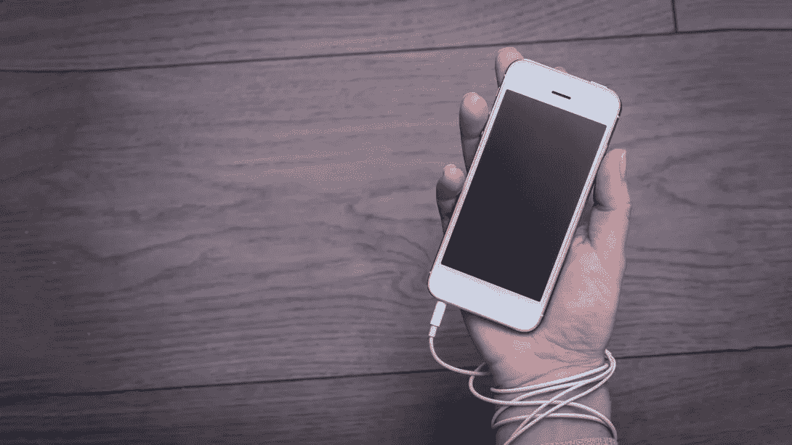

# 我尝试了数字安息日，它是史诗般的

> 原文：<https://medium.com/hackernoon/i-tried-a-digital-sabbath-and-it-was-epic-f70c2e3e1ab5>

Tried to find the rights for this picture but couldn’t

[尼古拉斯·塔勒布](https://en.wikipedia.org/wiki/Nassim_Nicholas_Taleb)曾经说过:

> "三种最有害的成瘾物质是海洛因、碳水化合物和月薪."

如果他是住在洛杉矶或旧金山的企业家，他会知道这句话应该是:

> "三种最有害的嗜好是碳水化合物、月薪和 **Instagram** "

我在网上花了太多时间。太多时间了。基于空间( [Android](https://play.google.com/store/apps/details?id=mrigapps.andriod.breakfree.deux&hl=en_US) ， [iOS](https://itunes.apple.com/us/app/space-break-phone-addiction/id916126783?mt=8) )，有时候**我每天光是在手机上的时间就超过 7 个小时**。是的，听起来很多，你会惊讶于你实际上花了多少时间而没有意识到。[谷歌](https://hackernoon.com/tagged/google)地图、Spotify、Gmail、电话、日历、
等等真的加起来。看，我甚至没有添加脸书、Reddit、Twitter、Instagram 或网飞。

实话告诉你，作为一名企业家，我不需要一间办公室，但这意味着我要在旅途中大量工作(因此我手上粘着一部手机)。不，这只是一个借口！别自欺欺人了！

# 是改变的时候了

上周六早上，我决定尝试一个数字安息日。那是什么？

> 数字安息日是一种时髦的停止使用数字设备一整天的方式。

我的规则很简单:**没有手机，没有平板电脑，没有笔记本电脑和游戏设备**。而且肯定**没有互联网**。听起来很简单，对吗？

我的早晨开始在后院吃早餐，没有网飞或 YouTube 作为背景。当然也没有音乐(没有 Spotify)。该死，我应该买一个旧的时尚收音机。也许从亚马逊订购？该死，没有亚马逊！

然后我在我的房子里建了一个健身房，我已经推迟了一段时间，但嘿，周末的 Instagram 故事是如此有趣(更新:不，它们不是)。

我能听到我的电话在响(我应该关掉它，但现在我不允许碰它)，可能是我的朋友们在试图协调咖啡、饮料、活动。我希望有人来串门，这样我就可以告诉他们我的安息日。当黑色安息日到来的时候，我真的很想唱这首歌，但是除了偏执狂，我不会用吉他弹奏任何安息日的歌曲，我也不能上网去找音乐目录。没错，这就是我的[个人越南](https://people.com/politics/trump-boasted-of-avoiding-stds-while-dating-vaginas-are-landmines-it-was-my-personal-vietnam/)。

快进一下，我的一个朋友顺便来喝了杯咖啡，把这个消息传播到了我们的网络上。我可以听到 Facebook Messenger 每眨一下眼睛背后的笑声。

现在是喝咖啡的时间了！而且必须在附近的某个地方，因为我们有*没有谷歌地图*的政策。或者至少**我**不能用谷歌地图。当我在想我们应该去室外还是室内时，我几乎发现自己在问“嘿，谷歌，今天天气如何？”。今天不是谷歌。今天不行。

我们到达咖啡馆，在车里聊天，没有人查看 Twitter、脸书或 Instagram，因为我有这种巨大的能量消耗我周围的社交空间，我说“咖啡我请客”。

我的数字安息日让我意识到技术是多么了不起，在我们的日常生活中是多么根深蒂固。显然，如果不使用平板电脑，你甚至无法在咖啡店买到咖啡。

白天变成了夜晚，我们出去喝饮料，然后吃东西，我看完了一天的实体书，我把它当成了装饰品，因为我在 Kindle 上阅读。

# 裁决

我爱每一点(哈！双关语！)的体验。我真的很喜欢排队，不看手机，只是看着人们(看他们的手机)。这是一种奇怪的冥想练习。

实际上，人们似乎变得更加健谈和开放。谁知道呢！

# 下周六我还会这么做吗？

当然啦！但是我会稍微优化一下。这种即兴的数字隔离让与朋友的交流变得充满冒险精神(至少在开始时)，因为没有人知道我的实验。现在他们会知道我们只需要坚持从周五开始的计划，他们必须帮我买咖啡。哦，我肯定会买一个小收音机(在你面前的 Spotify)。

[**乔恩五世**](https://www.linkedin.com/in/johnvlachoyiannis/) **在 4300 年建造了第一个传送装置，并经常回到过去谈论将改变未来的事情。或者过去。在他的旅途中，他建立了** [**史诗公司**](http://agentrisk.com) **，投资** [**牛逼公司**](http://tradingview.com) **和** [**创造了一台支付他账单的机器**](http://agentrisk.com) **。**

你可以在斯坦福大学、联合国、各种科技和创业活动以及他最喜欢的星球 KOI 7711 附近找到他的演讲。

## 如果你喜欢这个故事，请点击👏按钮并分享，帮助其他人找到它！欢迎在下方留言评论。