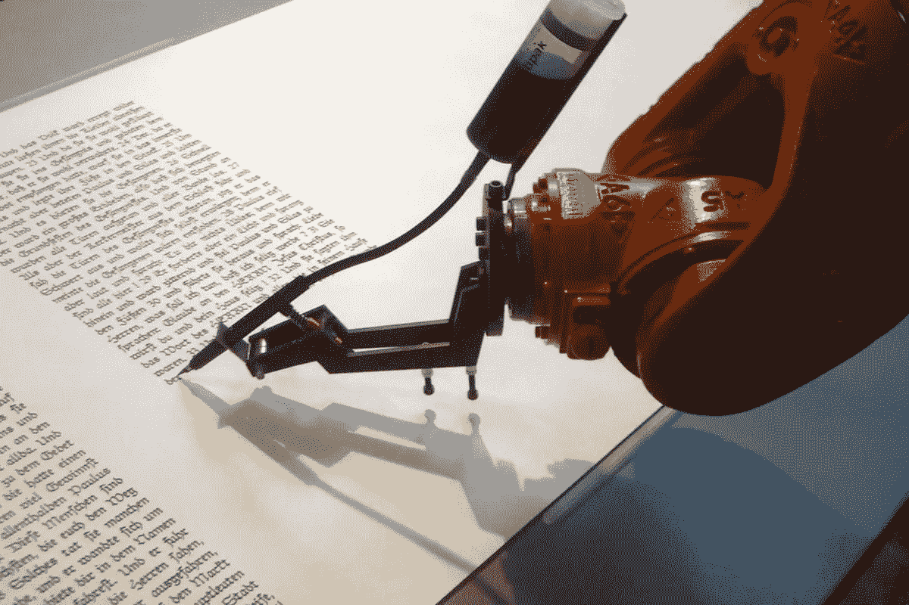

# 如何用深度学习写诗

> 原文：<https://medium.com/hackernoon/i-tried-my-hand-at-deep-learning-and-made-some-poetry-along-the-way-2e350c33376f>



那是一个黑暗、灰暗的冬天夜晚，我发现自己，就像过去很多次一样，盯着我的电脑屏幕无休止地滚动着无用的文章，从积雪自救到大脑融化教程。

唷，那是一个很长的句子。

不管怎样，不知什么原因，我发现自己读了这篇文章:[https://www . digital trends . com/cool-tech/Japanese-ai-writes-novel-passes-first-round-national-literal-prize/](https://www.digitaltrends.com/cool-tech/japanese-ai-writes-novel-passes-first-round-nationanl-literary-prize/)

安艾写了一部小说，而且还差点得了文学奖！所以，它不仅不是垃圾，而且好到足以愚弄专家！我很感兴趣，并开始谷歌了…

我发现实际上有一个**全国小说创作月**，在那里人们提交他们最大的努力来创作一部至少 5 万字的小说。我看了一些代码/输出，非常感兴趣。你可以在这里找到:【https://github.com/NaNoGenMo】T4

然后，就好像我还没有因为兴奋而口吐白沫一样，我读到了这个:[https://github.com/zackthoutt/got-book-6](https://github.com/zackthoutt/got-book-6)

一个家伙用深度学习写了下一部《权力的游戏》！各种想法在我脑海中闪过。我现在可以看到了…

我要取一些数据，用我惊人的算法处理。我打算出版一本小说。它会成为畅销书。下一个大型幻想系列。我会在图书销售方面做得很好。网飞随后会过来并获得我的书的版权。他们会制作电影三部曲。我可以见到詹妮弗·劳伦斯。我现在会过得很好。他们会邀请我接受电视采访。采访者会滔滔不绝地谈论我的作品，告诉我她是多么的崇拜我，并问我，我似乎有超人的能力创作出如此多令人惊叹的小说，秘诀是什么。我会给她一个自鸣得意的笑容，看着镜头，大喊:

“哈哈，你们这些白痴！我刚刚通过一个从 github 偷来的算法把所有的时间之轮的书都输入进去了！你就像阿尔·帕西诺电影里的人，他制作了西蒙软件。你被解雇了！”

混乱将会爆发。人们会开始质疑他们的现实。他们会害怕拿起另一本书，以防他们最喜欢的作者是一台机器。

我等不及了。我开始执行我的迂回计划。

***30 分钟后……***

我放弃了。

是啊，事实证明大多数算法都不擅长写出好小说。事实上，它们产生了非常不连贯，有点滑稽的输出:

*“我继承了公司是因为未来把他的哥哥送上了掌声。父母是一个愚蠢的成功，夫人，现在确实，女性形式在个人的颜色。现在咆哮发生了，壁橱，少女，总是赢得任何礼物，在六个。”*

我显然不会用那篇散文打动任何人，更不用说网飞和詹妮弗·劳伦斯了。我很失望。我没有深度学习的经验，也没有资源来消耗大量的数据，所以我几乎没有希望击败所谓专家的努力。

要是有一种体裁可以把这些随意的词解释为天才就好了。然后我突然想到。诗歌！诗歌不就是一堆乱七八糟的词扔在一起吗？这相当于文学中的现代艺术。好吧，我向所有热爱和阅读诗歌的人道歉。我确信它会是美丽而有意义的。但它从来没有真正吸引过我单纯的口味。我倾向于喜欢一个简单的有剑的童话。还有龙。还有留着长长白胡子的睿智老人。

但我很好奇想尝试一下，看看用诗歌能得到什么样的输出。我的小项目就这样开始了。

# **数据**

我决定用沃尔特·惠特曼的《草叶集》作为数据。即使像我这样的平民也能欣赏沃尔特·惠特曼！你可以在古登堡计划找到这个，这是一个非版权作品或那些现在在公共领域的资源:【https://www.gutenberg.org/

我找到了《草叶集》的文本文件，并把它保存在我的电脑上。姑且称之为 data.txt 吧。

# 算法

我决定使用扎克·索特的算法，他曾用这个算法创作了下一部《权力的游戏:[https://github.com/zackthoutt/got-book-6](https://github.com/zackthoutt/got-book-6)

# 我在哪里运行这个？

关于深度学习，你需要知道的一件事是，你需要大量的计算能力来运行模型。理想情况下，您需要一个 GPU 资源来为您完成繁重的工作。我没有 GPU，但幸运的是，我以前涉足过深度学习，并报名参加了 http://www.fast.ai/杰瑞米·霍华德的课程

在 fast.ai 课程中，你在云上运行所有的模型，这样你就不会受到你的机器的限制。我们在 Amazon Web Services (AWS)上设置了一个 EC2 实例，它背后有 GPU 支持(这将是 P2 实例)。你需要请求亚马逊给你这个；如果你是他课程中的一员就可以。

一旦运行了实例，就可以在连接到该实例的 Jupyter 笔记本中运行代码。我觉得，对于我这样的外行人来说，设置所有这些来运行您的深度学习模型是一件痛苦的事情，因此我将逐步介绍如何做到这一点。现在，有很多方法可以做到这一点。但我只是想让你们看看我是怎么做到的。这可能不是最好的方法。但确实有效。

# 最后，教程

我假设您知道如何启动 EC2 实例。为此，您希望使用其中一个 AWS 深度学习 AMI。这样，您就不必担心安装任何深度学习软件包。我选择了 AWS 深度学习 AMI(亚马逊 Linux)。


现在，选择一个 p2 实例。这可能是 p2.xlarge 实例，除非您是获得更大实例批准的大人物。


一旦你对一切都满意了，就启动你的实例。

现在，打开一个终端并连接到 EC2。你知道诀窍:在 Mac 中使用终端，在 windows 中使用 Putty。您可以通过在 EC2 实例上单击鼠标右键并选择“Connect”选项来了解如何将 SSH 安装到实例中。该命令将类似于以下内容:

```
ssh -i your-ec2-key.pem ec2-user@ec22–212–21–23–21.compute-1.amazonaws.com
```

你加入。一切都已经设置，因为我们选择了深度学习 AMI。嗯，一切，除了一些小事情…

用于深度学习的其中一个库是 Tensorflow。我们希望在本练习中使用 Tensorflow 1 . 0 . 0 版。原因是我们将在以后的版本中使用的 github 代码会中断。这可能是一个足够简单的更新，更改代码以修复这个问题，但我很懒，只想运行这个****。

我们需要通过首先卸载现有的 Tensorflow 软件包并重新安装 1.0.0 来更改我们的版本。

```
#Uninstall
pip uninstall tensorflow# Install version 1.0.0
pip install tensorflow==1.0.0
```

然后，我们需要优化我们的 GPU 设置，因为 Amazon 出于某种原因不会自动这样做:

```
# optimize GPU
sudo nvidia-persistenced
sudo nvidia-smi — auto-boost-default=0
sudo nvidia-smi -ac 2505,875
```

我们需要做的另一件事是为 CUDA 设置库路径，以确保我们的深度学习算法在此实例上实际使用 GPU:

```
export LD_LIBRARY_PATH=/usr/local/cuda-8.0/lib64
```

成交。现在我们准备启动 Jupyter。您需要运行以下命令:

```
jupyter notebook --no-browser --port=8888
```

显然，这也不简单。你现在需要在你的终端中打开一个新的标签/窗口。并运行此命令(使用密钥和 EC2 ID)，以便可以在本地主机 8000 上运行 Jupyter:

```
ssh -i EC2key.pem -L 8000:localhost:8888 [ec2-user@ec2-21-21-21-21.compute-1.amazonaws.com](mailto:ec2-user@ec2-34-231-122-83.compute-1.amazonaws.com)
```

很好。现在，我们真的准备开始编码 aka 复制粘贴别人的代码。打开 localhost:8000，你会看到 Jupyter 启动。您可能需要通过身份验证才能访问它，在这种情况下，您需要在 URL 中传递一个字符串。这可以在运行 Jupyter 笔记本命令的终端的输出中找到。

现在，我们需要移动笔记本中的数据。我假设你一直是一个伟大的追随者，并已保存下来的数据。我们称之为 **data.txt** 。您可以使用主页右上角的“上载”按钮轻松地将其移动到 Jupyter。


On your right there is a button titled Upload.

现在我们的数据在 Jupyter，我们要做的就是用我们偷来的代码！

你可以在这里拿到有代码的笔记本:[https://github . com/zackthoutt/got-book-6/blob/master/got-book-generator . ipynb](https://github.com/zackthoutt/got-book-6/blob/master/got-book-generator.ipynb)

要么复制粘贴它，要么通过上传命令将整个笔记本移动到您的 Jupyter 服务器。更改代码中对数据的引用

```
book_filenames = sorted(glob.glob("/data/*.txt"))
```

变成了:

```
book_filenames = sorted(glob.glob("data.txt"))
```

现在你只需点击 run，从上到下遍历每一个单元格！

一旦你训练了你的模型(你可以摆弄超参数)，你就可以选择一个单词并生成一个 Whitmanesque 诗歌的样本。它应该保存在 Jupyter 主页的 outputs 文件夹下。以下是一个示例:

*我听到西方天空新的条纹，
被吞没的游子带着它们穿过
你身旁休息的地方，丁香花在音乐中呼喊，悠长，不被相信，从今以后在你的任务音乐中，
这里带着种子单纯的目的更没有下落或世纪足够的人，*

*与印度更进一步！
世纪一彩旗！*

*总是我求求你和她的时间或土地！
佐证了金沙的说话并朝他停顿，
战争折损了，最好的手，然后自由地独自一人，
无边无际地沿着大海，
赋予
在一边和他的脸
以外的美国的额头，
曼哈顿在北方作为所有的黄金地面，
通过许多遥远的军队，站在你的兄弟？*

看那个。这毫无意义。但也许确实如此。我说这是天才。现在你也可能成为下一个詹姆斯·乔伊斯，他们会在接下来的几年里试图弄清楚你的意思。

这里还有一个:

*岩石和胜利的泡沫，
然而岩石的声音和
将军迅速地相好，
我们站着不再从你们的目标中打出去计划，libertad，
全部走了，
在两个英雄的废墟中慢慢地忙碌着
其余的准备好了的赔率，，到了它知道的地方就把这里的
到处乱摸，
我的机械师同志带着
祸不单行，
我在小巷和空间后漂亮地出去了所以*

*现在终于轮到太阳和他们所有的人了，
光明从无休无止的痉挛中走了出来，这
他们的球体，
我的手重新伸过了沼泽中的白手，
我知道作为封建的声音，粗糙而浑圆的手是如此的不可分离，
直到我听到卡萝尔洗刷过立方的乐器，在冰冻的岗哨里忍受关闭它嘶哑的脚步，
建造者，困顿而绝望，一个生物，
那羞涩和气味扑面而来，水手们那傲慢的小个子，和响着溅起水花的翻滚坐在一起，
出了和真正的盖年头顶上升或翻滚的城市。*

它没有让你流泪吗？

此外，如果你的模型需要很长时间来运行，请确保你是在你的 GPU 上运行它。您可以通过运行以下命令来检查这一点:

```
nvidia-smi
```

如果它显示“没有运行进程”的消息，即使您的模型正在接受培训，这也意味着 GPU 没有正确连接。再次强调，请确保运行以下命令:

```
export LD_LIBRARY_PATH=/usr/local/cuda-8.0/lib64
```

希望这有所帮助！

请分享您的结果。我很想知道你得到了什么。:)

宣礼员