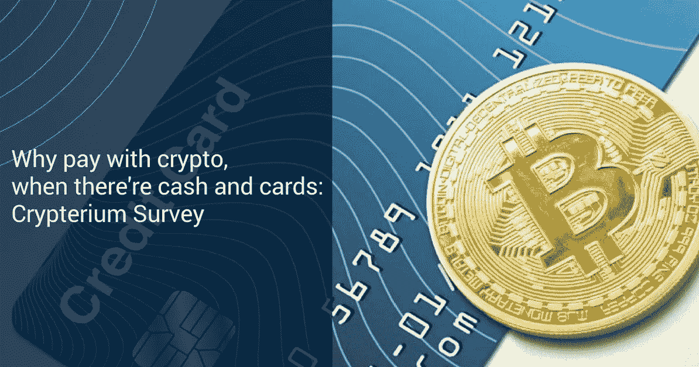

# “我想用加密支付一切，这有很多原因”

> 原文：<https://medium.com/hackernoon/i-want-to-pay-with-crypto-for-everything-and-theres-a-number-of-reasons-for-that-c64d13648eb2>

***自 2017 年初以来，***[***Crypterium***](http://www.crypterium.com)***一直致力于一种数字解决方案，让人们用加密货币支付，就像用现金或信用卡一样轻松。这款应用的创意得到了超过 40 万人的热烈响应，其中包括 TechCrunch***[***的联合创始人凯斯·蒂尔***](/@crypterium/keith-teare-crypterium-has-a-great-vision-that-captures-the-imagination-aec9fec0e902) ***和传奇风险投资家*** [***蒂姆·德雷珀******。***](https://www.youtube.com/watch?v=NqxovpWcOJ4&t=71s)

我们决定向 Crypterium 的支持者询问他们渴望用加密货币支付的原因。我们得到的答案太有价值了，不能留给自己，所以这里列出了几个最重要的原因:

# **降低成本**

主要原因很明显:许多人已经意识到为银行服务支付额外费用的负担。这可能很难立即意识到——它们会逐渐影响你的账户余额——但银行费用真的会堆积如山:根据 Chime Bank 的[银行费用搜索总结报告，2017 年美国人平均在这些上面花了 329 美元。这是一位来自巴西的](https://www.slideshare.net/ChimeBank/bank-fee-finder-april-2017-report/1)[地下墓室](https://hackernoon.com/tagged/crypterium)支持者所说的:“我想摆脱银行滥用的费用。另一个来自挪威的人补充说，他喜欢加密在没有中间人的情况下更具成本效益。

# **更高的速度**

第二个最受欢迎的原因与区块链技术的另一个众所周知的好处有关——速度。标准的银行转账不仅费用昂贵，而且需要几天才能完成。甚至不要让我们开始等待银行批准。

一旦你转向加密，你会注意到传统银行系统的所有缺陷，并开始欣赏区块链的优势。“我很喜欢能够按照自己的方式使用我的密码，而不必提现和等待银行批准，”—我们来自美国的支持者解释道。

# **适用于任何国家的相同解决方案**

这是另一个过于流行的原因:Crypterium 应用程序被那些定期环游世界的人广泛期待。考虑一下:你只需要用你的智能手机在任何地方支付任何东西，而不是去找自动提款机，试图找到最好的汇率，最后把钱兑换成当地货币。就这么简单！

“当你在国外时，使用加密货币更容易，”我们的加拿大追随者说。在协议中，来自英国的 Crypterium 支持者讲述了他对法定货币的问题:“有了法定货币，我每次旅行都必须兑换货币，然后在返回时兑换并支付高额费用。”

# **处于控制中**

一旦你把钱存入银行，它就不再完全是你的了。你不能 24 小时随时动用你的资金。例如，您可能无法在午夜时分进行紧急转账。此外，如果银行遇到任何问题，你的钱也会受到影响。

这就是为什么加密货币受到那些喜欢完全控制自己资金的人的青睐。“我想拥有自己的钱”和“这让我能够控制自己的资本，成为自己的银行”是调查中常见的答案。

一位来自丹麦的受访者总结道:“我更喜欢全天候控制我的钱，远离大公司银行是额外的收获。”。

# **对菲亚特系统的不信任**

菲亚特系统老了，经历了无数的问题。2008 年的金融危机就是一个生动的例子。全球菲亚特基础设施的内在缺陷，加上金融机构的次优表现，导致了灾难性的后果:成千上万的人失去了工作，积累了巨额债务，甚至无家可归。

对菲亚特系统的不信任一直在稳步上升，这是合乎逻辑的。“我不信任菲亚特系统，”一名澳大利亚受访者明确表示。“我反对当前的银行体系，它必须迅速被取代。从这个意义上说，解决方案是加密的，”—一位葡萄牙追随者同意。

此外，一些政府的货币和经济政策不到位会导致通货膨胀，甚至恶性通货膨胀，就像现在委内瑞拉的情况一样。这只会加速人们向加密货币的过渡，正如来自巴西的 Crypterium 支持者完美总结的那样:“我更喜欢加密，因为信托货币大幅贬值，而且我的国家经济不太繁荣。”

# **更高的安全性**

这一个是相当不言自明的。在你和你的钱之间的中介机构越少，诈骗的几率就越低。此外，“没有卡的详细信息——没有安全威胁，”一位来自英国的受访者指出。

# **税收影响**

在这一点上，全球各国政府只是在制定关于加密货币的税收政策。这意味着，最终，在税收影响方面，crypto 可能与 fiat 不同，也可能不同。

尽管如此，相当多的人看到了现在使用加密的税收好处。你会问为什么？一位澳大利亚支持者说，“如果你永远不回归菲亚特，在 crypto 中获利不会有税收影响。”。另外两个来自巴西和南非的支持者同意:加密有助于减少税款。

Crypterium 分析师正在对不同国家的加密税收进行研究，一旦他们准备好了，我们将与你分享我们的发现。

# **有选择**

生活在一个国家意味着使用该国的法定货币。你没有真正的选择——也就是说，除非你愿意不断地在转换费上赔钱。因此，在英国你肯定会使用英镑，在俄罗斯你会使用卢布，在墨西哥你会使用比索。

有了加密货币，就完全不一样了。您可以选择任何您喜欢的硬币和代币作为您的首选支付方式，我们的许多追随者认为这个想法非常有吸引力。“我希望能够自己决定使用哪种硬币/代币，”我们的一位美国粉丝说。

# **密码是未来**

“加密货币在技术上比法定货币更优越、更方便，在意识形态上也更好。全球货币是未来，现在我希望在全球任何地方都方便，”我们的巴西支持者说，我们的信念表达得再好不过了。

我们的波兰支持者还有一个很好的注解:“国与国之间不同，法定货币是进一步发展的障碍。加密支付的引入将使联合国在比现在大得多的规模上联合起来。”

我们现在可能习惯于用菲亚特支付，但新技术迟早会占上风。加密是降低交易费用、减少官僚作风、将全球金融基础设施提升到一个全新水平的途径，我们希望走这条路。