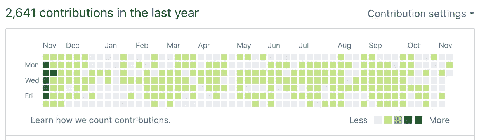

# 我想更深入地了解区块链的发展。所以我建了一所学校。

> 原文：<https://medium.com/hackernoon/i-wanted-to-go-deeper-into-blockchain-development-so-i-built-a-school-8957ae6ada27>

> 学习新事物最有效的方法是找到做这件事的动机。我发现我家在建一所学校。

## **背景故事**

4 年前，我辞去了投资银行的工作，进入了编程领域，这是由面对新挑战的雄心和开发产品的愿望所激发的。

这条路非常刺激，但并不容易*。熟悉基本的编程概念并不容易。感觉独立自主并独自完成整个项目并不容易。完全理解我从 StackOverflow 复制/粘贴的代码并不容易。*

*学习编码 6 个月后，我建立了一所在线学校( [lacerba.io](http://lacerba.io) )，教授编码和其他数字技能。目标是提供一些课程，减少我在编程学习过程中经历的痛苦。*

*该学院专注于意大利市场，因为我们发现了一个巨大的市场机会:大多数有才华的人对自己的职业不满意，甚至更糟的是，他们失业了，所以我们专注于为他们提供一个新的机会:将他们的才华转移到数字工作中。*

*我和我的联合创始人无法涵盖我们在课程中教授的大多数主题，所以我们开始寻找令人印象深刻的初创公司和专业人士，以便让有才华的教师加入进来，教授按需技能。现在，这个平台已经成为意大利所有希望获得数字技能的人的入口。*

## ***突破***

*今天我感觉自己像一个“真正的开发者”。我有几个项目在生产中，去年在 Github 上有 2641 个贡献，我自己运行开发运营，我管理一个由 4 名开发人员组成的团队。*

**

*回顾过去，我意识到我的大部分改进不仅仅与编码本身有关。加速我学习曲线的是我有机会与我们学校的老师分享知识。*

*我们为学校发布新课程的流程如下:*

*   *确定一个宏观主题，我们的用户应该学会如何具有竞争力*
*   *询问我们信任的网络，看他们是否认识在这方面有经验的人*
*   *头脑风暴一下这个话题，为什么它很重要，好处，缺点，学习难度，然后我们一起定义一个教学大纲*
*   *一起记录课程，提供实时反馈*
*   *和老师一起录完课程后去喝啤酒(**必修**)*
*   *编辑课程*
*   *推销课程*
*   *帮助我们的社区*

*这需要大量的工作，既费时又不容易，但是在每一步都有机会深入我们所教的主题。*

*这个过程我们已经经历了 100 多次，每一次我们都学到了新的最佳实践、解决问题的更好方法、技术趋势和补充技能。*

*例如，我的开发人员生涯是从学习 Ruby 开始的。从那以后，我几乎可以只用 Ruby on Rails 和一些前端技巧来构建任何东西。我们最近决定在前端框架上建立一个课程，我们联系了一个 VueJS 开发者。*

*我构建的最后一个项目只有一个 ruby api 作为后端，VueJS 作为前端。这是因为我有机会在创建课程之前与老师讨论 Vue。我帮他录制了观看 Vue 运行的课程，我立即意识到构建一个项目是多么的快速和简单。但最重要的是，我们对这种语言进行了大量的讨论。通过构建一个项目来学习 Vue 那时很容易:我知道去哪里看，期待什么，以及它背后的基本概念。*

*类似的事情也发生在互补技能上，例如搜索引擎优化，基础营销或者用户界面和 UX 基础。*

> *建立一所学校是掌握我的开发技能和获得补充技能的最有效方式。*

## ***我进入区块链发展的第一步***

*在过去的几年里，和大多数从事编码或创业行业的专业人士一样，我开始了解区块链技术。*

*开始时，我着重于理解区块链的主要概念，如共识、智能合约、多重签名、密码学等等*

*突然，我觉得我正在经历过去学习编码时遇到的同样的问题。但这次更糟。区块链仍然是一项新兴技术，缺少一个可靠的知识枢纽。整个生态系统是分散的，对于有抱负的区块链开发者来说，没有明确的切入点。*

*每一个区块链社区都有不同的观点，这些观点在大多数时候都是相互敌视的，不公开对外讨论。也很常见的是，人们没完没了地讨论与人民币相关的区块链项目，但很少讨论其技术价值。*

*当前的生态系统很难找到以下关键问题的答案:*

1.  *哪个区块链平台符合我的需求？*
2.  *区块链发展的最佳实践是什么？*
3.  *我如何确定我正在构建的东西是安全的？*

## ***工艺品***

*深入区块链发展的最佳方式是什么，同时对任何有相同目标的人都有价值？*

*再次，建学校。*

*我打电话给我的一个朋友 Simone，他参与了区块链领域的工作，请他帮我在区块链建立一所开发者学校。*

*这个想法是建立基于项目的在线课程，这些课程基于区块链平台创建者开发的真实应用。为此，我们正与领先的区块链项目团队合作，以提供最相关的发展课程。*

*目标是创建一个知识中心，有抱负的开发人员可以在这里学习区块链开发，了解不同的技术，并获得构建他们的应用程序所需的技能。*

*无论一个有抱负的区块链开发者是想在这个行业找到工作，创建一个 DApp，建立一个加密创业公司，还是仅仅想了解区块链是如何运作的， [Craftain](https://craftain.com) 都是学习和了解最新发展趋势的切入点。*

## ***创造一些能激励你向他人学习的东西***

*不一定要建学校才能学到新东西。但是如果你想更深入地研究某件事，从向专家学习开始，并找到不断做下去的动力。*

*建立一所学校激励我不断了解区块链的新项目，结识这个行业的人才，并与他们进行公开讨论。*

*[Craftain](https://craftain.com) 是我们渴望向专家学习的结果，我们坚信每个对区块链技术感兴趣的人都会乐意与我们分享他们的专业知识。*

**🚀想了解更多关于 Craftain 的信息吗？* [*从这里开始*](https://craftain.com) *！**

**🔮如果您正在从事与区块链相关的项目* [*，您可以联系我们进行合作*](https://craftain.typeform.com/to/ZC4Tkc) *。**