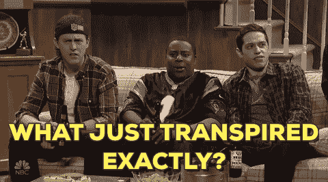
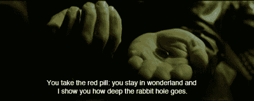
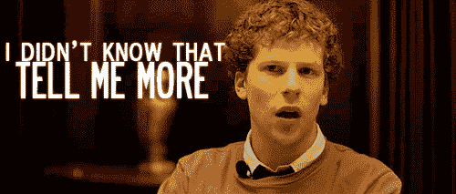
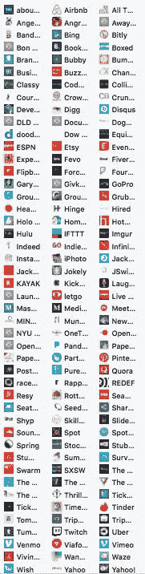
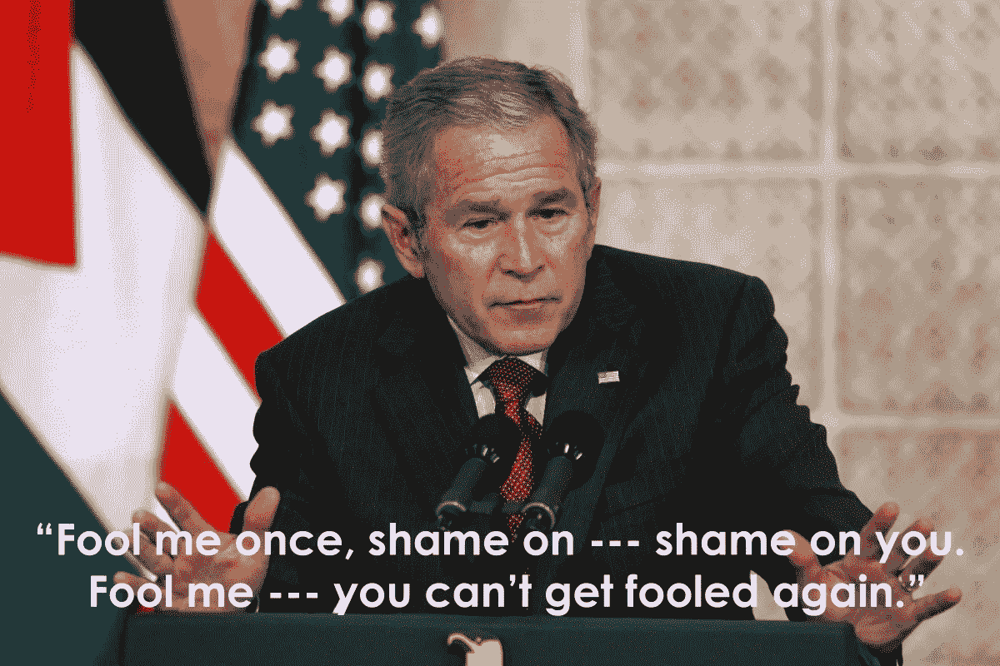

# 我不会#删除 facebook，但我会更好地管理它

> 原文：<https://medium.com/hackernoon/i-will-not-deletefacebook-but-i-will-better-manage-it-ef8380a9f945>

弥补已经做过的事情为时已晚，所以我们需要积极主动地确保它不会再次发生。

我仍然记得十年前我报名参加脸书大学的那一天——2005 年 12 月 15 日，我被大学录取了，收到了我梦寐以求的录取通知书。edu 电子邮件。这是一种不可思议的感觉，不仅因为我是班里第一个得到它的人，而且我还能立即与其他数百名同样被录取的学生联系起来。那天，我的世界呈指数级膨胀。

这就像试图想象在没有手机之前，我们如何与人联系，没有脸书，我们如何与朋友联系并保持联系(并记住他们的生日)？

是的，我有那么老…

# 那么剑桥分析到底发生了什么引起了如此强烈的反对？

没有人真正知道。

我们知道发生的一些事件，他说，她说的一个很好的时间表，以及采取的一些措施和其他事情到位。但这只是冰山一角——我们只知道这个故事的 1%,却让一家公司损失了约 1000 亿美元，引发了强烈反对删除它的声音，因为他们是邪恶的，并且在完全不知道原因的情况下找到了替代品。“他们拿走了我们的数据并滥用了它！”

我们知道他们可以访问一些数据，进行更多的推断，拥有一些应用程序，人们可以自由地输入更多的信息，然后“不道德地”与他人分享。脸书要求他们删除它，他们勾选了一个框，表明他们确实喜欢其他所有可以访问的数据公司，并可能对此撒谎。不酷。

我们现在才知道，它被用来非常直接地针对微观选民，并可能通过认知失调来影响他们的投票。可悲的是，这是几年前的事了，感觉到的伤害已经造成了。这只是目前我们知道他们使用它的目的——我有把握地假设它也被用于其他邪恶的事情。

无知有时是福。

[https://twitter.com/iamdylancurran/status/977559925680467968](https://twitter.com/iamdylancurran/status/977559925680467968)

# 你就是产品

没有我们，脸书、谷歌和大多数这些服务都只是空容器。我们用自己创造的东西填满它们——它们只是托管、管理和移动它们。

No one can be told what the Matrix is…

我的第一家公司 Brandyourself 专注于 SEO 和声誉管理，这奠定了我的技术基础。我很久以前就知道，你放在网上的任何东西，都可能会被用来对你有利或不利。不要把任何你想让 DONT 人知道的东西放到网上。

你上次付钱给脸书是什么时候？从来没有。

你最后一次为你读的新闻付费是什么时候？不太可能。

你现在正在免费阅读这篇文章/我没有报酬。Medium 正试图找出如何从你身上赚钱。

那个广告是针对你的吗？是的，他们知道你在那个网站上，点击了那个商品，去结账，却没有购买。他们会在网上到处跟踪你，让你回来买。

你在网上所做的一切都被跟踪、挖掘、推断，并被用来更好地了解和锁定你。你可能没有在金钱上付出，但你肯定在精神上付出了——用你的眼球和脑力。这是我们现代网络时代的货币。

# 等待 5 天回应…

They really made us stew

感觉像是永远，尤其是在这个时代，我们需要即时的满足和即时的回应。以我的公关/传播背景，这是危机模式时间，我学到了一个艰难的方法，那就是在你得到尽可能多的信息和事实之前，你永远不要公开宣布。

场景 1(所有人都预料到的)——新闻突然出现，所有人都吓坏了，但扎克/谢丽尔出来说我们很抱歉，一旦我们进一步调查，我们会给你更多信息。我敢打赌，每个人都会感到不安，追捕他们，直到他们得到更多的信息，我们会在同样的确切位置，我们现在在这里。

场景 2(发生了什么)——当他们收集信息、事实并准备更一致的反应时，无线电静默。虽然它不完美，但绝对不仓促。每个人都不开心，我们的处境也一样。

1 小时、1 天或 5 天，没有任何响应时间能让所有人满意。我的想法是，虽然这是一件大事(我也确实相信是)，但这并不是脸书最不想关注的问题。

# 删除脸书不会改变任何事情

From the Facebook movie…

你已经给了他们所需要的一切，并且你的所有连接的应用仍然有你的数据。我有超过 100 个应用程序，其中一些我已经很多年没用过了，但仍然有可能收集、获取和使用我的数据。此外，如果你删除了脸书，你还需要删除 Instagram、Messenger 和 Oculus Rift。

*   我们现在和陌生人一起上车
*   我们住在陌生人家里
*   我们现在允许扬声器(和电话)听到我们在家里说的每一句话
*   我们允许联网摄像机监视我们的家(里里外外)
*   我们安装了智能门锁，以方便进入
*   您的日历知道您在哪里，何时在那里，和谁在一起
*   你的银行完全知道你在买什么
*   你戴着智能手表(很快就会有衣服)来测量你的生命体征

如果这听起来像一些黑镜的东西，那是因为它是。不幸的是，这部剧有一种更黑暗的反乌托邦的感觉，而在现实中，虽然这一切听起来令人毛骨悚然，但我们通常从中受益更多。

在处理这个问题时，我们需要采取更积极的步骤，而不是被动反应。我个人一直在减少脸书/Instagram 的使用，尤其是当我有空闲时间漫无目的地浏览时。Twitter 实际上占用了我更多的时间，我可以从它那里获得更多的个人/职业收益。

# 那么，我们如何对此进行监管呢？

这是多年来的热门话题，但实际上没有什么结果。既然这是一个主流问题和热门的政治话题，期待围绕它的许多会议和讨论，这可能实际上导致一些东西。

这些大型科技公司应该受到监管吗？100%是。什么和如何？我不知道，我认为大多数政治家不知道/科技公司不会轻易泄露信息。考虑到他们有非常矛盾的动机，这应该是有趣的。

> 在一次采访中，扎克伯格说，“我真的不确定我们不应该被监管。”

这是一种非常模棱两可和令人费解的方式说，当然，请尝试，也许我会遵守。

# 向前两步，向后一步

像这样的事件是不幸的必然。我们对我们的数据/信息安全感到非常自满，这是一个警钟，要求我们改善它，创造更多的透明度。(我猜 Equifax 还不够？)

脸书正在采取措施切断你对旧应用程序的数据供应，限制他们可以获得的范围和他们可以访问的时间。这将损害应用开发者生态系统。

脸书是第二大广告客户(仅次于谷歌)，能够经受住这场风暴。因此，根据获得通过的法规，它可能会对所有较小的公司产生不利影响，并可能给脸书带来更大的护城河。我们需要非常小心地前进。

出于无数的原因，脸书绝对不希望这样的事情再次发生，所以我相信他们会尽一切可能阻止未来的发生。正如我的导师总是告诉我的“信任但要核实。”

*我从一群在脸书购物的营销/广告人员那里听说，这对他们没有任何影响。是的，他们失去了大量的市值，但如果这不伤害他们的底线，那么这只是一个擦伤。基本上没有其他平台可以接近你可以开展的有针对性的活动和你获得的投资回报率——这是一个形象问题，而不是商业模式问题。