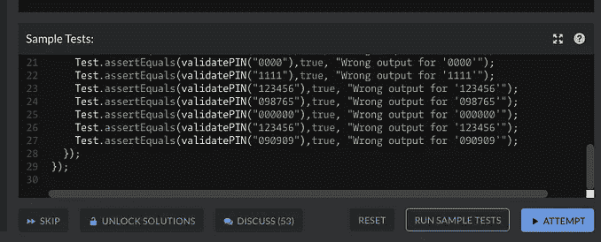
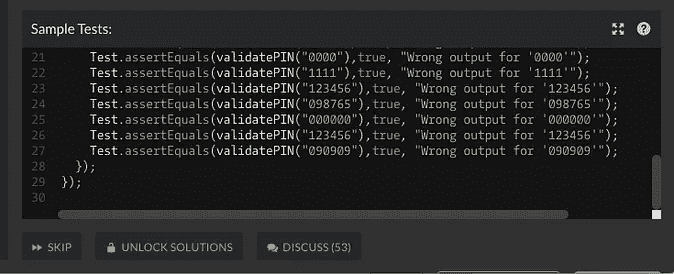
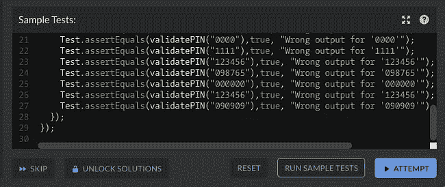
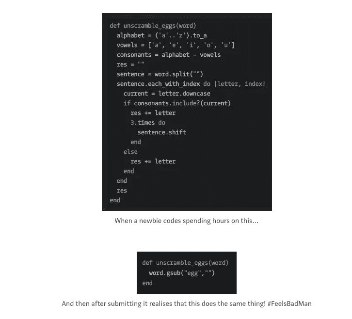
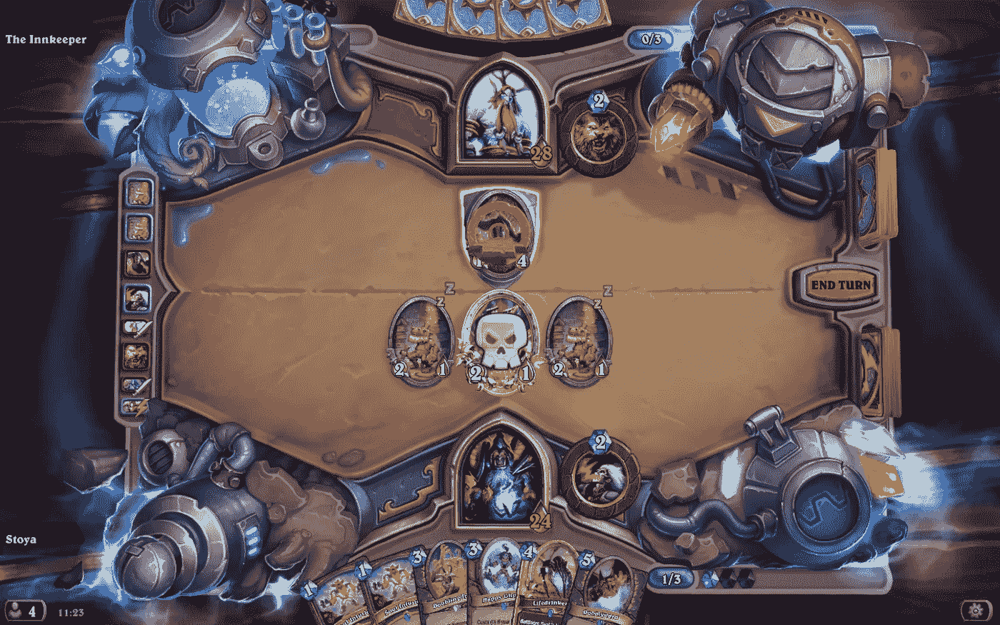
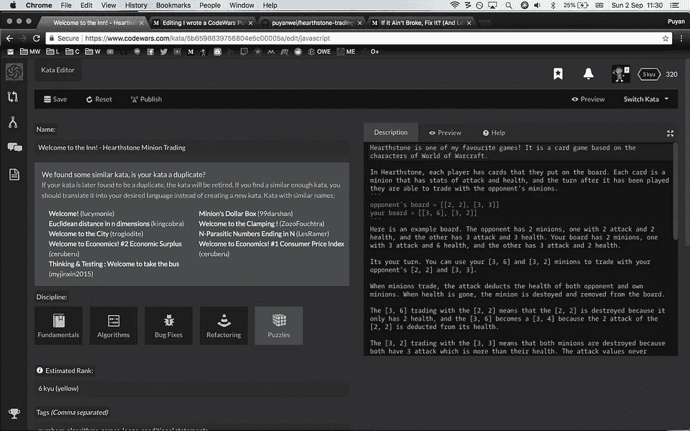
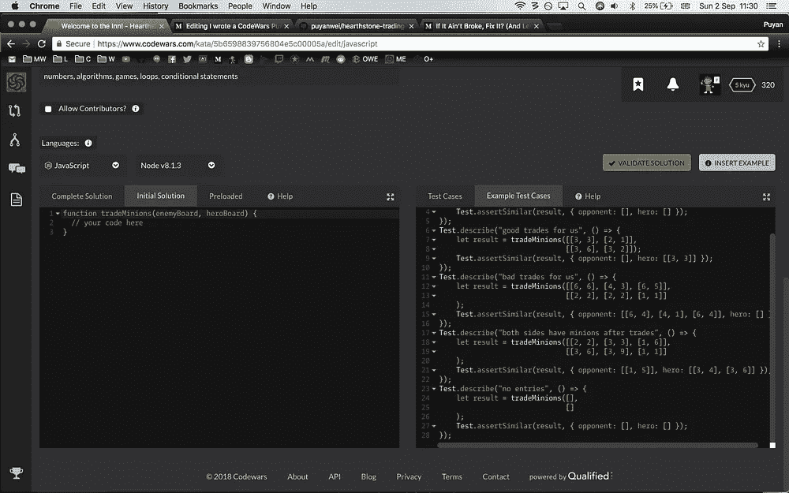
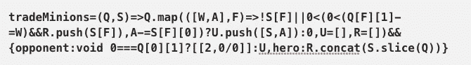
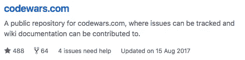
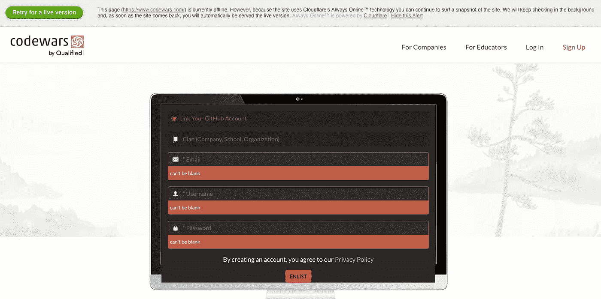

# 我写了一个 CodeWars 谜题，这是一次令人失望的经历

> 原文：<https://medium.com/hackernoon/i-wrote-a-codewars-puzzle-and-it-was-a-disappointing-experience-d0126d5c1c76>

# 什么是 Codewars？

Codewars 是一个你可以解决编码难题，然后为之沾沾自喜的地方。这种沾沾自喜会被记录下来，并在网站上提升你的等级。你在他们的网站上做所有的谜题，并试图通过测试。

也许创作者痴迷于武术，因为这是一切的主题。形就像难度级别，除了最低的是最好的，最高的是 8 级的新手状态。

Codewars is themed towards Martial Arts which is pretty fun!

平心而论，这很有趣，尽管有时谜题不是很清楚，并且/或者当涉及到边缘情况时，你不知道测试在测试什么，这可能很令人沮丧。

一个好的建议是，如果你被卡住了，检查一下讨论，因为一些谜题可能有一些不一致或对某些事情不清楚。看不到讨论按钮？是的，你需要确保你的窗口是一个更大的尺寸，因为一些疯狂怪异的原因，按钮消失了。

Breakpoints still has bugs when I noticed this last year. Left is full screen, middle and right are slightly thinner widths. Losing the discuss button is huge as its important to find out if the puzzle has inconsistencies that other users report

# 课前预面

事实上，这样做的想法已经在我的脑海里出现了一段时间。在我们开始编码训练营之前，我们被要求使用 Codewars 来练习我们所学到的东西。

然后之后，我们带着新找到的自信回去了…仍然意识到这并不容易，但是用它们来练习面试官可能设置的技术测试。我记得我用它们主要是为了找一些谜题来练习测试 first on (TDD)。

Old blog posts reveal my struggles doing codewar puzzles

所以我一直在想，既然已经有一年没去上预科了，这将是一个很酷的里程碑，那么为什么不试一试，看看它是什么样的呢？

# 拼图！

我是一个巨大的炉石迷，并认为可能有潜力继续这一主题在以后，如果这成为成功。

我的想法是根据游戏的机制做一个谜题。在炉石中，你把小兵放在棋盘上，试图让他们以最高效的方式互相交易。

Here my minions are ([2, 1], [2, 1], [2, 1]), my opponent’s are ([1, 4]). When I trade my 2, 1 into his 1, 4 the result is that my 2, 1 dies because it has one health and the 1, 4 has one attack, and the 1, 4 ends up being a 1, 2 because it 2 from the 2, 1’s attack is deducted from the 4\. This was not a good trade for me!

每个仆从都有攻击和生命值。攻击值永远不变，两个小黄人交易时，攻击值扣除生命值。如果任何一个仆从没有生命值，他们就会死亡并被从棋盘上移除。

选择将这转换成编码问题很有趣，但是我已经有了我想要的输入和输出的想法。

# 而且是直播！

过了一会儿，我决定现场发布。确实花了一段时间才弄清楚如何使用他们的平台来编写代码、进行测试并满足他们的标准。很难知道该把这个放在什么样的形上，在 codewars 我注意到等级系统看起来很不一致，因为不同的人发现不同的难题很难，这可能是相对的…

我发现他们的文档在很多事情上相当不清楚，似乎试错法是理解事情如何工作的最佳方式，这意味着多次发布和转发。

All tabs had to be filled in, Complete solution, Initial Solution, Test cases, and Example Test cases.

一旦上线，我就期待着人们会给出各种各样的答案。有几个我认为有趣的，首先操纵统计数据的顺序以使交易计算更容易。

很明显，游戏中有一些老手想通过跳到新创造的招式上来进入总排行榜，我假设他们已经完成了网站上大多数现有的谜题。

这是因为我很快得到了关于我的形的反馈，这很好，我用它来澄清我的描述。然而，很快我就得到反馈，说没有随机测试，我不知道这是怎么回事。我已经写了 31 个测试，看了他们的文档，没有任何关于它的内容。

显然，实施随机测试是为了阻止人们通过操纵测试来作弊。我认为这个平台让每个人对他们的谜题做随机测试是非常不好的。

1.  他们的文件对此只字未提。
2.  他们让每个人都这样做，即使这似乎是一个边缘案例，我不能想象有许多骗子在那里，因为这是一个很大的努力。
3.  当然，更容易跟踪作弊者，因为他们在短时间内获得了高分，而不是自动化？

# 而它死了……—D:←(懊恼脸)

我认为让社区成员来贡献和编辑我的形是一个好主意，所以一个人在我的测试中加入了随机测试，这很好。然而，他的测试略有错误，因此正确答案开始失败，由于我并不真正理解他做了什么，我想我的难题被否决了，大约一天后它自动退役

当我还是一个新手，第一次开始做这些事情时，有趣的是看到这些解决方案被评为“聪明”或“最佳实践”。最终我得出结论:“最少的字符数”=最佳解决方案！现在我知道，实际上这是可怕的，它真的应该是“最可读”或“最容易理解”。

What are we saying to new coders when solutions like this are being voted as ‘clever’? Note, changed slightly so this wont work. How readable does this code seem to you?

这是 codewars 的问题之一，我已经看到了很多其他用户的反馈，他们抱怨这一点，并希望看到为此创建另一个类别。让最短的解决方案被投票选为“最佳”,对于什么是伟大的代码给出了混杂的信息。

# 破碎的窗户

在魔鬼经济学中，有一种理论叫做“破窗理论”。它讲述了一栋建筑的窗户是如何被打破的，过了一段时间，涂鸦出现了，这个区域变得更糟。倾向于没有人修理破窗户，因此没有人关心这个建筑/区域。

No updates to the main site for over a year??

由于缺乏来自任何“工作人员”的交流，网站最近也没有任何改进，它真的感觉这是一个不再被维护或照顾的地方。它有一扇破碎的窗户，现在更多的东西在它周围破碎。

任何帮助似乎只来自社区成员，当试图解决问题时，没有反馈的自动化感觉很糟糕…又名“YouTube 风格”

Today Codewar’s front page for a new user doesn’t even seem to be live anymore?

考虑到他们的 github 有两个贡献者，其中只有一个是开发者，这是可以理解的。整个网站由一个人维护，这似乎不是他的主要任务(他们有另一个合格的网站)。

让用户能够通过强大的支持和文档很容易地创建 katas 会给网站带来更多的可信度，而不是挫败感。我的体验一点也不好，我的谜题在我写出来的时候就已经上线了，我收到了关于随机测试的投诉，而这些在文档中根本没有提到，然后我的谜题就自动退出了。

没有任何信息反馈给我，作为官方的原因，以及如何可以逆转。让其他用户建议“继续提交更多，祈祷好运”是一个糟糕的基础设施，完全没有激励作用。

No response at all, their twitter seems to have died the last activity was in April

# 最后的想法

总而言之，对于练习编码来说，这是很好的训练，只是要记住可读性应该是优先考虑的，并使用网站的过滤器和评论部分来找到好的谜题，因为有些可能不清楚，并有边缘情况，这将使你无法通过测试。

至于创造形，我想说这可能不是最好的。这需要很大的努力，然后你必须希望自动化接受它，所以在一个被接受之前，可能需要几次尝试，谁有时间呢？

在 [codewars](https://www.codewars.com/kata/5b6598839756804e5c00005a) 上的原始谜题在这里，但是作为一种选择，我已经创建了我自己的谜题回购，如果你们想试一试，请随意在这里[分叉它](https://github.com/puyanwei/hearthstone-trading-minions)并通过测试！

有一个伟大的一周和快乐的编码！