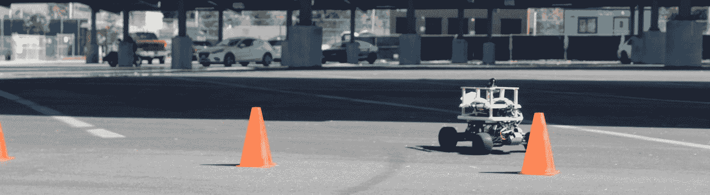
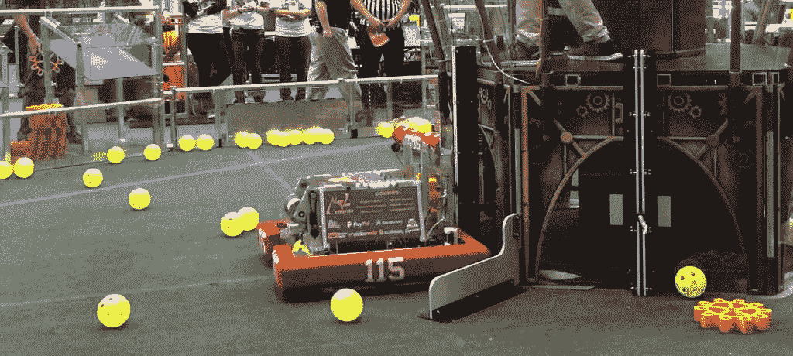
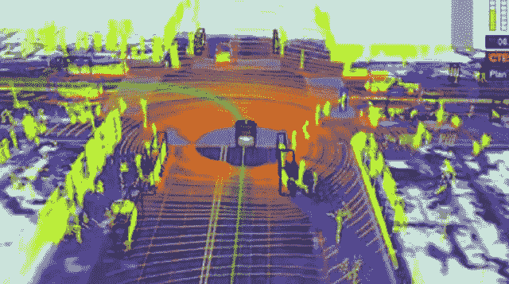
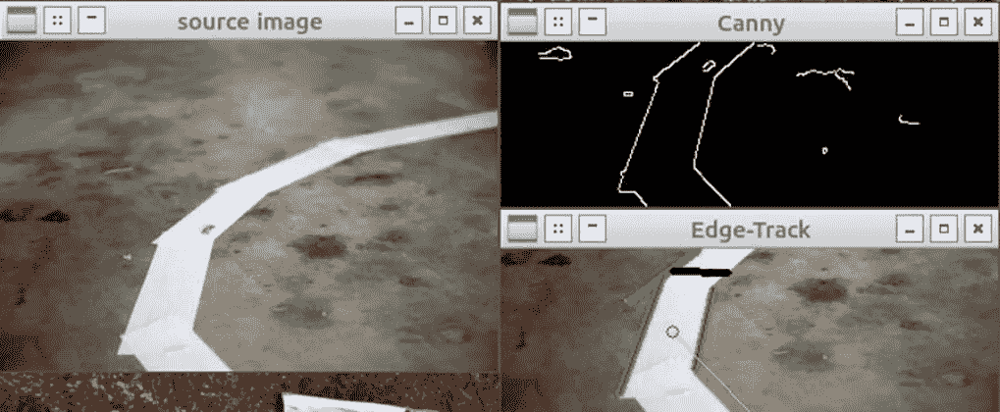
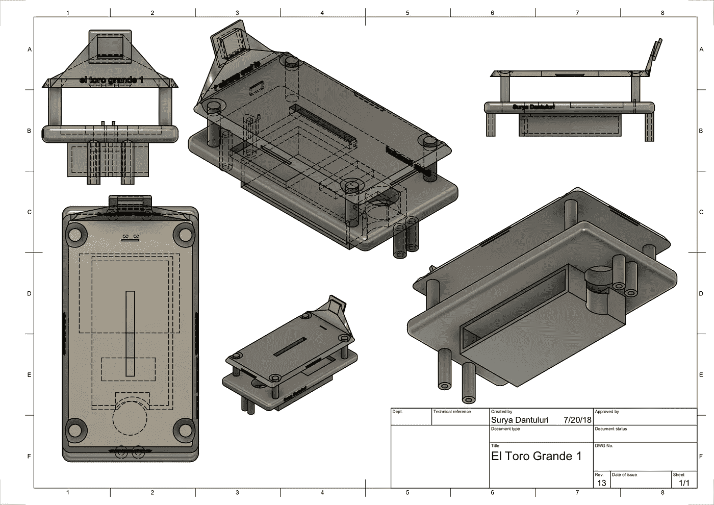
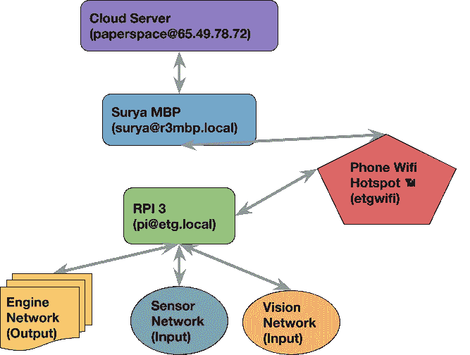
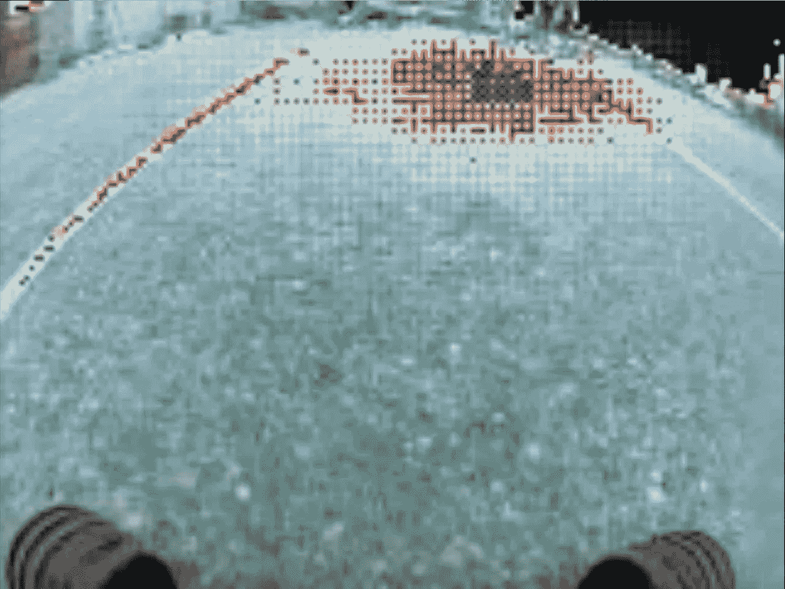
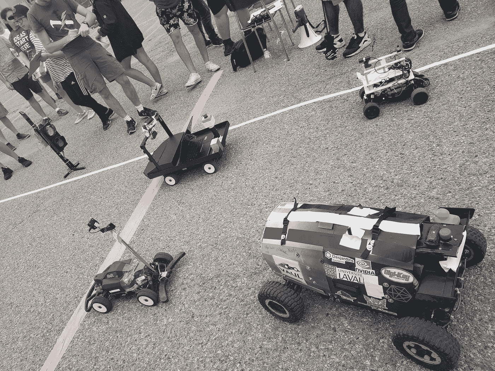

# 用机器学习在一年内造出一辆自动驾驶汽车

> 原文：<https://medium.com/hackernoon/iarrc2018-b93a2b63c1a6>

## 作者:Surya Dantuluri |所属单位:蒙他维斯塔高中|发布时间:2018 年 7 月 24 日| Arxiv:[https://arxiv.org/abs/1807.08233](https://arxiv.org/abs/1807.08233)

# 介绍

如果 ECX 制造了高质量的产品，这一切都不会发生。

说真的。

那是 2013 年的夏天，我和妈妈、姐妹们去拜访加州弗里蒙特的一位世交。我刚刚在亚马逊上用我在一个小型壁橱拍卖(我的车库拍卖版本，因为我住在一个公寓里)赚的钱买了一辆遥控车。我决定把我全新的遥控车带到这位家庭朋友的家里，因为他们前面有一条路通向一个死胡同(这意味着几乎没有交通)。我开着它在街上转了足足 15 分钟，然后交给了我的姐妹和其他家庭朋友。他们都玩了一会儿，看着这辆小车以接近每小时 15 英里的速度行驶是很有趣的。然后我妈妈叫我们所有人进来吃点心。当其他人都离开的时候，我决定在进去之前再玩几分钟我的车。以大约 10-15 英里/小时的速度在街上开了一圈后，当我转动控制旋钮刹车时，车并没有完全停下来。相反，汽车来了一个缓慢的停止，几乎就像它是在中立模式，我认为这是不可能的。我是对的。马达还在动，但汽车不再动了。

我花了一个小时不懈地调试这个问题。我试着重置接收器，重置控制器，甚至试着慢慢转动油门旋钮，看看它是否会移动，哪怕是轻微的移动。伺服工作肯定，但汽车不动，即使电机在运行。

我花了几个星期才最终联系上 Horizon 的一个爱好代表，帮我调试这个问题。30 分钟后，我发现当时对我来说有些陌生；小齿轮坏了。

从我五年级的夏天开始，我就这样开始了为期 5 年的建造和改装遥控汽车的职业生涯。



ETG is Rolling Around

## 高中的机器人学

结束了成功的中学生涯后，我被鼓励在蒙他维斯塔高中继续我的发展。我在中学时是科学奥林匹克俱乐部和全国青少年荣誉协会的主席，这是那里最大的两个组织。出于各种原因，我搬到了蒙他维斯塔附近，这是库比蒂诺/桑尼维尔最著名的学校之一。我听说过这有多难，但我从来没有想到对我和许多其他人来说，这有大一和大二时那么难。无论如何，作为一个精力充沛的中学生，我马上加入了机器人团队和其他几个俱乐部，希望能得到军官的职位。不幸的是，我没有得到任何，令人惊讶的是，甚至在大二期间也没有(我将在另一篇博客中解释)。我也加入了越野赛，因为我八年级的时候参加了越野赛。加入机器人团队和参加越野赛并不容易，但对我来说还是可以应付的。

随着时间的推移，我意识到我们机器人团队的团队文化是有毒的。这与我前几年听到的关于这支球队文化的诉讼新闻相吻合。截至写这篇博文时，我无法也不想解释这对机器人团队的每个人来说有多糟糕，但糟糕到我不得不离开。



虽然我交的许多朋友仍然留在这个团队，但最终让我决定离开的是，我意识到 FIRST 更像是一场基于机械和硬件的竞争。我对机器人的机械或硬件方面并不真正感兴趣，因为大多数时候我都没有机会接触这些系统来了解它们(我没有机会接触 CNC 机器或 3D 打印机)。软件当然有作用，但许多第一团队(据我所知)似乎真的怀疑他们的计算机视觉技能(或缺乏这种技能)或新的机器学习技能。考虑到 FIRST 是一个面向高中学生的比赛，这更有意义，因为高中学生通常没有学位，也不了解复杂/高级的 CV 或 ML 算法，以及如何在快节奏的比赛中实现它们。除了 CV 或 ML，我见过的(在蒙他 Vista 的机器人团队)唯一需要做的软件是“微调控制”。直到今天，我还不确定蒙他·维斯塔的[机器人](https://hackernoon.com/tagged/robotics)团队在“微调控制”时在做什么，因为远程控制运动应该不难实现，尤其是当其他团队在 Github 上开源他们的代码时。

我是 2017 年 6 月离队的。这是在我们赢得亚利桑那州北部地区比赛第一名和国际比赛第二名之后。我决定是时候离开，去做其他软件重机器人项目了。

离开几周后，附近的一个竞争对手团队，瓦尔基里机器人公司，请我在他们的团队中负责计算机视觉。我接受了这个角色，因为大多数成员也是蒙他维斯塔的学生(关于瓦尔基里的存在以及为什么它只由蒙他维斯塔的学生组成有一个巨大的背景故事)。我每天都花大量时间在那里，但很快就被机器人戏剧吸引住了。我是 2017 年 7 月份走的。



*图片来自:*[*https://www . 33 rdsquare . com/2012/01/what-will-自驾-cars-mean-for-us.html*](https://www.33rdsquare.com/2012/01/what-will-self-driving-cars-mean-for-us.html)

# 转向真正的机器人技术

我不认为第一机器人是真正的专业级机器人。从我在那里的 500 个小时中，我了解到 MVRT 和瓦尔基里的第一机器人只不过是将一些电线插入一台昂贵的机器中，这台机器不比 40 美元的 Raspberry Pi 3 更强大，称为 roboRIO。每年都有一些核心 CAD 加入到设计中，还有一些其他的外展项目，你需要向其他团队展示你关心你的社区，但是这不足以说服我每天花很多时间在团队上

这就是为什么我开始在我自 2013 年以来一直在改装的遥控汽车上实现 autonomy。

## 和 ROS 一起玩

2017 年 8 月开始用 ROS。有了一些 C++和 Python 的经验，我开始构建 ROS 节点来相互通信。我首先做的事情之一是在模拟中连接两个海龟机器人，以反映彼此的运动。当然，我不得不一步一步地遵循教程来达到这个阶段，但它向我展示了 ROS 真正能做什么。

## 向第一机器人团队教授 ROS

离开我所在的两个一线队后，我决定在湾区的一线队教 ROS。来自海湾地区的大约 10 个团队出现了(我认为这非常令人印象深刻)。我教他们基础知识，以及如何在他们的机器人中实现它们。我甚至向他们展示了一个使用 OpenCV、Raspberry Pi 3 和伺服电机的小演示。每当白板上的一条线向左或向右移动时，伺服系统也会朝那个方向移动。这是发布者和订阅者集成 OpenCV 的一个例子。

## 向所有人教授 ROS

不久前我制作了一个视频，详细介绍了你需要知道的关于如何开始使用 ROS 的一切。我还没有时间编辑和上传这个长达一小时的视频，但很快就会了。

# IARRC 入门

## 我是如何发现 IARRC 的

就像我发现 AVR 一样。乔治亚理工学院的机器人团队。我对乔治亚理工学院感兴趣，所以我决定四处看看，看看他们的机器人团队在做什么(我听到了关于机器人夹克的好评)。我最终发现了 IARRC，并惊讶地发现它允许高中生使用。更好的是，它允许单独的竞争者加入。这一点至关重要，因为我个人并不知道有多少朋友对机器人感兴趣，并且有一些机器学习/计算机科学知识。

## 初始方法

我花了 9 个月研究 ROS

我整合了 OpenCV，一个基本和高级算法的混合体，来处理比赛的不同部分。我知道这将是非常计算昂贵的，但没有那么多，一个 RPI3 和 Dragonboard 410c 并行工作都将耗尽内存和 CPU 的能力。



我所做的陈述。由:[](http://www.yisystems.com/)

*我买不起 600 美元的 Nvidia TX2 主板(即使有教育折扣),也没有其他选择，只能废弃我日以继夜不知疲倦地编写的整个 ROS 代码库*

## *机器学习方法*

*由于某些原因，我在微积分预科学了一些线性代数，所以我通过看一下 Ian Goodfellow 的深度学习书和其他各种教程来扩展我的线性代数知识。我很快对机器学习领域产生了兴趣，因为我认为 2017 年的生成对立网络(GANs)非常酷，甚至在 3 月份被邀请参加 Tensorflow 开发者峰会。*

*我对机器学习感兴趣的另一个原因是我看到它被用来帮助他人的各种方式。它被用于诊断人类、动物和植物的疾病，以及欧洲粒子物理研究所的粒子追踪挑战中显示的先进科学。*

*所以我开始在我的 RPI3 和 Arduino 堆栈中实现机器学习，因为这是唯一不需要大量计算能力的选项。*

# *在国际癌症研究中心工作*

## *组*

*只有我自己。只是一个高中生对抗顶级大学队，他们可以完全由他们的大学资助，可以有赞助。*

## *硬件/机械*

*记得我说过我离开 MVRT 是因为我不喜欢机械/硬件部分吗？我仍然不是 100%喜欢它，但我学会了如何至少喜欢它来建造我的机器人。硬件对我来说花的时间最长，因为设计零件和找出我需要的组件需要时间和研究。几个月前，我还不知道什么样的电路板兼容 I2C 协议，但现在我认为我已经很好地掌握了我使用(和制定)的各种协议，这样我就可以用它来控制有刷电机和伺服电机。*

## *3 天学会 CAD*

*有时在六月底，我意识到我的 noob Tinkercad 技能是没有用的。我用 Tinkercad 做了几个粗略的模型，但是你在纯在线的 cad 软件上能做的有一些限制。在做了一些研究后，我发现 Fusion360 是最好的选择。他们为像我一样过去使用 Tinkercad 并希望获得更多功能的新手提供了几个教程。*

*我花了整整 3 天 3 夜才把 Fusion360 从上到下学会。*

*我还不是专业人士，但我已经了解了 Fusion360 的大部分功能(尽管我不熟悉所有的键盘快捷键)。我用我的知识为我的车创建了一个具有成本效益的 CAD 模型。我创造了多个平面层来降低成本，同时保持机器人的功能。*

*经过几天的设计和建造，我终于造出了一个模型，它包含了我需要的机器人的所有部件。*

## *湾区的 3D 打印*

*湾区的 3D 打印很难。真的很难。至少对我来说是这样。我给旧金山湾区的 30 多家印刷服务机构打了电话，发现我的型号没有低于 3000 美元的价格。甚至像 HackerDojo 或其他 makerspaces 这样的空间也无法使用，或者没有回复我的电话或电子邮件。*

*随着 TechShop 的死亡，我所知道的唯一 3D 打印服务是桑尼维尔图书馆。但是由于我的模型的尺寸，我没有办法把它打印出来。即使我的模型符合他们打印机的尺寸，我在图书馆网站上找到的它们可以打印的最早日期是 11 月。这是超过 5 个月的提前预订！*

*所以我选择了我最后的选择，3D 中枢。他们让世界各地拥有 3D 打印机的人以低成本打印你的物品。我犹豫是否购买 3D 集线器的唯一原因是，每次我寻找打印机时，价格都在 300 美元到 500 美元之间。尽管这比我在海湾附近商店买到的价格便宜 10 倍，但还是超出了我的预算。*

*长话短说，我从密苏里州拿到了 3D 打印服务订单。他们给了我一个低于 100 美元的合理价格，我觉得还可以。*

**

## *把它放在一起*

*我在木工方面很有经验。从那时起，我就转向了计算机科学，但是在这个领域我有很多经验。我用我的木工技能建造了一个结构，把所有的 CAD 模块放在一起。*

## *软件完整性*

*软件集成是硬件/机械和软件之间的中间层。这也是我认为我遇到的最大挑战之一。我是对的。*

*有几次我去 Youtube 上看到非常酷的遥控汽车在转圈或者自动驾驶。然而，每次我都很困惑他们是如何将 Python 代码集成到汽车中的。*

*当试图将机器学习 Python 代码(以前是 ROS/OpenCV)实现到汽车中时，情况仍然如此。*

*我最终自学了 I2C 协议，并使用 Pyserial 库在 Arduino 和 RPI3 之间制定了自己的协议(我制定了自己的协议，以便在电路板之间进行更快、更可靠的数据传输)。*

*在我找到 PCA9685 之后，PWM 控制就没那么难了。我用 Adafruit 库最终控制了油门和伺服。*

**

## *软件*

*我在这里解释的任何东西都只不过是从我今年为 IARRC 写的论文中复制粘贴而来的。这里有一个简短的总结。我还在这一部分的末尾和这篇博文的开头附上了我论文的链接。*

## *简要*

*我用 Tensorflow 构建了一个用于红绿灯检测的 DCNN。我用谷歌图片中的大约 5000 张图片来训练它。我有一个 100 的图像测试集和一个 1000 的图像验证集。*

*我使用 Tensorflow 构建了一个 DCNN 来预测方向盘值。我用他们给我们的赛前一天收集的大约 50，000 张图片对它进行了训练。我有一个 5000 美元的验证集和一个 100 美元的图像测试集。*

*我使用 Tensorflow(我只使用 Tensorflow，尽管我在 Caffe 制作的模型在 RPI3 上运行时出现了一些问题)构建了一个 RNN/LSTM 模型来预测节流阀值。我在我的论文中解释了这一点，但本质上它防止了驱动环路之间的快速变化或停顿。换句话说，它平稳地增加和降低速度，而不是在随机情况下快速加速和减速。在测试期间，DCNN 模型实际上打破了相机模型几次(以及出于某种原因的 ESC)。*

**

**显著物体可视化。视频此处:*[](https://www.youtube.com/watch?v=lFjsN7KcKIE)*

## **我在论文中进一步解释了我所做的事情。**

## **在以下位置获取一份副本:**

**https://arxiv.org/abs/1807.08233**

**Surya Dantuluri 的纸质档案:[https://papers.suryad.com/18.pdf](https://papers.suryad.com/18.pdf)**

**研究门:[https://goo.gl/GoEj9s](https://goo.gl/GoEj9s)**

# **旅行**

## **空运的**

**旅行的时候，我还没跟机器人玩完。当运行主 Python 脚本超过一分钟时，我开始在 RPI3 上遇到内存问题。这让我在整个飞行过程中感到恐慌。这甚至促使我在整个通宵飞行中继续编码。**

**我最终修复了错误，但是以一种根本不稳定的方式。比赛前的最后几天让我想起了黑客马拉松的最后期限。**

**比赛前的最后一周我都没睡觉。**

## **登陆加拿大**

**湿度差对我打击很大。上一次我在印度和新加坡经历如此高的湿度水平。人们似乎也试图快速逃进装有空调的空间。我听说我经历的温度与加拿大的一般温度相比是异常的，这更有道理。**

# **比赛日**

## **星期四**

**我周四就在滑铁卢了。我和妈妈逛了逛滑铁卢大学的校园。它有一座城市那么大！到处都是新建筑，大量的学生仍然在夏天四处游荡。**

**我甚至决定去停车场看看，在接下来的两天里，我将在那里和我的 ETG 机器人比赛。**

**由于对加拿大、滑铁卢大学及其学生不熟悉，我小心翼翼地走在 5 号工程大楼前。我发现一个团队看起来出奇的年轻，在大楼里测试他们的机器人，但不相信他们是为 IARRC 做的。当时我不知道你可以自由地呆在大楼里做你的项目。**

## **星期五**

**我周四看到的那个团队，周五很快就和我成了朋友。他们有一个有点基础的 OpenCV + Arduino 机器人，类似于许多大学级别的机器人。我不得不说，他们的团队中有一些高素质的人，他们了解他们机器人的一切，似乎对他们的机器人充满热情。**

****

**最初，我的机器人在四处漫游时做得很好。我很高兴至少基本的手动控制对 SSH 有效。然后我开始遇到我想象中最糟糕的问题。**

**ESC 坏了。**

**或者至少我认为是的。我听到 Ottabotics，在他们的 ESC 坏了之后用他们的话说“退出”，所以我想这是我的路的尽头。当然，我希望不是这样，因为我来自 4200 公里以外的地方，我希望一个简单的 50 美元的硬件不会完全毁掉我的机器人。**

**很多评委和组织者告诉我，他们在我身上看到了毅力。我也是这么想的。在测试期间，我遇到了两个巨大的障碍，并设法在创纪录的时间内调试并修复了问题。关于电子稳定控制系统，它需要大量的调试和电气工程知识，最终发现不需要外部电源来驱动大功率伺服电机。**

**调试 ESC 花了我 3 个小时不知疲倦的工作。然后我开始收集数据。我知道收集赛道数据是唯一能有效利用我的时间和电池能量的方式，而不是开着 ETG 去兜风。我收集了大约 40，000 张好照片，或者我是这么认为的。**

## **星期六**

**考虑到大学和高中队有多冷(与湾区高中生的任何比赛相比)，我也很放松，但仍然准备好了。**

**我刚刚在一个 Nvidia GPUs 集群上训练了我所有的模型一个小时。我得到了很好的损失分数，所以我认为我的车已经准备好了。**

**当我最初尝试它时，我在汽车和 GPU 集群上运行的模型结构之间出现了一些维度问题。我不认为这是一个大问题，因为我可能没有更新我的 RPI3 软件**

## **开源代码库**

**Github 开启了我的编码生涯。然而，在这个过程中，我缺乏组织性(正如我在过去两个月的贡献历史中所显示的)，这导致我在一个不同的分支上训练一个模型。我花了一个小时的调试才在停车场的地上找到这个问题。出于某种原因，停车场的中间是我可以连接到 5 号楼的互联网并通过 SSH 连接到 RPI3 的最佳位置。**

**解决这个问题后，我开始在雨中训练我的模型。出于某种奇怪的原因，天开始下雨了，尽管外面天气很热，阳光明媚。我训练了另一个模型，只是为了看看我是否可以获得更低的损失分数(更低的损失分数，但不会太过拟合)。**

**成为那里仅有的高中生之一已经很不寻常了，但在停车场训练我的模型基本上是其他团队在过去一年里用 OpenCV 和 ROS 做的所有事情。**

**这是我至今仍无法理解的事情。**

## **顺时针而不是逆时针**

**所以我训练了我所说的所有数据，让赛车在赛道上绕圈，以逆时针方向拖动比赛。我很快了解到比赛将以顺时针方向进行。**

**我花了接下来的 3 个小时预处理我所有的数据。我拿出从 APCS 那里学来的一些生疏的 Java 技能和一些 Pillow 文档，以便翻转 40，000 多个元数据文件中的角度值，并水平翻转 40，000 多个图像，这样我就可以训练模型顺时针旋转。**

**当我完成这个模型的训练时，第二圈比赛已经结束了，我没有比这更好的成绩了。我在他们移除赛道之前测试了它，它做得很好，可能让我排名前五。**

## **结局**

**我很晚才开始比赛。当时我甚至不认为我应该参加第二场比赛，因为我确信我远远落后于其他人。直到现在我才后悔那个决定。**

**每个人都整理好了自己的材料，准备为比赛做出决定。**

**结果非常明显，波兰获得第一，VAUL 获得第二，泰国队获得第三。**

**一周后期末考试成绩出来了。与大学水平的队伍比赛时，我获得了第九名。我得分超过了乔治亚理工学院和其他几个加拿大大学队。**

**超过佐治亚理工学院是我从未预料到的。**

# **结论和我的局限性**

**这次长达一年的旅程是一次漫长、艰苦、激动人心，最重要的是充满乐趣的冒险。作为一名中学生，我有许多梦想，这是我认为我无法实现的梦想之一。**

## **我一个人超过了乔治亚理工学院**

**这是我认为不可能的事。**

**我住在公寓里。也就是说我没有车库。即使是电动工具也不行。**

**我从来没有导师或教练**

**我没有足够的钱为我认识的每个朋友的研究项目购买这些教练。**

**因此，出于我对计算机科学和机器人学的勇气和热情，我创作了一篇 100%原创和有机的研究论文。**

**我自学了我在这篇博文和论文中解释的所有内容。**

## **所以说我自己的得分超过了佐治亚理工学院是我工作和激情的证明。**

## **结束今年的旅程**

**在我学习编码的一年半时间里，我已经写了超过 190 万行代码。有些人可能认为我疯了，但我认为编码是上瘾的。我已经决定希望从 9 月份开始在今年剩下的时间里休息一段时间(除非我去 PennApps)，这样我就可以赶上我自己在 CS 之外的生活。希望这能给我时间去思考新的想法和新的方法来解决我现在在代码中遇到的问题。**

## **来自 2018 年 IARRC 的收获**

**我还没有对我制作的 IARRC 回购进行项目后测试。这些测试为我提供了回购的各种统计数据。我猜我写了大约 10，000 行以上的代码，包括我在比赛期间没有在车上使用的代码。**

**正如我在论文中解释的那样，我发现机器学习方法实际上可以与传统的计算昂贵的计算机视觉、路径规划和定位算法相媲美。有了这个概念证明，我打算让 ETG 2 自己学习(提示:肯定不是 RL)。**

**加拿大人看起来真的很好，很善解人意，国际癌症研究中心的比赛没有任何瑕疵。国际团队看起来并不像是在相互竞争，而只是在驾驶小机器人时玩得开心。在比赛过程中，各队还互相合作，互相帮助。这是自动驾驶汽车等领域的研究和进步应该有的样子；快乐，竞争，合作。**

**明年，我一定会回来见见这些极其多样化、充满激情和同情心的团队，来找点乐子。**

# **确认(时间顺序)**

```
**1\. Caleb Kirksey
   - He gave me some initial help and encouragement
2\. kangalow from JetsonHacks
    - He gave me some advice on what ESC to choose
3\. Mohamed Alzaki
    - He gave me some advice on how he implemented Ultrasonic Sensors into his robot
4\. Tawn Kramer
    - He gave me advice on how to integrate Hardware with Software in his videos**
```