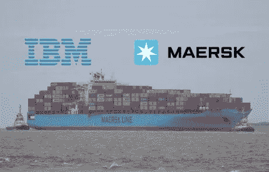

# IBM 和马士基的争斗给民营区块链蒙上了阴影

> 原文：<https://medium.com/hackernoon/ibm-and-maersks-struggles-cast-a-shadow-over-private-blockchains-1892cbc86a1b>

# **TL；博士**

*   **IBM 和马士基的合资公司正努力吸引航运公司，因为担心谁将最终拥有区块链网络的知识产权**
*   **这一挫折引发了关于私人许可的区块链相对于公共许可的可行性的问题**
*   **像 IBM 和 Maersk 这样寻求加入区块链网络的企业必须接受分散的治理结构，并放弃一定数量的控制权，这是他们不习惯的营利性的成熟企业**

*(原载于***)**

*几个月来，专家们一直在猜测区块链技术提高大型企业效率和透明度的前景。IBM 和 Maersk 之间的合作伙伴关系是区块链企业采用的最引人注目的案例之一。*

*今年早些时候，IBM 宣布他们正在与世界上最大的集装箱运输公司马士基建立一家合资企业。*

*该合资企业旨在利用区块链技术改善航运供应链流程。该公司正在创建一个开放的交易平台，在这个平台上，文件归档被数字化和自动化，文件得到适当当局的批准，有关装运和运输计划的信息在相关方之间共享，以提高效率。*

*区块链技术供应链似乎是天作之合，但最近的消息似乎表明，IBM/Maersk 合资企业正面临一些重大和意想不到的障碍。10 个月后，这种合作关系只吸引了一家航空公司:亚洲一家名为“太平洋国际航运公司”(PIL)的大型航运公司。*

*那么，为什么大多数航空公司选择不加入这个革命性的新系统呢？简单的答案就是竞争。事实上，区块链合资企业背后的潜在知识产权属于马士基和 IBM，这使得 CMA CGM 和 Hapag-Lloyd 等竞争对手陷入困境。两家运营商都公开拒绝了区块链的解决方案，CMA CGM 总经理 Peter Wolf 表示，*

*“从技术上讲，(马士基和 IBM 的)解决方案可能是一个很好的平台，但它需要治理，使其成为一个行业平台，而不仅仅是马士基和 IBM 的平台。这就是我们目前在这些计划中看到的弱点，因为每个项目都声称提供一个他们自己控制的行业平台。这是自相矛盾的”。*

*需要集中各方建立对分散系统的控制是企业采用区块链的主要障碍。*

*老牌银行、航运公司和科技公司面临的根本问题是不愿意全盘接受区块链。大多数都在一个集中的结构下运行，信息存储在这个结构中，服务从一个单一的来源进行管理。*

*纳斯达克计划让区块链参与股东大会和私人公司股票发行的投票。微软和 IBM 对帮助企业改善供应链流程的技术很感兴趣。银行希望建立一个许可分类账，以便在其机构之间更高效、更安全地转移资金。*

*所有这些计划的共同点是强调使用只涉及内部业务参与者的私有区块链，而不是公共的、开放的和没有许可的。*

*正如马士基和 IBM 合资企业的情况一样，一旦带头的公司意识到他们的竞争对手并不接受他们正在加入一个“行业平台”的想法，而是对参与一个可能被创建该网络的公司利用来获得竞争优势的网络持怀疑态度，这些倡议就可能开始土崩瓦解。毕竟，私有许可分类帐可能具有许多与公共分类帐相同的特征(分布式节点网络、共识协议等)。).然而，它仍然在很大程度上由总账的设计者集中控制。他们决定谁有权访问网络，控制 IP，并可能创建后门来规避访问规则。*

*在这种情况下，显而易见，为什么公司会希望避免加入由竞争对手建立的私有区块链网络。*

# *私人与公共区块链*

*区分公共“无许可”区块链和私有“有许可”的主要特征是谁被允许加入网络的问题。对于许多公司来说，他们使用区块链技术的主要动机是在他们的许多不同部门和子公司之间，或者在他们的公司和其他伙伴公司之间创建一个共享的分类账。对于这些情况，私人区块链限制参加人数。这种有限的访问权限还确保了只有业务联盟中的相关方才能接触到敏感的公司数据。*

*私有区块链模式的问题在于，它保持了中央集权，并且阻止了使用令牌激励机制来鼓励更多的参与者加入并建立网络。*

*公共区块链是关于尽可能多的人，并建立一个全球分布的开发者社区。比特币和以太坊是这方面的完美例子，因为它们由世界各地成千上万的开发者运营，他们通过使用工作证明或利益一致机制验证交易来做出贡献。*

*尽管这看起来像是公开区块链危及安全，但实际上是私人区块链更容易受到安全漏洞的影响。这些区块链使用更少的节点运行，这些节点更集中在一起，这提供了更明显的单点故障。*

*公共区块链更难拆除，因为它们分布在全球数千个节点之间，因此需要巨大的计算能力来拆除它们。*

*区块链技术的主要价值主张是它允许多方验证数据、货币、运输项目等的交易。防止欺诈或腐败。私有区块链限制了公众验证交易的访问，这意味着数据驻留在一个损坏仍未被检测到的位置，并且数据可以被轻易地修改。*

*正如许多这些公司开始发现的那样，如果没有一个全球社区来支持他们运营和利用区块链的工作，他们本质上是在一小撮人之间建立一个运行速度较慢的数据库，否则他们可能只会使用 Google Drive、Box 或任何其他集中式数据共享工具来共享信息。*

*像思科系统公司、英特尔公司和摩根大通公司这样的公司已经开始将他们采用区块链的[计划](https://www.bloomberg.com/news/articles/2018-07-31/blockchain-once-seen-as-a-corporate-cure-all-suffers-slowdown)推迟到至少 2020 年，很可能是出于上面提到的所有原因。*

# *受利润驱动的中央集权组织会完全接受公共区块链吗？*

*这些公司必须问自己的一个大问题是，他们是否会冒险加入一个真正公开的、未经许可的区块链网络。*

*由象征性经济模式运作的公共区块链为所有参与者创造了多层价值，并根据他们的贡献从中受益。为了让网络真正去中心化，它不应该被任何人控制，所有的参与者都应该被同一套成文的规则所约束。这在很大程度上违背了上市的财富 500 强企业的目标，这些企业陷入了“主导地位竞赛”，并经常延伸或完全规避我们当前市场体系中管理企业的规则。*

*这并不意味着私人许可的区块链的生存能力丧失了所有的希望。然而，如果这样的区块链网络要存在并蓬勃发展，很可能需要有几个这样的网络(在私营区块链之间形成竞争)，每个网络必须包含一小组完全受网络成文规则约束的企业。*

*我们可以在今天的区块链领域看到类似的现象，在区块链协议(以太坊、EOS、NEO 等)之间出现了传统的自由市场“竞争优势”。)，但在每个区块链协议中，参与者在一套严格的成文规则下相互合作甚至竞争，这些规则旨在将网络的福祉置于任何一个参与者的福祉之上。*

*也许航运业采用区块链的未来是这样的:像 Maersk、CMA CGM、PIL 和 Hapag-Lloyd 这样的最大参与者并不都是同一个区块链网络的一部分，而是事实上是较小类别的航运公司采用的独立但平等的区块链网络的参与者。*

*因此，换句话说，在当前市场体系中发生的传统的主导地位竞争将仍然存在，但在由较小类别的航运公司组成的区块链网络之间。通过这种方式，业内排名第二和第三的承运商不必放弃对排名第一的任何控制，同时采用区块链技术，只在竞争的航运承运商之间创造更高的效率和透明度，他们在公平的竞争环境中运营时会感觉更舒服。*

*最终，在宏观层面上，私营区块链仍然受制于中央集权实体所面临的相同缺陷(安全、审查阻力、缺乏完全的透明度)。然而，在微观层面上，这些私人区块链的参与者仍然可以获得公共无许可区块链网络提供的许多好处，只要所有成员都选择加入并受同一套成文规则的约束。*