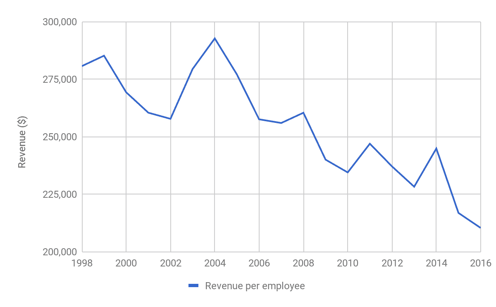

# IBM:蓝色巨人

> 原文：<https://medium.com/hackernoon/ibm-big-blues-e99c9665815f>

前几天我在读[“聪明的投资者”](https://en.wikipedia.org/wiki/The_Intelligent_Investor)，本杰明·格拉哈姆在介绍章节中将 IBM 描述为“出色的表演者”。鉴于我的版本是 1971 年的，这让我想知道这个 47 年前的投资建议是否仍然有效。另一方面，马克·库班在 2014 年说过一句名言[“IBM 不再是一家科技公司”](https://www.cnbc.com/2014/10/22/very-little-content-is-created-in-us-without-first-talking-to-netflix-investor-mark-cuban.html)。他这么说是什么意思，他是对的吗，更重要的是，IBM 仍然是一个出色的表演者吗？

# 快速回顾 IBM 的辉煌历史

从任何标准来看，IBM 都是一家老牌公司，从计算机历史的角度来看，它是一只货真价实的恐龙——它们在第一台电子计算机出现之前就存在了。事实上，它太古老了，以至于维基百科上有一篇很长的文章专门介绍它的历史。举几个公司历史上值得注意的成就，在 1981 年给我们[个人电脑](https://en.wikipedia.org/wiki/IBM_Personal_Computer)之前，IBM 实际上[发明了大型机](https://en.wikipedia.org/wiki/IBM_System/360)，[帮助人类登上月球](https://en.wikipedia.org/wiki/Saturn_V_Instrument_Unit)，[控制了航天飞机](https://en.wikipedia.org/wiki/IBM_System/4_Pi#AP-101)，发明了[关系数据库](https://en.wikipedia.org/wiki/Relational_database)，[第一个优化编译器](https://en.wikipedia.org/wiki/Fortran)，并推出了[第一台商用激光打印机](https://en.wikipedia.org/wiki/IBM_3800)(公平地说，这是由另一只 IT 行业恐龙发明的

# IBM 的业务转型

随着技术的不断变化，IBM 不得不不断改造自己，以避免重蹈恐龙的覆辙，它在这方面做得相当成功。他们在 80 年代成功地从大型机过渡到了个人电脑，从商用硬件(1991 年处置了[打印机业务](https://en.wikipedia.org/wiki/Lexmark)，2004 年处置了个人电脑业务，2014 年处置了 x86 服务器)转向了商业服务(2002 年[收购了普华永道咨询公司的一部分](http://www-03.ibm.com/press/us/en/pressrelease/491.wss))。下图说明了这种转变:

IBM Revenue Streams: “sales” means software & hardware revenue, “financing” is the revenue from extending loans to their customers to purchase IBM products/services. Compiled from [IBM Annual Reports.](https://www.ibm.com/annualreport/)

然而，他们似乎错过了 21 世纪初 IT 界的两大机遇——云和移动。为了解决这个问题，IBM 在 2012 年推出了新的“战略要务”，包括分析、云、认知(IBM 对“人工智能”一词的概括)、社交和移动以及安全。

IBM 在 2013 年通过收购 SoftLayer 加入了云游戏，在移动领域[试图](https://en.wikipedia.org/wiki/IBM_Mobile)在“iOS 上的商业应用”市场分一杯羹，但并不成功。2016 年的年报仅提到移动业务正在增长，但没有给出具体数字(会计准则要求单独披露任何实质性业务部门，这意味着移动不是实质性业务)。据报道，云计算在 2016 年带来了 102 亿美元的收入，但应该注意的是，其中大约一半(56 亿美元)来自“基础产品——公司为客户提供软件、硬件和服务，以构建他们自己的云。”(IBM 2016 年年报，p57)。他们本质上是在建设客户的数据中心，并将其计入云收入。

在人工智能(AI)方面，IBM 是该市场的早期参与者——他们在 1997 年的国际象棋比赛中击败了卡斯帕罗夫，并在 2011 年赢得了危险边缘的比赛。从那时起，IBM 通过投资 Watson Health(医疗决策支持)、Watson IoT(物联网大数据分析平台)和 Watson Platform(数据分析平台)，大力投资将 Watson 转变为商业友好型人工智能平台。根据 2016 年年度报告，医疗保健是这一领域的最大焦点，IBM 在沃森医疗保健公司雇用了超过 7，000 名员工。

虽然截至 2016 年底，它已经在全球数十家医院推出，但它的成功[似乎并不确定](https://www.statnews.com/2017/09/05/watson-ibm-cancer/)-如果该解决方案在很大程度上优于医生，人们会预计收入会飙升。

# IBM 还是一个出色的表演者吗？

在经历了本世纪初收入缓慢增长的十年后，IBM 连续 22 个季度出现收入亏损，2016 年收入略低于 1998 年的水平。管理层似乎很好地管理了波动的收入，收益从 2002 年的 75.24 亿美元增长到 2012 年的 225.40 亿美元，增长了近两倍。这可能是以回避科技股闻名的沃伦·巴菲特[在 2011 年投资 IBM](https://www.theguardian.com/business/2011/nov/14/warren-buffett-buys-ibm-stake) 的原因之一。

# 为什么收入在下降？

IBM 的两个主要收入来源，销售和服务，自 2011 年以来一直在下降(尽管服务似乎在 2016 年略有回升)。这可以用过去七年不断变化的 IT 环境来解释:公司正在迅速将其数据中心迁移到云(不是由 IBM 硬件驱动的)，并在 IBM 不具备重要技能的领域(如用户体验设计、移动应用和数字营销)需要更多的 IT 咨询。

IBM 认识到了这一点，并通过建立自己的数字代理机构来构建其“数字经济”知识:2014 年 [IBM Interactive Experience](https://www-935.ibm.com/services/ibmix/) ，它通过一系列收购来推动这一发展——从 2015 年到 2017 年，他们[收购了](https://en.wikipedia.org/wiki/List_of_mergers_and_acquisitions_by_IBM)六家咨询公司。当巴菲特在 2017 年出售了大约三分之一的股份后[说](http://fortune.com/2017/05/04/warren-buffett-ibm-berkshire-hathaway/)IBM 是一家强大的公司，但他们也有强大的竞争对手，这可能就是他所指的。

# 库班是对的吗？

库班对 IBM 的抨击可以用 2013 年年度报告中的以下摘录来概括

从 2000 年到 2013 年底的 14 年间，IBM 产生了大约 1650 亿美元的现金流，其中 81%通过股票回购和股息返还给了股东。再加上这段时间 320 亿美元的收购，你就会明白库班指的是什么了——IBM 一直在对市场变化做出反应(而不是像过去那样改变市场)，在市场参与者薄弱的领域收购他们。

关于股票回购，他们宣布的目标是到 2015 年达到特定的每股收益数字，因此可以看出库班认为 IBM 的管理层过于关注股东，而不是客户和竞争对手。这可以解释 IBM 的管理层是如何错过上述移动、云计算和人工智能机会的。

从每名员工的收入绩效指标来看，IBM 的每名员工收入落后于 HPE、亚马逊和微软等竞争对手，尽管他们仍领先于埃森哲等纯服务公司。这解释了为什么他们希望[将大部分劳动力](https://www.theregister.co.uk/2016/03/07/ibm_offshoring/)转移到海外以削减成本——他们预计这一趋势会持续下去。

# 结论

如前所述，在过去十年中，IBM 的管理层过于关注投资者，而不是公司的增长。因此，自 2005 年以来，他们错过了许多机会:

*   如果不是 IBM，还有谁能把云卖给企业(尽管它仍然被认为是“不安全的”)呢？
*   同样，如果不是 IBM，还有谁能把移动应用、设计思维和所有现代“数字趋势”卖给大企业呢？

然而，并非一切都令人沮丧。服务业务似乎已经完成了“数字化转型”(*我知道，认为 IBM 需要数字化转型听起来很奇怪，但他们确实需要。也许“现代化”是一个更好的词？*)，他们的服务积压仍然非常健康(以 2016 年的速度计算，超过两年的价值)，大型机显然仍然是一个东西(他们 2017 年第四季度的大部分增长实际上来自大型机)。因此，IBM 很可能会留在这里。不管马克·库班怎么说，他们仍然在科技公司。

在 IBM，甚至有一些“遥不可及”的增长机会:

*   沃森仍然可以获得成功。经过三年多的“生产”，这似乎不太可能——谷歌似乎是人工智能的关键参与者，拥有 AlphaGo、TensorFlow 和云人工智能 API。他们也开始在[健康](https://qz.com/1189730/google-is-using-46-billion-data-points-to-predict-the-medical-outcomes-of-hospital-patients/) [部门](https://deepmind.com/applied/deepmind-health/about-deepmind-health/)进行实验。
*   通过他们的 Hyperledger 项目获得区块链机会(例如，他们最近签署了[马士基交易](https://www.reuters.com/article/us-maersk-blockchain-ibm/maersk-ibm-to-launch-blockchain-based-platform-for-global-trade-idUSKBN1F51DE)
*   他们似乎仍然是量子计算的关键角色

这个清单上的所有项目都有一个很大的疑问，所以对 IBM 来说，即使从长期来看，增长似乎也不值得付出太多。