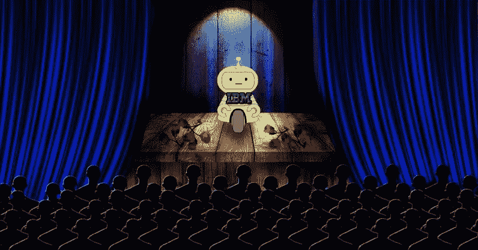
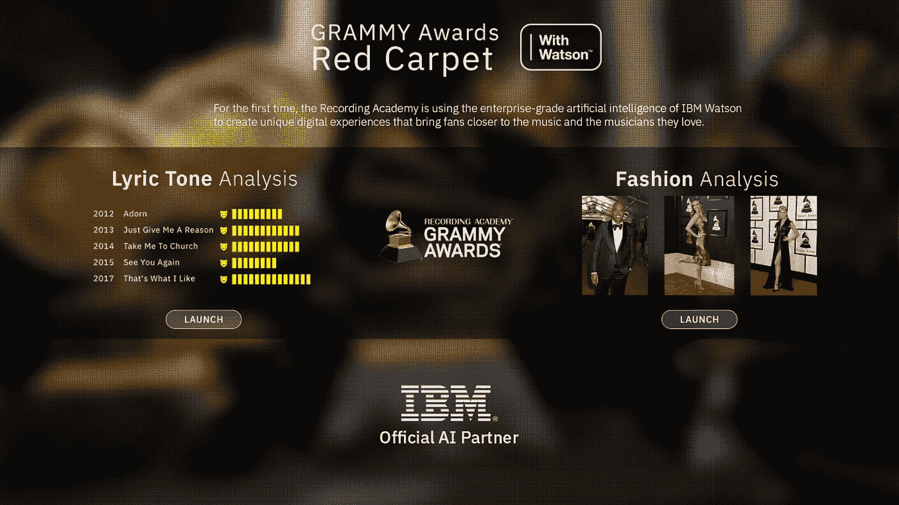
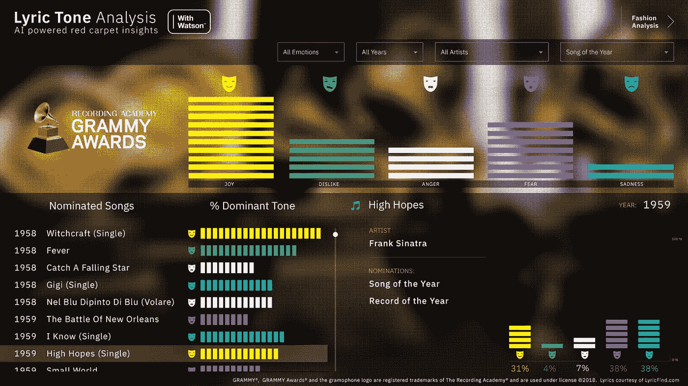

# IBM Watson: AI 的签名大使

> 原文：<https://medium.com/hackernoon/ibm-watson-ais-signature-ambassador-d7ba9c0fffb6>

Credit: Nicole Gray

当我听说第 60 届格莱美颁奖典礼将以人工智能为主题时，我立刻想到“这是一个营销策略。”但后来我发现 IBM 的沃森是有问题的人工智能。

你看，沃森卷起它不存在的袖子，做一些老式的艰苦工作是没有问题的。不要期望一个愚蠢的机器人在红地毯上滚动模仿人类，IBM 的机器会出现来解决问题和优化工作流程。

虽然这并不十分性感——努力工作很少如此——但它非常重要。

你很有可能在不知情的情况下遇到了华生。它嵌入医疗保健系统，它[制作音乐](https://thenextweb.com/apps/2017/10/20/ibms-watson-beat-who-owns-music-made-by-machine/)，[挑选午餐菜单](https://thenextweb.com/artificial-intelligence/2017/06/27/lunch-gets-seriously-weird-when-an-ai-decides-whats-on-the-menu/)，而[比你想象的更了解我们](https://thenextweb.com/artificial-intelligence/2017/09/08/ibms-watson-ai-is-learning-to-understand-nuance-and-context/)。

IBM 让沃森参加格莱美是有道理的。它不仅有能力为工作人员提供后端支持，而且它还被完美地设计为处理事件产生的大量数据。

# 这是数据

沃森带来了人类无法做到的东西。作为 IBM 体育和娱乐合作伙伴的副总裁，诺亚·西肯告诉 TNW:

> 至少在某种程度上，内容“过期”，或者至少随着时间的推移变得不那么相关。加快上市时间将影响它吸引粉丝的速度。

内容本身——图像、视频、时尚甚至歌词——都是数据，人工智能处理数百万条信息的速度比人快。

这意味着 IBM 人工智能对时尚和歌词的见解将在活动期间通过交互式仪表盘向粉丝直播。

同样的洞察力还将使活动工作人员能够找到并制作内容，而不必手动整理数小时的视频和数十万张图像。

IBM 项目经理约翰·肯特告诉 TNW:

> *例如，我们正在将 Watson 应用到现有的摄影工作流程中，这将为摄影工作人员提供更高的效率和更大规模的工作能力。*

当然，格莱美并不完全是世界上最具挑战性的人工智能展示——即使这是音乐界最盛大的夜晚。我们不是在谈论实时优化纽约交通网格或在亚原子水平上模拟碰撞。然而，在全世界的注视下，毫无疑问沃森将表现得像计算机一样精确。我甚至会冒险做一点水晶球报告:这不会让整个行业尴尬。

2018 年，有很多“绿野仙踪”人工智能结构承诺将是伟大和强大的，但通常证明只不过是木偶。为了让公众接受人工智能，理解人工智能很重要。

# 沃森大使

IBM 的沃森是人工智能领域的完美大使。它的存在不是为了给它的开发者一个练习他们的一行程序的平台，它不是[刻薄或怪异的](https://thenextweb.com/artificial-intelligence/2016/10/10/humanoid-robot-sofia-puts-the-moves-on-60-minutes-correspondent-charlie-rose/)。它不会在杂货店里[骚扰你](https://thenextweb.com/artificial-intelligence/2018/01/24/robots-that-act-like-humans-are-a-waste-of-time/)。它只是做它应该做的。

如果你对它的聊天机器人功能不感兴趣，可以看看它在[肿瘤学](https://thenextweb.com/artificial-intelligence/2016/08/31/artificial-intelligence-could-soon-revolutionize-the-way-doctors-treat-cancer/)的记录。如果你不喜欢它不是以机器人的形式出现，你可能误解了它的目的。

AI 应该让世界对人类来说更美好。

这并不是说沃森是最好的，最强大的，甚至是最有用的人工智能。可以说，谷歌的 DeepMind 有更多的大脑。但是沃森不仅仅是站在前沿看它走向何方；这是一个脚踏实地的人工智能，在你能想到的每个行业都有大量的工作岗位。

我们需要沃森继续为其他人工智能(开发者)提供榜样，因为尽管它缺乏吸引力，但它代表了该领域的现在和未来。

沃森知道如何闭嘴并做好自己的工作——让我们所有人都变得更容易。

你可以在[格莱美颁奖现场](http://watson.grammy.com/)查看沃森大使的作品，并在这里了解更多[。](https://www.ibm.com/sports/grammys)

*这个故事是由* [*特里斯坦·格林*](https://thenextweb.com/author/tristangreen/) *写的，最初发表在*[*Next Web 上。*](https://thenextweb.com/artificial-intelligence/2018/01/26/ibms-watson-is-ais-greatest-ambassador/)