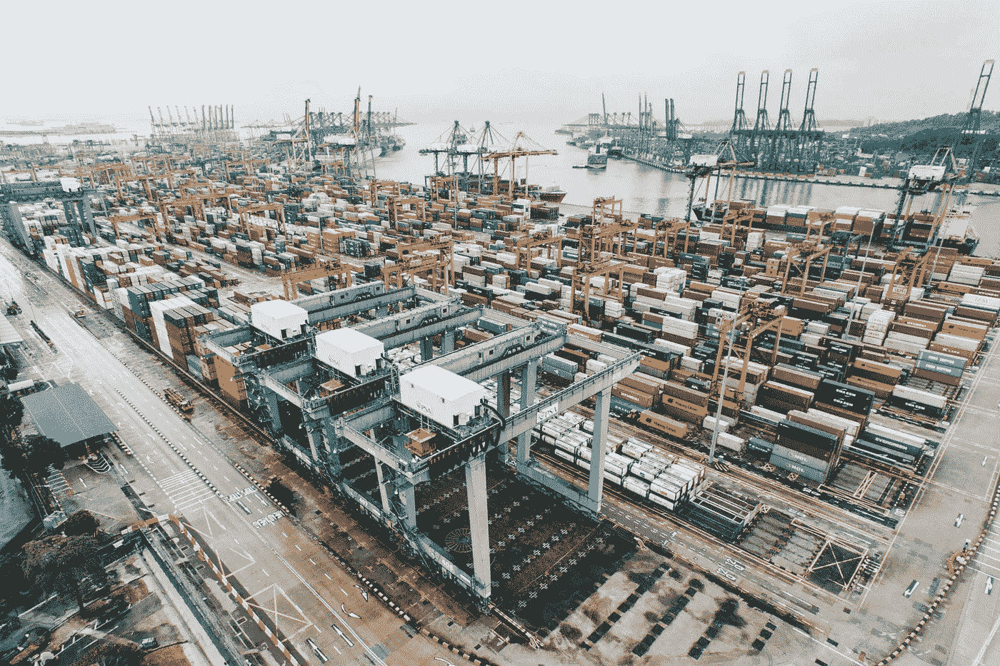

# IBM 在标准化运输(比特)上下了大赌注

> 原文：<https://medium.com/hackernoon/ibms-big-bet-on-standardized-shipping-of-bits-1345bff2c55c>

收购 Red Hat 让许多人感到意外——尤其是价格。

自宣布以来，许多专家、战略家以及现任和前任员工都从不同角度发表了意见，有些人认为这反映了 IBM 的旧剧本，当娄[郭士纳](https://hackernoon.com/tagged/gerstner)负责时，如何让红帽的员工满意是 IBM 的新战略，或者这是*真正的*关于 [Kubernetes](https://hackernoon.com/tagged/kubernetes) 的全部。

在[错综复杂的](http://www.intricately.com)，我们对数字云中发生的事情有一个前排座位，但出于许多原因，Red Hat 的收购是独特的。

我想提供另一个视角，将这次收购视为工业化航运兴起的平行事件，以了解为什么 Red Hat 将成为 IBM 未来的重要组成部分。

特别是，我们将重点关注越来越多的公司转向多供应商云战略，以及这一战略在商品化大型云供应商核心(计算和存储)业务方面的潜力。

然后，我们将揭示 IBM 在云商品化和收购 Red Hat(特别是其服务业务)上的赌注，这是一个拥有高利润业务并在面临 AWS、Google Cloud 和 Azure 的云统治时保持相关性的机会。

我还会做一些物流和运输方面的参考。我希望你喜欢它们。

# 运输比特 vs 运输原子

之前职业是做物流的，看过[马克·列文森的 *The Box*](https://www.amazon.com/Box-Shipping-Container-Smaller-Economy/dp/0691136408) *:海运集装箱如何让世界变小，让世界经济变大*(极力推荐 *)* 。这个有点冗长的标题简明扼要地概括了大约 400 页的内容。从现在开始，我们将把标题缩短为*盒子*。

你还记得在海运集装箱出现之前的生活是什么样的吗？大概不会。长话短说，Amazon.com 是不可能的，国际贸易是非常困难的，它涉及到许多装卸工。

在 1956 年之前，产品是以散装货物的形式运输的，也就是公司将货物放入箱子、袋子、桶、鼓、板条箱以及其他他们认为可以固定在托盘上的东西中。装卸工一整天都在装卸各种形状和大小的产品。

听起来熟悉吗？

今天，正如我们所知，互联网是由云提供商推动的，他们既是运输工具(通过虚拟机运送货物的船只、卡车和飞机)*也是各种形状和大小的散装货物集装箱的制造商(利基人工智能、ML 和其他解决方案)。*

这部分是由于云提供商发起了一场争夺 IT 资金的战争，因为企业首先转向了混合云，然后是原生云，并越来越多地转向了多云战略。

但在过去十年中，随着亚马逊、微软和谷歌将资源转向为云构建车辆和货箱，IBM 选择袖手旁观，让他们损失了数十亿美元的潜在云收入。

IBM 试图在 2013 年通过收购 Softlayer 来纠正这一点，但由于上市较晚*和*没有能力投入必要的资本支出来与老牌大云公司竞争，他们需要一个新的计划。

# 救援集装箱？

虽然云公司一直在争夺公司的基础设施支出，但像 [Docker](https://www.docker.com/products/docker-enterprise) 和 [Kubernetes](https://kubernetes.io/) 这样的技术已经通过容器创新在云标准化方面取得了实质性进展。

类似于[联运集装箱](https://en.wikipedia.org/wiki/Intermodal_container)如何变革全球贸易，云集装箱化通过定义和执行一套标准规则，简化所有相关方的流程，允许公司更快、更便宜地运输(数字)产品。

转向标准集装箱运输，远离散装货物运输，需要企业家、私人投资者、政府和港口的共同努力。随着 IT 购买者转向多供应商战略，我们现在看到这种情况在云中发生，改变了数字产品的构建和部署方式。

就像标准化运输的大规模扩张改变了世界一样，云必须通过提供最快、最便宜的解决方案来交付产品，从而从客户的最大利益出发，让自己适应标准化的好处。很明显，向标准化集装箱的转变从根本上改变了国际物流，并使潜在市场总量呈指数级增长。

好吧，好吧，但这不是一篇关于 IBM 和红帽的文章吗？

嗯，在过去的几年里，Red Hat 一直专注于为企业(即 Kubernetes)实现开源容器解决方案。类似于 IBM 曾经是[开源技术和企业](https://stratechery.com/wp-content/uploads/2018/10/Paper.stratechery-Year-One.380.png)之间的中间层，容器化有可能在公司的所有应用程序之间实现标准化，而不管底层的云提供商或技术如何。

这意味着，通过集装箱化，数字产品可以通过默认使用最简单的路线，通过互联网高速公路更快更便宜地制造并运送给消费者——无论是亚马逊、Azure 还是处理“物流”的谷歌云服务器。

集装箱化不再是装载各种形状和大小的不规则货物的船只，而是通过不再将数字“制造商”锁定在某些基础设施上，让他们能够根据每个客户的最佳路线跨云交付产品和应用程序，从而为他们提供支持。

类似于沃尔玛有几十个运输合作伙伴，从地球另一端的生产设施到最后一英里，集装箱化使公司能够轻松地为旅程的每一段选择最佳供应商。

# 建造合适的港口

如果联运集装箱化的革命教会了我们什么，那就是有时一个必要的解决方案是建造一个全新的港口。向标准化集装箱的过渡是第一代港口城市如纽约、伦敦和旧金山(把这些想象成 1.0 版)的死亡和二级城市如奥克兰和纽瓦克(新的和改进的 2.0 版)崛起的原因。

IBM 没有将农场押注于能够赶上基础设施和利基云计算，而是看到了向基于服务的业务倾斜的机会，因为基于服务的业务往往利润率较低，但更稳定、更高，尤其是与资本支出密集型的计算业务相比。

通过收购 Kubernetes 的最大实施者之一 Red Hat，IBM 实际上是在押注云供应商的商品化，同时保持他们长期的业务关系，以销售更多(高利润)的云咨询服务。

IBM 本质上是在建设新云的港口，在这里一切都是为交付数字产品而优化的，而 Red Hat 是为进出这些“数字港口”的船只提供服务的关键部分。

# 商品化的云

随着一切的消费化蔓延到企业 IT，对更快、更便宜地解决业务挑战的期望不仅是美好的愿望，也是核心要求。就像标准集装箱为大规模国际商务奠定了基础一样，云的标准化也有可能推动类似的数字商务爆炸。

这将允许企业以前所未有的方式构建、交付、购买和销售技术产品，尽管大公司可能会试图抵制它，但从长远来看，标准通常会带来一个各方共赢的市场。