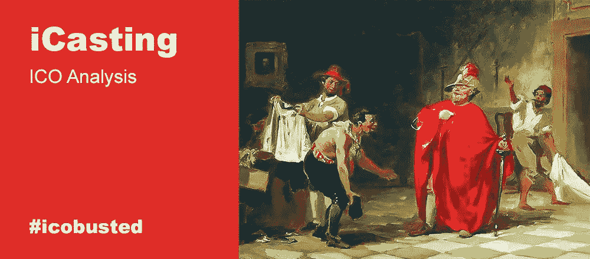

# iCasting ICO:为全球市场拓展人才市场

> 原文：<https://medium.com/hackernoon/icasting-ico-expanding-the-talent-marketplace-for-the-global-market-6dc28584b4ae>

*专栏作者是* [*亚历山大·萨维金*](https://howtotoken.com/blockchain-experts/) *，我们的投资专家，Howtotoken 的联合创始人。这是#icobusted，我们扫描市场，寻找最新、最引人注目的即将推出的 ico，并对它们进行深入分析，重点关注这些项目背后的商业概念的可行性。这不会涉及前 ICO/ICO 价格差距，没有对团队的喘息和抱怨，也没有代码检查。在这里，我们将试着把每一件事都分解开来，看看当且仅当该产品能够交付时，该产品是否有任何市场前景。*

*如果您对我们的新形式有任何反馈，我们将不胜感激，因此请在评论栏中畅所欲言，说出您最感兴趣的部分，以及我们如何改进这些主题，让您对它们更感兴趣。要了解我们的最新动态，请关注我们:*

*   [推特](https://twitter.com/howtotoken)
*   [脸书](https://www.facebook.com/groups/howtotoken/)
*   [电报](https://t.me/icobusted)

或者只订阅我们的电子邮件简讯(以接收仅通过电子邮件分发的更新和独家材料):

# iCasting

iCasting 是一个市场，在这里有才能的人以及那些寻找他们的人可以找到彼此，而不需要中间人，创造了一个人才铸造的供求市场。自 2015 年以来，iCasting 一直致力于改变市场，它已经获得了超过 140，000 名有才华的个人，并形成了超过 35，000 场比赛，证明了它的有效性和潜力。它还拥有自己的在线教育平台，名为 iCasting Academy，为各种人才提供深度面试和指导课程等服务。

该产品的当前版本仅在荷兰可用，即将推出的 ICO 和基于区块链的平台版本的开发旨在面向全球推出。天赋令牌作为其内部货币。

虽然，我们认为区块链并不是这个项目的必要特性，而且这个服务的当前工作版本已经发布的事实也证明了这一点。同时，它似乎非常适合区块链科技，因为它可以为身份管理提供复杂的解决方案，并改善客户和人才之间的相互结算，智能合同可以保证安全透明的预订流程。

# 市场

仅在美国，人才中介市场在 2017 年就创造了约 9 亿美元的年收入(根据 IBISWorld [research](https://www.ibisworld.com/industry-trends/specialized-market-research-reports/advisory-financial-services/other-outsourced-functions/casting-agencies.html) )。毫无疑问，这是一个稳定而成熟的行业。目前，大多数“顶级”人才的选角工作都是以传统方式进行的:利用私人关系、代理人等。但“明星”人才并不是市场的全部，有几个资源提供在线寻找演员的能力。

最大的服务之一是[演员访问](https://actorsaccess.com/)，有超过 845，000 名演员使用该服务(是 iCasting 的 6 倍)，每年发布超过 43，000 个故障。Actor Access 的所有者 Breakdown Services 拥有多种针对表演行业的产品，为经理、演员、选角导演提供解决方案，被美国选角协会(CSA)认定为首选在线资源。

以便与诸如演员接入、Mandy.com、Backstage.com 等服务竞争。，iCasting 必须提供更好的用户体验、更高级的人才档案设置和智能匹配算法。此外，大多数最大的竞争对手瞄准了北美市场，其中一些还加入了英国和澳大利亚。因此，真正让一个平台成为全球服务的方法是让它成为多语言平台，不仅要与美国雇主协会发展合作关系，还要与所有重要国际市场的雇主协会发展合作关系。

如果 iCasting 团队提供真正有竞争力的服务，接收全球客户，并为其客户群规模和交易总额创造 10 倍的利润，会怎么样？我们可以和 iCasting 的直接竞争对手 Actor Access 做一个粗略的类比，后者每年只需支付 70 美元就可以无限制地访问网站的全部功能。是愚蠢还是谦虚——我们不得而知，但 iCasting 并没有恰当地披露平台费用的大小及其之前的年度业绩。让我们假设 iCasting 可能每完成一笔交易就能获得 35 美元(可以肯定他们会击败竞争对手的价格)。自 2015 年以来，iCasting 平均每年匹配约 12000 名人才。因此，如果 iCasting 在已完成的交易(“比赛”)中达到 10 倍，据称他们可能会获得 420 万美元的收入。有了这种可能的表现，iCasting 可能会兑现其承诺，考虑到 1600 万美元的硬帽。

# 摘要

该项目似乎相当有前途，尽管区块链并不是开发其所有功能的必备特性。我们也没有忘记这样一个事实，即有很多竞争对手没有区块链，但却拥有卓越的市场地位。这里的主要问题是 iCasting 是否能够提供方便的多语言服务。

顺便说一下，35%被分配用于营销，硬资本为 1600 万美元，对于 B2C 细分市场的全球营销活动来说，这只是可行的边缘。

**利弊**

(+)现有服务(非区块链)
(+)稳定的全球市场
(-)强劲的竞争对手
(-)产品及其优势的独特概念

那么，我们的最后一句话是什么？蜂蜜是甜的，但被蜜蜂蛰会痛🙂iCasting 是一个有吸引力的项目，但在我们看来还不够详细。为了进一步考虑，投资者将需要关于竞争特征、定价等更清晰的信息。

# 参考

1.  [通过 Crunchbase 升级财务](https://www.crunchbase.com/organization/odesk#section-overview)
2.  [铸造机构 Ibisworld 的美国市场研究报告](https://www.ibisworld.com/industry-trends/specialized-market-research-reports/advisory-financial-services/other-outsourced-functions/casting-agencies.html)
3.  [按细分服务分类的细分服务统计](http://blog.breakdownservices.com/_working_about_us_page/)
4.  [biz fluent 提供托管服务需要满足的条件](https://bizfluent.com/info-8509694-escrow-license.html)
5.  [由 Eitantheactor 进行的 Actor 访问审查](http://eitantheactor.com/bio/tag/actors-access-scam/)

*所有材料仅供参考。任何材料都不应被解释为投资建议。*

*原载于 2018 年 9 月 6 日*[*howtotoken.com*](https://howtotoken.com/for-traders/icasting-ico-expanding-the-talent-marketplace-for-the-global-market/)*。*