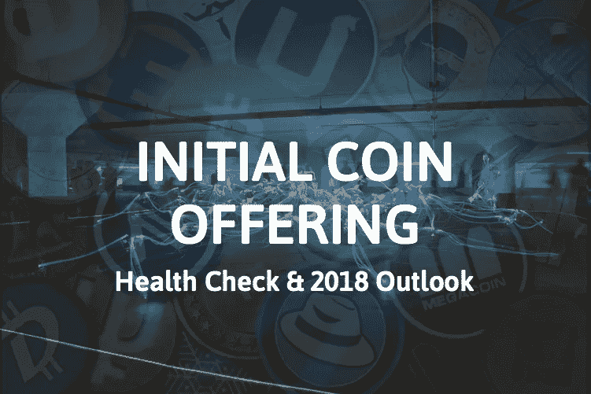
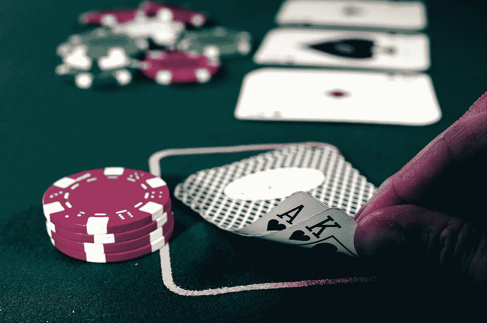
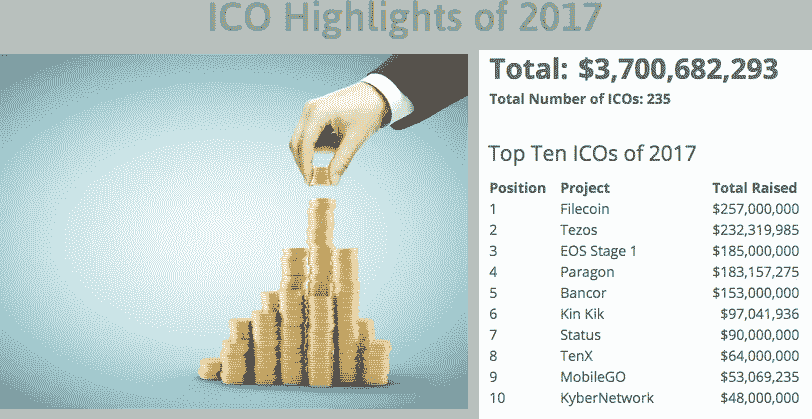
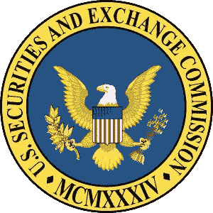
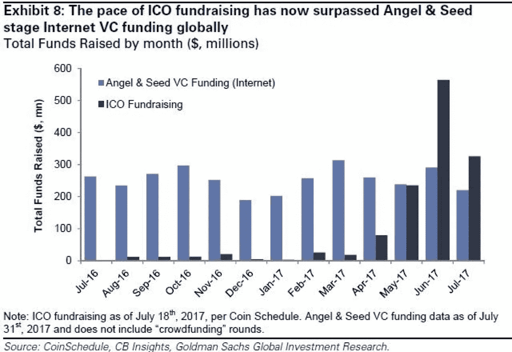
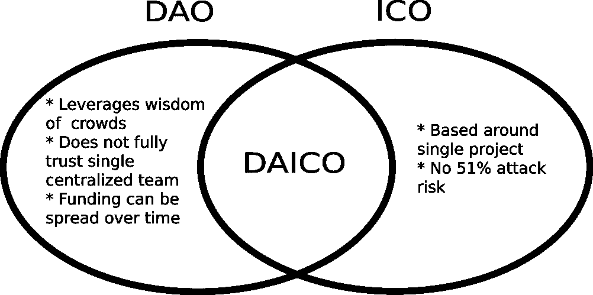

# ICO 健康检查和 2018 年展望

> 原文：<https://medium.com/hackernoon/ico-health-check-2018-outlook-446a75e66a17>

对于 2017 年一直关注 crypto 的任何人来说，听到下一个热门 ico 是理所当然的。有一个语音相似的 IPO 和只有 3 个音节时，每个字符是健全的，肯定发挥了它的"酷"的因素。此外，对于那些想在这个空间里炫耀自己的时髦的人来说，把“k”说成一个双音节单词可能听起来更吸引人。

不管你对 ico 的立场是什么，它们都是一种新颖的筹款现象。随着 2015 年 7 月以太坊的成立，代表初始硬币发行的 ico 在很大程度上得到了普及，并在早期的[技术](https://hackernoon.com/tagged/technology)市场掀起了风暴。

## **什么是 ICO？**

但是 ICO 到底是什么？简而言之，ico 是总部位于区块链的科技公司的全球融资机制。这些公司发行一种新的加密数字资产，以换取比特币和以太坊等更成熟的加密货币。这些公司通常将筹集的资金用于成立一家全新的公司，在某些情况下，还用于在一家已成立的公司中推出新的服务或功能。ICO 机制是实现这一目标的起点。作为回报，ICO 投资者会以某种预先设定的加密汇率获得代币。

一般来说，这些代币预计具有平台效用和二级市场流动性。这种投资工具具有高度的投机性和风险性。在最坏的情况下，任何投资者都应该做好失去全部投资的准备。

## **投机为什么**

那些不熟悉 ico 的人可能会问，“为什么会有人投资这样的东西？”简而言之，传统投资界以“%”为单位寻求投资回报率，而 ICO 投资者则以“x”为单位寻求回报。ICO 的极端表现已经产生了超过 90 倍的回报。现在，在许多情况下，9000%回报的可能性是值得冒相关风险的。虽然 90 倍是个例外，但在几周或几个月内实现 200%至 400%的回报率并不是想象中的不可能。

Photo by [Michał Parzuchowski](https://unsplash.com/photos/GikVY_KS9vQ?utm_source=unsplash&utm_medium=referral&utm_content=creditCopyText)

虽然所有这些看起来都像是高赌注的赌博，但请记住，玩流行的赌场游戏轮盘时的最高赔率是 35 比 1。最低轮盘支付是匹配的 1 比 1。对于投资股市的人来说，“跑赢市场”往往意味着超过 6-8%的年收益率。就投机性投资而言，除了利用杠杆进行交易以及买入期权和期货合约等衍生品之外，很少有类似类固醇的期权。

## **通常无股权**

除了极少数例外，迄今为止，大多数 ico 都没有发行过各自公司的任何股票。这实质上意味着，在许多情况下，他们在不放弃各自公司所有权的情况下筹集了数百万美元。(请注意，这主要适用于散户投资者。很可能已经向在这些公司进行更大投资的机构投资者提供了股权条款，类似于传统早期资本市场的预期。此外，我预计加密令牌股票发行将在未来几年增加。)

[Coinschedule Statistics](https://www.coinschedule.com/stats.html)

## 受管制的安全困境

令 ICO 更令人烦恼的是，许多 ICO 都是在它们的代币发行不是受监管证券的借口下执行的。虽然美国证券交易委员会(SEC)已经开始表达他们的立场，并对明显违反将任何投资视为证券的特定条款的公司采取行动，但许多寻求这种融资机制的技术公司已经竭尽全力保护他们的代币不被视为证券。

迄今为止，美国证券交易委员会:

1.  根据 1934 年证券交易法第 21(a)节发布的[调查报告:2017 年 7 月 25 日 DAO 第 81207 号](https://www.sec.gov/litigation/investreport/34-81207.pdf)，
2.  SEC 主席 James Clayton 提供了一份关于加密货币和初始硬币发行的[声明](https://www.sec.gov/news/public-statement/statement-clayton-2017-12-11)
3.  对 Munchee，Inc .[的一项正在进行的 ICO 发出第一份停止令，行政诉讼文件编号 3–18304，1933 年证券法发布编号 10445，2017 年 12 月 11 日](https://www.sec.gov/litigation/admin/2017/33-10445.pdf)。

现在，如果你是一家公司，你可以在不放弃股权的情况下筹集数百万美元，你为什么不利用这个机会呢？虽然大多数人不会拒绝这种类型的融资机会，但 ico 并不容易推出，也不保证一定会成功。推出失败的 ICO 的后果可能是毁灭性的。

## **早期资本和 ICO 市场**

在创业时代，早期资本市场由种子和天使投资者、风险投资基金、加速器和孵化器、专业银行服务和各种众筹平台组成。这些投资方法的皇冠上的宝石通常是获得股权、未来收入，在某些情况下还能控制候选公司的方向。

虽然我相信早期资本市场仍然生机勃勃，但在 2017 年 6 月，一场超过弓的*射击*打响了。六月是 ICO 筹资的第一个月，获得了超过 5 亿美元的等值美元加密资本，而*互联网/技术*领域的天使、&种子风险投资基金大约为 3 亿美元。直截了当地说，ICO 的每美元融资额超过了同类产品的早期资本。

虽然与传统的早期资本相比，6 月份的 ICO 融资可能是一种异常现象，但 7 月份强化了这一市场现象。7 月 ico 刚刚超过 3 亿美元，天使和早期 VC 融资刚刚超过 2 亿美元。如果你是一个基于互联网的早期投资者，最近的这种趋势是一个令人不安的事件，很可能让你重新考虑你的投资策略和进入区块链互联网科技交易的条款。

## **红旗、争议和泡沫言论**

由于 ICOs 发行的是加密货币，而加密货币在主流媒体上很大程度上归功于比特币，所以“泡沫”这个词被频繁抛来抛去。对于那些一直关注其他也大幅升值的加密货币的人来说，泡沫论变得更加有力。

那么，我们是在泡沫中吗？这是一个复杂的话题，我个人认为答案是既肯定又否定的。

Photo by Alejandro Alvarez

*代币价格*。如果你所说的泡沫是指从机构到散户层面的一些投资者正在哄抬新发行代币的价格，将其视为投机机会，那么答案是在一些案例中。

*令牌供应*。如果你所说的泡沫是指这些执行 ICO 的公司中的一些没有有效地管理 ICO 推出或业务成熟过程中的令牌供应，那么在一些情况下，答案是**是的**。

*资本过剩*。如果你所说的泡沫是指这些执行 ico 的公司中的一些公司获得了过多的资本，实质上使它们过度资本化，那么在一些案例中的答案是是的。

*前期产品投资*。如果你所说的泡沫是指**这些推出 ico 的公司中的一些**没有实际的产品，最终将无法建立、部署甚至发展有意义的用户群，那么**一些**案例中的答案是**是的**。

*缺乏监管和投资者保护*。如果你说的泡沫是指投资者保护措施很少或根本没有，一些投资者将被彻底欺骗，对他们的损失没有追索权，那么这是一个响亮的**是的**。

*边际价格现象和资产脆弱性*。加密资产在高度分散的市场中交易，并且资产的交易价格通常不反映基础资产的真实价值，而是该资产最后一次交易的边际价格。这是供求经济学的最佳状态。名义上，所有这些代币的流通供应本来就具有最后交易价格的价值，但不同程度的资产流动性加上脆弱的市场动态，使得这些资产的价格根本不稳定，并且在市场抛售时面临崩溃的高风险。

虽然除了象征性价格、象征性供应、过度资本化、产品风险和普遍缺乏监管之外，还有更多需要考虑的因素，但我们的目的并不是煞费苦心地详细研究泡沫论点，而是为您提供复杂泡沫问题的传统商业案例答案，并告诉您—“**这取决于……**”

尽管存在所有这些以泡沫为导向的风险，但在这个炙手可热的投资领域还是出现了积极的趋势。

## 车祸的原因

尽管区块链和密码界不希望看到市场崩溃，但我们很可能正在走向崩溃。数百万美元的加密技术被四处挥霍，就好像一切都是正常的一样。更高加密值的传播使得新 ico 更容易获得资金。

举个例子，有人投资了 10，000 美元在加密技术上。让我们假设，在 6 到 12 个月的时间里，他们的投资增长了 10 倍，现在他们拥有 10 万美元的加密资产。这个人现在有可能投资新得到的钱。假设这个人想分散投资 10 个 ico，每个 ico 10，000 美元。以前，这个人没有这笔钱可以投资，但现在 10 个新项目获得了 10，000 美元的新投资。没什么大不了的，对吧？

Photo by [Clem Onojeghuo](https://unsplash.com/photos/tca2Hfz1cvY?utm_source=unsplash&utm_medium=referral&utm_content=creditCopyText)

现在，让我们假设整个市场在可比时期内投资增长了 10 倍，他们也认为投资 ico 是一种可靠的投资工具。现在让我们假设世界上有 500 万人持有 1 万美元的密码。一开始，这相当于系统中 500 亿美元的资金。在他们持股 10 倍之后，现在他们可投资的资本总额是 5000 亿美元…你明白了。今天的市值刚刚超过 7000 亿美元。这些数字与现实相当。

散户投资者拥有统一的可用资本分布这一基本情况是看待这一资产空间的一种方式，但事实并非如此。这种分布是高度倾斜的，加密巨鲸和机构持有大量加密资本，而散户投资者持有的数量要少得多。这个市场不可能兑现为法定货币而仍然保持完整。虽然可以考虑无数的假设来维持当前市场环境的相对稳态，但我想强调以下关键要求:

1.  新的资金需要继续投入到加密市场
2.  现有的加密持有者需要**尽量减少兑现**和转换回菲亚特
3.  现有的加密货币和 ico**需要通过传递真实价值来提升**它们的加密市场资本化

这种醉翁之意不在酒的现象，再加上中央政府需要保持对资本流动和税收的控制，充其量只能说是岌岌可危。再加上黑社会犯罪和恐怖主义金融家利用 crypto 的独特功能带来的威胁，可能会对 ico、crypto 交易、一般合法性以及传统银行业与 crypto 客户和企业互动的能力实施严厉的政策。

## 乐观的理由

事实上，积极的市场趋势提供了真正乐观的理由，支撑了上述一些风险和相关的担忧。

Photo by [Austin Chan](https://unsplash.com/photos/ukzHlkoz1IE?utm_source=unsplash&utm_medium=referral&utm_content=creditCopyText)

***区块链技术快速提升***

*   每秒事务的增加
*   共识算法的改进
*   安全协议正在进步(想想量子抵抗倡议)
*   协议越来越具有互操作性

***智能合约能力正在推进***

*   代码库正在开发中，这将促进高效和可重用智能合同的自动化和集成
*   设计糟糕的智能合约将被更强的代码所取代

***投资者越来越聪明***

*   随着区块链项目数量的增加，投资者被迫进行更严格的尽职调查
*   总供应量、折扣率、锁定期和治理模式等术语只是投资者更密切关注的诸多因素中的一部分

***不好的项目会失败***

*   随着 ico 的失败，市场将变得更加有效。没有什么比资本的突然损失更能提高市场效率了。
*   这些公司的事后剖析将为 ICO 投资界提供与区块链公司失败相关的指标、时间表和触发因素的教训。

***好的项目会成功***

*   相反，使优秀公司在各自的行业、市场和技术堆栈中生存下来的指标、时间表和核心贡献因素将成为未来投资者的可比参考点。

***比特币相关性和市场支配地位递减***

*   加密市场正慢慢与比特币脱钩。有一段时间，比特币是所有加密技术的领头羊。随着每个新项目上线，加密市值将变得更加分散，慢慢降低比特币的市值百分比
*   虽然比特币的价格可能会飙升，抵消其他加密货币的增长和市场主导地位，但我相信，随着时间的推移，比特币价格的净影响将越来越小。
*   脱钩很重要，这样 ico 和市场才不会对大多数比特币持有者经常遭遇的剧烈波动做出如此严厉的反应。

***ICO 标准将继续发展***

已经有人尝试创建 ICO 标准。随着时间的推移，这些可能会变得更加强劲。请参见以下链接了解一些最新进展:

*   [Vitalik Buterin 的分散自治 ICO (DAICO)](https://ethresear.ch/t/explanation-of-daicos/465) 其中，参与者为智能合同做出贡献，并在满足合同的条款和要求后获得代币作为交换。

*   自我监管计划的增长，如[总部位于香港的 ICO 认证金融委员会](§%09https:/financialcommission.org/certification-services/ico-certification)和 [ICO 治理基金会](https://icogovernance.org/)
*   [俄罗斯与 30 个国家制定全球 ICO 评级标准](https://news.bitcoin.com/russia-global-ico-ratings-standard-30-countries/)
*   [Waves 和领先的市场参与者正在建立一个新的自律机构，为 ico 制定标准](https://blog.wavesplatform.com/waves-platform-with-the-support-of-leading-market-players-is-founding-a-new-self-regulatory-body-b8bfc0c4ca84)
*   [近地天体 ICO 标准](https://stateofneo.com/nis/)。

***政府当局将继续实施指导和执法行动***

因为投资者监管问题与证券交易委员会(SEC)等组织提供 ico 指导的必要性之间存在无可争议的联系。其他监管机构也将参与进来。

***加密货币的增长***

*   机构和散户投资者都在更广泛地采用加密货币。韩国是最活跃的加密货币市场之一，来自韩国的数据显示[大约三分之一的韩国员工是加密投资者。](https://qz.com/1166103/a-third-of-south-korean-workers-have-invested-in-cryptocurrencies-like-bitcoin/)虽然韩国一直在努力监管交易活动，保护人们免受投资加密技术的相关风险，但总体增长速度令人震惊。
*   更多市场参与者的净效应可能是增加市场流动性，尽管许多人希望市场稳定，但我预计流动性更强的市场具有弹性，即使在波动之后，它们也将比流动性差的市场更快反弹。

*[***将现实世界的资产放在区块链***](http://www.nasdaq.com/article/how-tokenization-is-putting-real-world-assets-on-blockchains-cm767952)*

*   *有许多风险投资正在将真实工作资产令牌化。这一领域的一些项目包括:*
*   *黄金令牌化。 [Digix Global](https://digix.global/) 和 [GoldMint](https://www.goldmint.io/)*
*   *房地产。[亚特兰特](https://atlant.io/)和[速度台账](http://www.velocityledger.com/)*
*   *艺术品。[猫](https://www.maecenas.co/)和[猫](https://www.cryptokitties.co/)*
*   *期货合同。 [Evermarkets](https://evermarkets.com/)*
*   *发行公司股票。由于代币有能力代表公司内部的真实股份，这种代币的发行即将开始*

****区块链互操作性的进步****

*   *虽然区块链本身通过分散化和新部署的基于技术的信任机制释放了强大的功能，但区块链互操作性的进步同样会释放那些“未来”基于平台的孤岛特性和功能，并产生复合效应。*
*   *随着我们获得更多协议和解决方案的集成，这些进步将会蓬勃发展。一些亮点包括:*
*   *[分类帐间协议](https://interledger.org/)，跨不同分类帐发送付款*
*   *[方舟的智能桥技术](https://blog.ark.io/what-is-the-ark-smartbridge-and-how-does-it-work-1dd7fb1e17a0)，*
*   *[Loopring](https://loopring.org/en/index.html) 的分散交换和开放协议*
*   *Airswap 的点对点交易网络*
*   *原子交换功能，例如 Decred (DCR)和 Litecoin (LTC)之间的[跨链交互](https://coinsutra.com/atomic-swap/)*
*   *[Onchain 的分布式网络架构(DNA)](https://hackernoon.com/neo-onchain-and-its-ultimate-plan-dna-4c33e9b6bfaa) 。NEO(区块链，通常被称为中国的以太坊)背后的 Onchain 公司着眼于发展完善的区块链间网络。*

## *2018 年展望*

**

*Photo by [Evan Kirby](https://unsplash.com/photos/TFATaOllUC8?utm_source=unsplash&utm_medium=referral&utm_content=creditCopyText)*

*迷茫？害怕吗？乐观？欢迎加入俱乐部。我们正处于高度不稳定和成型的时代，因为它关系到加密市场的整体健康。最小的事件或一段时间内发生的许多事件都会让这个市场陷入混乱。*

*市场继续被旨在传播 FUD 的消息震惊——恐惧、不确定性和怀疑、衍生品市场的出现以及看似过度的主权监管措施(例如，彻底禁止 ICO 投资和加密货币交易)等等。*

**抗易碎性*。人们评论比特币是一种抗脆弱的资产，这可能适用于许多其他加密资产。但是，即使一些加密资产从市场不稳定中获得了力量和弹性，这并不意味着它适用于整个市场格局。*

**区块链弹性。我们现在确实知道区块链理工大学是有弹性的、强大的，并且会继续存在下去，但是这并不能保证加密市场能够继续抵御崩溃。经历过 20 世纪 90 年代互联网泡沫、2008 年金融危机和 2012 年欧债危机的人对繁荣-萧条周期再熟悉不过了。**

*我确实预测会有一场市场崩盘(一场可以恢复的崩盘)，但我不认为 2018 年会是崩盘之年。这个市场太有前景了，太新了，而且获得了太多的媒体关注，因此不会有大规模的外流。我相信 2018 年将是前所未有的市场增长的一年，全球市值将达到 1.5 万亿至 2.5 万亿美元。*

*除此之外，我们还需要不断评估市场环境，并确定可持续的基本面是否正在发展并支撑着主要的风险因素。今天，我不相信必要的基本面已经存在。尽管如此，我对未来的市场增长相当乐观。*

*— — — — — — — — — — — — — — — — — — — — — —*

**要获得更多类似的文章，请随意将任意数量的 ETH 或 ERC20 令牌投稿到此地址:*0x94b 43854 aaec 027 a 499 b 4566d 761 e0e 94 b 222 e 28*