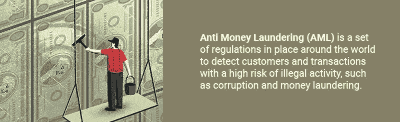
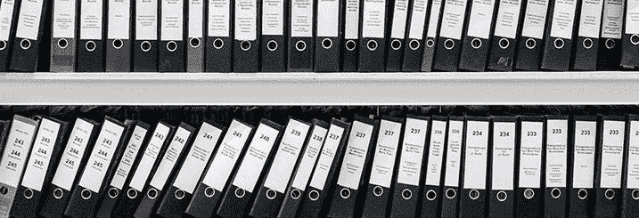
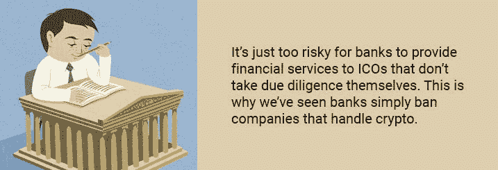
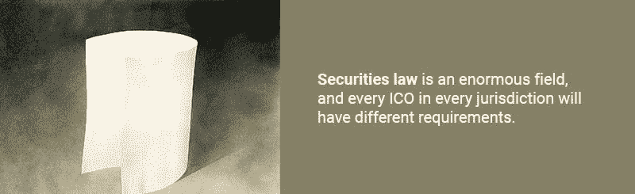

# 2018 年的 ICO:遵守证券法的挑战

> 原文：<https://medium.com/hackernoon/ico-in-2018-the-challenges-of-complying-with-securities-laws-ea5ff5be2c59>

不受监管的 ICO 市场的免费搭车正迅速嘎然而止。监管者开始认真对待区块链代币，他们开始在狂野西部的秘密经济中树立权威。监管机构在这一点上的每一个行动和声明都是未来 ico 将如何监管的重要指标。正如我们将看到的，这些指标之一是，ico 目前提供的许多代币是[证券](https://en.wikipedia.org/wiki/Security_(finance))，受证券法管辖。

对于计划通过 ICO 筹集资金的初创公司来说，这是一件大事，因为遵守证券法会带来各种挑战。ico 提供了一种新的经济模式，而弄清楚如何遵守现有法律并不容易。通过仔细分析监管机构给出的提示以及律师和专业投资者的意见，我们可以制定出代币发行者需要采取的步骤。

# 作为证券的 ICO 代币

过去几年在 ICOs 出售的大多数代币都被打上了[实用代币](https://strategiccoin.com/3-types-ico-tokens/)(只能在应用程序中使用的硬币)的标签，因此不属于不需要遵守证券法的监管交易空间。然而，这很可能只是一厢情愿。

尽管创始人可能会对自己的代币进行分类，但最终决定如何监管代币的是法律。在证券行业从业超过 30 年的 Liquid M. Capital 首席执行官文森特·莫利纳里[在接受采访时表示，](https://www.youtube.com/watch?v=LIDf0VgU9K0)“只有大约 8%的 ico 在应用程序本身中使用令牌”，因此，“大多数被认为是公用事业的行为就像证券一样。”他预计大部分误解是由于“天真”改变的不是法律；美国目前对证券的定义从 20 世纪 40 年代就已经存在。只是监管机构现在才刚刚跟上市场的步伐。

来自[澳洲](http://www.iosco.org/library/ico-statements/Australia%20-%20ASIC%20-%20Initial%20coin%20offerings.pdf)、[瑞士](http://www.iosco.org/library/ico-statements/Switzerland%20-%20FINMA%20-%20Press%20Release%20on%20ICOs.pdf)、[美国](https://www.sec.gov/news/public-statement/statement-clayton-2017-12-11)、[加拿大](http://www.iosco.org/library/ico-statements/Canada%20-%20Quebec%20AMF%20-%20Warning%20to%20investors,%20issuers%20and%20sponsors%20concerning%20Initial%20cryptocurrency%20or%20token%20offerings.pdf)、[欧盟](http://www.iosco.org/library/ico-statements/EU%20-%20ESMA%20-%20Statement%20to%20Firms%20on%20Initial%20Coin%20Offerings.pdf)、[日本](http://www.iosco.org/library/ico-statements/Japan%20-%20FSA%20-%20User%20and%20Business%20Operator%20Warning%20about%20the%20Risks%20of%20ICOs.pdf)和其他国家的监管者都警告说，许多 ico 很可能会提供安全令牌。如果是的话，他们必须遵守所有相关的证券法。这对 ICO 发行人来说是一个很大的警钟。下一步需要了解哪些证券法适用于 ico。

# 遵守证券法

[证券法](https://www.sec.gov/answers/about-lawsshtml.html)是一个庞大的领域，每个管辖区的每个 ICO 都会有不同的要求。话虽如此，但有几个证券法的核心领域适用于 ico。

# 反洗钱和 KYC

[反洗钱](https://www.imf.org/external/np/leg/amlcft/eng/aml1.htm) (AML)是一套适用于世界各地的法规，用于检测具有高非法活动风险的客户和交易，如腐败和洗钱。金融公司和其他受监管的公司(如 ICO 令牌发行者)必须进行“尽职调查”，以识别客户和跟踪交易，确保一切合法。这样做完全是公司的责任。

了解你的客户(KYC)是这一框架内的核心程序。它本质上需要识别客户并寻找可疑活动。

KYC 的典型程序为:

*   识别客户—通常通过收集和分析身份证件
*   检查他们是否在任何高风险“名单”上，例如[政治公众人物](https://en.wikipedia.org/wiki/Politically_exposed_person)
*   确定身份盗窃、洗钱或金融犯罪的风险
*   根据这些信息建立对客户交易行为的预期，有点像对他们将要进行的交易的预测
*   使用预期的配置文件来检查可疑活动

公共 ico 很难执行这些检查。大多数人只是让任何人用以太网或比特币购买他们的代币，而其他人则试图用[阻止美国公民](https://eosforum.org/t/eos-for-us-citizens/253)，例如用 [eos.io](https://eos.io/faq) ICO。

# 锁定期

在 ICO 完成后，当代币在交易所交易时，一些规定也适用于二级市场。这方面的一个例子是根据美国的[法规 D](https://www.investopedia.com/terms/r/regulationd.asp) 运行 ICO。通过这样做，代币发行者可以在美国出售证券代币，而不必经过向美国证券交易委员会注册这些代币的昂贵过程。

这种[方法](https://saftproject.com/)越来越受欢迎，但在大多数情况下，它最终无法兼容。根据规则 D [规则](https://www.ecfr.gov/cgi-bin/text-idx?SID=465dc4251925603a672a767b7916fc49&node=sg17.3.230_1498.sg11&rgn=div7)的规定，证券代币是[受限证券](https://www.investor.gov/additional-resources/general-resources/glossary/restricted-securities)，在可以在市场上出售之前有 6 到 12 个月的锁定期。之后，销售通常仅限于合格的投资者。

# 仅限合格投资者

某些[类型的证券](https://www.investor.gov/additional-resources/general-resources/glossary/rule-506-regulation-d)仅限于在一个管辖区内销售给[合格投资者](https://www.investor.gov/additional-resources/news-alerts/alerts-bulletins/investor-bulletin-accredited-investors)。这些法律是为了保护不合格的投资者免受不良投资的影响。在美国，[成为合格投资者](https://www.investopedia.com/terms/a/accreditedinvestor.asp)意味着证明你有一定的净资产或收入。

这一要求给 ico 带来了一个大问题。目前的代币标准如 [ERC-20](https://theethereum.wiki/w/index.php/ERC20_Token_Standard) 没有任何内置的机制来帮助开发者限制他们对合格投资者的销售。这些可以被编码到智能合约中，但接下来的问题就变成了准确确定谁是合格投资者。

这也是交易所面临的问题。美国证券交易委员会[发布了一份针对加密交易所的声明](https://www.sec.gov/news/public-statement/enforcement-tm-statement-potentially-unlawful-online-platforms-trading)，警告说，根据他们现在的做法，他们可能参与了“未注册的证券发行和销售”，这是一种刑事犯罪。交易所将不得不采取措施，确保在其平台上上市的代币能够遵守所有证券法规。目前的 ico 通常[无法以这种方式限制代币销售](https://venturebeat.com/2018/03/03/sec-subpoenas-show-the-saft-approach-to-token-sales-is-a-bad-idea/)。

# 不遵守的后果

未能努力识别客户、披露正确的信息以及对证券转让施加适当的限制会在全球范围内造成严重后果。

# 监管报复

最明显的是针对证券监管机构的法律行动。我们已经看到了这一点，美国证券交易委员会指控 ico 及其创始人出售未注册证券。这些行为包括民事指控，如罚款、赔偿、没收、禁令以及刑事指控。处罚因司法管辖区和具体案件而异。

# 被投资者起诉

被证券交易委员会指控可能会令人害怕，但正如 CrowdCheck，Inc .[的首席执行官兼创始人 Sara Hanks](https://www.seedinvest.com/blog/seedinvest/how-icos-can-comply-with-corporate-and-securities-laws-more-questions-than-answers) 指出的那样，“你可能更应该担心原告律师对未注册的证券销售提起私人诉讼，并要求返还投资加利息。"

是的，如果证券代币销售的发行方不遵守规则，投资者可以、也很可能对其提起诉讼。Centra ICO 的投资者正在这么做，并起诉创始人出售未注册证券。

# 被银行禁止

当涉及到反洗钱等金融法规时，银行会受到严格审查。对他们来说，向自己不尽职的 ico 提供金融服务风险太大了。这就是为什么我们看到[银行干脆禁止处理密码的公司](https://www.planetcompliance.com/2018/07/16/your-startup-did-an-ico-no-bank-account-for-you/)。

# 难以在交易所上市

证券交易委员会[也明确表示](https://www.cnbc.com/2018/06/06/sec-underwhelmed-by-rate-of-cryptocurrency-exchanges-self-reporting.html)他们不会停止出售令牌化证券，他们还将“监管证券交易”这意味着加密交易所也将很快被置于监管的显微镜下。承担监管责任的 ico 和代币可能会在交易所上市中享有优先权。

那么，所有这些挑战是否意味着 ICOs 的终结？经济学家兼研究员 Carlo R.W. De Meijer 表示:“这些监管干预很可能会改变 ico 的前景。但这是否也意味着 ICOs 的终结？我不这么认为！”

因此，问题变成了:ico 应该如何驾驭这个新领域？

# 为法规遵从性构建 ICO

遵守所有这些法律绝非易事；银行目前在这个问题上花费了数千亿美元。通常的做法是雇佣一个律师团队来构建一个符合所有相关法律的证券发行。

但那是老的(也是昂贵的)做事方式。自动化是区块链公司相对于传统公司的主要优势。这种优势也可以延伸到合规性。

# 内置合规措施

一个很好的起点是扩展 ERC-20 令牌，将这些合规性措施内置其中。这正是专注于证券的 ICO 平台 [Mobu](https://mobu.io/) 目前正在做的事情。Mobu [已经将 ERC-20](https://mobu.io/assets/mobu_whitepaper.pdf?80172489074) 改编成一种新的令牌标准，称为 MOB20。使用 MOB20 标准的令牌可以受到限制，因此它们只能与经过验证的地址进行交易。这意味着代币可以自动限制自己只能交易给合格的投资者，并遵守锁定期。

为了确定谁是合格的投资者，Mobu 平台有一个市场来补充他们的 MOB20 标准。这个市场将由 KYC 供应商填充。这些是收费提供客户身份识别服务的个人或公司。想要购买 MOB20 安全令牌的投资者可以在市场上搜索 KYC 提供商对其进行认证。由提供者来选择过程和需求。

例如，假设投资者 Sam 想要投资一个提供新安全令牌的 ICO。这些令牌基于 MOB20 标准。为了加入 ICO，Sam 必须在 Mobu 平台上注册他的以太坊账户。他搜索市场并选择了他管辖范围内的 KYC 提供商。提供商执行所有必需的检查并验证他的地址。Sam 现在可以在 Mobu 平台上参与证券代币销售和 ico。他还可以在二级市场上直接从其他投资者处购买 ICO 后的限制性证券代币，地址是他的授权地址。

Mobu 平台使法规遵从性变得简单，只需选择所需的内置令牌限制，并从平台上已有的提供商处购买 KYC 和反洗钱检查即可。

律师兼区块链技术专家 Preston Byrne 对这种新的、合规优先的 ICO 方法(有时称为 ICO 2.0)感到兴奋。他在他的博客中说:“我对 ICO 2.0 的前景非常乐观。与其说是“ICO 2.0”，不如说是“自动化证券发行 1.0”……ICO 2.0 有可能是 ICO 1.0 的 10 倍。”

# 面向未来的建筑

监管机构开始直面 ICO 行业。他们的信息是明确的；如果它走路像保安，说话像保安，那么它就是保安，它会被监管。认真对待这一信息的 ico 将获得巨大的利益。采取措施构建符合证券法的 ICO 将意味着被监管机构和投资者起诉的风险降低，也意味着对银行和加密交易所的监管更加友好。

## 关于作者:

基里尔·希洛夫——geek forge . io 和 Howtotoken.com 的创始人。采访全球 10，000 名顶尖专家，他们揭示了通往技术奇点的道路上最大的问题。加入我的**# 10k QA challenge:**[geek forge 公式](https://formula.geekforge.io/)。