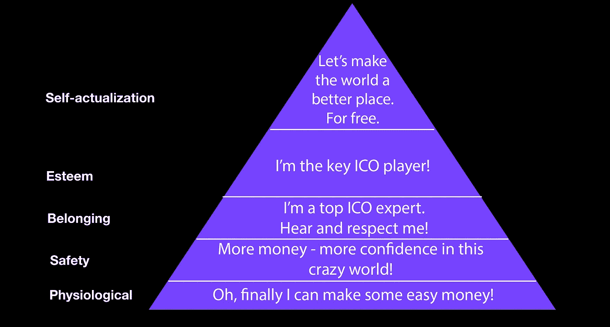

# ICO 发布:你创意的真实价格

> 原文：<https://medium.com/hackernoon/ico-launch-the-true-price-of-your-idea-52dcc61587d4>

*鉴于即将到来的黑色星期五和网络星期一，*[*NinjaPromo*](http://ninjapromo.io/?utm_source=medium&utm_medium=article&utm_campaign=icolaunch)*决定看看销售的另一面，算算，推出自己的 ICO 要花多少钱。*

许多企业家仍然认为 ICO(首次公开募股)是为他们的区块链项目融资的一种简单方式，尽管它今天受到了打击。一个人的 ICO 的成功取决于很多因素，并不是所有因素都能直接影响。但是从长远来看，适当的准备可以减轻一些风险并增加总体结果。

所以，你终于准备好把你的想法变成一个真正的加密项目。你需要多少钱买 ICO？

# **ICO 推出的基本需求**

在你把钱放在桌子上之前，有一些计划要做。

在你确立了你的想法之后，你需要找到那些愿意分享他们的时间和资源来支持你的项目的人。那些在相关领域有适当能力而你没有的人会是你最大的合作伙伴。在开发的后期阶段，你的团队、顾问和大使也是如此。

你必须支付的总费用至少包括雇佣员工、技术开发、法律支持、市场营销、公共关系、投资者关系。

但是让我们来看看数字。

# **你的钱包应该有多厚？**

很难说推出 ICO 到底要花你多少钱。只花 20 万美元，你就可以幸运地变得非常成功。或者，你可以向这个项目投入 100 多万美元，但几乎不收回任何资金。

但是总的来说，专家们同意在每个步骤的个人水平上花费一定的范围。

> **技术发展**

在谈论技术之前，讨论任何其他问题都是没有意义的。这是任何加密相关项目的核心，其成本应该放在第一位。

有趣的是，有时它们并不是 ICO 中最大的。仅在技术上花费大约***25，000 美元到 100，000 美元*** 是很常见的。该成本还包括代币销售平台、KYC 系统等的开发。

> **法律覆盖范围**

ICO 在世界各地的每一个法律框架中仍然没有准确的定位。时至今日，密码规则发展迅速。建立你的公司，开发你的技术，创建适当的与令牌相关的文档等等——所有这些仍然会导致崎岖的道路。

因此，你需要一个能够驾驭不断变化的环境并适应它们的团队。这使得法律团队成为 ICO 最大的开支之一。你将为或多或少受保护的项目支付的最低合理价格约为 50，000 美元，但仅法律保险就花费***【100，000 美元到***200，000 美元通常是可以接受的。

> N *注:当然你可以以低至 2 万美元的价格找到团队，但如果你想确保你的项目经受住第一次重创，你应该准备好增加法律支持的费用。*

> **白皮书**

任何 ICO 的必备之一就是它的白皮书。这是一份复杂的文件，应该清楚地解释区块链项目的所有细节，并以通俗易懂的方式向潜在投资者介绍其实际用途。这是给人留下第一印象的方式，也许是唯一的印象。

有很多估算，但它们都在合理的范围内***【5000 美元】—***10000 美元，但仅白皮书一项就花费高达 15000 美元的情况并不少见。价格取决于许多因素，其中包括:你的 ICO 项目的复杂性，技术作者的资格和它的长度。

> *注意:你的白皮书是你形象的重要组成部分。不要削减这些费用太多，这样你就不会以低质量的文件结束，而这些文件会在第一时间把你的潜在投资者拒之门外。*

> **网站**

今天，拥有一个有吸引力的、用户友好的网站对任何企业来说都是必须的。当然，你可以做一个相当简单的网站，花费不超过 5000 美元。但是区块链项目通常需要更复杂的资源，具有普通业务所不具备的特性和工具。

一般来说，ICOs 的网站开发费用大约在 10，000 到 20，000 美元到之间，这取决于你的需求。

> 注意:即使在现代条件下，独自开发一个网站不成问题——有大量的资源可以让你不需要钻研代码就能做到——最好还是有一个专业的网站开发者和网站设计师。他们拥有必要的技能，只会专注于尽可能做好网站，让你和你的合作伙伴去做更紧迫的事情。

> **网络安全**

由于整个区块链产业都是建立在网上的，所以安全问题是极其重要的。最常见的情况是，相关开发和活动的成本在***【30，000 美元】到***50，000 美元之间。

> **公关&营销**

ICO 高度依赖于它的社区和它的观众。因此，毫无疑问，总的来说，营销成本是 ICO 预算中最高的。但平心而论，还有很多工作要做:

各种媒体上的出版物；

付费搜索和营销；

SMM 与社区管理；

参加活动和会议。

考虑到所有这些支出，ICO 项目可能需要 ***从 4 万美元到 40 万美元*** 用于所有主要的广告方向。

> **团队、顾问、大使**

每个 ICO 的团队都需要专业人员。吸引不同地区的顾问和大使也是有意义的，这样他们可以帮助发展和公关。这里的费用因国家和其他因素而异，因此费用从 8 万美元到 20 多万美元不等。

# **结论**

那么我们学到了什么？

就像任何其他行业一样，总有办法花更多的钱。而且尽可能多的自己做工作总是可能的——甚至是所有的工作。但问题总是关于高质量和常识的结合。

最常见的发现表明，确保你的 ICO 发布成功的最便宜价格大约在 25 万美元到 30 万美元之间。如果你想尽可能地感到安全和有保障，并且仍然从你的想法中赚一些钱，你可以花费大约合理的**100 万美元**或更多——取决于你的区块链项目的具体特点。

*感谢您阅读本文！如果你喜欢它，请分享它，并告诉我们你对今天 ICO 发布费用的看法。另外，你可能会喜欢我们的其他故事:*

> [*-区块链影响者营销手册*](https://hackernoon.com/influencer-marketing-fdff540b092e)
> 
> [*——ICO 为什么需要它的社群，如何关注它*](/@NinjaPromoAgency/why-crypto-community-matters-and-how-to-focus-on-it-ebd2d293c94)
> 
> [*——在推销你的加密项目时，因为显而易见而被你忽视的事情*](/@NinjaPromoAgency/things-you-neglect-because-they-are-obvious-while-marketing-your-crypto-project-4100cf3bef05)