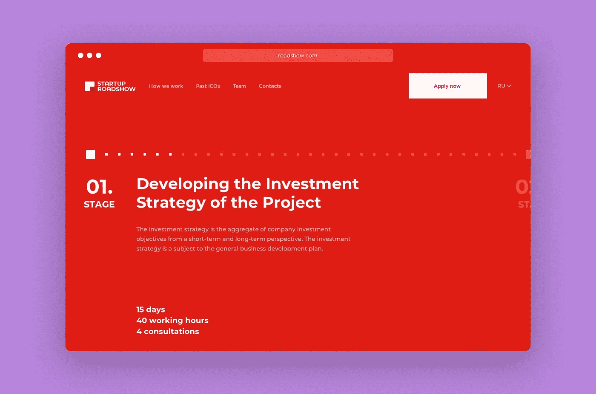
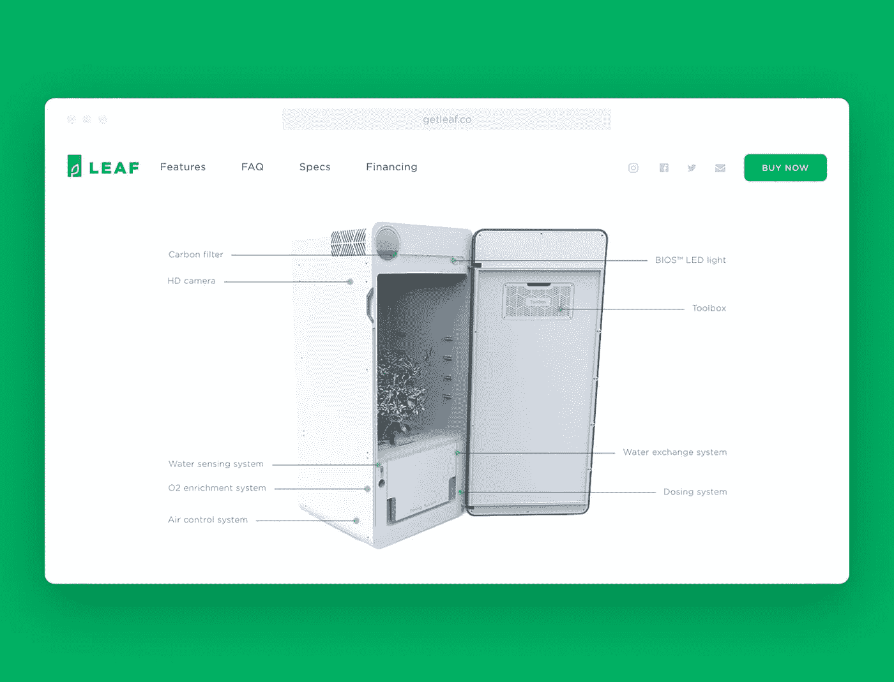

# ICO 营销。准备推出 ICO 的人员的清单

> 原文：<https://medium.com/hackernoon/ico-marketing-checklist-c1f7eb0fc58c>

在项目开始前或进行过程中，在没有营销策略的情况下开始首次发行硬币(ICO ),仅仅是迈出第一步并不是一个好主意。你的网上声誉是建立 ICO 网上活动的基础。我们最近一直在与几个 ICO 项目合作，帮助他们为投资者创建带有个人文件柜的登录页面。在文章中，我将分享我们的想法，开发一个快速和经济有效的方式来组织一个 ICO 营销活动。

# 1.详细的白皮书

ICO 白皮书是一份解释和推销你的想法的文件。以下是一个基本结构，列出了您应该回答的问题:

## 项目

从描述你项目的总体想法开始。为什么世界需要它？对某人有帮助吗？用什么方式？记得讲述你的故事:写下这个项目的想法是如何实现的。

## 问题

把重心从众筹转移到解决问题上。专注于你的项目要解决的主要问题，以及它如何改变游戏。人为什么需要投资？为什么行业需要你的项目？

## 解决办法

描述你的项目如何解决现存的问题。它给投资人带来了什么好处，行业有哪些可以改变的地方。

## 市场的独特性和状态

强调你的产品与现有解决方案的不同之处。用分析材料和报告收集关于目标和潜在市场的信息。

## 产品

描述当时产品的现状。是代码还是 MVP(最小可行产品)？是开源的吗？有没有可能在 Github 上看一下？

## 代币经济与需求

描述财务模式、融资策略，并指定是否已达成第一笔销售和合同，以及是否共享可能需要的数据。

## 团队

这是建立信任的关键。介绍主要领导、他们的教育和经验。他们是否拥有行业专业经验或加密货币专业知识，有助于 ICO 取得成功？项目是否得到行业内各大公司或有价值的公众人物的支持？

## 投资

告诉你的投资者，你计划给这个项目投入多少资金，发行多少代币。证明初始代币价格是如何确定的，以及未售出的代币将会发生什么情况。哦，那奖金呢？你的投资人会因为支持你而获得任何奖金吗？

不管你的 ICO 白皮书是 10 页还是 100 页。但是你的文档越长，就越容易迷失在细节中。

> 快速提示:将您的 ICO 白皮书翻译成多种语言。

# 2.ICO 营销的网站或登录页面

当在网站上为你的 ICO 活动工作时，不要跳过发现阶段。弄清楚市场的现状，确定你的主要竞争对手，以及他们如何推广他们的活动；做一个 SWOT 分析来增加你实现目标的机会。拥有一个值得信赖的网站可以让你一举两得。

**确定目标受众。**网站流量充满洞察力，使用谷歌分析或其他工具来了解它们。

**市场验证。**在你的网页上添加一个表格可以帮助你收集一个发布前的列表，并判断人们是否关心你的项目。

**介绍产品。**描述它的功能、技术特点以及它如何能对你的目标受众有所帮助。

**介绍一家初创公司。**告诉你的投资者你公司的成就，你 ICO 活动的目的，以及他们将合作的团队。

**传播品牌。**最后但同样重要的是，增加对你的 ICO 活动的忠诚度，吸引投资者。

*Landing Page of the Startup Roadshow*

我们已经帮助了许多初创公司进行 ICO 营销，我们相信在你的网页上包含以下部分和工具可能有助于建立信任。

*   图表和最新数据。展示你之前 ICO 成功的统计数据。
*   计算器。显示当前的代币成本，以及投资者在一段时间内将从每个代币中获得多少收益的预测。
*   硬件产品的 3D 模型。如果你的产品是一个物理设备，一个 3D 模型将允许用户详细地观察它并与产品互动。

*3D model of the LEAF growbox*

# 3.接收加密货币的投资者个人柜

个人文件柜的主要目的是简化 ICO 流程管理。PC 对于 ICO 投资人和 ICO 创始人都是必不可少的。它允许投资者实时跟踪每一笔加密货币转账，并确保透明度。对于 ICO 创始人来说，上述个人内阁意味着工作的自主权。例如，激活奖金累积的自动设置，以及代币价值变化的实时统计。

*Investor personal cabinet*

# 4.拓展你的投资者和媒体

与媒体分享你的 ICO 项目，开展电子邮件营销活动，鼓励尽可能多的人投资。有几种资源可能会派上用场:

*   [HARO](https://www.helpareporter.com/)
*   [旅行请求](https://www.journorequests.com/)
*   [源瓶](https://www.sourcebottle.com/)

并非每个成功的 ICO 项目都遵循上面列出的所有步骤。但是你做得越多，你的项目就越强大，你的受众就越多。做好 ICO 众筹，我们永远[在这里帮](https://goo.gl/tXvxub)。