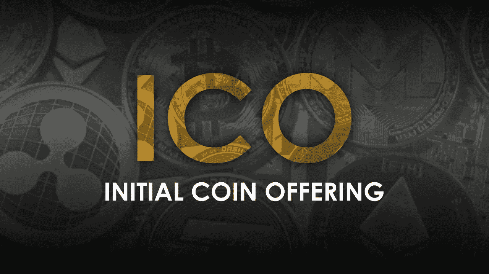

# ICO:金融世界的蜕变

> 原文：<https://medium.com/hackernoon/ico-metamorphosis-of-the-financial-world-a7bf14623408>

在加密货币领域，初始硬币发行更好地称为 ICO，是一个公司出售数字令牌以筹集各种运营资金的过程。首先，该公司向投资者提供一定数量的代币，以换取其他加密货币，如比特币或以太坊或其他一些法定货币。

2017 年首次发行硬币筹集了超过 65 亿美元，其中一家公司在短短 30 秒内筹集了 3500 万美元。脸书花了 7 年时间从投资者那里筹集了 10 亿美元，优步花了 5 年时间才筹集到同样的资金，Block.one 的项目 EOS 仅用了 9 个月就用 ICO 超过了这个数字。由于涉及如此巨额的资金，远离 ico 已变得不可或缺。

参与者可以购买代币，这使他们在以后的日子里可以特别使用该产品的服务。投资者可以在发行期间购买代币，如果企业成功，代币的价值就会上升。在首次发售期间，代币的价格通常低于产品成功后的价格。

在这个 ICO 数量与日俱增的时代，找到合适的 ICO 进行投资，远离不靠谱的，是当务之急。首先要确保上市公司是合法的。在网上快速搜索一下这家公司及其团队成员，你会对它有一个清晰的认识。确保该公司有一个适当的专用办公空间，并且不是最近才设立的。请高度关注白皮书，确保它不会承诺购买后立即获得意想不到的回报。警惕庞氏骗局或传销。

最后也是最强有力的检查是确保公司有工作产品或技术诀窍和[技术](https://hackernoon.com/tagged/technical)专业知识来交付承诺的产品。

关注我们的社交媒体频道-

[脸书](https://www.facebook.com/Whyral.io/) [推特](https://twitter.com/whyral_official) [LinkedIn](https://www.linkedin.com/company/whyral/) [电报](https://t.me/joinchat/F4jtxhI7hvtbP48aGpINDw) [不和](https://discordapp.com/invite/atG8R9K) [Youtube](https://www.youtube.com/channel/UCrjc0sGAhsZSFzeRWM4Lpog)