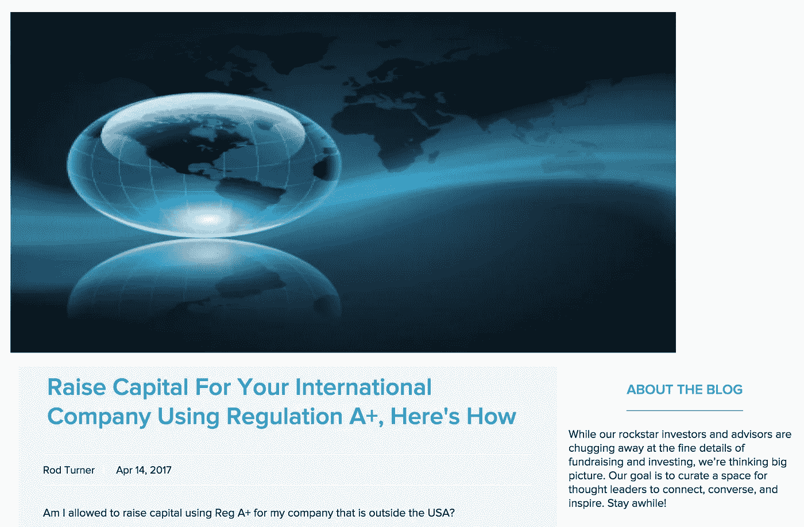

# ICO 还是 STO:谁赢了？

> 原文：<https://medium.com/hackernoon/ico-or-sto-who-wins-fd43c3ee7b8d>

ICO or STO: Similar in appearance, but different in ideology

加密货币领域目前正在进行一场术语之战:ICO 还是 STO？

根据普华永道和瑞士密码谷协会的[报告，2017 年 ico 的爆炸式增长已经在 2018 年上半年翻了一番，今年 ico 筹集了超过 137 亿美元。尽管传统的风险资本交易仍让这些数字相形见绌，但这种快速扩张的融资模式震惊了金融界，甚至让最老练的投资者也睁大了惊讶的眼睛。](https://cointelegraph.com/news/pwc-report-finds-that-2018-ico-volume-is-already-double-that-of-previous-year)

然而，尽管 ICOs 取得了非凡的成功，但已经有一种新的模式正在兴起，这种模式被称为安全代币发行，或 STO。

在取得如此多的成功和令人难以置信的庞大数字后，你可能会认为 ico 会继续保持增长势头。即使投资者不了解底层技术，他们也能理解一种趋势，随着每一个新的 10 亿美元的筹集，你可以期待更多的投资者探索 ICO 机会。这既是对经济学的探索，也是对行为科学的探索。问题？美国证券交易委员会(SEC)等监管机构表示，ico 是一个问题。

问题是这样的。ICOs 被认为是公司将他们的协议令牌送到用户手中的伟大策略。这是一个处于早期阶段的结构。专家们仍在研究代币经济学的好处，但前景是存在的。理论上，令牌经济学可以通过奖励用户参与来改善网络效果，也可以通过让最活跃的用户在协议的未来决策中有更大的发言权来创造更好的治理。相当酷。当然，还有其他好处，但这是另一篇文章的主题。

在这个用例场景中，协议建立，网络运行。令牌被分发给消费者，以便在平台内立即使用。我们谈论的是功能令牌的数字销售，即具有实用性的实用令牌。

然而，现实是大多数 ico 都是这些代币的预售。它们还没有发挥作用。事实上，到目前为止，大多数 ico 的目的都是为了筹集资金，以便相关公司可以建立使用这些令牌的协议。

在这种情况下，实用程序令牌没有任何用处，因为使用它们的应用程序不存在。没有分散，因为分散协议不存在。这些钱将流向企业，流向特定的个人。令牌的用例是假设性的，除了参与项目的个人的承诺之外，没有人保证该实用程序将来会存在。

承诺并不是保证。

看看最近很多以太坊去中心化的应用，你会发现虚拟鬼城。即使启动了协议，并且令牌实现了某种形式的效用，市场也可能对令牌的功能方面不感兴趣，因此分散式应用由于不能吸引用户而逐渐消失。

那么，投资者为什么还要购买代币呢？问题的关键是流动性和投机。通过 ICOs，投资者购买的代币可以立即在世界各地的加密交易所进行交易。作为一名投资者，我可以在上午以 1 美元的价格买入代币，下午以 1.3 美元的价格卖出。有一些日内交易者在公开市场上以股票交易为生，这种投资行为是当前加密货币市场的驱动力之一。

这种投资行为是一种游戏，一种赌博形式，最重要的是*一种赚钱的方式*。对于敬业的人来说，足够维持生计，对于闲散的人来说，足够花钱。

在一个已经被广泛报道的话题中，SEC 将这些 ico 中的大部分视为证券销售，而不是公用事业，原因如上所列，包括[豪威测试](https://consumer.findlaw.com/securities-law/what-is-the-howey-test.html)的一般参数。这些普通投资者正在参与一个充满骗局、欺诈和幕后预售交易的泡沫市场，他们没有任何保护。证券交易委员会非常关心*保护投资者，这也是联邦安全法的目的。*

鉴于市场的不确定性、监管的缺乏、明显的欺诈和投机行为，以及 SEC 的警告，科技行业内部对 ico 产生了反弹。首先，脸书在一月份禁止了与 ICO 相关的广告。然后谷歌[在三月](https://www.coindesk.com/google-to-ban-cryptocurrency-ico-ads-from-june/)宣布 ICO 广告将在六月开始被禁止，Twitter 和 Mailchimp 紧随其后..显然,“ICO”这个术语本身就产生了问题。一定有别的办法。

**进入 STO**

An article dating back to April 2017 that mentions an STO

我能找到的第一次提到 STO 这个词是在 Manhattan Street Capital 的一篇[博客文章中，可以追溯到 2017 年 4 月 14 日，但当然 STO 的想法早在这个特定术语出现之前就已经酝酿了。追溯到更早的时候，您可以找到对受监管 ICO、ICO 2.0、令牌产品甚至“ICO”的提及，这些 ICO 不是通过名称而是通过结构来区分自己。所有这些都是指相同的产品结构，只是名称不同。](https://www.manhattanstreetcapital.com/blog/rodturner/raise-capital-for-your-international-company-using-regulation-heres-how)

STO 与 ICO 的相似之处在于，企业向大众提供产品，消费者购买基于区块链的加密令牌，但除此之外，两者没有太多相似之处。ico 是出售硬币、所谓的公用事业甚至货币，而 sto 是出售证券。

STO 参与者是投资者，而不是用户，他们支付并接收由代币代表的证券(即股权、债务、收入份额等)。为了向大众出售证券，一家公司必须在美国证券交易委员会(SEC)注册(既困难又昂贵)或使用豁免注册。

s to 通常是通过一项名为 D 506(c)的豁免来完成的，该豁免是向合格投资者(任何净资产超过 100 万美元或过去两年年收入超过 20 万美元的人——配偶年收入合计 30 万美元)公开发行证券。这一规定意味着公司可以向公众募集资金，但潜在投资者在参与 STO 之前必须核实他们的资格。

s to 的另一个受欢迎的选择是使用豁免监管众筹，这是一种面向公众的产品，这意味着经认证和未经认证的投资者都可以参与发行，但有一点需要注意的是，一个 STO 在一年内可以筹集的资金是有限制的，上限是 107 万美元。

STO 可以使用的最后一个重要豁免是监管 A+，像监管众筹一样，允许人群中的每个人参与，但年度限额增加到 50，000，000 美元。除了更高的发行上限，发行还必须通过 SEC 的审核，这与其他豁免不一样。迄今为止，还没有一个 STO 通过了 SEC 的认证，但我希望这种情况会很快改变。

原因很简单:这是从公众筹集资金的黄金标准，在交易 s to 发行的证券代币时没有锁定期，这意味着我可以在同一天买入和卖出我的证券，就像你目前可以使用加密货币一样(而 D 506(c)法规和众筹法规在这些代币可以交易之前有一年的锁定期)。

随着市场变得越来越复杂(理解为:更少的骗局和欺诈)，投资者将表达对安全令牌的更大需求，因为它们提供了治理和保护。谁不想要这个呢？

大多数 ico 投资者不希望这样，因为他们喜欢自称为“交易所”且不受监管的网站的即时流动性。这些平台的成本很低，如果有成本的话，因为公司没有任何监管或规则的负担，因为他们会带任何人和任何人交易任何东西。KYC 和反洗钱等概念是业内关于识别投资者的常用术语，对他们来说是陌生的，或者被认为是不相关的。

这些不受监管的交易所还存在其他风险，投资者可能会被利用。其中包括:

*   **抢先交易**，一家公司或个人在投资者之前交易(这是可能的，因为他们可以在投资者的决定被加入区块链之前看到投资者的购买决定)，然后在价格上涨时抛售股票以获利
*   **拉高抛售**，一群投资者串通起来购买大量代币，以推高价格。一旦价格达到一个商定的点，抽水和倾倒计划倾倒他们的硬币，推动价格回落，伤害了被虚假势头欺骗的投资者
*   **画胶带**，或称为清洗交易，一群投资者在他们之间来回交易，以创造流动性的假象。

如果你给他们一个交易的地方，许多投资者都可以接受。太神奇了！

来自 sto 的证券令牌将在另类交易系统或经纪自营商那里交易，这些交易由 FINRA 密切监督，并在 SEC 注册。这些 ATS 和经纪交易商的成本很高，因为需要进行监管，任命首席合规官，培训每个关键员工，参加所有必要的 FINRA 考试，遵守数千条规则，最后为员工为公司带来履行这些职能所需的经验和技能支付报酬。

Movies have taught us that the good guys ride off into the sunset.

当前的加密“交换”不需要做这些。相反，他们雇佣一些优秀的程序员来构建平台，同时保持投资者的低交易费用。与守法者相比，选择无视法律的人显然拥有不公平的优势。这将如何得到解决？故事的这一部分仍有待讲述，但最终我们只能希望好人会赢。毕竟，好莱坞是这么告诉我们的。

StartEngine 是一个领先的股权众筹平台，已经帮助 250 多家公司筹集了超过 8000 万美元。我们目前也在筹集资金。加入已经投资我们的近 3500 名 StartEngine 所有者。 [*这里投资 start engine*](https://www.startengine.com/own?utm_source=Medium)*。*

*欲了解更多信息，请查看我们的* [*发行通告*](https://www.sec.gov/Archives/edgar/data/1661779/000114420419013344/tv515967_253g2.htm) *。*