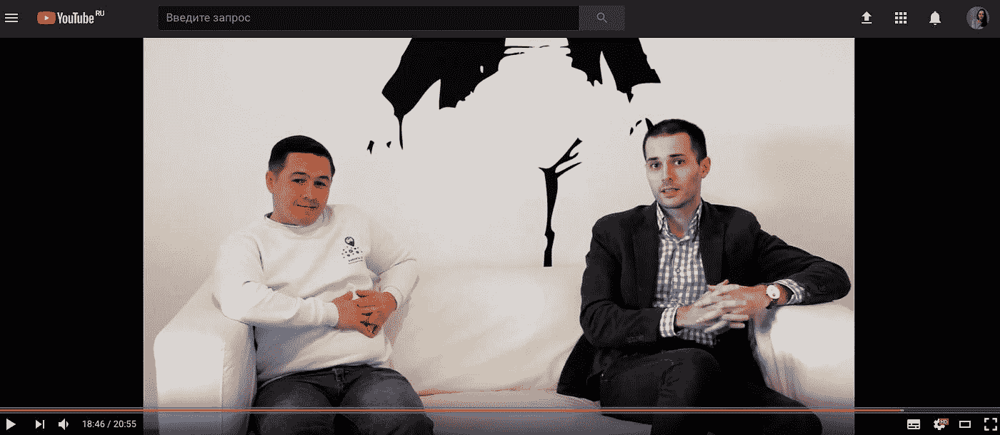
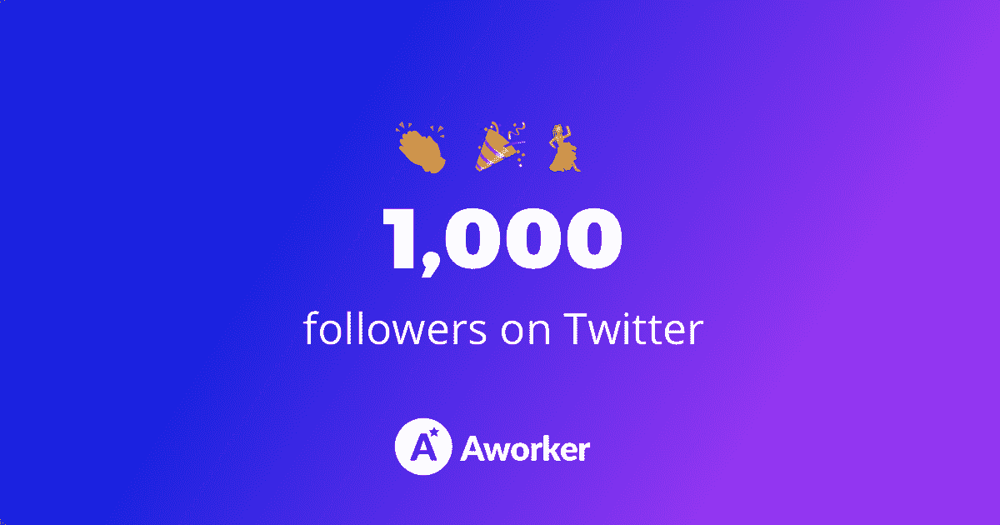

# 第 18 周报告

> 原文：<https://medium.com/hackernoon/ico-report-week-18-9215e72b91c6>

3 月 5 日至 3 月 12 日

本周我们有了新的激动人心的会议。在报告中了解更多信息。

上周的主要事件:

1.  团队中的新顾问
2.  达人塔 CEO 视频访谈
3.  HackerNoon 上的出版物
4.  推特上有 1000 名粉丝
5.  关于新上市的出版物

# 团队中的新顾问

我们很高兴地宣布一位工人顾问委员会的新成员，Dmitry Lyamenkov。他是 [ICOBox](https://icobox.io) 的商业分析师。营销专业人士，从事[加密货币](https://hackernoon.com/tagged/cryptocurrency)交易 2 年以上。他已经参与了 7 次成功的代币销售(Crypterium、ICOS、INS、Universa、Play2live、Socialmedia。市场，微货币)。

# 达人塔 CEO 视频访谈

上周，我会见了达伦塔公司的首席执行官奥列格·格里巴诺夫。我们在 ICOBox office 中录制了采访，并讨论了加密市场中当前的主要问题。

这里可以看采访[。](https://www.youtube.com/watch?v=20gk-3jvlcM)

# HackerNoon 上的出版物

今天招聘的游戏不好。这是我最近在《黑客正午》上发表的文章的主题。在文章中你会发现:

*   佛罗里达州的初创公司 Magic Leap 开发了未来 AR 眼镜
*   他们与名为汉普顿集团的招聘机构的关系
*   如何避免招聘中的欺诈计划

这里可以阅读全文[。](https://hackernoon.com/bad-game-in-todays-recruitment-d1ccf6dc1acf)

# 推特上有 1000 名粉丝

我们达到了另一个里程碑，Twitter 上的第一批 1000 名粉丝。感谢大家支持我们的项目！我们将继续努力，创造出伟大的产品！

# 关于新上市的出版物

很高兴看到一个工人如何增加其在列表中的存在。

本周我们出现在这些网站上:

*   [去哪里投资](https://wheretoinvest.money/aworker-ico-review/)
*   [基金会](https://foundico.com/ru/ico/aworker.html)

敬请关注更多更新！如果你不想错过关于一个工人的最新消息，订阅我们的官方网站。

请随时联系我们，并确保关注我们在[电报](http://t.me/aworkerio)(英语)[推特](https://twitter.com/aworkerio)(英语)[脸书](https://www.facebook.com/aworkerio/)(英语)的下一次更新。