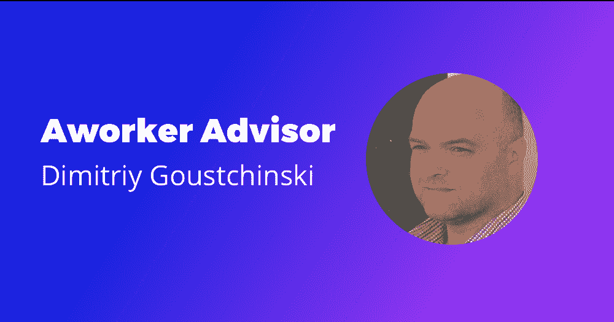
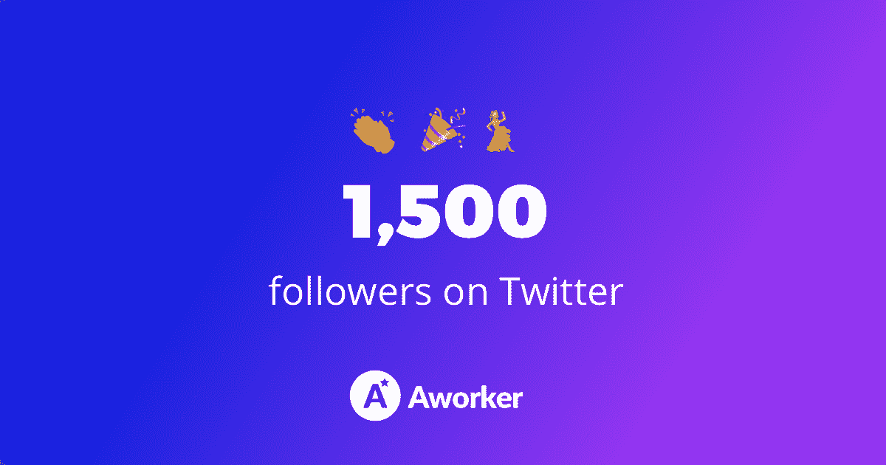

# 第 19 周报告

> 原文：<https://medium.com/hackernoon/ico-report-week-19-200635f1484b>

3 月 13 日至 3 月 20 日

本周我们录制了几个[采访](https://hackernoon.com/tagged/interviews)并且有了新的令人兴奋的会议。在报告中了解更多信息。

上周的主要事件:

1.  团队中的新顾问
2.  电台采访
3.  CBDO 本土视频盒子视频访谈
4.  推特上有 1500 名粉丝
5.  [一名工人](https://hackernoon.com/tagged/aworker)视频回顾
6.  关于新上市的出版物

# 工人团队的新顾问

我们很高兴地宣布 [Alex Linenko](https://icobench.com/u/alex-linenko) ，区块链的爱好者、企业家和加密经济的实践专家，以及 [Dimitriy Goustchinski](https://www.linkedin.com/in/finist4x/) ，来自明斯克的区块链顾问和分析师，成为 Aworker 顾问委员会的一员，帮助该项目建立招聘行业最强大的生态系统。

Alex Linenko 从事 10 多个成功 ico(plus coin、Crypterium、Medichain、Nvb.digital、Bitrewards、Gem4me、NWPsolutions 等)的令牌化和战略管理工作。).点击查看关于我们合作的报道[。](/@aworker/aworker-welcomes-a-new-member-in-advisory-board-866593fb3030)

Dimitriy 是管理合伙人 [7btc.me](http://7btc.me/) 和 CAPCHECK/ [CRYPTA.WORK.](http://crypta.work/) 创始人，他负责该产品的市场开发和业务架构。迪米特里已经从事网络营销 7 年了。点击阅读更多关于 Dimitriy [的信息。](/@aworker/new-advisor-in-aworker-project-2cdebd7810ff)

# 在加一电台的采访

最近，我在 [Plus One Radio](http://plusoneradio.com/) 上发表了一篇关于加密市场现状的专家意见。这是纯粹的俄语，但我希望你能听到一些！

特别感谢电台的邀请，希望在不久的将来我们能再次合作。

# CBDO 本土视频盒子视频访谈

上周，我会见了达伦塔的 CBDO·帕维尔·瓦辛。我们在 ICOBox office 录制了采访。

[原生视频盒子](https://nvb.digital)是一个去中心化的视频分发平台，使用基于多层区块链和深度机器学习的原生视频广告。

你很快就可以看采访了。

# 推特上有 1500 名粉丝

我们达到了另一个里程碑，Twitter 上有 1500 名粉丝。感谢大家支持我们的项目！我们将继续努力，创造出伟大的产品！

# 工人视频评论

最近，昵称为 Alex Coin 的 Youtuber 对一个 worker 项目进行了评论，描述了它的优势和竞争优势。你可以在他的 [Youtube 频道](https://www.youtube.com/watch?v=LGV-4AI_4gk&t=6s)观看完整视频。

# 关于新上市的出版物

很高兴看到一个工人如何增加其在列表中的存在。

本周我们出现在这些网站上:

*   [CoinWire](https://www.coinwire.com/aworker)
*   [ICONow](https://iconow.net/new-ico-vectorzilla-aworker-%D0%B5%D1%81%D0%BEs/)

敬请关注更多更新！如果你不想错过关于工人的最新消息，请订阅我们的官方网站。

请随时联系我们，并确保关注我们在[电报](http://t.me/aworkerio)(英语)[推特](https://twitter.com/aworkerio)(英语)[脸书](https://www.facebook.com/aworkerio/)(英语)的下一次更新。