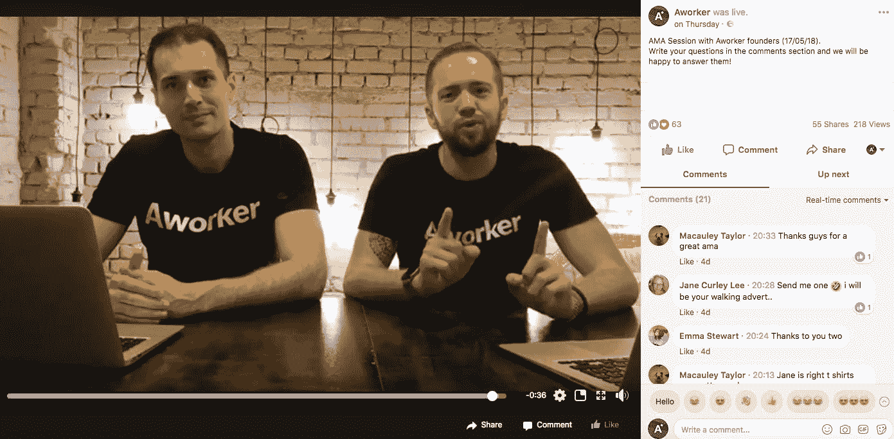
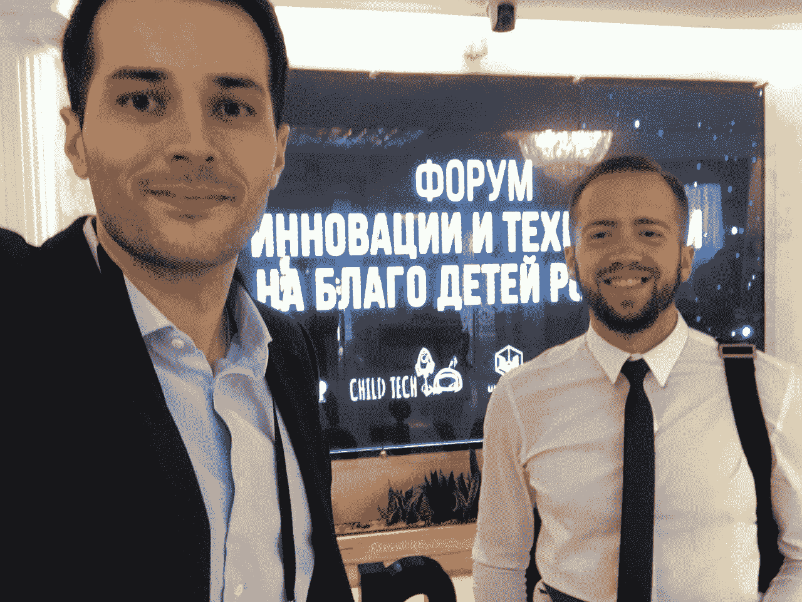
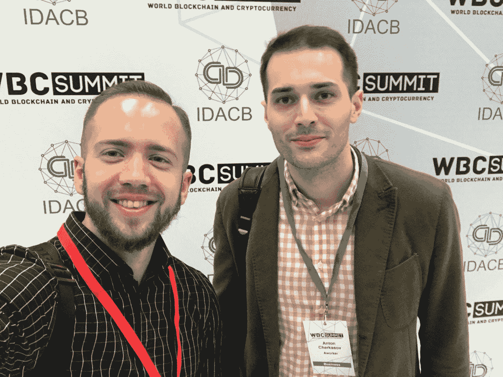
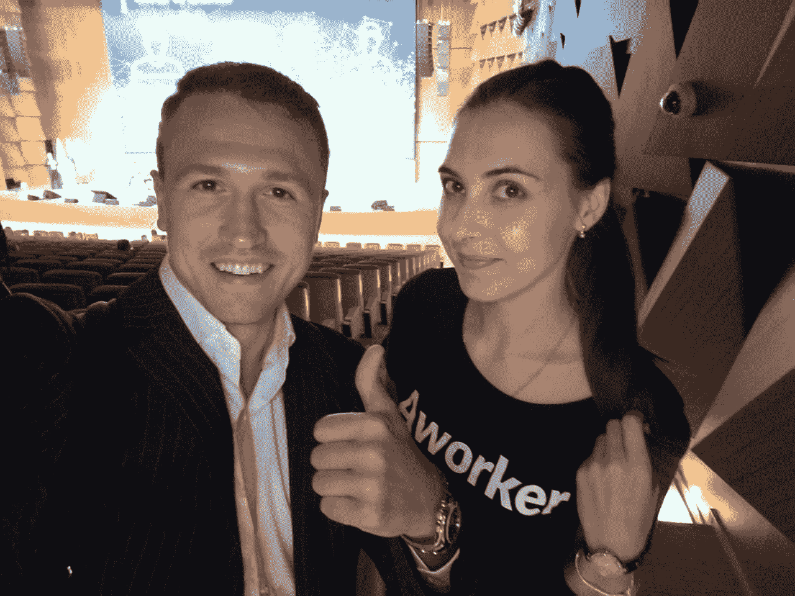
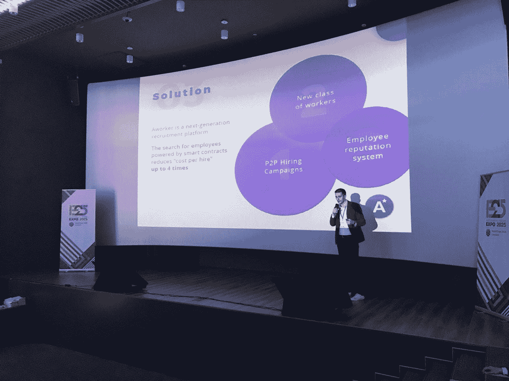
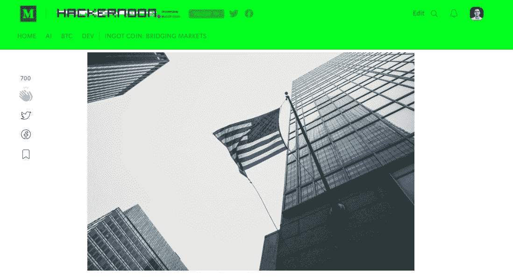
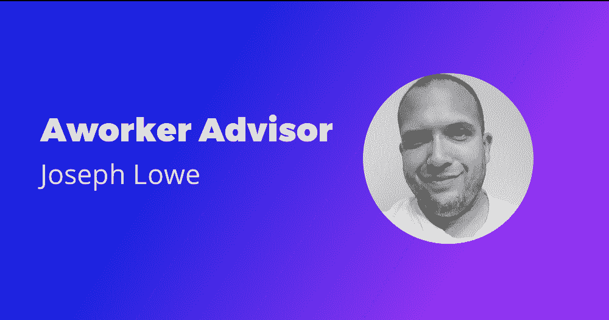

# 第 28 周报告

> 原文：<https://medium.com/hackernoon/ico-report-week-28-301c6177870c>

5 月 16 日至 5 月 22 日

希望一切都好，伙计们。一个员工团队度过了疯狂的一周，参加了四场[区块链](https://hackernoon.com/tagged/blockchain)会议和黑客马拉松，AMA 会议，以及更多令人兴奋的活动。在报告中找到更多关于它们的信息。

本周重要事件:

1.  与工人创始人的 AMA 会议
2.  人力资本大会上的一名工人首席执行官
3.  世界区块链峰会上的一个工人团队
4.  《哈克农报》上的出版物
5.  今日分散出版
6.  约瑟夫·洛是顾问委员会的最新成员
7.  在快网上发表
8.  视频评论
9.  在新列表中发布

# 与工人创始人的 AMA 会议

上周四，我和我的同事、人力资源合伙人兼联合创始人迈克尔·巴科夫在[脸书直播](https://www.facebook.com/aworkerio/videos/1746746228746452/)上参加了 AMA 会议。我们讨论了最近的工作新闻，并回答了电报会员最关心的问题。

你可以在[新的工作人员 Youtube 频道](https://www.youtube.com/channel/UCvAhBBAN67yZnZyVFI6v59w)上找到之前 AMA 会议的所有视频。

我们也有很多关于 t 恤的问题，所以我们正在考虑为你做更多！

我想感谢每一个参加我们会议并在会后观看我们视频的人。我们将会更频繁地进行这些直播，敬请关注！

# 人力资本大会上的一名工人首席执行官

最近我以专家的身份参加了[人力资本大会](http://human-capital.sci-guide.com/)，对人力资源行业的项目进行评估。我还在会议的嘉宾面前发言，这很酷，因为我喜欢听到观众提出有趣的问题，我很乐意回答。我要感谢这次盛会的组织者和所有参加的人！

# 世界区块链峰会上的一个工人团队

这个周末我们去参加了[世界区块链和加密货币峰会](http://wbcsummit.org/)，包括我自己在内的一个工作核心团队的成员。这是一个为期两天的会议，来自不同行业的区块链动力项目和密码爱好者，包括俄罗斯联邦总统的顾问，聚集在一个地方。

我们遇到了很多有趣的人，我们希望在未来与他们合作。我还做了一个演讲，讲述了随着区块链技术的实施，招聘行业的发展潜力。

这是这次活动的一些照片。

# 《哈克农报》上的出版物

*集权巨头转向分权——这就是为什么*

描述:最近 [CoinTelegraph](https://cointelegraph.com/news/amazon-microsofts-move-to-blockchain-centralized-companies-into-decentralized-ecosystem) 分享了关于微软和亚马逊考虑实施区块链的消息，尽管这违背了他们的中心价值观。这些公司根本无法忽视权力下放，因为很明显，区块链就是未来。

你可以在[杂志](https://hackernoon.com/centralized-giants-move-to-the-decentralization-here-is-why-a8c35ce1cbf9)上阅读全文。

*美国梦:在美国哪里找工作*

描述:每年都有成千上万的人飞往美国，为自己创造更好的生活，寻找更好的工作。你可能已经注意到了，并不是所有人都成功了。要保持领先地位，给自己一个争取被录用的机会，你需要的不仅仅是一份脸书简历。你需要活跃在最好的求职网站上。

你可以在[杂志](https://hackernoon.com/american-dream-where-to-find-a-job-in-the-united-states-c3d87795af28)上阅读全文。

# 关于今日分权的出版物

我最近发表了一篇文章，标题是:*‘新加坡两名男子面临 400 多项招聘骗局的指控’*。

说明:商务司和人力部指控两名新加坡男子经营虚假就业公司，从外国求职者那里骗取费用。

39 岁的 Terry Tan-Soo I-Hse 和 30 岁的 Clarence Lim Jun Yao 面临总共 442 项指控，罪名是利用三家诈骗公司**从 300 多名外国求职者**那里收取费用**来从事并不存在的工作**。

要阅读完整的故事，请访问[今日分散](https://decentralize.today/two-men-in-singapore-face-more-than-400-charges-for-recruitment-scam-b16b64cbf152)。

# 最新的工作顾问:约瑟夫·劳

我很兴奋地宣布工人顾问委员会的新成员，约瑟夫·洛。

[Joseph Lowe](https://www.linkedin.com/in/j-lowe/) 是区块链委员会认证的加密货币专家。2017 年 10 月至 2018 年 2 月 Joseph 被任命为 CoinHealth Community 的策略师，coin health Community 是一家创新的区块链初创公司，致力于去中心化 EHR、生物识别可穿戴设备，并通过游戏化体验中的象征性奖励来激励用户变得更健康。2018 年 4 月，约瑟夫加入陪审团。在线作为仲裁者。作为认证专家。他不只是名义上的顾问，但他有经验、证书和可靠的背景。

凭借成功启动的历史，Joseph 可以帮助员工改进当前的营销策略，并在项目开发的其他方面提供有价值的建议。

在我们的媒体博客中阅读完整版本[。](/@aworker/joseph-lowe-is-the-newest-aworker-advisor-1244ed1e39d9)

# 每日金融科技评论

最近，我们在 www.qukuaiwang.com.cn[的中文网站上找到了一篇关于工人的评论，能在国际上看到关于工人的言论总是很棒的。](http://www.qukuaiwang.com.cn/)

[你可以在这里阅读全文](http://www.qukuaiwang.com.cn/news/9082.html)。

# 视频评论

Youtube 上一个关于俄罗斯有前途的项目的频道对一名工人进行了评论。在视频中，作者浏览了一份工作人员的单页报告，并解释了该项目的主要优势及其颠覆招聘行业的潜力。

可以在 [Youtube](https://www.youtube.com/watch?v=vX1ZquvBIRw) 上观看完整视频。

# 关于新上市的出版物

很高兴看到一个工人如何增加其在列表中的存在。

本周我们出现在这些网站上:

*   [世界新闻](http://wcoinnews.com/ico/aworker-work-ico-rating-details/)
*   [bitcoinnews](https://www.bitcoinnewss.com/ico/aworker/)

感谢您抽出时间阅读这份报告！