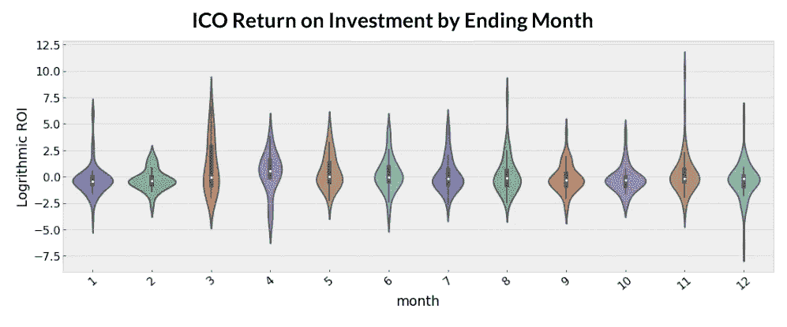
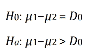

# 研究显示，ICO 回报不受熊市影响

> 原文：<https://medium.com/hackernoon/ico-returns-are-unaffected-by-bear-markets-research-shows-fcd7f6dd3946>

# 1.介绍

## 不同市场条件下 ICO 绩效的统计分析

在过去的几个月里，Lunar Digital Assets 的数据科学团队对 ICO 在各种市场波动中的表现进行了分析。直觉可能会让典型的散户投资者相信，一个 ICO 在牛市中会比在熊市中表现更好(在没有任何特定方向的稳定市场中)。

## 对 288 名秘密投资者的调查

在这项研究的想法开始时，我们很想知道加密货币交易员和 ICO 投资者对牛市和熊市表现的看法。因此，我们向各种交易者和投资者网络提出了一个相当简单的问题。

正如大多数人所预料的那样，结果出人意料地有利于牛市。然而，值得注意的是，29%的受访者不同意大多数人的观点。(29%,因为选择“随时”的 12%也会投资牛市。)

事后看来，我们或许应该把“我不知道”加到选择列表中。

## 投资 ico 的最佳时机是什么时候？(调查结果)

*   牛市:171 次(59%)
*   中性市场:40 个(14%)
*   熊市:35 次(12%)
*   任何时间，不重要:33 人(12%)
*   从不:9 人(3%)

> 注意:这不是一项科学调查。

在本分析中，我们旨在通过统计分析和假设检验来证明或消除这种常见的观念。我们坚信，这项研究对相对年轻的加密货币和初始硬币发行市场特别有帮助，而传统金融市场有着更长的历史和既定的模式和趋势。

我们将尝试回答这个问题*每个人都认为他们知道，但并不真正知道*:**ico 真的——在统计上——在牛市中表现更好吗？**

# 2。数据抓取、清理& EDA

## 数据概述和探索性分析:在这个分散、年轻的市场中寻找可靠的数据可能具有挑战性。

这项研究的数据来自 [Coinist](https://www.coinist.io/) ，它提供了 457 个初始硬币的样本数据。虽然我们知道有更多的 ICO 进行，我们认为 457 是一个足够的大小，从中得出推论。Coinist 也是唯一一个容易获得投资回报信息的数据源(这些数据也经过了准确性抽查)，并且可以追溯到 2013 年，直到 2018 年 5 月进行这项研究时才获得数据。

作为分析的基础，我们将使用自 ICO 结束日期以来每枚硬币的投资回报率(ROI)作为投资业绩的衡量标准。由于 ico 的投资回报率各不相同，我将使用每个硬币投资回报率的通用对数函数(以 10 为底)作为合理的比较方法。当我们关注不同市场条件下的相对表现，而不是相关的标量值时，这一点尤其有用。

## 捕获的数据

1.  硬币名称
2.  1 小时百分比变化
3.  24 小时百分比变化
4.  每周百分比变化
5.  ICO 日期(代币销售的最后一天)
6.  ICO 价格
7.  当前价格
8.  ICO 投资回报(ROI)

## 数据清理

除了硬币 APX 的一个贴错标签的日期外，我们没有发现任何重大的数据问题。ICO 日期定为 1970 年 5 月 21 日。在与其他来源进行交叉参考的同时，我们将 APX ICO 的日期确定为 2017 年 5 月 21 日。

异常值:NXT 的整体投资回报率约为 24，000%，这是进行适当比较和分析的一个障碍。尽管是一个显著的异常值(下一个表现最好的是以太坊，约为 1，900%)，我们决定保留这个数据，并通过一个常用的对数函数对其进行正则化分析。

## 探索性数据分析

[EDA](https://www.itl.nist.gov/div898/handbook/eda/section1/eda11.htm) 的目标是从不同角度可视化数据，为进一步分析、异常检测和数据一致性收集更多见解。在这一部分中，我们将从较高的层次来可视化数据。首先，我们希望探索 ICO 的发展速度，并想象 ICO 作为一种资本融资方式的兴起:

我们看到 2017 年 ico 惊人但不令人惊讶的增长，随后是 2018 年年初至今的下降。然而，我们不会惊讶地看到 2018 年的年度价值超过 2017 年的期末记录。应该指出的是，正如预测的那样，自从 5 月份开始收集数据以来，ico 的数量正在稳步上升。

## 更多 EDA:可视化赢家和输家

将数据集分为输家(其中 ICO 的当前价格低于其 ICO 价格)和赢家(其中 ICO 的当前价格等于或高于其 ICO 价格)，显示输家(314)以几乎 2:1 的比率超过赢家(144)。

## 年度投资回报率

我们的数据集捕获了随后的年份以及该年持有的 ico 的相关数量。下面的 violin 图提供了按 ICO 年划分的 ROI 绩效统计描述符的直观总结:

Refer to below for key.

## 可视化键

*   **白点:**中值
*   **粗蜡烛:**四分位距
*   **细蜡烛须:** 95%置信区间
*   **宽度:**核密度估计

## 每月投资回报率

以月度为基础，在 4 月结束的 ico 有最好的中值表现，但也更有可能是除 12 月之外表现最差的月份。否则，基于月末的 ICO 表现似乎没有显著差异。

## 市场条件下的投资回报率

分析 ICO ROI 时要考虑的另一个重要区别是 ICO 是否发生在熊市、牛市或炼狱市场环境中。Fundstrat Global Advisors 的研究主管 Thomas Lee 利用了日期范围。还请注意，任何未包含的日期范围都被视为“炼狱运行”

在 ICO 数据集中应用日期范围，将每个 ICO 及其各自的 ROI 分类为属于牛市、熊市或炼狱市场。

**牛市**

06/17/2015–07/12/2015

02/07/2016–04/05/2016

03/18/2017–06/16/2017

11/12/2017–01/13/2018

**熊跑了**

07/13/2015–08/29–2015

04/06/2016–05/29/2016

06/17/2017–09/21/2017

01/14/2018–03/18/2018

任何不在上述范围内的 ICO 都被归类为炼狱。然后将日期范围应用于 ICO 数据集，以将每个 ICO 及其各自的 ROI 分类为属于牛市、熊市或炼狱市场。

当去掉视图的年维度时，该图表明中值 ROI 性能的差异非常小。

该图表明中值投资回报率表现差异很小，但一个非常奇怪的统计数据是，**牛市看到更多的负表现异常值**，炼狱市场看到更多的正表现异常值(可能是由于 NXT 的投资回报率，因为硬币在 2013 年的炼狱市场中大幅上涨)。

市场条件似乎对 ICO 的中值回报没有重大影响。现在我们可以继续看看，平均而言，ico 在牛市中的表现是否好于熊市。

# 3.方法和统计分析

## 中位数和平均数是不一样的！

用来证明我们假设的主要分析方法是使用 Z 检验的假设检验。为了适当地执行测试，我们要求数据的分布是单峰的和正态分布的。在我们的抽样方法中，样本量必须大于 30，并且我们的样本是独立的。

我们发现每个市场环境在牛市中包含 173 个 ico，在熊市中包含 143 个，在炼狱市场中包含 142 个。因此，我们的人口和随后的样本量将大于 30。此外，我们的人口样本假设是独立的。

为了证明我们的数据是单峰的，我们构建了一个指数累积分布函数。理论模型采用我们 ROI 的平均值和标准差，并绘制假设数据点。我们将其与 ROI 数据的实际图进行比较。在下图中，我们发现我们的真实数据与理想模型非常接近，因此可以假设为单峰正态分布。

我们的统计分析和假设检验的目标是确定 ico 在牛市中的平均表现是否比在熊市中更好(平均投资回报率更高)。为此，我们需要构建置信区间，然后是假设检验参数。

我们从建立 95%的置信区间开始，以提供我们可以观察到的差异范围的洞察力。从公牛和熊的种群中随机抽取 100 个样本，平均值之差为-0.159。在 95%的置信水平下，对数 ROI 的差异可以在-0.52 和 0.21 之间。

对于我们的假设检验，我们的陈述将表示为:

其中μ1 是牛市的平均投资回报率，μ2 是熊市的平均投资回报率。D0 将为 0(零)以表示平均值的差异。我们的零假设假设牛市和熊市回报之间没有差异，而我们的替代假设假设有正差异。我们的临界拒绝区域将是[1.64 到无穷大]。按照分层抽样方法，我们得出两个总体平均值:

Z 检验统计公式是均值(μ1-μ2)减去 D0 的差值除以牛市和熊市 ROI 的标准误差的平方根。我们得到了-0.717 的检验统计值。这个值没有落入我们的临界拒绝区域[1.64 到无穷大]，因此无法拒绝零假设。这表明牛市和熊市之间的平均投资回报率(以及延伸表现)没有区别。这一论断在 99%和 99.9%的置信水平下仍然成立。

我们还测试了当我们将替代假设从 Ha:μ1-μ2 > D0 更改为 Ha:μ1-μ2≠D0(这表示牛市和熊市的平均投资回报率之间存在显著差异)时，这一假设是否成立。我们发现，在 95%，99%和 99.9%的置信水平下，我们仍然无法拒绝零假设。

# 4.调查结果摘要

## 惊喜！不管市场健康与否，狗屎硬币仍将是狗屎硬币。

总之，我们发现无论是在牛市还是熊市，ICO 的平均表现都没有统计学意义。事实上，我们发现 1)不管市场环境如何，业绩亏损者往往比赢家多得多 2)平均而言，ico 往往在牛市和熊市(市场由在职硬币和代币驱动)中表现不佳，3)牛市中负面表现者的离群值更多！

我们可以有把握地说，还需要做更多的研究，这里有太多的变量在起作用。但是，那些希望通过 ICO 筹集营运资金的人不应该专注于尝试把握市场时机，而是应该将精力集中在其他方面，如实际产品、白皮书、营销宣传、社区建设等。

**编者按:**当我给加里克分配这个任务时，我认为我要向世界证明，在熊市期间投资 ico 是一个糟糕的主意。我不仅被证明是错的，而且这项研究让我对如何进一步利用下跌趋势有了新的认识。

如果您想推出 ICO，或者需要营销方面的帮助，让我们帮助您。毕竟，我们实际上是在研究这些东西。

*原载于 2018 年 7 月 6 日*[*【lunardigitalassets.com*](https://lunardigitalassets.com/insights/2018/analysis-ico-performances-bull-vs-bear/)*。*