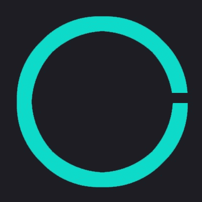
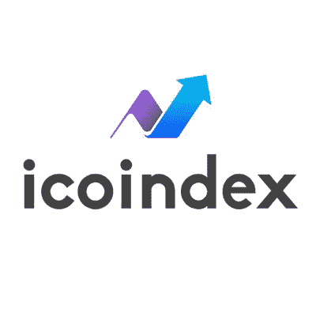

# ICO 评估网站| ICO 列表网站|根据 ICO 分析师的评估，排名前 100 位的 ICO 评级网站

> 原文：<https://medium.com/hackernoon/ico-review-sites-ico-listing-sites-top-100-ico-rating-sites-reviewed-bc8fc1b69888>

ICO ROI Ratios colored by year — the next top ICO might be found on ICO listing sites reviewed in this post

这篇文章将比较可能有助于找到高质量 ICO 的 ICO 评论网站。ICO 创始人和 ICO 投资者的核心问题是如何找到高质量的 ICO 评论网站和 ICO 排名网站，这篇文章的目的就在于此。

在 2017 年和 2018 年期间，越来越多的 ICO 上市网站涌现出来，以抢占不断增长的 ICO 行业的份额。这篇评论文章旨在帮助加密投资者找到排名前 100 的 ICO 评论网站和 ICO 评级网站，帮助您快速轻松地发现高质量的 ICO。

在这篇文章中，你可以找到前 3 个 ICO 评论网站的简短回顾和前 100 个 ICO 列表网站的简短描述。帖子还包括每个 ico 评审网站的名称和徽标，以防列表底部的一些网站非常简约。帖子还包括许多免费的 ico 列表网站，许多网站也有溢价列表选项。

如果您正在使用 ICO 列表网站营销 ICO，我们已经将所有的 [**100+ ico 网站添加到一个电子表格**](https://docs.google.com/spreadsheets/d/115eCz1YnM7VOhqfE0ZsEZeVnxAXigY5I4xw3RBS7XBc/) 中，以使您的提交过程更快更简单(由于不可编辑，请复制或下载)。

给你:

1.  [顶级 ICO 排行榜](https://topicolist.com/)

所有在[topicolist.com](https://topicolist.com)上展示的 ICO 都由专业 ICO 分析师进行评审和评级。不到 10%申请上市的 ICO 通过了[质量指南](https://topicolist.com/guides/how-topicolist-com-ico-analysts-rate-icos/)顶级 ICO 名单使用。他们似乎只列出优质的 ico 来帮助投资者快速发现好项目，他们列出的 ico 数量也最少(这与他们的说法一致)。

Top ICO List 拥有最深入的评论和评级，但最令人印象深刻的是“XYZ 代币价格背后的价值驱动因素是什么”部分，这使得人们很容易掌握代币价格应该如何增值，因为这往往太耗时且很难找到。(**披露:**我是[topicolist.com](https://topicolist.com)的 ICO 分析师之一)

2. [ICObench](https://icobench.com/)

ICObench 提供了在线 ico 的最大选择之一。当你想找到关于你正在考虑投资的某个特定 ICO 的关键信息时，这是非常有用的，因为你在 ICObench 上找不到那么多主要的 ICO。他们的评级系统是一个社交系统，任何人都可以在他们的网站上申请成为 ICO 专家。对于最受欢迎的 ICO，你可以找到 ICObench ICO 专家社区提供的许多专家评论..

ICObench 为其所有认可的 ICO 专家提供评级说明。建议他们通过评估团队、愿景和产品这三个主要因素来评定 ico。所有这些领域都用 1-5 分制进行评估。

3. [ICOdrops](https://icodrops.com/)

ICOdrops 是一个评级网站，以简单的形式向您提供其列出的 ico 的关键信息。他们的评级体系考虑了三个因素，炒作率、风险率、ROI 率。基于这些因素，他们对 ico 的兴趣从中性到非常高。

在他们的网站上，你还可以跟踪每个 ICO 到目前为止在他们的融资过程中筹集了多少资金，包括%和绝对金额，以及他们距离达到上限还有多远。

4. [Coinschedule](https://www.coinschedule.com/)

ico(初始硬币发行)和代币销售的原始列表。除了列出 ico，Coinschedule.com 还有一个全面的定期更新的比特币、以太坊、Waves、Ripple 和其他替代币的加密会议和新闻列表

5.[令牌市场](https://tokenmarket.net/)

TokenMarket 是一个负责任地列出令牌和分散资助项目、发布行业新闻和管理市场上唯一无广告 ICO 日历的平台。TokenMarket 是区块链资产的众筹销售和交易平台。我们相信，分散技术提供了一个巨大的投资机会，将简化和民主化投资市场。

6. [ICOalert](https://www.icoalert.com/en/)

ICO Alert 是一个值得信赖的 ICO 发现平台，提供活跃的和即将推出的初始硬币产品。

7. [ICOrating](https://icorating.com/)

ICORating 是一家评级机构，发布独立的分析研究，评估 ICO 项目并为其分配评级。ICORating 的目标是成为顶级 ico 列表网站之一。投资 ico 是一个潜在的高利润、高风险行业。ico 市场目前处于发展阶段，尚未完全规范，也没有一套可靠的项目评估标准；所有这些都给投资者带来了潜在的陷阱。

在 I corporation，我们的目标是为项目制定明确的评估标准，并根据透明和标准化的标准进行评级。对项目(其平台的技术特征、商业模式、团队、分散基础设施的优势和劣势等)进行深入和公正的分析，可以让我们客观地评估风险，并创建项目及其潜力的完整画面。

8. [ICOcalendar](https://www.icocalendar.today/)

ICOCalendar。如今归 W-MKT.com 所有，是 ICOBay 集团的一部分。W-MKT 是数字营销领域的全球领导者。W-MKT 诞生于 2008 年，当时初创公司和中小型企业对数字营销解决方案的需求日益增长。

我们的团队在北美和欧洲两大洲的 3 个国家拥有超过 25 名顾问。我们已经帮助 2000 多个众筹项目所有者筹集了数千万美元。我们的投入和营销努力帮助记者和企业家通过杂志和新闻网站上的文章提高了知名度，如《华尔街日报》、《Forbes.com》、《Entrepreneur.com》、《纽约时报》、《FastCompany》等等。

9. [ICOwatchlist](https://icowatchlist.com/)

ICOwatchlist 的目标是成为领先的令牌列表平台。我们的平台托管了一系列可靠的加密货币令牌和 ICO(初始硬币发行)项目，投资者可以从中进行选择。我们不断更新我们的加密货币和代币项目列表，以使访问者保持最新状态。我们还帮助区块链企业家寻求为其企业的各个阶段筹集资金，接触感兴趣的加密货币投资者。

10.[隐薯](https://cryptopotato.com/)

寻找与加密货币世界相关的资源——比特币和替代币。加密交易“方法”、指数和初始硬币发行(ico)

11. [TrackICO](https://www.trackico.io/)

TrackICO 为用户提供关于最佳 ICO 项目的最可靠信息，帮助 ICO 取得更大成功。它是一个平台，旨在为用户提供关于最佳初始硬币发行项目的可靠信息，并帮助 ico 吸引更多投资者。

12.[令牌顶端](https://tokentops.com/)

最好的新 ICO 项目不断被添加到 TokenTops ICO 列表中，提供所有需要的信息，安排公正的 ICO 评审和评级。

13.[图标](https://icomarks.com/)

ICOmarks 是一个分析和研究 ICO(首次发行硬币)的独立平台。我们有自己的评级系统，用于编制最有前景的项目列表、即将推出/即将结束的 ico 日历，以及用于跟踪已交易令牌统计数据的工具。每天都有数十个新的 ICO 项目公之于众，我们的使命是为投资者提供关于每个 ICO 的独立、透明的信息，以便他们将投资风险降至最低。

14. [ICOtracker](https://icotracker.net/)

这个项目是在另一个领域开始，作为一个简单的工具，专门用于个人目的。但几周后，来自 bitcointalk.org 的 4 位投资者给了我一些理由，让我把它提升到公共状态，并称他为 ICO 追踪者。从那时起，ICOTracker 的目标就是成为最好的 ico 评论网站。

15. [ICOhotlist](https://www.icohotlist.com/)

ICO Hot List 是一个独立策划的目录，列出了最有前景的活跃和即将到来的初始硬币发行(ICO)。我们的选择展示了他们在白皮书、团队、路线图、查询响应等方面的真正潜力。最热门的项目被列入我们的“热门”名单，完全由我们决定。

我们保存了一个不断增长的运行令牌档案，以跟踪过去 ICO 项目的性能。ico Hot List 拥有广泛的 ICO，已成为在线最佳 ICO 评级网站之一。

16. [ICObazaar](https://icobazaar.com/)

ICObazaar 是为加密货币和区块链技术投资者提供的信息和洞察力资源。我们提供来自区块链、加密货币、金融和投资专家的独立 ICO 评级和评论。

17。ICOholder

ICOholder 是一个平台，旨在为用户提供关于最佳初始硬币发行项目的可靠信息，并帮助 ico 吸引更多投资者。

18.[史密斯和克朗](https://www.smithandcrown.com)

Smith + Crown 是世界领先的区块链研究机构。自 2013 年以来，我们一直在研究公共区块链空间的广度，重点关注全球趋势、行业情报和加密经济系统。

19. [ICOranker](https://icoranker.com/)

ICORanker.com 是分析即将到来的 ico(首次发行硬币)的首选目的地。我们才华横溢的团队在加密货币行业拥有多年的经验，我们只列出最具潜力的顶级 ico。如果你认为你的项目是最好的项目之一，请今天提交你的项目！

20. [FoundICO](https://foundico.com/)

Foundico 是一个免费的 ico 和 pre-ico 聚合平台。在这里，您可以搜索、阅读和比较关于即将推出和正在进行的 ico 的信息。我们确保所有技术、分析和财务数据以最合适和优化的格式呈现。

21.[造币者](https://www.coinist.io/)

Coinist 是加密爱好者的中心，他们希望在与数字货币、应用程序令牌、区块链技术、金融科技和金融相关的主题上保持领先。在别人之前第一个了解机会。

22. [ICO-List](https://www.ico-list.com/)

ICO-List 是一个 ICO 导航网站，在这里您可以找到正在进行、即将开始或已经结束的不同 ICO 的列表。

23. [CR 币](https://crcurrency.com/)

CR Currency 旨在为读者提供 ico 的完整列表——世界各地的初始硬币发行。

24.[福克斯 ICO](https://foxico.io/)

第一个由社区对 ICO 项目进行评级的评级系统。在这里，您可以找到由社区选出的最佳 ICO 项目(评分最高的项目)。要查看 ICO 项目的完整列表，请跳转到沙盒。

25. [ICO 倒计时](http://www.icocountdown.com/)

ICOCOUNTDOWN。COM 关注新的加密项目，重点关注众筹方法，ICOCOUNTDOWN.COM 也进行尽职调查，以确定这些项目的可行性。欢迎来到未来。

26.[令牌数据](https://www.tokendata.io/)

TokenData 仅供参考，其客观性旨在成为顶级 ico 列表网站。TokenData 对任何链接的外部网站的内容概不负责，也不对这些外部网站上任何材料的内容、合法性或准确性做出任何陈述。如果您决定访问任何外部网站，您需要自担风险。

27. [Bitcoinx](http://www.bitcoinx.com/)

Bitcoinx.com 提供了一个信息世界，包括如何获取、兑换和使用比特币和其他加密货币。此外，我们还提供了一份区块链世界顶级 ico 和众筹销售的列表。我们还提供各种工具和图表，包括与比特币和其他市场相关的金融和技术数据，让用户完全融入比特币、区块链和其他加密货币的世界。对于加密货币交易以及那些想要参与区块链公司大规模销售的人来说，这是必不可少的信息。

随着加密货币的发展和被更广泛地使用和接受，我们将增加资源来帮助您在变化的环境中导航。

28.[广场](https://concourseq.io/)

ConcourseQ 为 100 美元的加密令牌销售提供社区来源的尽职调查.

30.[列举 ICO](https://www.listico.io/)

在我们的网站上寻找您的下一个 ICO 机会。我们每天都有成千上万的访问者像你一样浏览我们的 ico。我们列出了世界各地最好的即将推出的 ICO 和正在进行的 ICO 加密货币硬币。我们不断更新 ICO 列表，并提供关于预 ICO、活动 ICO、即将推出 ICO 和已结束 ICO 的高质量信息。如果你不想错过一个好的 ICO 项目，那么就在 Twitter 上关注我们，订阅我们下面的时事通讯。在 ListICO 上寻找 2018 年最好的 ICO

31.Base.info(前 WiserICO)

Base.info 提供了当前、未来和过去的 ico 列表。每个 ICO 在其网站上都可以看到以下信息:1-5 级评级、募集资金金额、剩余天数和结束日期。

32.[ICO 文摘](https://theicodigest.com/)

ICO 文摘有一个明确的价值主张:再也不要错过任何 ICO 机会。你需要的关于 ICOs 的唯一每周文摘。加入由 5000 多名 ICOs 投资者组成的团队。

33.[长猫链](https://longcatchain.com/)

《长猫链》旨在为读者提供值得投资的顶级 ico。

34.[共 delite](https://coindelite.com/)

Coindelite 是让你获得最新比特币新闻、加密货币新闻和 ICO 新闻稿的最令人愉快的媒体渠道。查看更新的 ICO 列表、实时加密货币价格图表、信息加密货币和实时市场数据。

它是唯一一个包含以下信息的网络平台:实时加密货币价格图表、比特币价格趋势、交易的有利性和不利性、ICO 的完整列表、其范围和功能、各种加密货币根据不同加密交易平台的汇率、实时市场数据、全球新闻稿、比特币和其他加密货币的新闻、区块链和 ICO 事件、主要加密货币列表以及顶级 ICO(初始硬币发行)列表等。

Coindelite 平台最大的优点是所有数据都在近乎实时的基础上进行更新。它为你提供了最新的和全新的趋势，贸易，以及关于密码世界的问题。订阅用户随时关注实时加密货币价格图表，以及即将推出的加密货币、ico(初始硬币发行)和与比特币或其他替代硬币相关的最新消息。

35. [ICO Tokn](https://icotokn.com/)

Icotokn 是一个可信的 ICO & Token 销售发现平台，带有一个工作列表板。

我们扫描区块链的项目，评估作为潜在投资的众筹销售，并提供 [ICO 推广服务](https://icotokn.com/ico-token-sale-advertising-program/)。

列表经过精心策划，这意味着我们的团队手动选择最感兴趣的 ICO，并进行分析，以确定项目的质量及其从长期投资角度看的潜力。但是，您仍然可以[将您的项目](https://icotokn.com/list-new-token-ico/)提交给我们审核并在 Icotokn 上列出。

Icotokn 已经成为最受欢迎的 ICO 数据库之一，拥有越来越多的用户，主要是来自美国、英国、俄罗斯、中国和日本的投资者。

36. [ICO 数据](https://icodata.io)

我们的使命是提供高质量的情报，包括评级和研究，这将有助于透明的 ICO 市场，使投资者能够做出明智的投资决策。我们的评级是完全独立的，可能会让很多人生气，但这正是问题的关键。市场不应该容忍糟糕项目从天真的投资者那里筹集数百万美元。

我们问正确的问题。我们对他们进入的团队、产品和市场进行了深入分析，并试图确定他们是否真的能成功。我们检查 ICO 结构、它的权限以及团队的安全和审计计划。我们还检查代币的分配、硬上限以及团队是否有任何代币锁定期。

37.ICO 令牌新闻

我们是 ICO 投资者和实际 ICO 的信息网站。我们试图为我们的访问者提供尽可能广泛的关于 ICO 行业的信息。

我们的使命是提供如何在理论和实践中参与 ICO 投资的良好信息。我们希望引导我们的投资者了解区块链和 ICO 基金的基本知识，代币和钱包，不同的加密硬币和交易所，以及与所有这些相关的术语和语言。也支持信息如何评估不同的项目，如果你找到你最喜欢的，如何参加特定的 ICO。

38.[标记器](https://thetokener.com)

令牌是一个 ICO/令牌销售目录。我们的目标是发布所有已完成、正在进行和未来的 ICO 和令牌销售的详细报告。网站建设有坚实的技术背景。这使我们能够将令牌器逐步迭代为成熟的信息平台。

40. [ICOindex](https://icoindex.com)

我们相信通过技术在社会中分散权力。我们的专家团队和区块链爱好者致力于使加密资产的投资变得易懂、简单明了，并为每个人所用。

41. [ICO 考官](https://icoexaminer.com)

ICOExaminer 是一个于 2016 年 9 月上线的平台，提供关于这一新区块链现象的新闻、观点、研究和评论，这一现象因其更广泛的影响而引发了激情和不安。你可以加入他们的论坛，成为关于区块链和区块链初创企业日益增长的现象的辩论的一部分，并在本页底部注册时事通讯，以跟上主要发展。

42. [ICO-Check](https://ico-check.com)

ICO-Check 是一个加密货币 ICO 网站，提供了一个广泛而深入研究的最佳正在进行和即将进行的初始硬币产品投资列表。

43.[硬币格式](https://coinformant.com)

查找社区审核的加密货币列表。浏览按评级排序的区块链相关资源。使用我们的搜索功能搜索交易所、ico、钱包、水龙头、服务和其他列表。

44.[最佳硬币](https://bestcoins.co)

Bestcoins 是投资者、技术爱好者和创始人的 ico 新列表。它是 ICOs 的发射台。

45. [ICO 硬币清单](https://icocoinlist.com)

ICO 硬币列表是一个新的 ICO 网站，在这里您可以找到最新 ICO 硬币的列表，我们还推荐[顶级 ICO 列表](https://topicolist.com/)。您可以搜索正在进行的 ico、预 ico，甚至是即将推出的 ico，以及它们的概述和其他您必须了解的有关该项目的详细信息。你甚至可以要求添加你自己的图标，如果你有一个，只需勾选联系人标签发送消息。

46. [ICO 缓冲区](https://icobuffer.com)

ICO Buffer 是一个精选的 ICO 列表，包含评级、分析和评论。ICO Buffer 进行分析，让区块链投资者更好地了解 ICO 市场。

47.[钱币市场](https://coinmarket.news)

硬币市场。新闻是一本关于加密货币、区块链和技术的在线杂志。硬币市场。新闻发布关于比特币、以太坊和其他加密货币的最新消息，谈论数字货币和区块链世界的技术创新，有趣的 ico 等等。他们试图避免“炒作”新闻，专注于技术和创造技术的人。

48. [ICO 投票](https://icovoting.com)

ICO 投票是一种独特的工具，旨在帮助您做出将资产投资于 ICO 阶段的一家或另一家初创企业的决策。而且绝对免费！

现在，您已经可以看到 ICO 评级结果摘要，并从 ICO 信息部分获得有关全球所有正在进行的 ICO 的信息。

49. [Alt 币警告](http://altcoinalerts.com)

AltcoinAlerts.com 是一个专门为首次公开募股(ICO)上市设计的大型数据库。我们的目标是提供与 ICOs 相关的更简单、更简短的数据。Altcoin Alerts 将为读者提供即将到来的代币销售、ICO 新闻、ICO 活动、奖金、空投和新闻稿的几乎所有细节。我们还涵盖每日加密新闻，区块链新闻，比特币新闻，以太坊新闻和其他 Altcoin 新闻。Altcoin Alerts 读者每周都会收到基于趋势和受欢迎程度的顶级 ico 通知/警报。你想成为每周收到提醒的第一人吗？那为什么还要等着订阅我们的数据库呢

50. [ICO 时间线](https://icotimeline.com)

ICO Timeline 的目标是让人们和投资者了解新的合法 ICO 和 Altcoins 项目。我们的首要任务是保护投资者免受诈骗项目的影响。

51. [ICO 时间](https://icotime.ru)

ICOtime 是一个资源，您可以在其中找到当前和未来 ico 的列表。感谢 ICOtime，您可以成为加密货币社区的正式成员，了解该领域的最新趋势和新闻。

52. [Coinkhoj](http://coinkhoj.com)

CoinKhoj 正在建立一个信任的加密社区，以引入新的创新项目，先于其他人与我们的社区携手合作。从早期开始支持一项创新，并从你的支持中获得回报。

53.[投币发射器](https://coinlauncher.io)

Coin Launcher 由领先的区块链营销机构 Searched.io 创建，旨在利用我们独特的数据驱动见解推广最强的 ICO 项目。我们的评分系统是一个复杂的算法，利用了网络、公关、社交媒体、社区和 SEO 的真实世界数据。我们受到长期增长的驱动，并相信任何 ICO 作为区块链初创公司要真正成功，他们应该寻求增加在线影响力。

54. [ICOkr.info](https://icokr.info/new_main)

每天查看 ICOkr 更新的 ICO 列表。韩国唯一的免费销售名单。看 ICO 新手指南，在公告牌上分享专家观点和意见。

55. [ICO 检查器](http://icochecker.com)

ICO Checker 旨在为投资者提供最干净的初始硬币发行上市，包括现场、即将到来和过去的 ICO。

56. [ICO 销售](https://icosales.com)

ICO 销售为投资者提供了一个即将到来的，正在进行的和过去的 ICO 列表，并结合 ICO 数据部分，其中有关于 ICO 的文章。

57. [Bl4nkcode](https://bl4nkcode.info/en/)

一个资源丰富的网站，您可以从中了解更多关于区块链和加密货币的信息。ICO 所有者以及与加密相关的服务/组织/公司将很高兴知道我们还提供 [ICO 列表](https://bl4nkcode.info/ico_list)和 [PR 发布](https://bl4nkcode.info/press-release)服务。我们这边有越来越多的读者。

58. [ICO 滴漏](https://icodrip.com)

ICO drip 帮助投资者找到最佳的 ICO(初始硬币发行)和代币销售机会。我们每日更新的区块链创业公司数据库让你了解最新的趋势投资。加入区块链和加密货币技术的革命，找到最好的 ICO 进行投资！

59.[最后一个加密](https://lastcrypto.com)

LastCrypto 由 ICO 分析师策划，为您带来最好的新 ICO 币，无论是活跃的、正在运行的还是打折的。寻找优质 ICO 销售的最佳选择。浏览免费初始硬币发行列表，找到投资于的*最佳 ico。或者使用我们的社区 ICO 评级功能来影响您最喜爱的即将推出的加密货币的知名度。*

60.[密码街](https://cryptostreet.co)

CryptoStreet 的目标是成为区块链社区的未来。我们富有奉献精神和才华的团队不断研究和撰写信息，帮助全球社区了解加密货币和区块链，同时保持消息灵通。此外，我们始终与行业人士保持联系，他们为我们提供来自生态系统的新鲜见解。

CryptoStreet 始于 2016 年，当时我们意识到世界上的每个人都必须拥有自己的财富和想法。做到这一点的方法是见多识广，耍小聪明。

61. [ICO 链接](https://icolink.com)

ICOLINK 名单包括来自世界各地的 1100 多个 ico。ICOLINK 社区中的用户和每个人都可以提交 ICO，进行评论，并在列表中查看 ICO 页面访问者统计数据。

62. [ICO 透明监视器](https://icomonitor.io)

ICO Transparent Monitor 是投资者和记者了解特定 ICO 是否透明和可信的必去之地。ICO Monitor 是一个透明的基准，帮助社区更好地评估产品，并根据客观指标做出明智的决策。他们根据智能合约评估所有 ico。

63.克里普托·韦尔莱赫

Krypto Vergleich 为投资者提供德语 ICO 评级，每天多达 5 个新的 ICO 评级。他们的目标是让 Krypto Vergleich 的编辑制作完全独立的评级。

64. [ICO 地点](https://icoplace.org)

ICO Place 是一群加密投资者，他们努力在各个地方收集关于 ICO 的信息，走到一起，建立了这个网站来解决这个问题。他们的目标是发展一个志趣相投的社区，让这个门户成为一个可以找到所有 ICO 的结构化数据的地方。

65. [ICO 进度表](http://icoschedule.co.kr)

ICO 日程安排韩国版面向韩国观众，提供有关即将推出的 ICO、特别优惠和加密市场新闻的更新。

66. [ICO 任务](https://icoquest.com)

欢迎来到 ICOQuest.com，这是你在 ICO 上的在线资源。在这个网站上，您可以找到定期更新的 ICO 列表，包括当前的 ICO 和即将推出的 ICO。此外，你还可以在我们的网站上阅读关于 [ICO 新闻](https://icoquest.com/news/)，以及其他与 ICO 相关的资源。

如果你有兴趣添加新的 ICO 到我们的 ICO 列表，你可以[提交 ICO](https://icoquest.com/submit-ico/) 给我们。

67. [ICO 卷轴](https://icoscroll.com)

ICO Scroll 由 ICO 专家策划，为您带来理想的全新 ICO 币，充满活力，接近或处于平价的 Pre ICO。高品质 ico 的理想选择。搜索 ICO 列表，寻找我们领先的首款硬币产品选择。ICO Scroll 是一个 ICO 目录网站，由我们的内部全职 ICO 专家管理。

68. [ICO 街](https://www.icostreet.io/)

查看我们正在进行和即将进行的 ICO(首次硬币发售)和加密令牌众筹销售的热门列表。我们的评级算法基于 ICOstreet.io 可获得的信息。这并不构成财务建议。如果你想上市，在这里提交你的 ICO。

69. [ICO 慌了](https://icopanic.com)

如果你正在计划一个 ICO 活动，或者正在选择一个投资项目，那么我们的网站就是为你准备的。ICO Panic 是一个最新的平台，列出了最有前景和最具趋势的 ICO，由我们的专家选择，分为即将推出的、正在进行的和已完成的活动，为您提供方便。

70. [ICO 网站](http://icoweb.co)

ICO Web 是一个面向中国受众的网站。他们向投资者提供有关区块链和 ICO 项目的信息。

71. [ICO 地图](https://www.ico-map.io/)

ICO Map

在 ICO 地图网站上，每个人都可以很容易地找到和跟踪正在进行和即将进行的 ICO。找到你的下一个投资，或者只是检查哪些国家比其他国家有更多的 ico。

72.[硬币清单](http://www.coin-list.com)

Coin List 是一个由 ico 和 crypto 人群销售驱动的社区列表。

73.[隐雷达](https://cryptoradar.org)

CryptoRadar 是主要的博客之一，提供与加密相关的新闻、新闻稿、ICO 发布以及与比特币、以太坊、莱特币、Ripple、IOTA、Stellar、NEO 和其他替代币相关的内容。我们每天都发布内容，帮助加密爱好者和加密投资者更好地了解前景，做出更明智的购买/投资决定。

74. [Icosignal](https://icosignal.com)

Icosignal 有一个简单的 ICO 上市格式，投资者可以获得评级和 ICO 令牌销售日期。

75. [ICO 广告](https://icoadvert.com)

ICOadvert 是一个推广和发现首次发行硬币的平台。

捐赠 ETH 或 ERC20 代币帮助我们继续维护我们的网站。

76. [ICO 调度器](https://icoscheduler.com)

独立可信的 ICO 市场。

77. [ICO 日报](http://icodaily.ru)

ICOdaily.ru 是一个由支持封锁技术开发及其在俄语国家和世界各地发行的爱好者组成的团队。我们跟踪当前的项目，强调他们对 ICO 的访问并对其进行审查，我们还撰写关于交易、会议和其他 cryptomir 事件的文章。

78. [ICO 酒店](https://icohotel.com)

ICO Hotel 是加密货币和代币市场的新闻参考。

79. [ICO 比率框](https://icoratebox.com)

ICO Rate Box 旨在为您带来一个 ICO 列表，您可以在其中找到您现在可以投资的最热门的 ICO。

80. [ICO 纨绔子弟](http://icodude.com)

加入加密货币世界已经 7 年了。ICODude.com 在这里帮助推广您的数百万美元的 ICO，并确保销售一空。

81.[列表-图标](https://list-ico.com)

名单-ICO 是一个现代的工具，ICO 所有者，潜在的投资者和那些谁想要获得的信息和事件，从最初的硬币提供世界。我们每天都尽最大努力为用户提供关于即将到来的 ICO 的最真实、最全面的信息。

82. [ICO 日历](http://icocalendar.ru)

[Icocalendar.ru](https://icocalendar.ru/) 是[happy cooin 的子域。Club](https://happycoin.club/) ，一个关于加密货币、区块链技术、现代金融技术、ICO 项目的俄语信息资源。他们为读者提供操作信息，在一个网站上收集所有的热门新闻。目前，有 40 多个新闻网站、博客、聊天室和讨论线程。我们选择最有趣、最相关的材料，放在我们的资源上。在他们的网站上，你可以找到来自世界各地的新闻和分析文章的翻译，以及即将到来的众筹销售(ICO)项目的原创内容。他们邀请译者和原创文章作者合作。

83.[令牌时间表](http://tokenschedule.com)

令牌计划具有简单的价值主张:利用令牌计划进行更明智的投资。

84.[令牌列表](https://tokenlist.top)

Tokenlist 是俄语团队的 ICO 评级。我们收集关于即将到来的和当前的 ICO 的信息，我们的算法以五分制评估它们的质量。将 ICO 纳入我们的评级是一种公众检查和审计。这种反馈激励所有直接参与者提高 ICO 的质量，并为投资者提供了一个比较和支持最有价值和最有前途的产品的视觉机会。

85. [ICO Top](https://icotop.io/)

ICOTOP 是一家独立机构，雇佣了一组区块链专家。我们专门为 ICO 项目进行评级。在我们全面详细分析的基础上，我们在我们的评级系统上评估 ICO 项目。

我们机构的目标是收集关于这些项目的所有重要信息，并为投资者提供洞察力，帮助他们做出正确的选择并投资于最佳项目。所有风险(骗局、活动等。)根据通用标准被标准化。精选项目接受我们的全面分析，这是我们的专家团队为了投资者的利益而提供的。

86. [ICO Champs](https://www.icochamps.com)

ICO Champs 是一个独立的 ICO 评估平台。

87. [ICO 列表器](https://www.icolistr.com)

ICO Listr 为所有网站访问者提供完整的 ICO、初始硬币产品列表。

88. [ICO 信条](https://icocreed.com)

专家评出的最佳 ico 综合列表。

89. [ICOMarketData](https://www.icomarketdata.com)

一个平台，满足您的一切需求。具有 ICO 日历，ICO 评级，ICO 统计，个人投资组合和推送通知，设计精美，捆绑到一个单一的平台。

90.[加密 ICO 警报](http://www.cryptoicoalert.com)

CryptoICOAlert 列出了世界各地即将推出的 ICO 和正在进行的活跃 ICO 项目。我们不断更新新 ICO 列表，并提供 ICO 评级信息，您可以在 Crypto ICO Alert 上找到下一个 ICO 机会。

91.[造币厂](https://coinmagnet.io/)

io 是 AmaZix 的一个先进的加密项目列表服务。io 是一个社会驱动的平台，旨在扩大加密空间市场。

92. [ICOScoring](https://icoscoring.com)

ICOScoring 是一个由投资者和金融专家支持的 ICO 分析平台。投资者很快得到答案，发现有希望的机会，并强调即将推出的 ico 的主要风险。公司吸引新的投资者，获得进一步发展的建议，并为当前的投资者提供可靠的分析。

93. [CoinMarketPlus](https://www.coinmarketplus.com/)

CoinMarketPlus 列出了进入众筹的新 ICO 项目。您将在他们的网站上列出所有此类项目/令牌的详细信息，这将有助于您分析项目，对正确的项目进行投资。

94. [CoinGecko](https://www.coingecko.com/en)

CoinGecko 维护着一个 ICO 电子表格，其中汇集了来自各种 ICO 评级机构和影响者的提及。

95.[https://crushcrypto.com/](https://crushcrypto.com/)

Crush Crypto 是一个独立的研究小组，专注于区块链技术和数字货币，如比特币和以太坊。Crush Crypto 的目标是为加密货币投资提供高质量和客观的基本面分析。

96.[https://picoloresearch.com/](https://picoloresearch.com/)

Picolo Research 提供关于区块链创业公司和 ICO 的独立研究

97. [ICOmagazine](https://icomagazine.com/)

ICOmagazine 是一家专注于 ICO 和代币销售项目的加密货币媒体。ICOmagazine 将涵盖新 ICO 项目、其背后的技术、数字货币的数字世界中的公司和个人的新闻和信息。

98. [ICOGURU](https://icoguru.io/)

ICOGURU 提供 ico 的专家评级。他们使用几个指标来评估项目，如项目的团队和顾问委员会；白皮书；产品和 ICO 术语。

99.[密码背心](https://cryptovest.com/ico/)

Cryptovest 拥有一个加密货币专家团队，致力于提供最佳和最安全的投资硬币的合理建议。

100. [ICObuzz](http://icobuzz.net/)

ICObuzz.net 是一个独立的 ICO(初始硬币发行)数据库，在一个地方提供详细的信息。