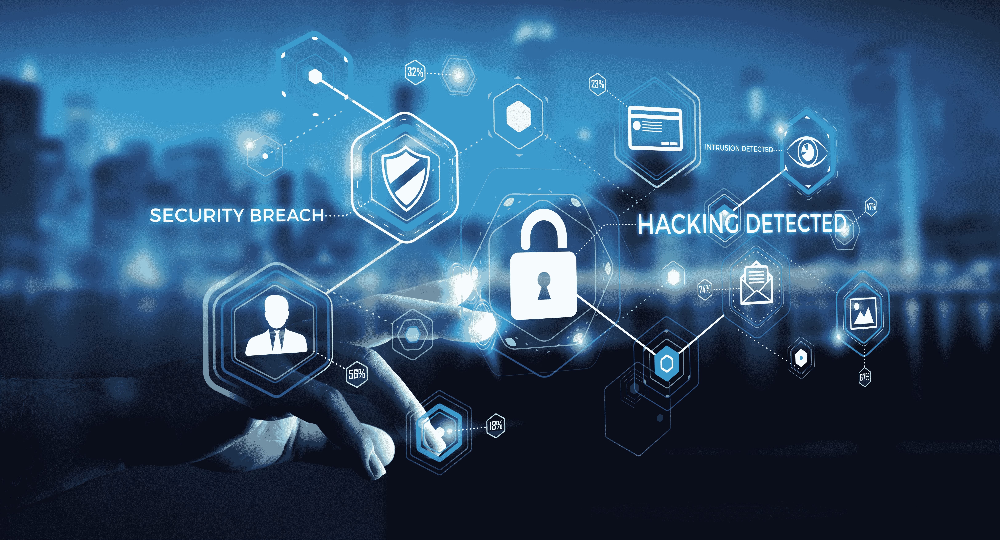

# ICO 安全:如何保护您的 ICO 免受黑客攻击

> 原文：<https://medium.com/hackernoon/ico-security-how-to-protect-your-ico-from-hackers-b264706d6420>

***区块链技术*** *是两个人之间不需要第三方的数据传输系统。****【ICO】****是一种通过区块链技术为创业公司筹集资金的数字化方式。随着区块链的人气上升，知道如何保护你的 ICO 免受黑客攻击变得更加重要。*

当一个 ICO 项目向世界公布时，它本能地告诉人们，它将收集价值数百万资金的加密货币。这就是你最吸引黑客的地方。如果你开始一个区块链或 ICO 项目，你首先要考虑的应该是安全性。

尽管加密货币具有高安全性优势，但在某些情况下，人们甚至可以通过最安全的东西。在过去的几个月里，ICO 项目中的安全性受到了广泛关注。但是，许多人没有意识到 ICO 世界中可能出现的风险和漏洞。

**出于这个原因，我们为潜在的 ICO 项目和初创公司提供一些关于如何保护他们的 ICO 免受黑客攻击和破坏的建议:**

*   坚持编程指南，其中有很好的建议，以避免失败的智能合同；
*   倾听你的社区，认真对待他们的建议；
*   监控您的所有 ICO 活动，并在出现问题时迅速采取行动；
*   不要忘记保护你的网站，因为它是一个交易平台；
*   制定一个计划，防止你的项目和你的社区受到骗子的侵害；
*   检查你的代码几次；
*   注意智能合同以及条款和条件中写的内容；
*   与你的团队一起创造一个良好的工作环境，并确保你的团队了解项目并为其安全做出贡献；
*   始终与你的用户沟通，告诉他们只访问你的网站；
*   在 ICO 开始之前，对您的团队进行网络安全风险教育；
*   只向那些在你的网站上注册的人提供资金说明；
*   不同的帐户使用不同的密码；
*   总是告诉你的用户忽略骗子和来自非管理员的信息；
*   建立一个强大的社区。

安全和保护是所有行业中任何业务的一部分。ICO 和区块链也不例外。但是，凭借强大的团队和良好的合作，您可以随时保护您的 ICO 免受黑客和骗子的攻击。

> 安全和成功的 ICO 的一个很好的例子是[能源总理](https://medium.com/u/e338af49a57a?source=post_page-----b264706d6420--------------------------------)。这是一个总部设在区块链的电力交易项目，旨在创造一个电力招标只需 30 分钟的地方，其使命是让供应商直接进入零售能源市场，同时给消费者提供合适的价格。

我们相信，能源总理 ICO 是一个安全的地方，你可以参加，因为我们有一个强大的专业团队，顾问和密码老手，如[佐藤友明](/energy-premier-blog/update-introducing-our-new-team-member-f470c68c5db)和[伯颜约西奇](/energy-premier-blog/update-boyan-josic-joins-energy-premier-40867373f47f)。我们一起努力开发一个成功的受保护的 ICO。我们已经有了一个可以运行的产品，你自己也可以看到:[**https://tokensale.energypremier.com**](https://tokensale.energypremier.com)

我们还有一个奖励计划，奖励帮助我们传播信息的人——点击这里查看

**加入我们有前途的 ICO，享受能源总理给你的所有好处！**

> **感谢您的阅读。**
> 
> **[订阅最大的电力竞价平台](/@energypremier)随时关注我们的更新。也参与我们电报频道的讨论:[https://t.me/joinchat/Hq0j1hDxZ3eRKFNo5f7oTw](https://t.me/joinchat/Hq0j1hDxZ3eRKFNo5f7oTw)**
> 
> **在这里加入预售和众筹:[https://tokensale.energypremier.com/](https://tokensale.energypremier.com/)**

****