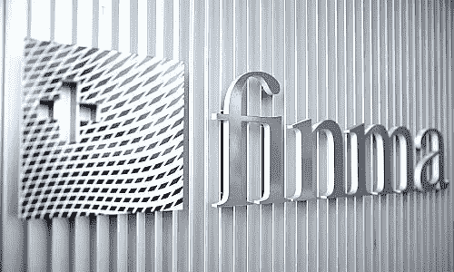
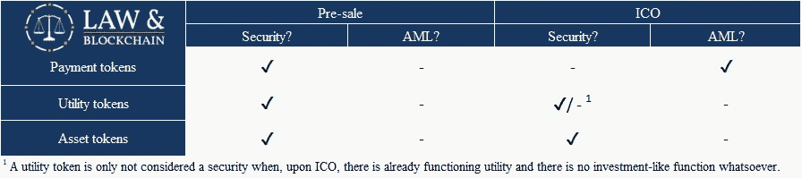

# 想在瑞士做 ICO？先看这个！

> 原文：<https://medium.com/hackernoon/ico-switzerland-regulation-56c2ae1e3e33>

## 反洗钱、证券监管和瑞士基金会快速指南。

自从以太坊(Ethereum)在瑞士建立并首次发行硬币(ICO)以来，这个司法管辖区一直受到区块链企业的欢迎。事实上，楚格市通常被称为“[隐谷](https://cryptovalley.swiss/)”。在本文中，我将很快深入研究适用于瑞士 ICO 的法律。瑞士基金会有听起来那么聪明吗？

[瑞士金融市场监管局(FINMA)](https://www.finma.ch/en/)[最近发布了关于打算如何对待 ICO 的](https://www.finma.ch/en/news/2018/02/20180216-mm-ico-wegleitung/)指导方针。FINMA 的首席执行官 Mark Bransom 表示:

> “我们处理 ICO 项目和调查的平衡方法允许合法的创新者在监管环境中航行，并以符合我们保护投资者和金融体系完整性的法律的方式启动他们的项目。”

像大多数监管机构一样，每个 ICO 都将根据其自身的优点接受审查。换句话说，监管机构将着眼于每一次发行的经济功能和目的，以决定适用何种法律。尽管如此，FINMA [认识到](https://www.finma.ch/en/news/2018/02/20180216-mm-ico-wegleitung/)不同种类代币之间正在出现的区别。这些是:

*   **支付代币/加密货币**
*   **实用令牌:**旨在提供对应用或服务的数字访问的令牌。
*   **资产代币:**代表资产的代币，如参与真实的实物基础、公司或收益流，或获得股息或利息支付的权利。就其经济功能而言，代币类似于股票、债券或衍生品。

The Swiss Financial Market Authority’s wall.

这种区别与行业中出现的术语非常相似。这一区别将有助于创始人确定 ICO 是否符合证券法、反洗钱(AML)和了解客户(KYC)的要求。

为了让事情变得更加混乱，FINMA 声明各个令牌分类并不互相排斥。资产和公用事业令牌也可以归类为支付令牌(称为混合令牌)。在这些情况下，要求是累积的；换句话说，代币被认为既是证券又是支付手段。

# 瑞士证券法规

根据瑞士证券法，资产代币被视为证券。

有趣的是，FINMA 还区分了售前和 ICO 的支付令牌和工作产品或服务的实用令牌。任何让投资者有权在未来获得代币的预售都将被视为证券，无论它是哪种代币。

公用令牌的 ICO 通常不被视为证券产品。但是，也有例外:

*   如果在公用设施令牌的 ICO 期间，没有为消费者/投资者提供公用设施的工作平台或应用程序，则该销售被视为预售，构成证券销售。
*   如果公用令牌具有*任何类似投资的功能，*ICO 将构成证券销售。

如果你的代币在瑞士法律下是一种证券，那又如何？

瑞士的证券监管通常不像大多数其他司法管辖区那样严格。根据瑞士证券交易法，自行发行的无证书证券的簿记和发行在很大程度上不受监管。根据《债务法》，唯一的正式要求是保持一本记录所发行的无证书证券的数量和面值以及债权人的详细情况的账簿(《债务法》第 973c 条第 3 款)。然而，承销或提供第三方的证券*需要根据瑞士证券交易所条例获得许可。最后，如果你提供的代币是“类似于股票或债券”，你很可能还必须满足瑞士债务法的招股说明书要求。*

# **反洗钱**

Money laundering.

制定反洗钱规则是为了“保护金融系统免受洗钱和恐怖主义融资的影响”根据瑞士《反洗钱法》( AMLA ),在以下情况下，您将被视为受反洗钱要求约束的金融中介:

(I)您提供支付服务或

(ii)您发行或管理支付手段

*那么，ICO 是否自动让你成为‘金融中介’呢？*

不会。事实上，根据 AMLA，只有加密货币/支付令牌将被视为支付手段。如果您发行支付令牌，您将必须遵守一些尽职调查要求。对创始人最重要的要求是:

*   确定买方受益所有人的身份(KYC)；和
*   加入自律组织或直接接受 FINMA 的监督。

对于公用令牌，只要您发行令牌的主要原因是提供对非金融应用程序的访问权限，您就可能不受 AML 要求的约束。对于售前，您将永远不会受到 AMLA。

Overview of Swiss regulations

# **瑞士基金会**

将 ICO 期间筹集的资金放在基金会中已成为市场惯例。由于瑞士法律的相对确定性和低税收负担，瑞士基金会经常被用于这方面。然而，应该指出的是，瑞士基金会并不适合这一目的。

Swiss Foundation.

首先，只有当创始人没有任何(即使是间接的)与非营利基金会的运作相关的个人经济利益时，才能注册为非营利基金会。在许多情况下，创始人会为自己保留一小部分代币，税务部门可能会认为这是个问题。

第二，瑞士基金会本质上是非常严格的。瑞士法律规定，这些基金会应该完全独立运作。此外，ICO 期间筹集的资金只能用于促进基金会的宗旨。

这对投资者来说通常是好消息。然而，它也可能成为一种负担。名为 [Tezos](https://www.tezos.com/) 的加密货币就是一个很好的例子。

我写了一篇关于[泰佐斯](https://hackernoon.com/the-curious-tale-of-tezos-from-a-232-million-ico-to-4-class-action-lawsuits-6f411b7aad7e)的奇怪故事的文章。简而言之，Tezos 的创始人百年灵正在处理三起不同的美国提起的集体诉讼。尽管他们在 ICO 期间成功筹集了约 2.5 亿美元，但[仍不清楚基金会的资金能否用于支付他们的法律辩护](https://www.reuters.com/article/us-bitcoin-tezos-lawsuits-exclusive/exclusive-tezos-founders-push-for-legal-bailout-from-swiss-foundation-idUSKBN1DV4K0)。使用资金为自己进行法律辩护是为了促进基金会的宗旨吗？此外，由于百年灵本身并不是基金会的正式成员，如果他们支付辩护费用，基金会还能独立行事吗？

## **几句结束语:**

*   可能有其他司法管辖区更适合您的 ICO。瑞士法律的相对确定性并不总是证明在那里做 ICO 是正当的。瑞士的基础结构在大多数情况下肯定是不理想的。
*   FINMA 特别保留改变对支付代币看法的权利:*‘如果支付代币通过新的判例法或立法被归类为证券，FINMA 将相应地修改其做法。’*
*   FINMA 认为以太坊是一种支付令牌。虽然以太坊确实被用来支付矿商执行智能合约，但人们也可以认为，持有以太坊的代币就能获得该平台的效用。这说明支付令牌和公用令牌之间的区别可能是模糊的。也可能是 FINMA 认为以太坊是一个混合令牌。
*   请注意，遵守一个司法管辖区的证券/反洗钱/KYC 立法只是第一步。相当多的监管机构有基于国籍的治外法权！
*   这些都不是法律建议，你应该在做 ICO 前咨询律师。
*   找个律师
*   *说真的，*找律师。

## 关于作者:

*Thijs Maas 是一名法律系学生，他对分布式账本技术带来的创新浪潮所带来的法律挑战有着浓厚的兴趣。他最近创立了*[*www . lawandblockschain . eu*](http://www.lawandblockchain.eu)*，一个关于区块链一切法律&的信息、见解和学术研究的中心。*