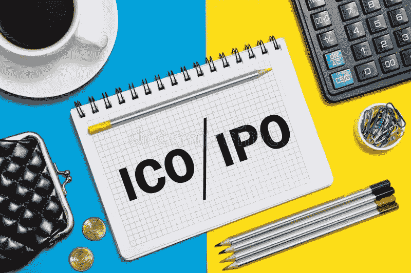

# ICO 与 IPO:主要区别

> 原文：<https://medium.com/hackernoon/ico-vs-ipo-major-differences-bd23890cb83b>

纵观加密货币和区块链技术的历史，我们已经接触到了许多新的流程和术语，如硬币、代币、预售、众筹、去中心化等。我们和许多其他公司和项目最关注的一些最常见的术语和流程是 ***ICO 和 IPO*** *。*

这些天我们听到很多关于 ICO 和 IPO 的消息。虽然 ICO 和 IPO 这两个名字听起来很相似，很多人认为它们的目的也很相似，但它们之间有很多不同之处。

**首次发行硬币(ICO)** 是加密货币创新带来的一个过程。这是初创公司的一种众筹方式，包括创造和出售代币，为项目的启动和发展提供资金。ico 与区块链技术有关。

**首次公开募股(IPO)** 是一个由私人公司主导的成熟过程，目的是扩大规模并公开交易。在这个过程中需要一些手续。IPO 是指公开出售公司股份，目的是筹集发展资金。

## **ICO 和 IPO 的主要区别是什么？**

**策略**

ICO 的主要策略是为项目筹集资金并进入市场，ICO 通常由创业公司执行。然而，IPO 通常在公司财务稳定并希望向公众扩张和发展的后期进行。其募集资金用于公司未来的扩张项目。

**文档**

当一家公司想要进行首次公开募股时，它必须创建一份名为招股说明书的法律文件。这份文件是一份法律声明，必须包括有关公司和 IPO 的关键信息，并且必须符合一些透明度标准。另一方面，ico 不受任何法律文件的限制。他们有一份白皮书形式的文件，其中解释了关于项目及其目的的一切。但是，必须指出的是，ico 没有义务制定白皮书，而 IPO 必须有成功运营的计划书。

**可信度**

一家公司要通过 IPO 上市，必须满足一些要求。这涉及到要有收益的跟踪记录，而且要有专业的会计事务所来确认。在 ICO 流程中，公司不必有业绩记录或任何监管框架。大多数 ico 只有一份不必要的白皮书。

**持续时间**

IPO 过程是一个漫长的过程，可能长达 6 个月。这是因为法律程序的要求。但是 ICO 流程要短很多。ICO 的持续时间取决于项目的性质。当一家公司发布白皮书和智能合同时，他们可以从众筹销售开始。众筹销售的持续时间取决于项目及其最大硬上限，通常需要 1 个月。

**目标群体**

IPO 只面向银行等机构投资者。整个过程中有一小部分是面向散户的。另一方面，ico 对任何人开放。你所需要的只是一种比特币或以太币，你可以把它转换成特定 ICO 的代币。

虽然 ICO 和 IPO 听起来是一个类似的过程，但实际情况是不同的，它们是截然不同的。然而，这两者都是很有前途的过程，可以带领公司走向成功。

我们公司[能源总理](https://medium.com/u/e338af49a57a?source=post_page-----bd23890cb83b--------------------------------)目前正在推出 ICO。Energy Premier 是一个先进的区块链电力交易平台，面向电力供应商和消费者。能源总理的目标是通过区块链把能源的权力还给人民。我们的平台使供应商能够直接进入零售能源市场，并消除距离对交易的限制因素，从而为消费者带来更低的价格。这是第一个为所有能源零售商提供直接进入市场的平台。

预售已经开始，9 月 21 日开始众筹。您可以轻松参与并在 https://tokensale.energypremier.com/的**上获得白名单**

**此外，我们还启动了一项奖金计划，以扩大我们的社区并奖励我们的参与者。点击这里查看[。](https://bitcointalk.org/index.php?topic=3043285.0)**

> **感谢您的阅读。**
> 
> **[订阅最大的电力竞价平台](/@energypremier)随时关注我们的更新。也参与我们电报频道的讨论:[https://t.me/joinchat/Hq0j1hDxZ3eRKFNo5f7oTw](https://t.me/joinchat/Hq0j1hDxZ3eRKFNo5f7oTw)**
> 
> **在这里加入预售和众筹:[https://tokensale.energypremier.com/](https://tokensale.energypremier.com/)**

****