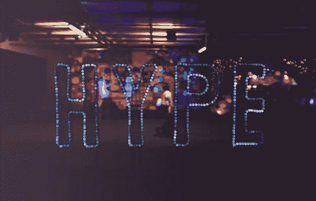

# ICO 僵尸来了

> 原文：<https://medium.com/hackernoon/ico-zombies-are-coming-cc505184cab5>

众所周知，越来越多的创业公司通过 [ICO 机制](https://hackernoon.com/tagged/ico-mechanism)筹集资金。他们中的很多人都做得非常成功，我要说，比传统的创业世界中的风投和天使投资人要成功得多，他们肯定更挑剔。

Image [source](http://maxpixel.freegreatpicture.com/Bitcoin-Currency-Decentralized-Coin-Money-Virtual-2008262)

我们都意识到这些 ICO 创业公司(他们的商业模式)大部分都会失败。但是之后他们会怎么样呢？

在“传统”世界中，当一家公司资金耗尽时，它要么破产，要么被其他公司收购(为了人才或专利)。但是在密码世界里，事情可以走一条令人惊讶的新路。

# 僵尸创业之路

想象一个创业公司做了一个成功的 ICO。之后，他们扩大他们的团队，开始构建他们伟大的去中心化想法，并推出第一个版本(让我们忽略一个事实，那就是大多数人可能不会走到这一步)。

他们的小 bagholder 社区非常激动，人们开始试用该产品。象征性的价格是 mooning 和兰博基尼巡航。

Image [source](http://maxpixel.freegreatpicture.com/Restaurant-Night-Lights-Dark-Bar-Celebration-2589458)

但很快炒作就消失了，“活跃用户”KPI 呈急剧下降趋势。人们回到他们旧的，更快，更便宜，更稳定和功能强大的集中式解决方案。

初创公司竭尽全力:增加新功能，降低费用，投入大量资金进行营销等等。但结果喜忧参半。他们获得了一些新的活跃用户，但总的来说，他们没有产生足够稳定的月收入来实现收支平衡，更不用说成为他们一直梦想的数十亿美元的独角兽公司了。

# 幸运的是，他们仍然拥有大部分的 ICO 基金

你看，他们没有把他们所有的 BTC 和瑞士法郎转换成菲亚特，除了每个月小部分用来支付工资。

与此同时，以太和比特币的估值正在稳步上升，这基本上意味着它们消耗的越来越少(它们不得不出售更少的密码来弥补支出)。所以即使公司的核心业务收入很少，但由于他们 ICO 的资金，它仍然可以存在几十年。

# 他们变成了僵尸 ICO 公司

Image [source](http://maxpixel.freegreatpicture.com/Walking-Dead-Halloween-Zombie-Parade-Costume-278755)

很难说怎么看待这类公司。一方面，他们雇佣了一些人，这通常是件好事(失业率更低)。但另一方面，也有机会成本，因为这些员工可以做一些更有意义的事情。

此外，如果(或当)在某个时候，创始人发现他们的 ICO 想法是狗屎，永远不会工作，但因为他们还没有用完 ICO 的钱，他们只是让字谜游戏继续下去，并在每个新年前夕宣布即将到来的一年是一年。至少从道德角度来看，他们应该关闭公司，把钱还给代币持有者。但是那些有家庭和孩子的员工呢…这是一个艰难的决定。

> 不要把僵尸 ICO 创业公司和僵尸代币混为一谈，正如本文中[所解释的。但是僵尸创业公司很可能也有僵尸代币，所以有一些共同点。](https://hackernoon.com/the-coming-era-of-the-zombie-token-707350b34b42)

请在下面的评论中告诉我你的想法。如果你喜欢这篇文章，请点击按钮；)