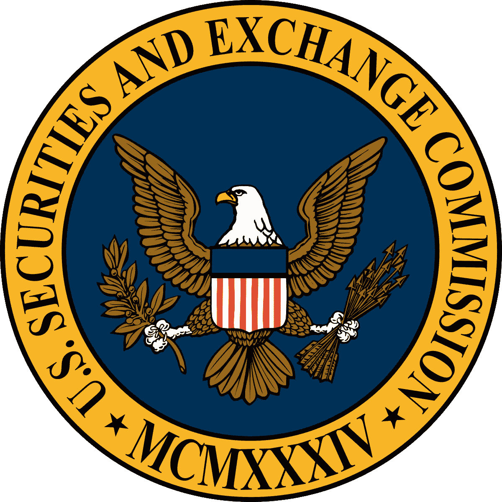

# ico 和代币权:治理的需要

> 原文：<https://medium.com/hackernoon/icos-and-token-rights-the-need-for-governance-4fc836e91d36>

# **资本主义和投资**

资本主义独一无二的历史性创新是其对资本所有权的 T2 化。资本主义是建立在一个产权体系之上的，这个体系允许个人或公司积累、拥有和配置资本以获取利润。资本、产权和动物精神的结合释放出巨大的[生产力](https://hackernoon.com/tagged/productive)能量，在过去的 300 年里重塑了世界。

20 世纪 60 年代，风险资本作为一种新的资产类别出现，旨在寻找建立大企业的企业家，并给予他们实现目标所需的资本——并在此过程中为每个人带来健康的回报。历史上，风险资本一直专注于股权投资。投资者进行投资以换取公司的股权，即公司的部分所有权。股权投资——通过优先股——赋予投资者几项重要权利，包括:

*   信息权利
*   残余财产分配优先
*   董事会席位
*   比例权利

这些权利有助于保护投资者和他们的资本，并使他们有权对公司的发展轨迹发表意见。投资在企业家和投资者之间创造了一种伙伴关系，理想情况下，这种伙伴关系是他们都认同公司的目标和使命。

但是代币持有者也有权利吗？如果是，这些权利会是什么样的？ICO 通常发生在公司的早期阶段，虽然在许多方面它们类似于上市，但 ICO 融资在功能上类似于首轮融资的预种子，使公司能够建立核心产品和团队。一个主要的区别是，在传统的种子前期和种子期，企业家出售他们公司 15%到 25%的股份。相比之下，ico 涉及在网络上销售 50% — 75%的令牌。

# **令牌权限**

代币在两个重要方面不同于股票:效用和流动性。大多数代币是所谓的“实用工具”或“平台”代币，这意味着它们被设计用于提供特定商品/服务的特定平台。因此，代币使其所有者能够访问否则无法访问的商品/服务(或者在该价格点无法访问)。股权并没有同等的功能。同样，代币具有很高的流动性。ICO 之后，代币市场立即建立起来，如果你愿意，你可以立即转手。在公司上市之前，风险资本投资的股权不会变得具有流动性，即使上市，也有一个持有期。

代币特别有趣的是，它们是“篮子证券”。发布的大多数协议都是为了允许其他开发人员在它们之上构建应用程序。因此，与该协议相对应的令牌的价值将部分取决于在[协议层](http://www.usv.com/blog/fat-protocols)上构建的所有应用程序的流行度和使用情况，而不仅仅是发布该协议的公司构建的应用程序。令牌的运作方式类似于指数基金，因为它们根据该协议跟踪经济活动的“总价值”。

虽然 2017 年是 ICOs 的蛮荒之年，但 2018 年看起来可能是监管生效的一年。根据美国证交会——现在是全球大多数监管机构——的说法，代币在很大程度上看起来和感觉都像证券。

> “证券发行结构的改变并不会改变这样一个基本观点，即当证券被发行时，我们的证券法必须被遵守。”
> 
> “总的来说，我所看到的推广的首次硬币发行的结构涉及证券的提供和销售，并直接涉及到证券登记要求和我们联邦证券法的其他投资者保护条款。”
> 
> [证交会主席杰伊·克莱顿](https://www.sec.gov/news/public-statement/statement-clayton-2017-12-11)

作为一种筹资机制，ICO 的部分成熟将是建立投资者应获得何种权利象征所有权的框架。理想情况下，市场会自我监管并建立这些框架，但如果市场不能做到这一点，监管者就会介入。

区块链世界的治理有两种含义:协议的激励结构和设计，以及一旦协议在世界范围内发布，协调协议变化和演变的机制。以下权利跨越两种治理含义。议定书的设计及其未来的协调机制是密切相关的。

# **令牌权模式**

效用权本身不足以证明一个令牌的存在。从商业角度来看，这似乎也适得其反。当接受美元同样有效时，为什么要制造一个令牌来故意增加获取你的商品或服务的摩擦呢？虽然公司可以从象征性价值的升值中获益，但这远非板上钉钉。相反，这里有一些证明令牌存在的初步令牌权利。

**块创建权**

关于在电力方面达成共识的工作证明系统有多昂贵，已经有很多文章。切换到利益相关证明是一种逻辑上的改进，但是这样做需要协议具有令牌。例如，DFINITY 协议就是这样设计的。10%代币的持有者能够与该股份成比例地验证网络上的交易。

这个模型的一个有趣的变体是 Komodo 协议。在科莫多协议上，64 个公证节点处理比特币区块链公证。这 64 个节点由科莫多币持有者选举产生。因此，令牌所有权授予持有者在网络中作为验证者发挥积极作用的权利。

**信息权利**

第二种模式是，一旦投资者达到代币所有权的某个门槛，就向他们提供信息权。如何计算这一阈值可以有不同的方法。该权利旨在为主要投资者在 ICO 期间或之后提供有关其投资状态的额外信息。随着时间的推移，这些主要持有人可能会清算他们的头寸并跌破阈值，这可能会导致没有代币持有人最终持有足够的头寸来赋予他们信息权利。

一种不同的方法是在 ICO 后的有限时间内授予 ICO 的每个投资者信息权利。

**投票权**

区块链第一次让数字自治组织得以创建和测试。但是，与任何分权社区一样，治理是决定社区长期健康的关键因素。作为分散的社区，协议的长期健康取决于其用户网络的强度和参与度。这种治理权是分布式自治组织的一个基本特征。虽然迄今为止很少有成功的例子，但是随着协议的成熟和不断发展，治理将变得越来越重要。

围绕一个协议的用户网络在功能上类似于开源社区，最成功的开源项目通常得到最好的治理。代币不仅提供了潜在的贡献奖励机制，还提供了潜在的投票机制。

**按比例分配权利**

ICO 的投资者也可以在后续的代币销售中获得按比例分配的权利。这可以像传统的股权投资按比例分配权利一样进行构建——允许投资者投入一定数量的资金以维持其所有权——或者允许 ICO 投资者投入与最初 ICO 相同的资金。

这种按比例分配的权利可能会扩大到包括基于该协议的其他应用程序，这将使它成为投资者的一项极其强大的权利——特别是对于成功的协议。

# **结论**

2017 年显示了企业家和投资界对 ico 的巨大热情。这是对私人市场和公共市场的颠覆性替代，是一种有可能将两个世界的精华结合在一起的混合体。但监管到位后的 ico 可能会与我们在 2017 年看到的情况截然不同。

围绕令牌权的框架开始出现符合协议和投资者的最大利益——既有利于协议的长期健康，也有利于 ico 和筹资机制的长期可行性。