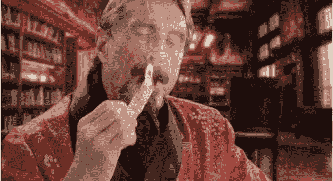

# ICOs:靠类固醇拉屎

> 原文：<https://medium.com/hackernoon/icos-bullshitting-on-steroids-7b8ce32bce96>

来自[社会资本](https://medium.com/u/f2d7634417ef?source=post_page-----7b8ce32bce96--------------------------------)的 Chamath Palihapitiya 至少对我来说，是风险投资界最有影响力的创新者。他也是一个非常坦率的人。在斯坦福大学的 [**面试**](https://youtu.be/PMotykw0SIk) 中，他对创业世界发表了令人印象深刻的评论:*“…每个人都在胡扯。这就是它的意思…如果有人看着你，告诉你他们知道他妈的他们在做什么，他们在撒谎。*

更令人印象深刻的是，他将自己的论点建立在数据分析的基础上，宣称自 20 世纪 70 年代以来，最大公司中只有 2%的硅谷投资者出现重叠。这意味着没有一个投资者找到了如何合理分配资本以及如何挑选赢家的神奇公式。对于高净值人群来说，这只是一个猜谜游戏。我看到另一个分析，说 92%的创业公司在 3 年内失败…

去年人们过量使用了密码。我最近开始做一个 ICO 项目，对 ICO 基金完全陌生。让我告诉你，这里的每个人都在胡说八道，但这一次，是在胡说八道。

# **白皮书**

比特币是通过发布一份 [**白皮书**](https://bitcoin.org/en/bitcoin-paper) 开始的，即使没有创始人，它也存活了九年。考虑到它到今天为止已经死了 315 次[这是多么巨大的成功。如今，所有的加密项目都试图模仿这一过程，但与比特币的区别是巨大的。](https://99bitcoins.com/obituary-stats/)

比特币创造了一个围绕一个想法的开源社区。另一方面，ICO 项目通过私下销售从风投那里筹集资金，只有这样，他们才能利用白皮书来召集社区，并得到风投资金的大力支持来进行营销。白皮书已经成为推介创意的标准方式，尽管这种形式对投资者来说非常不规范。没有人能够真正理解它——它意味着什么，商业模式是什么，背后的数据是什么，预测和场景是什么。很难把白皮书看作是一种旨在让项目看起来更好的营销工具。

请记住，至少货币的估值是可疑的。如果产品没有准备好，货币的真实价值是什么？还是 mainnet 还没发布？还是说那些每秒 x 千次的交易只是理论上的？用一个无政府主义式的文件来要求传统基金投资，不是很疯狂吗？投资人参与进来不是更疯狂吗？

外面有多少白皮书？大概 70 万。迄今为止，在大约 1500 种货币中，有 700 多种代币已经变得一文不值。*只是说…

# **ICO 评级**

由于白皮书已经成为一种标准化的项目推介形式，对于初创企业的推介来说非常不标准，所以没有人知道他们真正在说什么。这个项目好吗？是真的吗？能成功吗？

ICO 评级机构希望将更多的光和专业精神带入其中，并开始为 ICO 项目提供尽职调查服务。然后将他们的 DD 提供给他们的潜在 ICO 投资者社区，并公布评级。

我个人认识的 [**其中一个**](https://icoindex.com/) 是我尊敬和信任的。他们由 DD 项目支付报酬，尽管如此，他们还是公开宣称这些项目是骗局。

也许外面有更多诚实的人。但请记住，他们的商业模式是为你提供尽职调查的报酬。所以，在动机上有这种二分法。一方面，他们对社区的信任是他们永远不能打破的。另一方面，一些 ICO 评级机构对 DD 收取 20 比特币。

# **顾问**

John McAfee's net worth declined from 100M $to 4M$ after the markets crashed in 2009\. The picture has nothing to do with this information.

顾问角色的最初想法是给予区块链初创公司可信度，提供网络和指导，帮助投资者入伙，有时甚至做市场营销、公关和/或业务发展方面的具体工作。

咨询已经发展成为一个巨大的业务领域。一些个人以创始人的名义经营中小型公司，提供咨询服务。他们通常会收取巨额费用，仅仅是因为你的白皮书和网站上有他们的名字。价格从 5 万美元左右开始。

你不应该付这种钱。如果非要，说明两件事:你的项目是屎你很绝望，或者你他妈的蠢，活该。这些顾问代表几十个项目，很多时候甚至不考虑他们代表谁。一切照旧。越来越多，他们的声誉在加密社区恶化，因为我们已经看到第一次失败的项目，或者在许多支持的 ico 上没有回报。如果你现在用谷歌搜索任何有顶级顾问名单的 ICO 评级机构，你就会知道我指的是谁。检查他们的背景。如果这位顾问在 Crypto(公元前)之前是一名记者，你知道我要说什么……如果他/她以前建立过大公司，那就值得考虑。

机器人先生，又名约翰·迈克菲，在他的 82.8 万粉丝网络中发布一条推文收费 10 万美元，他在你的顾问委员会中的角色收费 25 万美元。这基本上意味着更多的推文。我在 LinkedIn 上找到了一份不错的联系人名单，他们都有类似的糟糕提议。

那么，既然你真的需要一个高质量的团队和高质量的顾问，如何解决这个问题呢？卷起袖子，与每一个人进行深入的谈判。链接一切与一个关键绩效指标，如投资者介绍数量，公关文章发表数量，每月分享数量。根据这些结果每月发放资金，并实施授权期。不要给没有保证的免费资金，而要另找顾问。

# **社区**

你不应该相信这些数字。有许多不为人知的膨胀方式。你可以购买追随者，创建假档案，你说吧。许多社区成员只是机器人，尤其是在赏金猎人的时候。建立一个充满活力的社区是一件相当了不起的事情，它既经过 bot 过滤，又引人入胜。但是如果你成功了，这个社区可以为你做很多工作，大幅降低你的营销成本，甚至为一个当地的印尼团体打印他们自己的 t 恤。重要的是，你不仅要雇佣社交媒体经理，还要以创始人的身份参与到社区中来，并且 [**向最优秀的**](https://hackernoon.com/improve-your-bounty-campaign-efficiency-e3de0e8f9def) 学习。

# **赏金猎人**

这是另一种形式的秘密工作，主要针对有互联网连接的低收入人群。在你希望的任何渠道增加你的追随者数量，并开始通过分享、评论或向人们推荐该项目来赚取代币。问题是大多数猎人有很多工作，平行于你的 ICO，他们为 50 个其他项目做同样的事情。

# **ICO 机构**

另一个潜在的生意。营销代理工作 3 个月 40–160 比特币？哇哦。这些是我们收到的报价。他妈的..，什么…，为什么…？我不明白…

# 事件

在欧洲有一个未命名的 ICO 投球比赛，前三名获胜者获得巨额奖金，并在主要交易所上市。最终，出于纯粹的巧合、历史同步性和深奥的关联性，其中一名评委碰巧也是获胜者的顾问。像这样的事件还有很多。如果这不是一个直接的骗局，那么它就是一个关于投资者和参与者数量的间接营销胡扯。同样，不要支付过高的出席费用，如果你要参加一个活动，确保你提前建立关系网，准备好自己的会议日程。

# **你的伙伴**

选择伴侣时要小心。如果看到一个项目在 16 秒内筹集了 3000 万美元，即使是诚实的人也可能会陷入抢钱炒作。你应该始终评估每个人的动机，以及它可能会如何随着时间的推移而变化。

所有这些狂野西部的问题只有一个答案。我们不喜欢它，但它是…慢下来。放轻松，尽可能长时间地引导。开发一个诚实的社区，让所有需要的人参与进来，而不是付钱给他们，当你有一个有效的 PoC 时，提高市场营销的最低有效资金量。

想在西部荒野保持诚实吗？好吧，祝牛仔们好运！