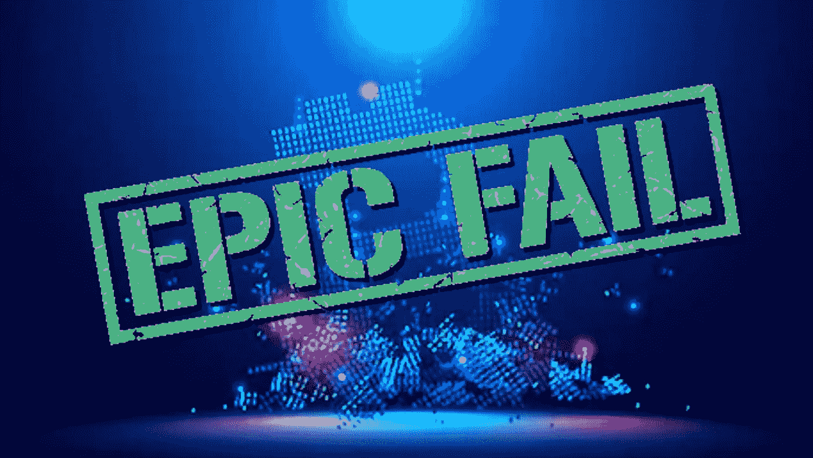
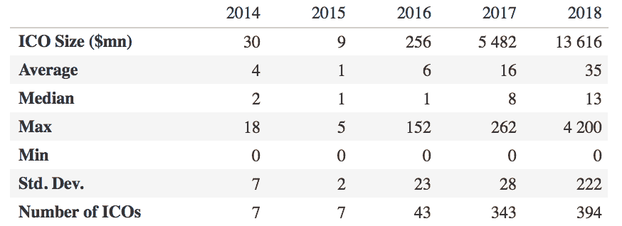
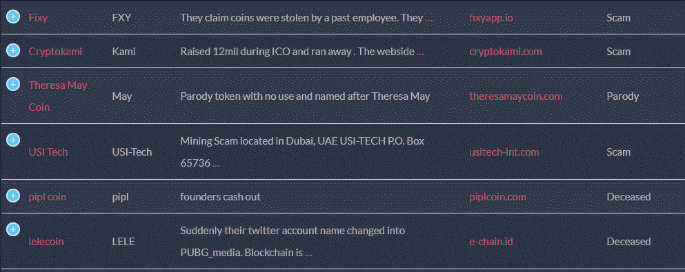
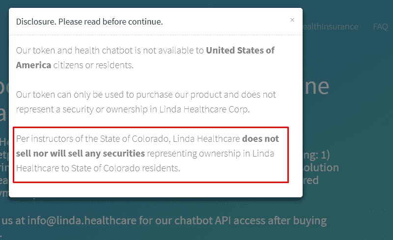
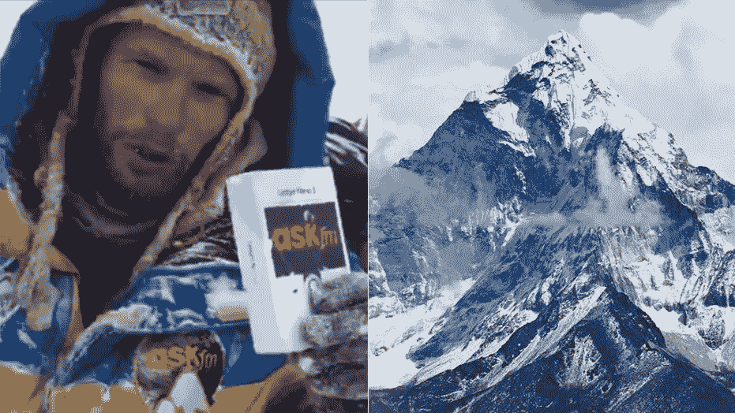

# 2018 年 ICOs 史诗般的失败——从一开始就注定了

> 原文：<https://medium.com/hackernoon/icos-epic-failures-of-2018-doomed-from-the-start-814e4a9645bc>

## ICO 市场上有两种消息:好消息和坏消息。更有意思的是，两者都是彼此的逻辑延续。

# 好消息是

ICO 市场持续增长。现在比以往任何时候都更明显的是，加密货币将在这里停留很长一段时间。只要看看 2018 年全年 ICO 增长对比往年的统计数据就知道了。增长是明显的。

*2018 年，ICO 比 2017 年增长了两倍多。这说明了很多问题。*

难怪 ico 有望成为融资的主要方式，包括超越风险投资。如果这真的发生了，我们所知道的创业成长的概念将会发生巨大的变化。而不是现在的 VC 疯狂，我们即将看到的是 ICO 疯狂。

# 坏消息来了

其实 ICO 疯已经有了，只是不是以一种好的“无害”的方式。当我们说“疯狂”时，我们的意思是有人被愚弄，金钱损失，泡沫破裂。我们刚刚过了 2018 年的一半，这六个月足以让 1000 个 ico 倒闭和消失，当然还有所有收集的资金。

**这一切都是骗局吗？**

不是一切，但是，绝大多数确实是一种时尚。Dead Coins 是一个收集失败的 ICO 项目数据的平台，它将这些项目分为以下几类:

*   骗局(有人故意搞砸别人)
*   黑掉，那些被黑掉的可怜硬币
*   已故(那些失败者-没有成功的 ico)
*   模仿——这是为了给投资者上一些课，主要是如何识别劣质股票。

*这份名单不乏欺诈性的提议。想象一下有多少还没有被发现。*

是的，公开募股失败，成为一个大新闻——或者联邦犯罪(这取决于 ICO 的性质)。然而，让我们不要把注意力放在完全彻底的骗局上，而是把焦点转移到那些“已故的”骗局上。什么会出错，ico 为什么会死？

*我们来调查一下。*

# 2018 年 5 大失败 ico

*可能只是开始*

## **厄运# 1——与错误的 ICO 广告合作伙伴合作**

如果你打算很快推出一个 ICO，要提防不靠谱的合作伙伴。一些广告和公共关系提供商没有帮助开发产品，而是反其道而行之，欺骗企业主，将 ICO 和产品的声誉都扔进垃圾桶。

**莫伊拉语**

很难预测一个雄心勃勃的未来预测平台会在 ICO 发布时失败，尤其是对那些投资了该平台的人来说。一个创新产品不知何故无法达到他们的软帽，因此，成为死亡——就像许多其他竞争对手。

正如该网站解释的那样，该平台被 ICO 广告公司搞砸了，正如 Moirai 所说，“拿走了投资者的钱，并拒绝退款”。

**后果**

人们并不真的关心是公司出了问题还是他们的伴侣出了问题。可能单调乏味的审判在某种程度上有助于恢复正义，但没有多少客户和投资者会留下来看这种情况发生。

事实上，莫伊拉伊案证明了这一点。尽管(如该公司所声称的那样)ICO 的巨大失败并不是他们的直接失败，[客户和投资者仍然自然而然地指责该平台欺诈](/@francoisphuk/moirai-ico-it-is-a-scam-stolen-money-from-investors-e86fea7ac0bb)。供品死了，钱没了，没人在乎你的解释。

## **厄运# 2——不值得信任的创始人**

你知道他们怎么说鱼是从头开始腐烂的吗？有了 ICOs，这种说法几乎在所有时候都被证明是正确的。要评估加密货币的成功几率，看看他们创始人的简介。在这种情况下，这是不言自明的。

**密码本**

CryptoCopy 通过存储成功投资者的联系信息，并使用智能合同监控每一笔交易，优化了投资流程。在这种情况下，你真的不需要一个预测算法来判断这个 ICO 从一开始就注定要失败。

事实上，ICO 是由伊戈尔·曼延契奇(Igor Manjencic)创立的，他也创造了一种富有的硬币，这种硬币在 2016 年失败了。在前一个项目失败后不久，决定开始下一个项目，但显然，错误没有被考虑在内。不要放弃第二次机会，不要冒险把钱投入到创始人可能会以任何方式怀疑的货币中。

**后果**

大多数活跃用户被承诺获得平台利润的 10%,但实际上一无所获。最糟糕的是，所有令人担忧的迹象都在表面上，很容易被及时发现。

**琳达健康币**

## **厄运# 3——法律问题和缺乏必要的政府协议**

作为一名成功的 ICO，同时应对调查是极具挑战性的。处理法律纠纷并保持领先地位实际上并非不可能，但在加密货币竞争激烈的时代，此类事件会很快发生。

该平台旨在提供一种智能医疗解决方案，可以根据患者的医疗报告建议治疗过程中的一些变化。开发人员甚至集成了人工智能系统，以确保该平台将不断学习，并在诊断方面变得更好。

然而，事情并没有按计划进行。就在最近，美国科罗拉多州的证券监管机构发布了一项停止令，停止了琳达健康硬币(LNDA)的首次硬币发行(ICO)，他们认为这是一种未注册的证券。

整个过程从 5 月份开始，甚至导致这家初创公司停止在科罗拉多州的领土上销售他们的 ICO(该网站甚至有一个弹出窗口显示同样的内容)。

当你在 ICO 的网站上看到这样的东西，这意味着投资可能不是最好的主意。

# **结论**

所有的[文档](https://docs.triggmine.io/Whitepaper.pdf?_ga=2.170787043.256803006.1533887871-1787694175.1526384191)都很重要。在监管不那么严格的 ico 世界里，人们很容易忘记法律限制仍然存在，它们可能会变得相当糟糕。对于 Linda Health Care 来说，投资披露的缺失足以造成巨大的麻烦。

这就是科罗拉多新闻在这个话题上所说的

> *然而，州监管机构指出，代币的潜在买家“没有被告知投资加密货币的风险”，称该公司网站上一个声称 ICO 构成科罗拉多州一种证券的弹出窗口“可以被关闭，很容易被忽略。”*

## **厄运# 4——目标过高的促销**

或者确切地说，和珠穆朗玛峰一样高。对于 ico，促销活动经常不合时宜，最终只会损害加密货币的声誉。

**Askfm 和他们的珠穆朗玛峰货币**

最受欢迎的社交媒体之一 Askfm 想要做大，但却被迫回家。事实证明，通过派遣密码爱好者登上珠穆朗玛峰来推广 ICO 的想法并不是最安全的公关噱头。

这个策略看起来很棒，直到其中一个狂热爱好者在探险中死亡，现在被认为已经死亡。当然，它扼杀了加密货币的声誉，成为如何不建立传播策略的宝贵一课。

# 担保呢？

我们已经提到，一个像样的产品有很好的信息支持，公司非常关心自己的声誉。看看营销自动化平台 [Triggmine](https://triggmine.io/) 在 2010 年 8 月推出其 ICO 之前，以 [4XStake](https://stake.triggmine.io/) 商业模式证明自己的合法性:

*   *购买低于票面价值 4 倍的 4XStake (300 000 TRG)的可能性*
*   *平台的扩张和有限的数量保证了对 TRG 股份的需求*
*   *40 个潜在合作伙伴(在签署 NDA 和合同阶段)和自己的工作产品*
*   *TRG 股份和 4XStake 的购买/出售的透明度由智能合同保证。*

说到担保，就应该是这个样子。你给予尊重——你得到尊重。

> **保证是诚实、透明和互利的同义词。**

# 如何在失败之前发现可能的失败？

没有 100%证明的算法可以找到合适的加密货币，并识别出不好的加密货币。但是，根据我们分析的案例，在选择投资产品之前，请考虑以下标准:

*   确保公司有已发布的产品。如果你投资区块链平台发行的 ICO，确保它发行成功。为此，您可以阅读评论，请求演示，联系团队以获取更多信息。
*   检查团队的声誉，尤其是创始人的可信度。在匆忙做出决定之前，确保你不会加入一艘正在下沉的船。如果公司的开发人员太少，这可能是危险的信号(谁知道如果其中一人离开公司会发生什么)。查看团队成员之前的项目，避免有经验的骗子。
*   看看 ICO 的创造者与潜在投资者沟通的方式。查看社交媒体，进入电报频道，联系支持部门。沟通应该清晰及时，否则会引起怀疑。
*   深入挖掘促销策略。如果你看到太多免费赠送的代币，或者大量的折扣，可能是 ICO 已经在下沉。
*   不要买所有像珠穆朗玛峰探险这样的“额外”东西，它总是可能出错。

如果 ICO 提供商没有给你看似合理的担保，明确要求他们或寻找更安全的投资替代方案。公司越清晰地传达合作的过程、好处和保证，失败的几率就越低。