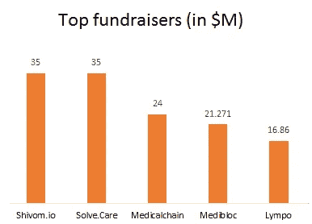
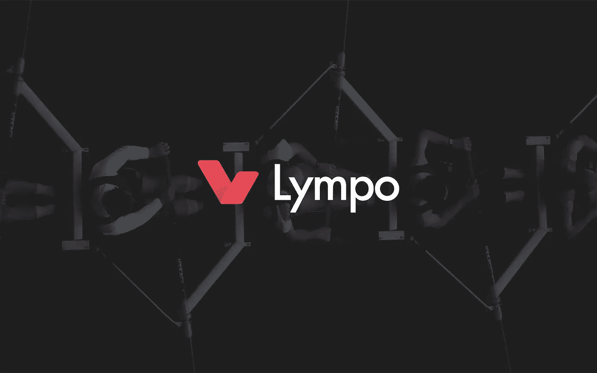

# 医疗保健行业——ico 仍在成长

> 原文：<https://medium.com/hackernoon/icos-in-healthcare-industry-detailed-healthcare-ico-sector-analysis-dd73766e809>

Source: InWara’s ICO database

# 医疗保健行业的 ico:效率统计

医疗保健行业似乎正在以众筹为基础的 ico 领域迈出缓慢但稳健的步伐。随着 ICO 格局的演变，谨慎的投资者有望尝试挑选赢家。在这场争夺秘密荣耀的竞赛中，一个新兴领域似乎是医疗保健。

医疗保健 ico 在已经低迷的 2018 年第三季度蓬勃发展，从 2018 年 Q2 的第 17 位跃升至 2018 年第三季度的第 8 位。增长虽然缓慢，但稳定而坚实。

Healthcare among the Top 10 sectors of ICOs in 2018 (Source: InWara Q3 report*)*

> [下载报告](https://www.inwara.com/report/healthcareicosreport/2-uncategorised/18-healthcareicosreport?ml=1)

# 地理展望

美国:医疗保健 ico 在美国受到了极大的关注，在美国，国家对医疗保健的贡献率为 29%，与总贡献率 29%一致。

俄罗斯:有趣的是，俄罗斯在医疗保健领域出现了显著的增长，前苏联有 6 个 ico，项目包括筹集超过 1000 万美元的冷冻剂。

英国:英国也已成为领先的地理位置之一，5 个 ico 总部设在这里，筹集超过 6500 万美元。

Source: InWara’s database

# 风险资本活动

虽然公众对医疗保健的整体兴趣已经被激起，但风投们正在放慢脚步。尽管 2018 年第三季度风投的投资势头强劲，但在大多数行业，医疗保健领域的风投行动有限。

[Patientory](https://patientory.com/) 筹集了四轮资金，而 Burst IQ 筹集了三轮资金。有趣的是，这些融资中的大部分来自医疗保健行业的风投，而不是一般的区块链/数字资产累加器。这让普通投资者想知道，区块链是否被用作一种强制手段，而不是医疗保健领域的自然现象？

Source: InWara’s Private funding database

# 医疗保健行业中活跃的风投

## [医疗技术创新者](https://medtechinnovator.org/)

医疗技术行业的加速器和风险企业为造福患者和提供更高医疗保健价值的变革性创新而竞争。

## [千年区块链](https://mblockchain.io/)

千禧区块链是一家国际控股公司，专注于积极投资和共同管理区块链公司和技术。

## [启动健康](https://www.startuphealth.com/)

组织、支持和投资全球健康变形人大军，实现 10 次健康登月，以改善每个人的健康和福祉。

## [500 家创业公司](https://500.co/)

500 Startups 是一家风险投资公司，其使命是发现和支持有才华的企业家，帮助他们创建大规模的成功公司，并建立繁荣的全球生态系统。

## [光伏企业](http://www.pvventuresllc.com/)

PV Ventures 是一家位于科罗拉多州的风险投资公司，投资种子期技术公司。

# 卢克热烈欢迎 ICOs 在医疗保健行业上市

Source: InWara’s database

只有 17%的医疗保健 ico 在交易所上市，这可能给投资者带来流动性问题。令人惊讶的是，2018 年与 2017 年相比，交易所的数量增加了近 25%，上市或其他可能是一个选择 ICOs，而不是缺乏交易所。

> [下载报告](https://www.inwara.com/report/healthcareicosreport/2-uncategorised/18-healthcareicosreport?ml=1)

# 医疗保健 ico 的投资回报(RoI)问题？

该行业可能会遇到初期问题，只有 17%的 ico 上市。这伴随着收益——与其他行业相比，医疗保健行业的指数化投资提供了相对较低的回报，只有 4 个 ico 产生了正回报。

Source: InWara’s database

# 医疗保健领域没有“重磅炸弹”筹款人

Source: InWara’s database

资金筹集一直存在偏差，前五大 ico 筹集了该领域总资金的 60%以上。此外，没有一家 ico 的融资额超过 1 亿美元。

# [希沃姆](https://shivom.io/)

Shivom: Founded in 2017

德国 Shivom 使用区块链来保护患者数据。Shivom 将使 DNA 数据捐赠者能够与生物技术、医疗保健行业和政府的变革者合作。Shivom 项目是这一发展的下一步，它在区块链创建了一个医学基因组生态系统。

该公司由 Axel Schumacher 领导，他在医疗行业拥有 24 年的经验，并拥有科隆大学的遗传学博士学位(1998 年)

# [解决护理](https://solve.care/)

SolveCare: Founded in 2017

Solve Care 是一个由护理组成的在线平台。钱包，小心。规矩，小心。硬币，小心。卡和其他组件，社区通过它们与客户进行联系。该平台使消费者能够有效地管理他们的医疗保健决策。

帕拉德普·戈尔是首席执行官，在医疗保健行业拥有 28 年的经验。

# [医疗链](https://medicalchain.com/en/)

MedicalChain: Founded in 2016

Medicalchain 使用区块链在单一版本中存储健康记录。

行业参与者(如医生、医院、实验室、药剂师和健康保险公司)可以请求获得访问患者记录的许可，以服务于他们的目的并在分布式分类账上记录交易。

该公司由首席执行官兼联合创始人 Abdullah Albeyatti 先生领导

# [医疗集团](https://medibloc.org/en/)

MediBloc: Founded in 2017

MediBloc 是一个建立在区块链上的开源医疗数据平台。它编制了所有患者医疗信息的完整索引历史，验证并保护一天中的每一项更改。

它可以安全地保护和整合来自各种机构的分散数据，也可以从智能手机等设备收集数据。该公司由在软件工程领域拥有 10 年经验的 Wookyun Kho 领导。

# [莱姆波](http://lympo.io/)

Lympo: Founded in 2016

Lympo 是一个基于区块链的移动应用程序，面向移动医疗行业。该生态系统将允许人们以 P2P 方式利用、控制和出售个人健康数据，消除第三方对个人健康数据的控制，以及对转售此类数据缺乏补偿。公司的首席执行官兼创始人是 Ada Jonuse，她在 IT 领域有 10 年的经验。

## 要获得所有 ICO 和私人融资轮的详细投资分析，请访问 InWara 的 [ICO 数据库](https://www.inwara.com/?utm_source=heathcareicos&utm_medium=heathcareicos&utm_campaign=heathcareicos)和[私人融资数据库。](https://www.inwara.com/?utm_source=heathcareicos&utm_medium=heathcareicos&utm_campaign=heathcareicos)

> [下载报告](https://www.inwara.com/report/healthcareicosreport/2-uncategorised/18-healthcareicosreport?ml=1)

免责声明:这不是财务建议。InWara 不提升/降级任何公司/ICO。本信息或其他媒体中的观点、陈述、估计和预测仅属于作者个人。它们不一定反映 Inwara 或其任何附属公司(“Inwara”)的意见。Inwara 没有义务更新、修改或修正此消息或其他媒体，或以其他方式通知其接收者，如果此处陈述的任何事项或此处陈述的任何意见、预测、预测或估计发生变化或随后变得不准确。本邮件或其他媒体中提供的任何内容、信息和材料均按“原样”提供。Inwara 对其准确性、完整性或及时性，或收件人获得的结果不做任何明示或暗示的保证，并且不对任何收件人在此的任何不准确、错误或遗漏承担任何责任。在不限制上述规定的情况下，Inwara 对任何消息或媒体的接收方不承担任何责任，无论是在合同、侵权行为(包括疏忽)、担保、法规或其他方面，对于此类接收方因其或任何第三方决定的任何行动、意见、建议、预测、判决或任何其他结论或任何行动过程而遭受的任何损失或损害，无论是否基于此处包含的内容、信息或材料。**