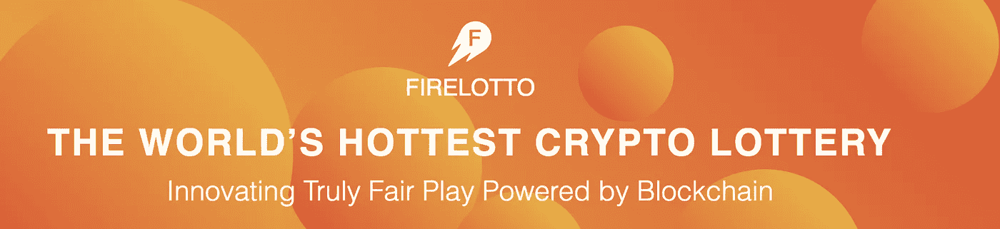
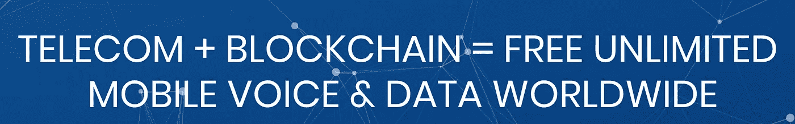

# 剩余的 ico 发布 SEC 新闻！(此外，明天还将列出本周最佳替代产品！)

> 原文：<https://medium.com/hackernoon/icos-that-remain-post-sec-news-plus-tomorrow-top-alts-for-the-week-are-listed-b4bf991fc85d>

SEC 最近重申了他们围绕 ico 和加密市场的阴谋。即使 SEC 目前正在进行“审查”,仍有许多 ico 可供公众使用。面对如此动荡的市场，密切关注即将到来的重要日期(本周有 5 个！)和不会屈服于 SEC 压力的 ico。

**本周有 5 个备用币(美国东部时间明天上午 11 点发布)可以“关注”，它们可以在以下交易所购买(点击链接注册):**

[**币安**](https://www.binance.com/?ref=15316928) **(3/5 可在此购买)**

****(5 只股票中市值最小的，可能涨幅最高的股票)****

**[**Bibox**](https://www.bibox.com/login/register?id=11305470&lang=en) **(本月新闻最大的 altcoin！)****

****下面列出了一些具有差异化产品的独特 ico。这些都经得起 SEC 的压力:****

****

**[**火乐透 ICO 首页**](https://firelotto.io/?ref=25407) **—区块链上的彩票****

**Fire Lotto 是一个加密 ICO，旨在改变彩票的举办方式。目前，彩票的最大受益者甚至不是彩票中奖者，而是州政府和联邦政府对彩票奖金征收的奇怪的税。**

**火乐透就很不一样了。这个密码计划将随机彩票带到安全的区块链。**

**大多数 ico 在拥有工作产品或原型之前发布。许多 ico 仅仅依靠一个团队和白皮书就筹集了数百万美元。不是火乐透，他们有一个已经成功推出的成品。**

**许多彩票被指控欺诈，甚至麦当劳的大富翁游戏也在多年前陷入困境。Fire Lotto 开发了一种独特的一键式机制，非常快速、方便和安全。**

**FLOT 的一个独特之处在于，当彩票中奖时，每个代币持有者将获得 10%的红利。整个彩票的 70%一次性支付给获胜者，10%给 FLOT(火乐透代币)的持有者。这就把 20%留给了团队、法律和基础设施来维持网站的运行。**

**与你在“真正的”彩票中获得的微薄的 25%相比，FLOT 支付了 70%(当然扣除了税收)，而这很可能是由政府运营和征税的。此外，FLOT 的持有者都能从全部彩票中获得红利。随着区块链的彩票作为公众彩票的替代品越来越受欢迎，这种红利将会不断增长。**

**[**链接到注册页面购买火乐透代币(FLOT)**](https://firelotto.io/account.html?ref=25407)**

**(在页面底部注册成为投资者，购买 FLOT！)**

****

**[**维斯塔林 ICO**](https://www.vestarin.io/?ref=38b3eff8baf56627478ec76a704e9b52) (欧洲的丹·布利泽里安加上一个功能样机)**

****

**Vestarin 的预售 ICO 期最近刚刚结束，因为他们达到了预售硬上限。他们在预售期间筹集了 3000ETH，并正在全力推进他们的 ICO。在常规 ICO 期间，VST 将降至 1500 vst/1 ETH 的比率。目前你的奖金比例仍然远远高于这个数字！该团队由东欧的丹·布利泽里安领导(大量宣传)。另外，他们有一个原型，可以在他们的网站上看到和下载。在 ICO 奖金减少之前，这是一个不容错过的机会！**

**在这里购买 VST:[**Vestarin ICO**](https://www.vestarin.io/?ref=38b3eff8baf56627478ec76a704e9b52)**

**[**KYC 法律 ICO**](https://bookbuild.kyc.legal/?ref=23734776ffa2051a83eb8bc1) **(ICO 很快就结束了！)****

****

**超过其硬上限的一半，它有能力解决区块链和 ICOs 的最大问题之一。《了解你的客户》(可怕的 KYC 表格)。如果你最近完成了一个 ICO，你就会知道我所说的形式。KYC 称他们的概念是区块链“个人身份的通用替代品”。他们的 ICO 很快就要结束了，最终 ICO 价格仍有 8%的折扣。**

****此处购买 KYC:**[**KYC 法律 ICO**](https://bookbuild.kyc.legal/?ref=23734776ffa2051a83eb8bc1)**

**[**【VINChain ICO】**](https://vinchain.io/?aid=5a91d4c3c10da)**(在区块链上放置汽车的历史)****

****

**在软封顶之前，VINCHAIN 目前每季度提供 24，000 瓶葡萄酒。硬性上限是 23,250 ETH(约 2000 万美元)。VIN 从非常微薄的奖金开始，并且在达到软上限后只会继续减少。汽车在区块链的历史，保证篡改里程表和事故不再发生。任何市场采用的 VIN 都将是巨大的！**

****在这里购买 VINChain:**[**VINChain ICO**](https://vinchain.io/?aid=5a91d4c3c10da)**

**[**Mobilink ICO**](https://dashboard.mobilink.io/?ref=94815b7c)**(全球无限免费蜂窝服务和数据…)****

****

**Mobilink 承诺在全球范围内免费提供语音和数据。没有漫游，没有手机话费。用户只需更换 Mobilink SIM 卡，就可以开始使用了。当用户不使用他们的电话进行通话/数据传输时，SIM 卡自动播放广告，并且该广告覆盖了与电话使用相关的“成本”。用户从来没有话费！此外，他们实际上可以通过 Mobilink 币收听更多广告！**

****在这里购买 Mobilink:**[**Mobilink ICO**](https://dashboard.mobilink.io/?ref=94815b7c)**

****insta gram:JaketheCryptoKing****

****推特:JbtheCryptoKing。****

****现在王国不和:**[**https://discord.gg/qTjQp8W**](https://discord.gg/qTjQp8W)**(加入 4000+王国！).****