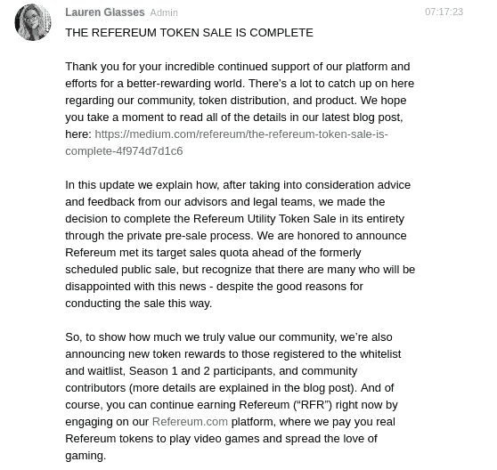

# ICOs:社区做营销，大投资者抢代币

> 原文：<https://medium.com/hackernoon/icos-the-community-does-the-marketing-large-investors-grab-the-tokens-2551bba51e1f>

## ico 如何变得越来越不公平，创始人可以做些什么。

当你在德国出生和长大时，你是世界上最有特权的人之一。你可以去 161 个不同的国家旅行，每个人都会欢迎你和你的钱。在处理财务问题时，德国护照真的会很方便，以德国人的平均收入，你会比大多数人有更多的“闲钱”来支付月租金。这就是我投资第一个 ICO 时的想法:‘损失 50，-美元不会有太大伤害，你不会错过他们’。事实证明，在 2017 年，只要 50 美元，你就可以在 ICOs 上获得四位数的收入。

回到一年前，你有许多伟大的项目，你可以用仅仅 50 美元投资。这已经改变了。如今，大多数代币销售不仅贡献最小，而且还会施加管辖和组织方面的限制，使得在首次代币销售中获得一席之地变得越来越困难。这变得如此困难，以至于我作为一个享有特权的德国公民都难以在今天的 ICOs 中找到自己的位置。

让我们来看看这些数字:加密货币是一场全球性的运动。在电报组和论坛里，你会遇到来自世界各地的人。事实上，如果你仔细观察，你会发现很大一部分 ICO 粉丝是西方工业化国家以外的人。一旦你忘记了自己受过良好训练的西方中心主义世界观，这就不足为奇了。单纯从数量上看，我们欧洲人和北美人都很小。除此之外，投入 ICOs 的大量工作并不是来自我们这些享有特权的西方人，他们每年有超过 10，000 美元的预算花在区块链上；它来自那些认为 50 美元投资是一大笔钱的人。由于这是一大笔钱，这些人在“他们的”ico 营销上投入了大量精力。

没关系。在印度的大部分地区，你通过参与赏金活动获得的相对较少的菲亚特等值物比在比利时更有价值。确实有回报。然而，加密货币曾经是社区驱动的努力。在分散系统中最重要的是权力下放，权力下放来自于将运行分散系统(采矿)的工作及其优点分散给尽可能多的人。有些人可能会说，比特币的财富分配远非平均分配，我同意这一点。但与比特币相反，许多新的区块链项目，尤其是那些提供 ICO 的项目，有越来越多的进入壁垒，从一开始就阻止了(可能的)收入的公平分配。记住:如果它不对所有人开放，它就不是一个市场。

# 84%的代币以私下和预售方式销售

两件事让加密货币变得越来越不公平:

1.  禁止某些国家的公民参与人群销售的法规
2.  组织混乱的 ICOs

虽然第一个超出了加密领域的控制，但第二个确实有很大的改进空间。尽管如此，似乎 ico 越受欢迎、越复杂，你的贡献就越不可能受到欢迎——不管是因为你的国籍“错误”、网络连接速度慢、资金不足，还是仅仅因为你不够幸运，不能按时到达。在 2018 年的前两个月，已经在最初的硬币发行中筹集了 20 亿美元。高达 84%的[在私人和预售期间售出](https://news.bitcoin.com/icos-raised-2-billion-year-mostly-private-sales/)，只剩下 16%给公众。一些公司声称要为 XY 建立一个公平的分散系统，甚至完全跳过任何形式的公共贡献。这是对 Satoshi 愿景的一种侮辱，他的愿景之一是任何人都可以进入。如果一家公司(或一个基金会)决定将他们的溢价供应出售给精选的投资者，然后他们在交易的第一周以 5 倍的价格出售，那么 crypto 就有可怕的问题了。

# 对 ico 的高需求对创始人来说是一个巨大的挑战

在过去的几个月里，ico 越来越受欢迎。虽然半年前一个热门项目的 Telegram 组规模曾经是 10k，但今天即使是一个平庸的 ICO 也可以轻松达到 30k 组成员。只要看看有史以来最大的电报集团，你就会发现其中有许多著名的 ico。这给创始人带来了很大压力，因为他们需要找到一种方法，既能选择“正确的”投资者，又能防止系统过载。

让我非常担心的是，即使对我这个非常有特权的人来说，进入代币销售也越来越难了。这通常是由于 KYC 进程和/或代币销售的糟糕组织造成的。除此之外，与社区的交流往往无法满足持有 ICO 的复杂程度。我在区块链项目中读到的最常见的短语是“我们很抱歉”和“我们没想到会有这么大的兴趣”你应该知道的。毫不奇怪，为你的“区块链 4.0”或“区块链项目的未来”打开闸门会阻塞区块链以太坊。你在格林威治时间下午 2 点通过“谷歌表单”提供的 KYC 表单将被谷歌关闭，这也不足为奇，因为他们的服务器会将你的社区关注者解释为 DDoS 攻击。

受欢迎的 ico 需要回答四个问题，然后才能建立他们的社区，并慢慢引导他们进行代币销售:

*   我们如何确保每个追随者都能以合理的硬性上限(人均和整体)参与我们的代币销售？
*   我们如何构建代币销售的渠道，而不冒在先到先得的方案中大投资者将购买所有代币的大部分的风险？
*   我们如何为一个五位数规模的社区组织一个 KYC 过程？

这些都是很难回答的问题，有不同的方法来组织你的 ICO:

*   建立一个白名单:先到先得
*   建立一个白名单，根据社区支持或配额等不同标准筛选潜在投资者
*   实施严格的 KYC 程序，最终过滤掉许多参与者，从而使通过你的白名单进行排序变得过时
*   增加整体硬上限
*   设定人均硬性上限
*   其中一些的组合

不过，过去几周是我开始投资 ICOs 以来最令人沮丧的一周。很明显，创始人正在努力跟上对他们代币的需求。与此同时，他们提出的解决方案似乎让情况变得更糟——不仅是对资金不足的人。

# 社区做营销，大投资者得到代币

2018 年最受欢迎的 ico 之一是 [Refereum](https://medium.com/refereum) 。然而，这是我见过的最令人失望的 ico 之一。我不会在这里放松我的言辞:我认为他们对待他们社区的方式是不尊重的。这就是为什么 Refereum 是一个很好的例子，说明如何不推出区块链。尽管如此，Refereum 本身是一个伟大的项目。他们有一个运作良好的 MVP，伟大的合作伙伴，一流的团队，他们的业务领域需要颠覆。那么，哪里出了问题？

在 Refereum 的商业模式中，RFR 代币作为营销和开发视频游戏的支付手段。视频游戏爱好者可以在该平台上玩视频游戏和流媒体游戏，并通过这样做来赚取 RFR 代币。你也可以在 Refereum 平台上购买 RFR 的视频游戏。最终目标是用行业收入的公平份额来奖励那些在视频游戏上付出大量努力的人。

对 Refereum 感兴趣的人从一开始就有可能通过使用该平台并将其推荐给朋友来获得 RFR 代币。Refereum 尽了很大努力将社区方面放在前面。我甚至可以说，直到真正的代币销售(或它会留下什么)，与社区的沟通是非常好的。他们就是没有做到。看看他们是如何实现大规模社区增长的，他们生动的社区管理留下了酸味。

Refereum 说得很清楚，不是每个人都会在代币销售中获得一席之地，他们不想把代币卖给投机者。相反，他们声称他们想要建立一个“有序的系统，最大化社区参与的百分比”他们大力鼓励人们使用这个平台，说:“你现在能做的最好的事情就是加入《Refereum.com》第二季，享受并分享这个平台。”人们纷纷效仿，然而如何在他们的代币销售中获得一个席位的说明却相当模糊。很明显，要增加你的机会，你必须利用这个平台，展示你对这个项目的热爱。首先，每个人都注册了他们的 MVP，这已经很好了。所以最终，每个潜在的投资者都成了 Refereum 的顾客——不管他们是否真的对电子游戏感兴趣。然后人们开始推荐其他人。当时围绕 Refereum 社区的一个典型问题是:怎样才能获得更多的积分？嗯，有几种方法:你可以开始流式播放你的游戏，你可以推荐其他投资者到他们的网站和/或 Telegram group，你甚至可以购买游戏并获得 Refereum 积分奖励。还想知道他们是如何在他们的电报组中达到 10 万成员的吗？就是这样。

2 月 8 日，当他们的“预售”应该开始，每个人都在等待如何参与的指示时，他们电报组的 10 万多名成员收到了这条消息:“REFEREUM TOKEN 销售完成。”Refereum 达到了他们的总体硬上限，被选中的投资者数量未知。他们放弃了本应在今年晚些时候进行的 ICO，并声称他们选择了那些对其实际业务表现出最大兴趣的投资者。

然而，在许多投资者看来，Refereum 卖给了少数“鲸鱼”或其他更有特权的投资者，并利用“社区”来推广该项目。在我看来，人们有充分的理由这样想。想象一下，你是一个年轻的巴基斯坦人，把所有的业余时间都花在推广区块链项目上；想象一下，你是一个小投资者，准备向 Refereum 投资 1000 美元，参考地狱，与你的朋友分享每一个微小的消息，不耐烦地等待代币销售的开始，突然，一切都结束了。

创始人需要认识到，社区不仅是将你的代币投入市场的一种方式，也是一个重要的营销因素。没有社区，就没有伊恩·巴里纳，因为市场上没有流动性。如果你是区块链项目的营销人员，全力投入社区和推荐营销，你就向帮助你的人做出了一定的承诺，那就是:“你从一开始就和我们在一起，你会在我们的代币销售中获得你的位置。”这是 ICOs 中一个完全失控的趋势:社区正在退化为只做营销。

# KYC 程序不应该被用来过滤你的投资者

但是，即使你愿意在代币销售中给你所有的追随者一个位置，说起来容易做起来难。有几个其他的例子可以说明这一点。以 [WePower](https://medium.com/wepower) 为例，这是 2018 年另一个非常受欢迎的 ICO，拥有一个庞大的感兴趣的投资者社区。与大多数代币销售一样，WePower 让投资者经历了一个 KYC 程序。遗憾的是，并没有如预期的那样进行。这种情况下我就拿自己举例子吧。正如开始提到的，仅仅因为我的国籍，我是世界上最有特权的人之一。有了我的德国身份证，我可以毫无问题地在德国和欧盟开设网上银行账户。KYC 的程序对我来说从来都不是问题——直到几个月前。突然，我开始收到拒绝，因为我在以前的许多 ico 中使用过相同的文档。我和 WePower 以及 Dether 都经历过这种情况，他们都是非常受欢迎的 ico。对此只有一种解释:创始人会随机发出 KYC 拒绝信，以过滤他们的白名单申请。

随着[和](/@DETHER)的消失，情况变得非常明显:他们对白名单上的申请数量感到惊讶，并且很明显很难及时审查所有申请。5309 份 KYC 申请中有 1941 份被拒。其中包括我和许多其他人，他们也声称他们提交的文件从来没有问题。这两个都是:组织不好，沟通不好。

我确实意识到在我的位置上抱怨可能很容易，因为我不需要检查质量差的 30k 护照复印件。我也不需要构建必要的基础设施来处理所有这些白名单应用程序。但我知道两件事:

1.  令牌应该提供给那些跟踪项目时间最长、投入精力最多的人
2.  在一个完全去中心化的行业，不诚实的沟通是不可接受的

我希望代币销售的成熟和机构投资者的涌入不会进一步扼杀社区方面，并且在未来，小投资者和区块链爱好者仍将有公平的机会在代币销售中购买代币。一个可能的解决方案是荷兰式拍卖，因为它是为节拍器代币销售计划的。如果进展顺利，未来的区块链项目可以以此为例，说明如何以有序和公平的方式组织首次令牌分发。