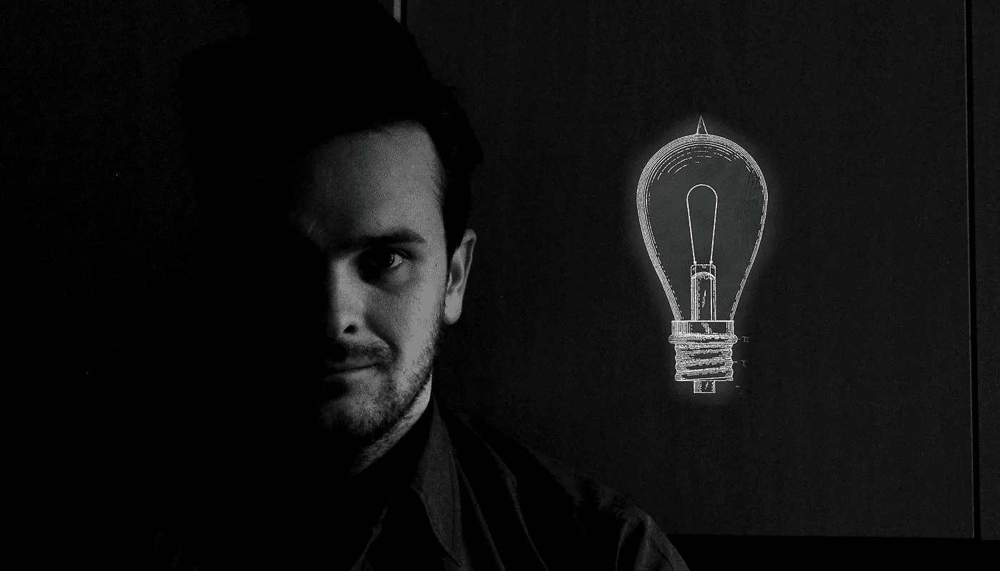
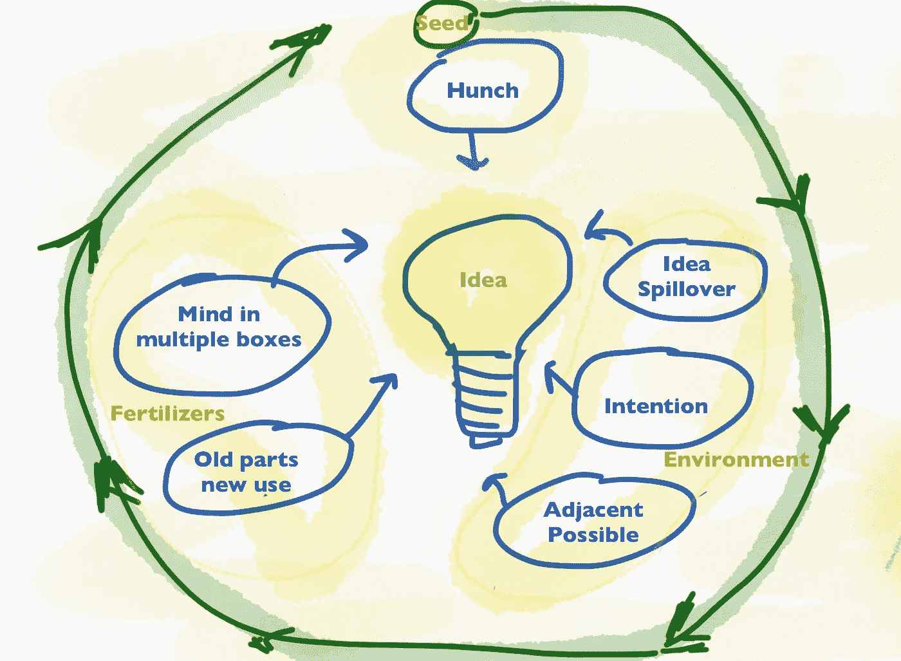
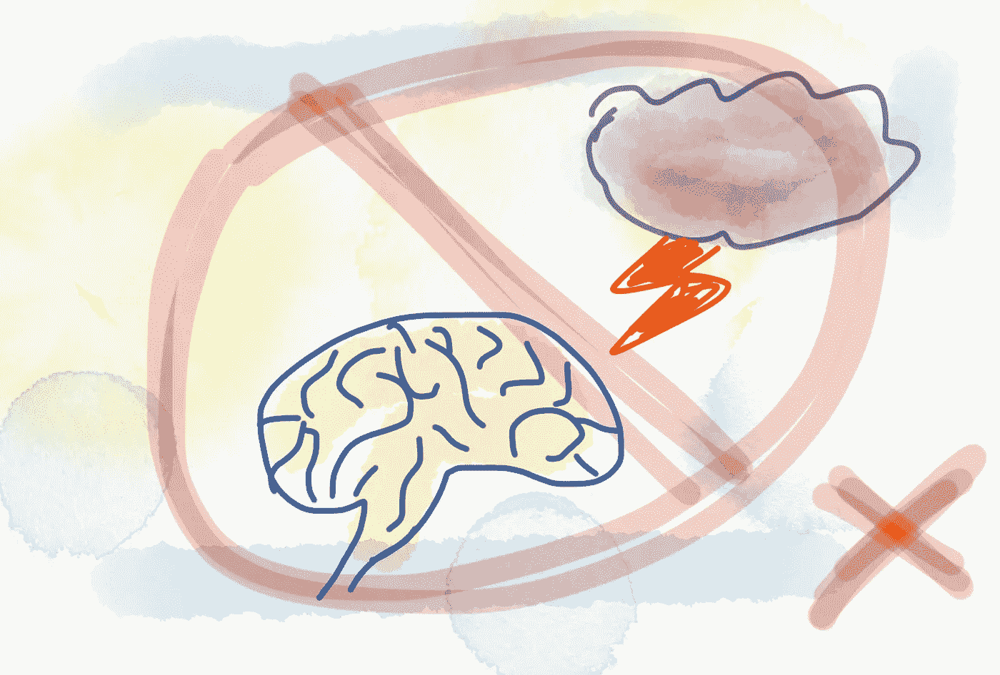

# 想法就像打喷嚏

> 原文：<https://medium.com/hackernoon/ideas-are-like-sneezing-1fd3ff3db930>

他们都是从直觉开始的

[pixeltie](https://www.instagram.com/pixeltie/) instagram

重大突破通常被称为“灵光一现”或“顿悟”,因为故事中有一定的叙事刺激。但这一突破实际上经历了很长一段时间的酝酿，一个缓慢的预感发展成为一个想法需要几个月甚至几年。故事的这一面往往不为人知。

# 一粒种子

早在一个想法出现在你脑海之前，一颗种子就已经深深地种在你的脑海里了。种子可以自己种下，当你遇到某个问题时，你开始思考可能的解决方案。更多的时候，种植过程是下意识发生的。这个想法还没有在你的头脑中形成，但是你知道有些东西已经存在了。这叫做**预感**。同样，种子也可以由别人来种。也许一个朋友分享了一个有趣的故事或对某个话题的不同观点。如果故事对你有吸引力，它会在你不知不觉中开始成长。几天后，你对这个话题又有了新的预感。想法还是没有，但是你感觉到有事情在发生。

# 想法是如何产生的？

我们都知道灯泡时刻。突然间一切都变得清晰明了。一个想法已经诞生，现在看来是如此明显。但是这个想法是如何实现的呢？

一个想法是你大脑中神经元的新集合。这是一个前所未有的突触序列。为了刺激这种新的组合，你必须把自己放在一个富有成效的环境中。想象自己舒适地坐在一个空荡荡的黑暗房间里。这个房间有几扇门通向不同的房间(新[创意](https://hackernoon.com/tagged/ideas))，但是你还没有看到门。既然你舒适地待在房间里，你就没有离开它的意图。所以为了发现新的东西，首先，你需要一个**意图**去这样做。

Creative process for a good idea

## 目的

你需要一点好奇心来找到其中的一扇门，为自己打开一个新的视角。好奇心把你从舒适的位置拉出来，推动你去发现新奇的事物。这些发现不一定是开创性的——它们可能只是一个新的视角，它将打开更多的门，让你看到越来越多的房间，直到你真正找到墙上写着尤里卡的那个房间。但是为了开始开放，你需要有探索的意图。

## 创意溢出

在志同道合的朋友或同事的一点帮助下，更容易探索。正如西蒙·西内克所说——在一起更好。当你周围都是有创造力的人时，你更有可能会发现一个观点，否则你不会想到这个观点。你可以听到一个新的想法，它会引导你找到新的方法和你自己的想法。一个想法引发一个新的想法，就像多米诺骨牌效应。这就是人们搬到硅谷的原因——他们可以与其他人有更多的互动，并获得大量的新想法和经验。否则，如果你是一个人，你必须是一个天才才能独自解决一些事情。

房间里的一个朋友可能对门有不同的生活体验(在阁楼上有一个房间)，他可能会在天花板上发现一扇门，这扇门通向建筑的一个全新的层面。这是一种思想溢出。你可以把它捡起来，搭个梯子，爬上新的楼层，就能看到壮丽的景色。

## 相邻的可能

你可能想用暗物质为你的宇宙飞船提供动力，在太空中旅行。但不幸的是，科学和技术还没有出现。你必须和邻近的人一起工作。你只能打开一扇通向你当前所在房间隔壁的门。一个发现可能会引导你走向另一个。你只能打开当前房间墙上的一扇门，选择的数量是有限的，但是进入一个新的房间会带来新的机会。这就是为什么坚持尝试很重要。发明有时是错误的结果，所以关键是让自己忙起来。

# 如何激发一个好的想法？

极度劳累之后，我和我的朋友决定去参观现代艺术博物馆放松一下。我们乘火车去兜风。博物馆令人惊叹，建筑本身就是一件艺术品。我们真的很喜欢它，我们已经设法忘记了之前紧张的一天。朋友买了一个万花筒做纪念，拿在手里。在回来的路上，我们享受了旅程和火车上的风景。由于他一手拿着万花筒，一手拿着手机，他很自然地开始记录移动的风景，但万花筒在手机镜头的上方。

最终的结果毫无用处——一个让你真的头晕目眩的迷幻视频。但这个想法似乎是开创性的。我的意思是，这个想法毫无用处，但让我惊讶的是导致最终结果的事件组合。

> 这个想法只是把手头的资源用于一种新的用途。将旧零件用于新用途。对我来说，那是纯粹的天真。

我确信来自博物馆的抽象展览影响了这个想法。我们的思想之前一直如此专注于工作，所以这种新的视角是一种更新。如果你在创新行业(今天每个人都是)，你必须**把你的思想放在多个盒子里**。

> 允许思维从一个盒子转移到另一个盒子，会迫使你从不同的角度处理同一个问题。

你可以用一个有趣的爱好来做这件事。你上一次第一次做某事是什么时候？当我们花很多时间思考一个特定的问题或话题时，我们的大脑就会饱和。改变上下文有助于你放松，从一个新的角度来处理问题。

浏览不同的主题并有广泛的兴趣是很重要的，因为想法可以从完全不相关的背景中激发出来。浏览印刷报纸就是一个很好的例子。报纸有助于意外发现，因为找到你感兴趣的话题需要浏览其余的页面。一些无关的标题可以抓住你的注意力，给你一个好主意。

*不该做的事情*:头脑风暴。它实际上不起作用。你把有限数量的与会者安排在有限的空间里，如果这两个人还不够限制的话，你就限制了他们花在头脑风暴会议上的时间。在如此多的约束下，很难想象会发生思想溢出。这就是为什么我避免这些会议。

No brainstorming!

# 孵化过程

苦苦思索这个问题不会让你找到解决办法。嗯，不是马上。这个想法从直觉发展成清晰的灵光一现需要时间。这叫做孵化过程。

> 孵化被定义为在某个时间点通过有意识的工作刺激的思想元素的无意识重组过程，在某个时间点产生新的想法。

所以投入工作很重要。但是休息一段时间和思考解决方案一样重要。

所以想法就像打喷嚏。他们都是从直觉开始的。你感觉会有事情发生，但你不知道具体是什么时候。你们都知道那可怕的几秒钟的期待。你快要打喷嚏了，鼻子很痒，但是不能用力。有时候，我们会使用一些技巧，比如向后仰着头(类似于想法的上下文切换)或者闭上眼睛。通常，诡计没有帮助，你认为你终究不会打喷嚏。然后，突然之间:

“Achoo”——一个想法诞生了！

# 想了解更多？

今天就学习如何将你的想法转化为成功的[业务](https://hackernoon.com/tagged/business)。

这本书为你提供了创建一个成功企业的整个过程的全面指导。它旨在为你展示整个[商业计划](https://treasureroadmap.com/)，让你的起步更加容易。整个过程归结为它的要点，使步骤简单易懂。

如果你遵循我在这本书里揭示的公式，很有可能你可以通过把一个[想法变成一个成功的生意](https://treasureroadmap.com/)来谋生。

 [## 宝藏路线图——如何将你的想法转化为成功的业务——企业家的最佳书籍…

### 如果你选择遵循我在这本书里揭示的公式，很有可能你可以通过转行谋生…

treasureroadmap.com](https://treasureroadmap.com/) 

点击下面的图片获取您的免费图书摘要:

