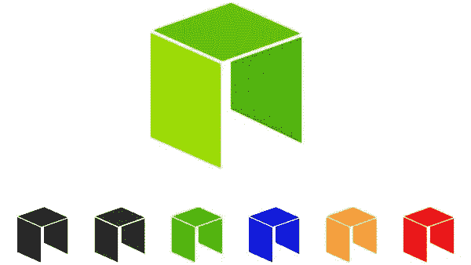
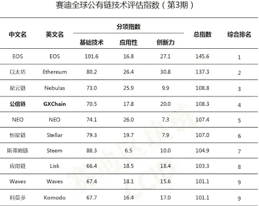
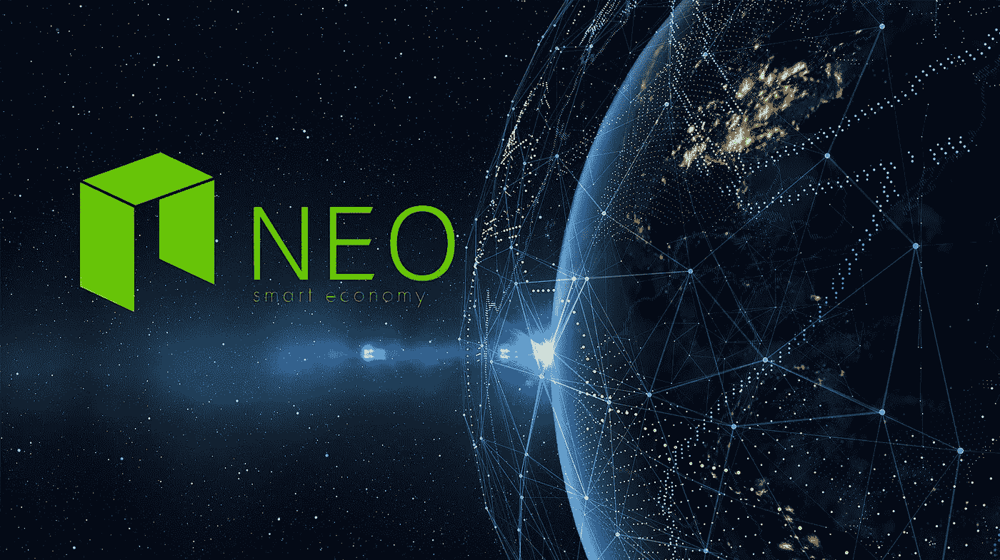

# 为营销解决方案确定合适的区块链

> 原文：<https://medium.com/hackernoon/identifying-the-right-blockchain-for-business-marketing-solution-6ad7e1f18512>

> 这是“创业 180 天”系列的第 5 篇文章，记录了我的企业家之旅。如果你想从头开始，请点击[这里](https://theascent.pub/180-days-to-start-up-1-documenting-my-journey-to-building-a-potentially-valuable-solution-1b79191ccca3)看第一篇文章。

大多数高价值的区块链是为特定需求而创造的。没有一个区块链可以满足所有要求。就像汽车一样，轿车和皮卡车是为不同的目的设计的。更确切地说，你不会为了省油而开 F-150 也不会开卡罗拉去炫耀(当然，除非是 AE86)。了解[客户需求](https://theascent.pub/180-days-to-start-up-2-how-research-drove-the-foundation-of-development-7a0a8468e382)和[产品需求](https://hackernoon.com/what-can-blockchain-do-for-small-business-marketing-7a1458f1784c)对于选择合适的平台至关重要。

正如我在[上一篇文章](https://hackernoon.com/what-can-blockchain-do-for-small-business-marketing-7a1458f1784c)中提到的，我们需要一个区块链来满足我们因社交媒体互动而产生的高频交易需求。我们还需要该平台快速、经济高效、可扩展、稳定、经济、易于开发。本质上，我们需要一些实用性高的东西。

Chinese CCID Ranking of Blockchain – middle 3 columns are the measuring criteria: Technology, Application, and Innovation (left to right)

根据中国信息产业部区块链评分排名，NEO 和以太坊在应用能力方面得分极高。这个排名和我们的研究表明，这两个很容易成为我们的决赛选手。虽然许多人可能会认为以太坊是更好的选择，因为它在北美被广泛采用，但我们最终还是选择了 NEO，原因如下。其中一个原因是运营成本。

在以太坊区块链上计算和存储数据的成本会变得非常昂贵。以 nodis.io 可能达到的交易量来看，会变得有问题。相反，NEO 的一次性智能合约通话费用为 0.0001 GAS (NEO 区块链操作平台的 GAS 版本)，数据存储不收费。即使我们达到了 100 万的交易量，那也只是一个可管理的 100 美元的价格(相当于今天的 629 美元)。

以下是我们认为 NEO 对 nodis.io 有益的一些其他优势:

1.  **智能经济** — NEO 专门开发了区块链，考虑到了贸易和经济。它的目标是数字化任何实物资产。所有用户都有一个数字身份，以便明确识别所有者。这对于法律合规性和所有权的合法性极其重要。
2.  **每秒高交易量(TPS)** —由于社区验证功能，NODIS.io 有可能产生大量交易。我们需要一个具有高 TPS 的区块链。比特币每秒可以进行 3-4 次交易，以太坊每秒可以进行 15 次交易，NEO 目前为 1000 次，有可能达到 10000 次。我们知道以太坊[碎片](https://www.ccn.com/ethereum-sharding-slated-for-2020-ethereum-foundation-researcher-justin-drake/)项目，但它可能要到 2020 年才会真正发生。
3.  **免费存储成本(截至目前)** —如上所述，虽然每笔交易有 0.0001 GAS 的成本，但没有存储成本。
4.  **高效共识机制** — NEO 使用委托拜占庭容错(dBFT)共识机制。它允许社区决定谁将成为共识节点(簿记员)。当三分之二的投票参与者同意共识节点的区块链版本时，达成共识。这种机制允许以更少的资源消耗进行更快的验证，从而实现更高的可伸缩性。
5.  **终结** —由于 NEO 的 dBFT 共识系统，*几乎*不可能分叉。只要共识节点有 66%的投票，决定就会执行。在社区不同意共识节点的情况下，替换簿记员将当场提出一个同意的版本。
6.  **NeoContract(智能合约 2.0)** — NEO 使用一个名为 NeoVM 的轻量级虚拟机。它允许更快的启动，同时占用更少的资源。通过结合高并发性、动态分区和低耦合设计，它具有高度可伸缩性、可靠性和高确定性。它还在执行之前优化和重组智能合同代码，以提高效率。最后，它可以与大家熟悉的 ide 一起使用，比如 Visual Studio 和 Eclipse。
7.  **编码语言灵活性** — NEO 支持 C#、Java、Python 和 Go 编程语言。

*关于近地天体区块链的更多技术信息，你可以访问他们的* [*文档页面*](http://docs.neo.org/en-us/sc/introduction.html) *。*

既然我们已经决定将 NEO 作为我们的区块链平台，下一个大问题是:我们如何定位解决方案，使其不基于加密货币的价值？再说一次，我们的项目，nodis.io，并不是要创造另一种数字货币来代替法定货币。外面的人太多了。我相信现在市场真正需要的是一个能真正让用户受益的问题解决方案。就像任何公司一样，如果服务有价值，公司就会有价值，让用户受益的密码也会有价值。这是我们回报投资者信任的方式。**从现在起大约两个星期后，我会写这个话题。**

如果你觉得我写的东西有一点点有趣，请在媒体上关注我，并给我一些掌声。您也可以在 [Telegram](https://t.me/nodisgetnoticedgroup) 和 [Instagram](https://www.instagram.com/nodis.io/) 上关注我们，获取最新内容和项目更新。感谢阅读！