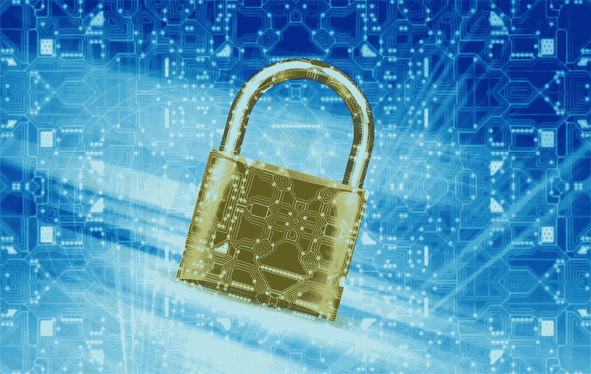

# 身份，区块链，还有你

> 原文：<https://medium.com/hackernoon/identity-blockchain-and-you-17cb1cbf2b60>

你的在线身份对于那些想联系你的人来说是一个强有力的工具。广告商、政府、公司、公共服务和许多其他组织使用在线身份来传递营销计划、信息和定制内容。随着互联网的发展，cookies 和广告 id 的使用扩大了在线身份的范围。今天，仅仅从元数据中就可以很容易地了解一个人的隐私细节。尽管隐私立法和身份屏蔽工具尽了最大努力，但我们大多数人都在没有太多数据保护的情况下在网上暴露了一切。欺诈者、罪犯、被抛弃的恋人和其他邪恶的角色可能会利用欺骗和伪造手段获取在线信息，从而对受害者的生活造成严重破坏。随着全球越来越多的银行、通信、商业和贸易转移到网上，盗窃和恶作剧的诱惑从未如此之大。

image source: [Pixabay](https://pixabay.com/)

身份是我们都认为理所当然的事情之一。根据情况和环境的不同，证明你的个人身份可能会很复杂。自 1414 年国王亨利五世以来，纸质护照一直是身份识别的黄金标准。许多国家使用驾照或国民身份证，但这些身份证明文件依赖照片、地址和大量其他“事实”来证明一个人的身份。当世界移动到网上时，认证人们的问题变得更加复杂。如果没有实际的互动，使用身份证进行网上交易和交流就不太实际。随着身份变得更加数字化，加密货币背后的技术可能会成为一种安全可靠的方法的关键，以证明在线身份是真实的。区块链能解决隐私、身份和在线交易的问题吗？

许多行业都有总部位于区块链的初创公司，它们希望利用这项革命性的技术来打破现状。身份管理也不例外——目前在“[区块链”的身份空间中有超过 20 家公司。这些公司希望处理广泛的商业和个人身份解决方案，许多公司已经在改变我们对身份的看法。像](https://letstalkpayments.com/22-companies-leveraging-blockchain-for-identity-management-and-authentication/) [VALID](https://valid.global/) 、 [UniquID](http://uniquid.com/) 和 [KYC-Chain](https://kyc-chain.com/) 这样的公司使用区块链科技和分布式账本来确保网上私人信息的安全。

image source: [Pixabay](https://pixabay.com/)

VALID 团队希望让用户在进行在线交易时能够控制他们的数据。该平台允许对身份验证、数据保护和个人信息货币化进行自定义控制。用户将重新获得对其数据和在线钱包的主权，免受营销人员和欺诈者的窥探。经批准的广告和营销工作的更好目标将奖励与网络共享选定数据点的用户。它对民调和市场研究行业以及广告行业都有影响。如果用户愿意的话，他们将获得有效的参与代币，更重要的是，这项技术还允许锁定控制个人信息。

UniquID 专注于物联网(IoT)领域，拥有一个安全的身份平台，专为小型电池供电设备设计。随着家庭中智能设备数量的增长，用户需要一种可靠的方法来无缝连接到所有设备，而不放弃可靠性或安全性。UniquID 使用一个位于区块链的平台，提供了一个“不可信、分散的、受比特币启发的访问管理解决方案”，以帮助消费者和企业保护其所有物联网设备的安全。

KYC-Chain 使用区块链技术解决了信任在线业务合作伙伴的问题。KYC 是“了解你的客户”或金融机构和其他公司追踪其客户和合作伙伴身份的义务的银行家谈话。犯罪分子和其他邪恶势力可以利用银行系统和汇款基础设施在世界各地转移资金，这就是为什么政府对银行、电信公司和其他“汇款人”实施严格的监管。KYC 情况复杂，涉及法律、会计、金融和公司合规界的许多学科。KYC-Chain 希望能让公司在网上更容易相互信任，而不需要过度依赖审查和认证。随着全球越来越多的交易在网上进行，修复信任问题对银行、政府、企业和消费者来说都是一个重要目标。

人们很容易将区块链视为解决世界问题的一颗银色子弹，而且许多有希望的进展即将出现。自从加密货币和区块链意识在全球爆发以来，这些区块链企业家就成了众人瞩目的焦点。只有时间会告诉我们，区块链是否能够实现所有这些承诺，但未来看起来是光明的在线身份解决方案，有这么多的资本，投资重点，并在该领域的创新人才。