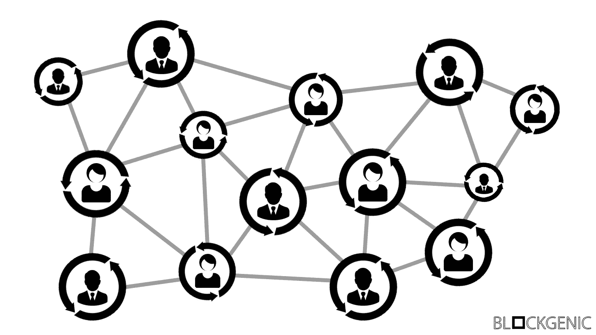

# 区块链上的身份

> 原文：<https://medium.com/hackernoon/identity-on-the-blockchain-c1e1a2fc353f>

如今，个人数据不像以前那样个人化了。大公司出售数据以获取巨额利润，泄密事件屡见不鲜。尽管如此，人们还是在任何地方输入他们的个人数据，因为它有很多用途。那么，为什么 EOS 或任何其他主要的加密货币还没有适当地实现自我主权身份系统呢？毕竟，区块链是没有边界和无限的。

# 数字身份

传统上，一个人的身份保存在政府颁发的文件中，如护照或驾驶执照，或者安全地保存在高度安全的政府系统中。但是技术进步使得身份识别变得更加抽象。数字身份是个人身份识别的下一步，尽管它们也带来了一系列新问题。哪些信息定义了用户？而且只需要很少的信息就能确保一个在线身份与某个人联系在一起？

数字身份是与特定身份相关联的(所有)数字信息。一般来说，有三种方法(或这些方法的组合)用于对一个人进行数字认证。这三种方法如下:

*   *:这是网上认证一个人最常用的方法。你知道的东西可以是任何东西，从一个简单的代码到一个密码到你第一只宠物的名字。在几乎所有要求你创建账户的网站或应用程序上，你需要填写一些你知道的信息，然后才能在该网站或该应用程序上访问你的信息。*
*   ****你有的东西*** :这是用在如果有人设法窃取你的身份会有较大风险的地方，通常与认证一个人的第一种方法结合使用。你拥有的东西是指你(实际上)拥有的东西。一个例子是借记卡，现在银行经常要求你结合使用读卡设备和你的个人识别码来访问你的银行账户。加密货币的一个例子是硬件钱包，它要求你同时拥有设备和钱包的相应 pin。*
*   ****你是什么样的人*** :最后，你可以使用一个人是什么样的人来进行数字认证。生物识别系统通常用于高安全性场所和/或应用，可能是所有系统中最先进的防欺诈系统。这些系统使用面部识别、指纹或任何对每个人来说都是唯一的东西来验证一个人。*

*但是这些系统如何用于区块链呢？进入你的钱包或账户的标准方法是使用你有的东西。在区块链上，这是一个或多个私钥。一个更安全的选择是同时使用你知道的和你有的东西，比如上面描述的硬件钱包。最后，人们可以建立一个更加安全的钱包，使用某种东西来验证用户。一个例子是新的 EOS IOS 钱包，据传即将发布。但是有更多的可能性吗？*

# *区块链上的个人资料，有用吗？*

*安全性可能是数字身份的用例之一，但更有趣的是使用数字身份时增加的便利性。毕竟，人们仍然在大量的在线网站上输入个人信息的原因是，他们希望方便快捷地获得服务或产品。*

*如果 cryptos 和区块链有朝一日被主流采用，他们必须迅速行动，用户体验必须完美无瑕。完美用户体验的一部分是产品的可用性。在密码的基础上创建一个身份系统，用户可以将(一些)个人数据放在某个区块链上，这将允许用户轻松地与密码生态系统中的各种 dapps 进行交互。用户可以选择分享多少信息，这取决于他们计划使用什么样的 dapps，他们也应该可以选择在任何时候删除任何数据。*

*另一个很好的用例可能是新一代更安全的钱包。丢失钥匙和丢失资金的故事屡见不鲜。让人们可以选择把你的指纹等个人数据放在区块链上，这意味着只有你自己的指纹才能进入某个钱包。没有更多的钥匙意味着没有更多的丢失的钥匙。*

*但这还不是全部，区块链上的数据一旦存在，仍然是安全和可访问的。不再因数据中心故障而丢失数据。不再无法访问数据，因为中央组织决定这样做，此外，人们可以对他们的个人(数字)数据有更多的控制权。*

# *太冒险了？*

*但所有这些优势都是有一定代价的。大多数区块链的不变性是一把双刃剑。将信息放在区块链上可能意味着无法删除，可能会暴露本不该暴露的内容。*

> *拥有身份证件也可能对个人的隐私和安全构成威胁。我们需要一种可信、安全的身份识别形式，允许持有者选择何时共享或保留个人信息。-IDPass*

*在将数据放入区块链之前对其进行加密也会带来各种风险。虽然这种加密目前可能是万无一失的，但将来可能很容易被解密，从而允许其他人访问他们不应该访问的数据。*

*那么未来会怎样呢？*

# *今后*

*总的来说，将身份信息放在区块链上有很多可能性，可以帮助那些目前没有身份信息的人，他们通常会被剥夺许多基本资源。它有可能给区块链带来他们需要的推动，使其被主流接受，尽管将个人数据放在区块链上可能有风险，但这很可能值得冒险。尤其是考虑到如今生物特征数据更常用于保护账户和钱包的安全。*

## *我们的社交*

*EOS Block 制作人姓名:' blockgenicbp'
[网站](https://blockgenic.website/)
[推特](https://twitter.com/blockgenic)
[Youtube](https://www.youtube.com/channel/UCXTaehuAs3UWKnMVnT71MMQ)
[Reddit](https://www.reddit.com/user/blockgenic)*

**作者为* [*作者为*](https://www.linkedin.com/in/yannick-slenter/) *作者为* [*作者为*](https://blockgenic.website/)*