# IEEE 的相机识别挑战——不同的合作方式

> 原文：<https://medium.com/hackernoon/ieees-camera-identification-challenge-different-approach-to-teaming-up-28da44dfe635>

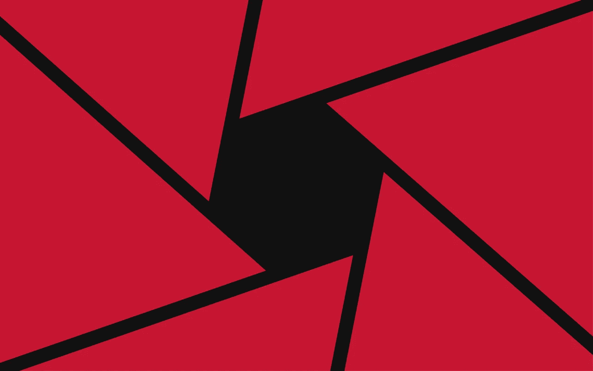

*最近，我们推出了一系列新的* [*机器学习文章*](/@dbrainio/amazon-basin-from-space-competitive-approach-to-train-neural-network-736937902dd0) *，由我们的首席数据科学家 Artur Kuzin 执行。今天，阿图尔带着他的一个新故事出现了，他谈到了作为导师参加“IEEE 的相机模型识别”比赛的情况，并分享了他最近在团队管理和解决问题方面的经验。*

# 问题陈述

今年冬天，我作为导师参加了“IEEE 信号处理学会——相机型号识别”竞赛。问题是识别拍摄图像的相机。图像集合中有十个相机型号作为类别:两个 iPhones、七个 Android 手机和一个 DSLR 相机。

问题是识别拍摄图像的相机。图像集合中有十个相机型号作为类别:两个 iPhones、七个 Android 手机和一个 DSLR 相机。

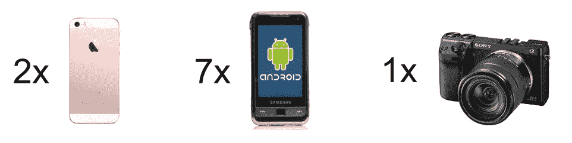

# 主要思想

通常，你有[深度学习解决方案](/@ksusorokina/image-classification-with-convolutional-neural-networks-496815db12a8)将图像上的各种物体相互区分开来(即猫对狗、色情对比基尼、汽车对公共汽车)。与此同时，猫(或汽车)的照片在拍摄方式和设备上不应该有任何区别。

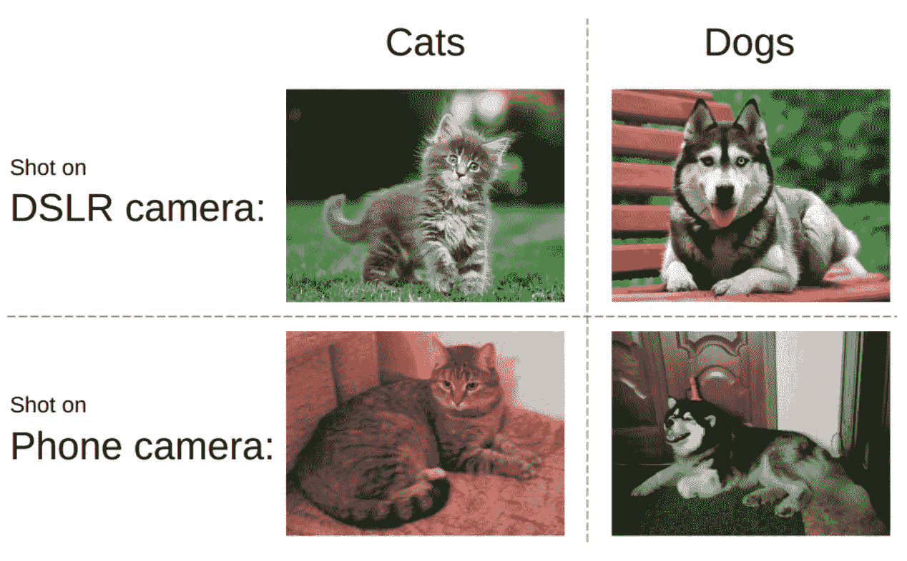

这个竞赛正好相反:不管照片上的物体是什么，我们都需要识别设备。这意味着，我们必须考虑传感器噪声、图像处理伪像、光学缺陷等因素。

# 团队互动

大多数 kaggle 团队由排行榜分数相似的参与者组成，每个团队成员都有自己的工作解决方案渠道。早些时候，我写了一篇[文章](https://habr.com/company/ods/blog/413667/)，其中有一个很好的例子。但是这一次我们用了另一种方式:我们将管道分成连续和独立的部分，所以每个团队成员都专注于自己的部分。

# 解决办法

**数据挖掘。**本次比赛允许使用外部数据集。我们的团队成员[阿图尔·法塔霍夫](https://www.kaggle.com/fartuk1)基于 [BeautifulSoup](https://medium.freecodecamp.org/how-to-scrape-websites-with-python-and-beautifulsoup-5946935d93fe?gi=441d5e833bff) 库编写了一个 web scraper。为了正确处理 Flickr 上的页面结构，使用 web 浏览器模拟器 [selenium](https://www.seleniumhq.org/) 也是必要的。总之，我们从 Yandex 下载了超过 500 Gb 的图像。Fotki，Flickr 和维基共享。

**数据过滤。这是我在这个项目中唯一的代码级贡献。我选择了以下过滤标准:1)典型图像大小(相机方面)，2) JPEG 压缩级别，3)EXIF 相机型号信息，4)EXIF 处理软件信息。**

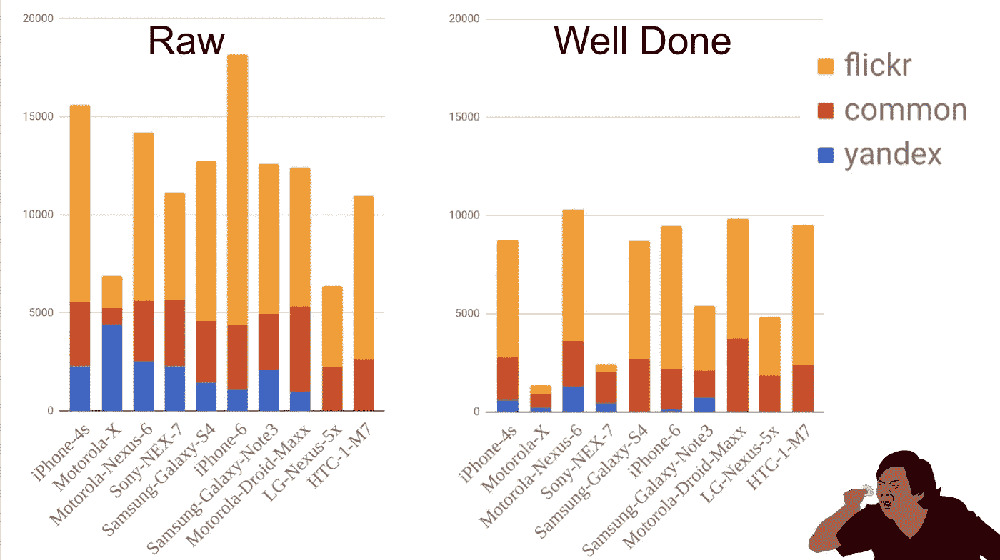

绝大多数的 Moto-X 图片都被忽略了，因为在那个类中有几个不同的硬件版本。

**验证方案。**学习和验证模块的开发委托给了 [Ilya Kibardin](https://www.kaggle.com/ikibardin) 。不幸的是，对 kaggle 数据集的验证不一致:我们的神经网络得分接近 1.0 的准确性(我们在排行榜上的得分约为 0.96)。

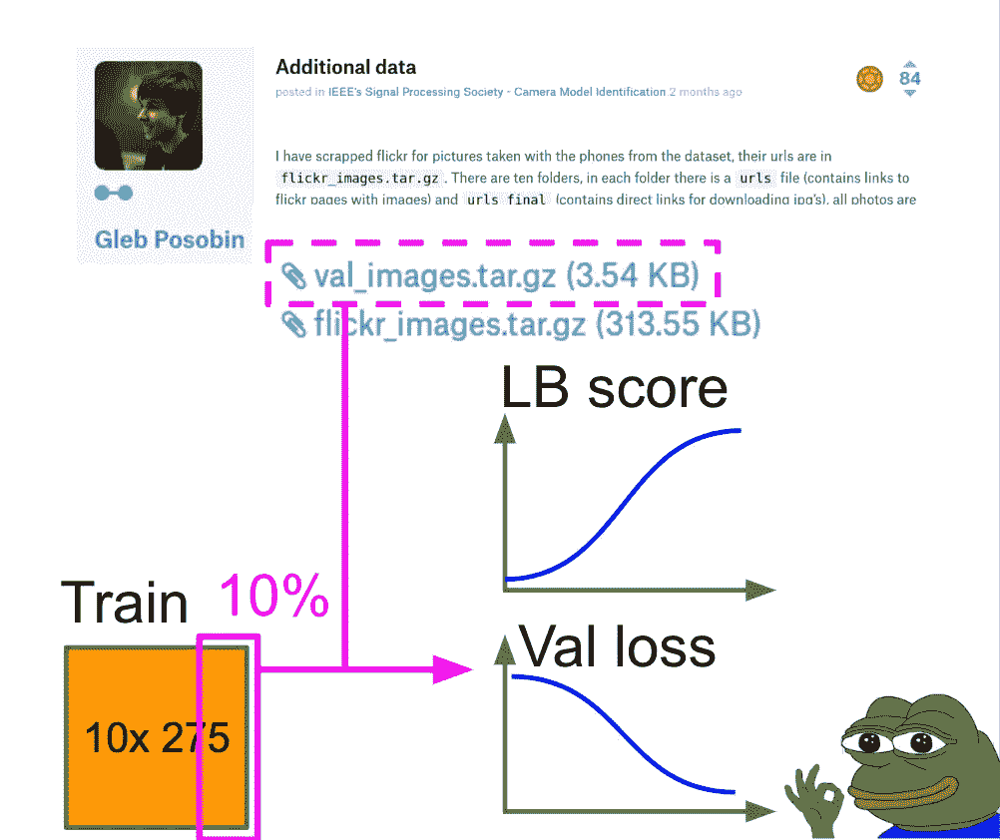

因此，我们决定在附加数据上进行验证(URL 由 Gleb Posobin 提供:[https://www . ka ggle . com/c/sp-society-camera-model-identificati on/discussion/47235](https://www.kaggle.com/c/sp-society-camera-model-identification/discussion/47235))。我们还将 10%的 kaggle 训练集加入到这个额外的数据集中，以使类别更加平衡。

最佳检查点是通过操纵的和未受影响的数据上的最低交叉熵值来选择的。

**培训方式。**在比赛进行到一半的时候， [Andres Torrubia](https://www.kaggle.com/antorsae) 在 kaggle 论坛上公开了他的完整解决方案。这是一个真正的游戏改变者，因为模型看起来很好，每个人都立即开始使用它。当伊万·罗马诺夫发布了同一解决方案的 pytorch 版本时，情况再次发生了变化:在多个 GPU 上实现并行化既快又容易。可悲的是，这些家伙最终在最终排行榜上排名第 30 和第 45，但他们在我们心中永远保持不败。

我们的组员伊利亚对米莎的代码([https://www . ka ggle . com/c/sp-society-camera-model-identificati on/discussion/48679](https://www.kaggle.com/c/sp-society-camera-model-identification/discussion/48679))做了如下阐述:

**预处理。**

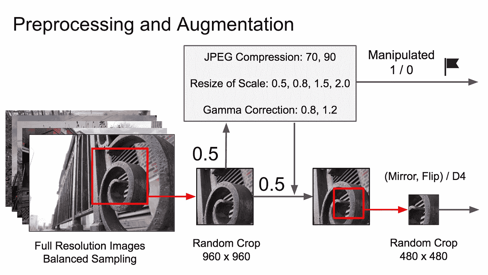

**学问。**学习步骤由完整神经网络的微调组成，没有任何冻结层，因为问题与 ImageNet 非常不同。

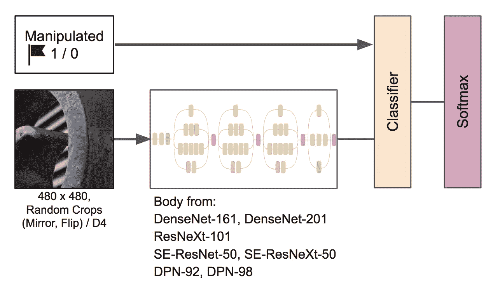

**调度。**

1.从学习率 1e-4 的亚当开始。如果损失在 2-3 个时期内没有改善，学习率减半。这一过程应持续到达到收敛。
2。用 SGD 代替 Adam 学习率是从 1e-3 到 1e-6 的循环(三个循环)。

**最后的合奏。**我让伊利亚应用我最近在“ [Amazon from Space](/@dbrainio/amazon-basin-from-space-competitive-approach-to-train-neural-network-736937902dd0) ”比赛中采用的方法:我们微调了九个模型，从中选择了三个最佳检查点，使用每个选择的检查点计算测试时间增加(TTA)的预测，并通过几何平均值对这些预测进行平均。

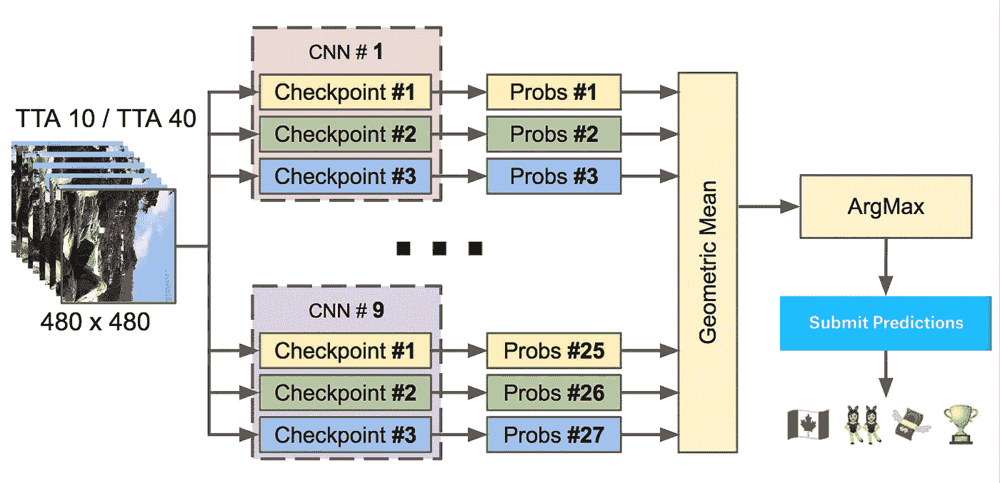

# 第一阶段后果

这种方法使我们在总排名中名列第二，在学生类别中名列第一。我们成功通过了第一阶段，并进入了 2018 年加拿大 IEEE 声学、语音和信号处理国际会议期间举行的比赛的第二阶段。非常值得注意的是，第三支队伍也被认为是一支学生队伍。从他们的得分来看，我们似乎只比他们的解决方案多了一个正确的预测。

# 2018 年 IEEE 信号处理杯决赛

在我们收到确认信后，伊利亚和阿图尔开始为第二阶段做准备，而瓦列里、安德烈和我决定我们不能参加。不幸的是，伊利亚和阿图尔的签证被加拿大大使馆拒绝。但幸运的是，组委会理解我们的处境，允许我们远程参与比赛。

# 第二阶段细节

第二阶段没有排行榜:根据比赛规则，我们只有一次提交解决方案的机会。此外，在训练集中没有关于相机模型的信息。所以，基本上，这是一个双重失败:没有外部数据和不具代表性的本地验证。

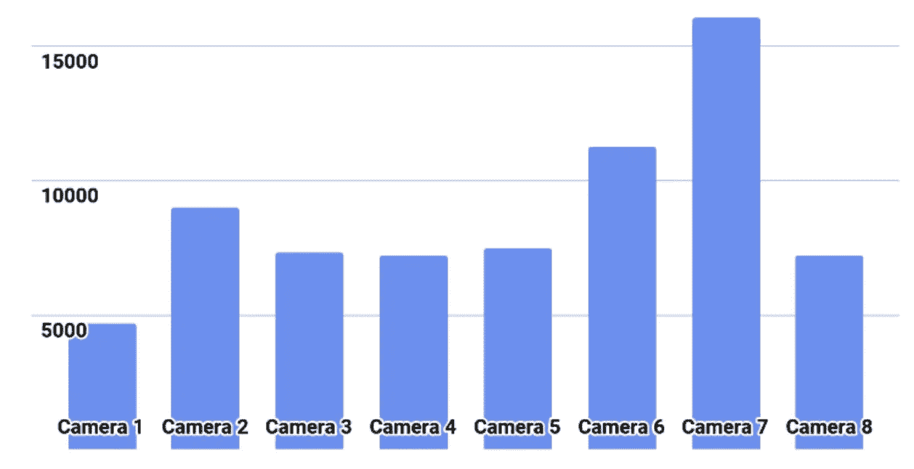

Class distribution on the second stage.

# 解决办法

起初，我们尝试使用第一阶段的管道。每个模型都很快获得了很高的准确性(大约 0.97)，但是它们的预测在测试样本上没有重叠(大约 0.87)。在我看来，我们的模型过于合身了。于是我想出了新的方案:
1。使用第一阶段的最佳模型进行特征提取；
2。执行特征提取，随后进行 PCA 缩减；
3。训练 LightGBM 分类器。

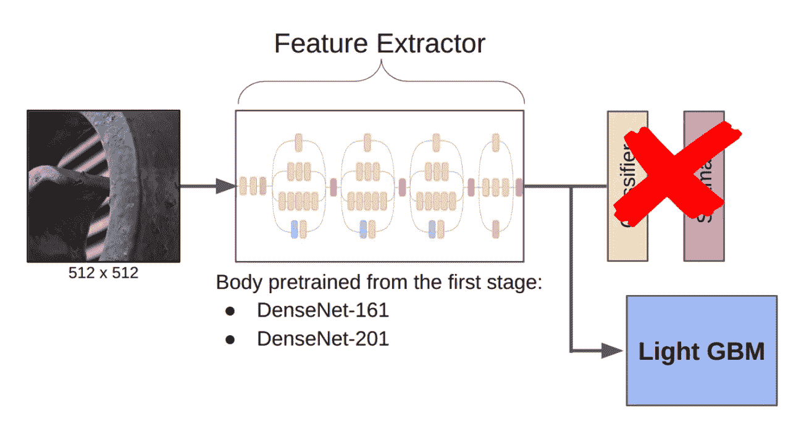

我提出这个计划的原因如下。这些网络已经被训练成能够在特定的图像背景之外提取重要的特征。因此，仅仅在它上面训练一些轻量级的东西就足够了。然而，由于这一阶段的数据可能与第一阶段的数据非常不同，如果分类器是非线性的，就更好了，就像决策树上的梯度推进一样。我已经在之前的比赛中成功应用了这个想法(我也分享了一些[代码](https://www.kaggle.com/drn01z3/mxnet-xgboost-baseline-lb-0-57))。DenseNet 在本地验证方面似乎优于 Resnext 和 SE-Resnext。结果，我们的最终解决方案看起来像这样:

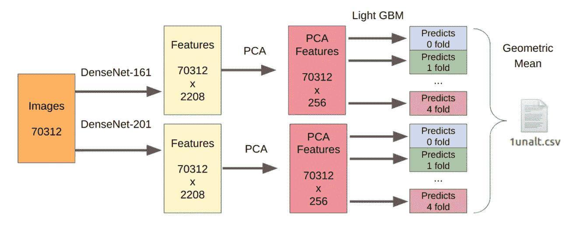

被操作部分的训练样本数乘以 7，因为我已经分别从数据的每个操作转换中提取了特征。

# 编后记

最后，我们在决赛阶段获得了第二名，但是有一些重要的情况。首先，评审团不是通过准确性，而是通过陈述来评估解决方案。决赛的获胜者不仅制作了演示文稿，还制作了他们算法的现场演示。第二，我们仍然不知道每个团队的最终得分(委员会不会透露这一信息，即使被直接询问)。

有趣的事实:绝大多数讲俄语的数据科学家都是开放数据科学社区的成员。这是一个非常友好的环境，在第一阶段，我们社区的每个团队都在团队名称中添加了[ods.ai]。结果发现排行榜榜首有好多！在那之后，像反转和基巴这样的传奇人物加入了我们的社区，想知道我们在做什么。

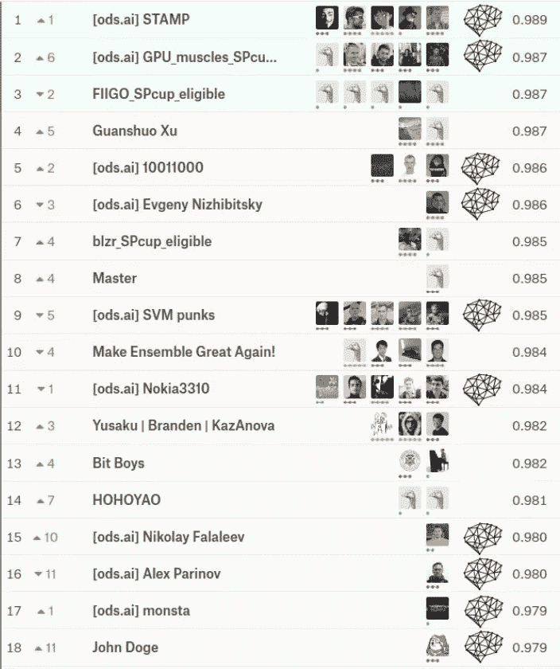

我真的很喜欢作为导师参加比赛。我能够给出一些关于基线改进和执行本地验证的有价值的建议——所有这些都是基于我在以前比赛中的经验。我认为，这种团队形成的实践已经证明了自己，应该在未来的比赛中应用:Kaggle Master/Grandmaster 作为解决方案架构师，2-3 名 Kaggle 专家作为编码员和研究人员。在我看来，这肯定是一个双赢的局面:有经验的 Kaggle 用户不必花太多时间编写代码，而初学者可以获得更好的结果，避免常见错误，并快速获得经验。